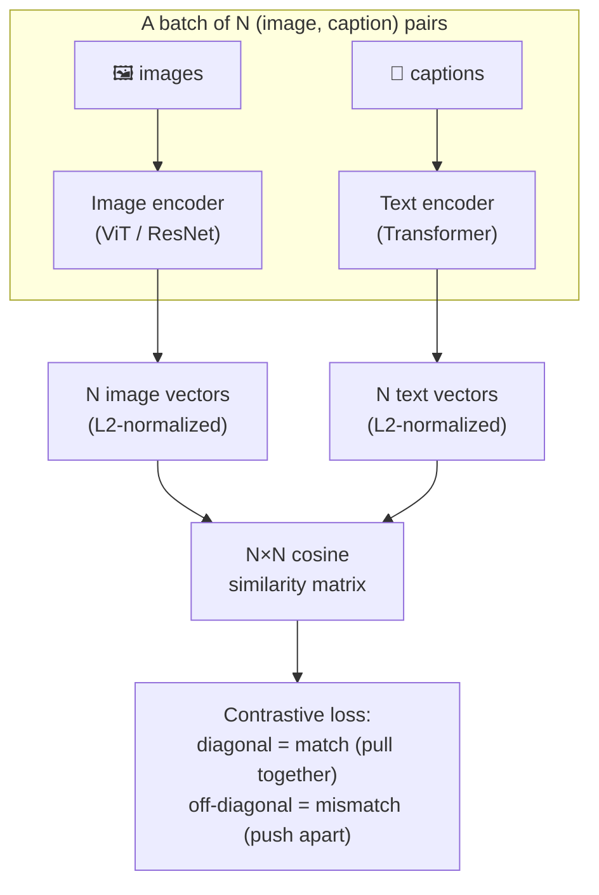
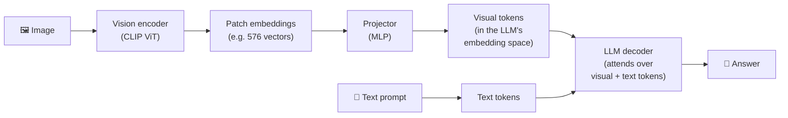

# 2 · Vision-Language Models (VLMs)

*Multimodal AI module · Lesson 2 of 6 · [← prev: What is Multimodal AI?](01-what-is-multimodal.md) · [next → Image Generation](03-image-generation.md)*

A **Vision-Language Model** takes an image (or several) plus text and produces text — captioning, visual question answering (VQA), OCR, chart reading, UI understanding. This lesson covers the two building blocks you actually need: **CLIP** (how vision and language get *aligned*) and the **encoder → projector → LLM** stack (how a chat LLM learns to *read* an image).

---

## 2.1 CLIP — teaching images and text to share a space

**CLIP** (Contrastive Language-Image Pre-training, Radford et al., OpenAI, **2021**) is the foundational trick. It trains **two encoders** — one for images, one for text — so that a matching (image, caption) pair lands at nearby vectors and a mismatched pair lands far apart. No labels, just ~400M image-text pairs scraped from the web.



**The contrastive objective in one breath:** for a batch of N pairs, build the N×N matrix of cosine similarities. The N *correct* pairs sit on the diagonal. Train so each row and each column is a softmax that puts its mass on the diagonal entry — a symmetric cross-entropy over images-as-queries and text-as-queries. That's it. This is the same **contrastive learning** idea behind modern text embedding models.

```python
# CLIP inference: zero-shot image classification with no training labels.
import torch, open_clip
from PIL import Image

model, _, preprocess = open_clip.create_model_and_transforms(
    "ViT-B-32", pretrained="laion2b_s34b_b79k"
)
tokenizer = open_clip.get_tokenizer("ViT-B-32")

image = preprocess(Image.open("photo.jpg")).unsqueeze(0)
labels = ["a dog", "a cat", "a car", "a plate of food"]
text = tokenizer(labels)

with torch.no_grad():
    img_feat = model.encode_image(image)
    txt_feat = model.encode_text(text)
    # normalize so a dot product == cosine similarity
    img_feat /= img_feat.norm(dim=-1, keepdim=True)
    txt_feat /= txt_feat.norm(dim=-1, keepdim=True)
    probs = (100.0 * img_feat @ txt_feat.T).softmax(dim=-1)

print(dict(zip(labels, probs[0].tolist())))  # → {'a dog': 0.97, ...}
```

**Why CLIP matters beyond classification:** those two encoders give you a **shared embedding space**, which is the engine for **cross-modal retrieval** — embed images once, then search them with a *text* query (or vice-versa). That's the backbone of one flavor of multimodal RAG in [Lesson 5](05-multimodal-rag.md).

| Use CLIP for… | Not for… |
|---------------|----------|
| Zero-shot image tagging / classification | Reading dense text in an image (use OCR / a VLM) |
| Text→image and image→image **search** | Generating long descriptions or answering questions (that's a generative VLM) |
| Filtering / dedup / safety pre-screens | Fine spatial reasoning (CLIP is a global "gist" embedding) |

---

## 2.2 From "aligned embeddings" to "an LLM that can see"

CLIP aligns vectors but doesn't *talk*. A generative VLM bolts a vision encoder onto a chat LLM. The architecture almost every open VLM uses:



The three pieces:

1. **Vision encoder** — usually a frozen **CLIP ViT** (it already understands images). Turns the image into a grid of patch embeddings.
2. **Projector** — a small **MLP** (LLaVA-1.5 uses a 2-layer MLP) that maps vision features into the LLM's token embedding space. This is the *only* thing that must be learned from scratch — it's the "adapter" that lets the LLM interpret image features **as if they were tokens**.
3. **LLM** — a standard decoder (Vicuna/LLaMA in LLaVA). It receives visual tokens *interleaved* with text tokens and just does next-token prediction over the mix.

### LLaVA in one paragraph

**LLaVA** (Large Language and Vision Assistant, Liu et al., **2023**) is the reference recipe. Two-stage training: **(1) feature alignment** — freeze both the ViT and the LLM, train *only* the projector on image-caption pairs so visual tokens land in the right place; **(2) visual instruction tuning** — unfreeze the LLM and fine-tune on GPT-4-generated image Q&A so it follows visual instructions. The insight is how *cheap* this is: you reuse a strong vision encoder and a strong LLM, and mostly train a tiny bridge.

> **Mental model:** a VLM is a text LLM that got a pair of glasses. The glasses (encoder + projector) convert what it sees into "words" it already knows how to reason about.

---

## 2.3 Calling a VLM via API (the part you'll actually do)

You almost never build the stack above — you send an image in a **vision message**. Two idioms dominate.

### OpenAI (Chat Completions) — image as URL or base64

```python
import base64
from openai import OpenAI
client = OpenAI()

def b64(path):
    with open(path, "rb") as f:
        return base64.b64encode(f.read()).decode("utf-8")

resp = client.chat.completions.create(
    model="gpt-4o",
    messages=[{
        "role": "user",
        "content": [
            {"type": "text", "text": "What does this chart show? Give the Q4 value."},
            # option A: a hosted URL
            {"type": "image_url",
             "image_url": {"url": "https://example.com/revenue.png", "detail": "high"}},
            # option B: an inline base64 data URL (for local/private images)
            {"type": "image_url",
             "image_url": {"url": f"data:image/png;base64,{b64('revenue.png')}"}},
        ],
    }],
)
print(resp.choices[0].message.content)
```

The `detail` field (`"low"` | `"high"` | `"auto"`) trades tokens for resolution — `"low"` sends a downscaled thumbnail (cheap, ~fixed token cost), `"high"` tiles the image for fine detail (more tokens). Reach for `"high"` on dense charts/scans, `"low"` on "is there a cat in this photo".

### Anthropic Claude — image content block (base64 or url)

```python
import anthropic, base64
client = anthropic.Anthropic()

with open("diagram.jpg", "rb") as f:
    data = base64.standard_b64encode(f.read()).decode("utf-8")

msg = client.messages.create(
    model="claude-sonnet-4-5",
    max_tokens=1024,
    messages=[{
        "role": "user",
        "content": [
            {"type": "image",
             "source": {"type": "base64", "media_type": "image/jpeg", "data": data}},
            {"type": "text", "text": "Transcribe every label in this architecture diagram."},
        ],
    }],
)
print(msg.content[0].text)
```

> **Prompting note:** everything from [`../01_prompt-engineering/`](../01_prompt-engineering/README.md) still applies — a vision message *is* a prompt. Be explicit ("transcribe verbatim", "state the single takeaway"), ask for structured output when parsing, and for OCR-heavy pages send higher resolution.

| VLM API knob | OpenAI | Claude | Effect |
|--------------|--------|--------|--------|
| Image source | `image_url` (URL or `data:` base64) | `source.type` = `base64` \| `url` | Where the bytes come from |
| Resolution / cost | `detail: low/high/auto` | Sized by longest edge (downscale huge images yourself) | Tokens ↔ fidelity |
| Multiple images | Multiple `image_url` blocks | Multiple `image` blocks | Compare / multi-page |

---

## 2.4 How this shows up in a real system (RagApp)

The [RagApp ingestion pipeline](../18_ragapp/06-visual-extraction-and-vlm.md) is a production instance of everything above. For image-dense PDF pages it:

- **rasterizes** the page to a PNG (300 DPI),
- sends it to a **VLM with an extraction-focused prompt** to produce a dense, retrieval-friendly text description (`visual_insight`),
- and at answer time loads the **actual image as a content block** so the model reads the real chart (grounding, per §2.2 and Lesson 1).

Notably it **does not** build CLIP image embeddings — it embeds the VLM's *text* description and fetches the image lazily. That's the **caption-then-text-RAG** design we contrast with shared-space CLIP retrieval in [Lesson 5](05-multimodal-rag.md).

---

## 2.5 Takeaways

- **CLIP (2021)** trains a **dual encoder** with a **contrastive loss** so matching image/text pairs share a vector space — the basis for zero-shot classification *and* cross-modal search.
- A generative VLM = **frozen vision encoder (CLIP ViT) → learned projector (MLP) → LLM**; the projector turns image patches into "tokens" the LLM can reason over.
- **LLaVA (2023)** is the canonical recipe: align the projector first, then visual-instruction-tune the LLM — cheap because it reuses strong pretrained parts.
- In practice you **call a VLM** with a **vision message** — OpenAI `image_url` (URL/base64 + `detail`), Claude `image` block (base64/url). It's still prompting.
- **CLIP embeddings** are for *retrieval/classification*; a **generative VLM** is for *describing/answering*. The [RagApp visual track](../18_ragapp/06-visual-extraction-and-vlm.md) uses the generative VLM route.

➡️ Next: [Image Generation](03-image-generation.md) — going the other direction, from text to pixels with diffusion.
