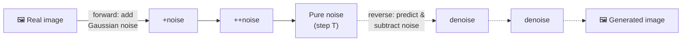
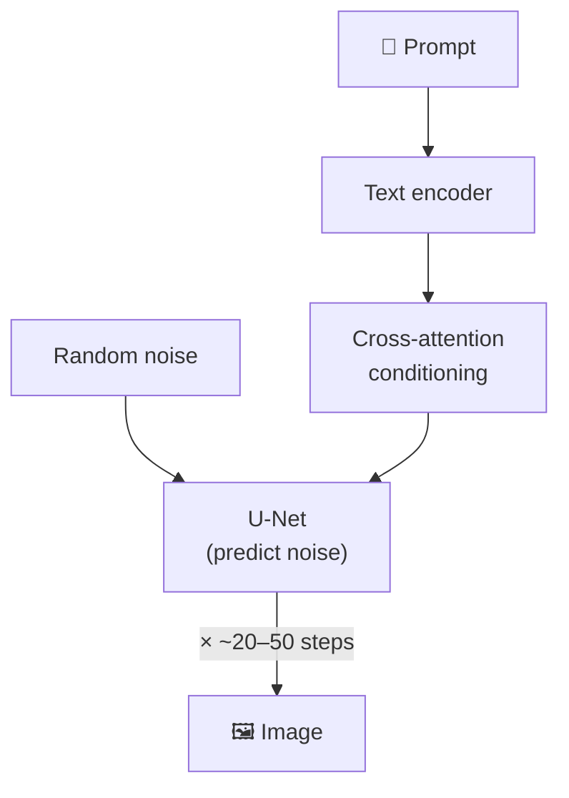
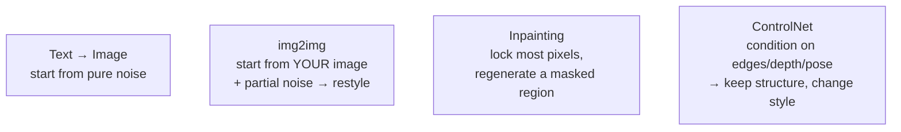

# 3 · Image Generation

*Multimodal AI module · Lesson 3 of 6 · [← prev: Vision-Language Models](02-vision-language-models.md) · [next → Audio & Voice Agents](04-audio-and-voice-agents.md)*

Lesson 2 went image → text. This lesson goes **text → image**. Nearly all modern image generators are **diffusion models**: they learn to turn pure noise into a coherent picture, one denoising step at a time, steered by your prompt.

---

## 3.1 Diffusion intuition — corrupt, then learn to reverse

Diffusion has two processes. The **forward** process is trivial and fixed; the **reverse** process is the whole model.



- **Forward process (training only):** take a real image and repeatedly add a tiny bit of Gaussian noise over `T` steps until it's indistinguishable from static. This needs no learning — it's just a fixed noise schedule (DDPM, Ho et al. **2020**).
- **Reverse process (what the model learns):** a **U-Net** is trained to look at a noisy image and **predict the noise that was added**. Subtract that prediction and you've denoised one step. Chain the steps and you walk from pure noise back to a clean image.
- **Generation:** at inference you *start* from random noise and run only the reverse steps — the model "hallucinates" a plausible image out of static.

**Where the prompt enters:** text conditioning. Your prompt is encoded (by a CLIP/T5 text encoder) and injected into the U-Net via **cross-attention** at every denoising step, so "a red bicycle" biases each step toward images consistent with that text.



> **Latent diffusion** (Rombach et al. **2022**, the basis of **Stable Diffusion**) does all of this in a compressed **VAE latent space** instead of on full-resolution pixels — ~8× smaller per side, which is why SD runs on a consumer GPU. A VAE decoder expands the final latent back to pixels.

---

## 3.2 Stable Diffusion vs DALL·E (open vs hosted)

| | **Stable Diffusion / SDXL** | **DALL·E 3 · gpt-image-1** |
|---|---|---|
| Origin | Stability AI (open weights, 2022+) | OpenAI (hosted API) |
| Where it runs | Your GPU / your infra | OpenAI's API only |
| Control | Full — samplers, seeds, ControlNet, LoRAs, fine-tuning | Prompt + a few params |
| Prompt adherence | Good; SDXL strong | Excellent (built to follow long prompts) |
| Cost model | Fixed infra / electricity | Per-image API fee |
| Best when | You need control, privacy, volume, custom styles | You want top quality with zero infra |

Other names you'll hear: **Midjourney** (hosted, strong aesthetics, Discord-first), **Google Imagen**, **FLUX** (open, high quality). All are diffusion (or diffusion-transformer) under the hood.

---

## 3.3 Prompting image models

Prompting a diffusion model is different from prompting an LLM — it responds to **dense descriptive noun phrases**, not conversational instructions.

```text
✅ "a cozy reading nook by a rain-streaked window, warm lamplight,
    autumn palette, shallow depth of field, 35mm photo, highly detailed"

❌ "Please could you make me a nice picture of a reading spot? Thanks!"
```

Levers that matter:
- **Subject + style + medium + lighting + composition** — stack concrete modifiers.
- **Negative prompt** (SD): what to *avoid* (`"blurry, extra fingers, text, watermark"`).
- **Guidance scale (CFG)** — how hard to follow the prompt. Low → creative/loose; high → literal but can look over-baked. ~7 is a common default.
- **Steps** — more denoising steps = more refinement, diminishing returns past ~30–50.
- **Seed** — fix it to reproduce or make small variations of the same image.

---

## 3.4 Beyond text→image: img2img, inpainting, ControlNet

You rarely want a *random* image — you want to steer it. Three high-level techniques, all reusing the same diffusion model:



| Technique | What it does | Example use |
|-----------|--------------|-------------|
| **img2img** | Start denoising from *your* image (noised part-way) instead of pure noise; `strength` sets how much to change | Restyle a photo; turn a sketch into art |
| **Inpainting** | Provide a **mask**; regenerate only the masked pixels, keep the rest | Remove an object, swap a face, extend a background (outpainting) |
| **ControlNet** (Zhang et al. **2023**) | Add a control image (Canny edges, depth map, OpenPose skeleton) that constrains **structure** while the prompt controls **content/style** | Keep a character's exact pose; match a product's shape |

---

## 3.5 API code sketches

### Hosted generation (OpenAI images API)

```python
from openai import OpenAI
client = OpenAI()

result = client.images.generate(
    model="gpt-image-1",          # or "dall-e-3"
    prompt="a minimalist logo of a fox, flat vector, two-tone teal and cream",
    size="1024x1024",
    quality="high",
    n=1,
)
# gpt-image-1 returns base64; write it to disk
import base64
with open("logo.png", "wb") as f:
    f.write(base64.b64decode(result.data[0].b64_json))
```

### Open-weights generation (Stable Diffusion via 🤗 diffusers)

```python
import torch
from diffusers import StableDiffusionXLPipeline

pipe = StableDiffusionXLPipeline.from_pretrained(
    "stabilityai/stable-diffusion-xl-base-1.0", torch_dtype=torch.float16
).to("cuda")

image = pipe(
    prompt="a cozy reading nook, warm lamplight, 35mm photo, highly detailed",
    negative_prompt="blurry, watermark, text, extra fingers",
    num_inference_steps=30,
    guidance_scale=7.0,
    generator=torch.Generator("cuda").manual_seed(42),   # reproducible
).images[0]
image.save("nook.png")
```

> **Safety & provenance:** hosted providers filter prompts and often attach invisible provenance metadata (e.g. C2PA content credentials). If you self-host SD you own that responsibility — add a safety checker and be deliberate about generating people, brands, or styles you don't have rights to.

---

## 3.6 Takeaways

- Modern image generators are **diffusion models**: a fixed **forward** process adds noise; a learned **U-Net reverse** process predicts and removes it, walking from noise → image.
- The **prompt conditions** every denoising step via **cross-attention** on a text encoding.
- **Stable Diffusion** = open weights + full control (runs on your GPU, thanks to **latent diffusion**); **DALL·E / gpt-image-1** = hosted, top quality, zero infra.
- Prompt with **dense descriptive phrases**; tune **guidance scale, steps, seed**, and use **negative prompts** (SD).
- Steer, don't just sample: **img2img** (restyle), **inpainting** (edit a masked region), **ControlNet** (lock structure via edges/depth/pose).
- Hosted APIs handle safety/provenance for you; self-hosting means you own it.

➡️ Next: [Audio & Voice Agents](04-audio-and-voice-agents.md) — the STT → LLM → TTS loop and building things that talk back.
