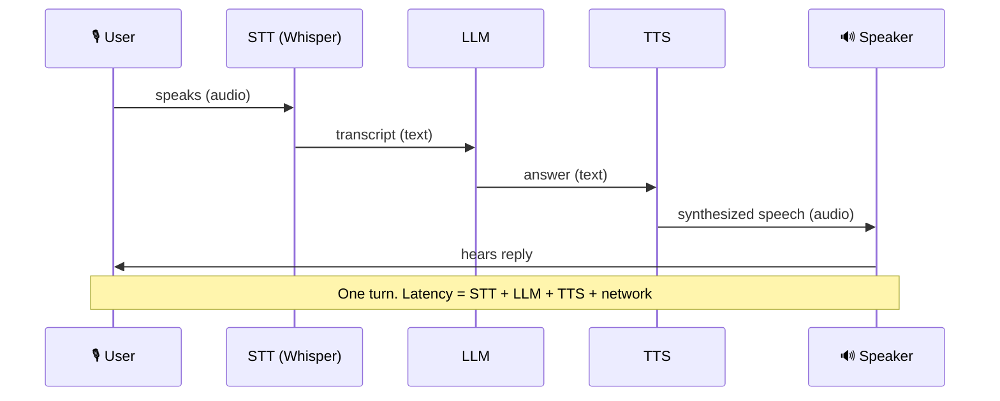
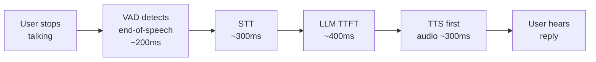
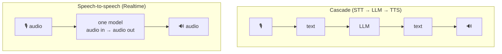

# 4 · Audio & Voice Agents

*Multimodal AI module · Lesson 4 of 6 · [← prev: Image Generation](03-image-generation.md) · [next → Multimodal RAG](05-multimodal-rag.md)*

A voice agent is the canonical **modality-specific pipeline** from [Lesson 1](01-what-is-multimodal.md): convert speech to text, reason with an LLM, convert the answer back to speech. This lesson walks the **STT → LLM → TTS** loop, the latency budget that makes or breaks it, and the newer speech-to-speech alternative.

---

## 4.1 The cascade: STT → LLM → TTS



Three specialists, each swappable:

1. **STT (Speech-to-Text)** — **Whisper** (OpenAI, encoder-decoder Transformer, **2022**, trained on ~680k hours) is the default; newer hosted options (`gpt-4o-transcribe`) trade openness for accuracy/latency. Output: a transcript, optionally with word timestamps.
2. **LLM** — reasons over the transcript (plus tools / RAG). Same LLM you'd use for chat.
3. **TTS (Text-to-Speech)** — turns the answer into a natural-sounding waveform (OpenAI `tts-1` / `gpt-4o-mini-tts`, ElevenLabs, etc.), choosing a voice.

| Stage | Job | Common tools | Key metric |
|-------|-----|--------------|------------|
| **STT** | audio → text | Whisper, `gpt-4o-transcribe`, Deepgram | Word Error Rate (WER), latency |
| **LLM** | text → answer | GPT-4o, Claude, local | Quality, time-to-first-token |
| **TTS** | text → audio | `tts-1`, ElevenLabs, Piper | Naturalness (MOS), latency |

---

## 4.2 Code — transcribe with Whisper, speak with TTS

```python
from openai import OpenAI
client = OpenAI()

# 1) STT — transcribe an audio file with Whisper
with open("caller.mp3", "rb") as audio:
    transcript = client.audio.transcriptions.create(
        model="whisper-1",
        file=audio,
        response_format="text",   # or "verbose_json" for word timestamps
        language="en",            # skip to auto-detect
    )
user_text = transcript  # e.g. "What are your service hours on Sunday?"

# 2) LLM — reason over the transcript
answer = client.chat.completions.create(
    model="gpt-4o",
    messages=[
        {"role": "system", "content": "You are a concise dealership voice assistant."},
        {"role": "user", "content": user_text},
    ],
).choices[0].message.content

# 3) TTS — synthesize the reply to an audio file
speech = client.audio.speech.create(
    model="tts-1",           # low-latency; "tts-1-hd" for higher fidelity
    voice="alloy",
    input=answer,
    response_format="mp3",
)
speech.stream_to_file("reply.mp3")
```

That's a full one-turn voice agent. To make it a *conversation*, keep the transcript history in the `messages` list (the LLM is stateless — see [`../01_prompt-engineering/`](../01_prompt-engineering/README.md)) and loop.

---

## 4.3 Latency — the thing that actually matters for voice

In text chat, a 3-second wait is fine. In a **phone call**, silence over ~**800 ms** feels broken. The cascade's latency is **additive**, so a naive implementation stacks up fast:



Techniques to stay under budget:

- **Stream everything.** Don't wait for the full transcript, full LLM answer, or full audio. **Stream STT** partials, **stream LLM tokens**, and **stream TTS** as tokens arrive so the user hears the first words while the rest is still generating.
- **Sentence-chunk the LLM→TTS handoff.** Send the first complete sentence to TTS immediately instead of waiting for the whole answer.
- **Voice Activity Detection (VAD)** + **endpointing** — detect when the user stopped talking quickly, and support **barge-in** (user interrupts → cancel current TTS playback).
- **Pick low-latency variants** (`tts-1` over `tts-1-hd`, smaller/faster LLM) for turns where quality can flex.
- **Co-locate** services to cut network round-trips.

> **Rule of thumb:** optimize **time-to-first-audio**, not total time. A reply that *starts* in 500 ms and streams feels far snappier than one that's silent for 1.5 s then plays all at once.

---

## 4.4 Cascade vs speech-to-speech (Realtime)

The cascade throws away everything text can't carry — tone, emotion, timing, overlapping speech. **Natively-multimodal speech-to-speech** models (e.g. OpenAI's **Realtime API**, a WebSocket audio↔audio stream on GPT-4o) skip the intermediate text and keep those signals, at much lower latency.



| | **Cascade (STT→LLM→TTS)** | **Speech-to-speech (Realtime)** |
|---|---|---|
| Latency | Higher (additive) | Lowest (single model, streamed) |
| Emotion / tone | Lost at the text bottleneck | Preserved (hears & speaks affect) |
| Barge-in / overlap | You build it | Native |
| Control & debuggability | High — inspect the transcript, swap parts | Lower — it's a black box |
| Tooling / RAG | Easy (plain text step) | Supported but newer/less mature |
| Cost | Pay 3 services | Often pricier per minute |

> **Rule of thumb:** build the **cascade first** — it's debuggable, lets you drop in RAG and tools, and any component is swappable. Move to **speech-to-speech** when sub-second latency or emotional nuance is the product (e.g. a natural-sounding phone agent).

---

## 4.5 Voice-agent patterns

- **Turn-taking loop** — the STT→LLM→TTS cascade above, run continuously with VAD + barge-in.
- **Tool-using voice agent** — the LLM step calls functions (check hours, book an appointment). This is a normal agent that happens to have ears and a mouth; the orchestration patterns live in [`../05_multi-agent-frameworks/`](../05_multi-agent-frameworks/README.md).
- **Voice RAG** — the LLM step retrieves grounding context before answering; the retrieval half is [`../12_rag/`](../12_rag/README.md). Keep answers short — spoken responses can't be skimmed.

---

## 4.6 Takeaways

- A voice agent is the cascade **STT → LLM → TTS**; each stage is a swappable specialist (**Whisper** for STT, a chat LLM, a TTS voice).
- The code is short: `audio.transcriptions.create` (Whisper) → `chat.completions.create` → `audio.speech.create` (TTS), looped with history.
- **Latency is additive and it's everything** — **stream** STT/LLM/TTS, sentence-chunk the handoff, use **VAD + barge-in**, and optimize **time-to-first-audio**.
- **Speech-to-speech (Realtime)** models skip the text bottleneck for the lowest latency and preserved tone, trading away debuggability and easy tool/RAG integration.
- Start with the **cascade** (modular, debuggable, RAG/tool-friendly); graduate to **speech-to-speech** when latency or emotion is the point.

➡️ Next: [Multimodal RAG](05-multimodal-rag.md) — retrieving over images and text in one system.
