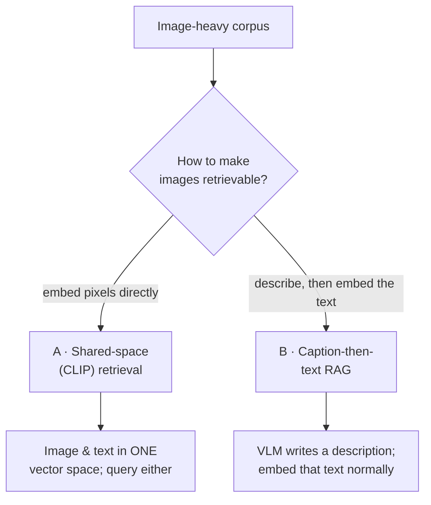
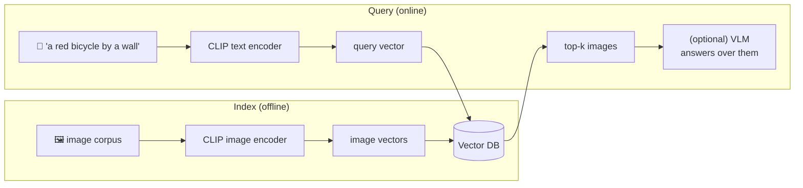
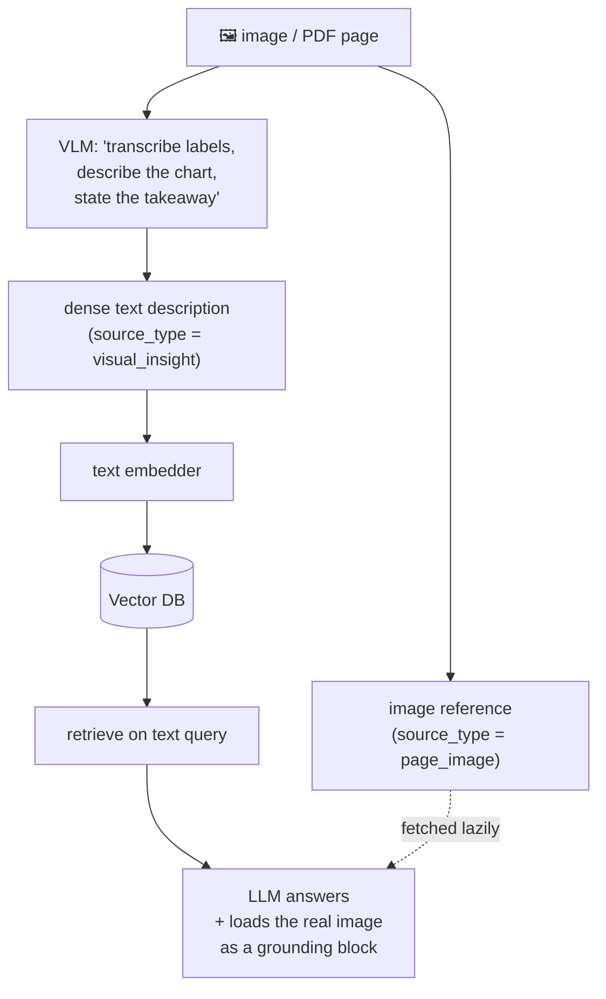
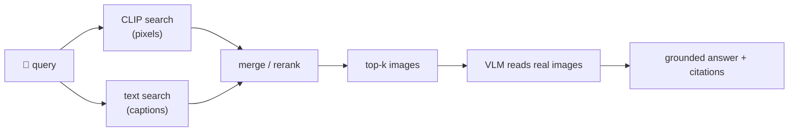

# 5 · Multimodal RAG

*Multimodal AI module · Lesson 5 of 6 · [← prev: Audio & Voice Agents](04-audio-and-voice-agents.md) · [next → Applications & Tradeoffs](06-applications-and-tradeoffs.md)*

Ordinary RAG (see [`../12_rag/`](../12_rag/README.md)) retrieves **text chunks** for a **text query**. But the answer to *"which slide showed the funnel diagram?"* lives in **pixels**. Multimodal RAG extends the retrieve-then-generate pattern to images. There are two dominant designs, and picking between them is the whole lesson.

---

## 5.1 The two designs at a glance



| | **A · Shared-space (CLIP)** | **B · Caption-then-text RAG** |
|---|---|---|
| How images are indexed | **CLIP image embedding** of the raw image | A **VLM describes** the image → embed the *description* text |
| Query path | Embed the text query with **CLIP text encoder**, search the same space | Embed the query with a normal text embedder, search text |
| Vector space | One shared multimodal space | Ordinary text space (reuse your existing stack) |
| Strength | True cross-modal search; finds images with no text; cheap at query time | Rich, searchable *semantics* (reads numbers, labels, trends); reuses text RAG verbatim |
| Weakness | CLIP is a global "gist" — weak on dense text, fine detail, exact numbers | VLM captioning cost at ingest; description can miss what it didn't mention |
| Best for | Photo libraries, product search, "find images like this" | Documents, charts, slides, scanned PDFs (the RagApp case) |

> **Rule of thumb:** if the value is in **what the image *depicts*** (a photo, a scene) → **CLIP shared space**. If the value is in **what the image *says*** (a chart's numbers, a diagram's labels, a scanned contract) → **caption-then-text RAG**.

---

## 5.2 Design A — cross-modal retrieval in a shared CLIP space

Because [CLIP (Lesson 2)](02-vision-language-models.md) puts images and text in the **same** space, you can embed a library of images once and then search it with a **text** query — no captions, no OCR.



```python
import torch, open_clip, numpy as np
from PIL import Image

model, _, preprocess = open_clip.create_model_and_transforms(
    "ViT-B-32", pretrained="laion2b_s34b_b79k")
tokenizer = open_clip.get_tokenizer("ViT-B-32")

def embed_image(path):
    x = preprocess(Image.open(path)).unsqueeze(0)
    with torch.no_grad():
        v = model.encode_image(x)
    return (v / v.norm(dim=-1, keepdim=True)).squeeze(0).numpy()

def embed_text(q):
    with torch.no_grad():
        v = model.encode_text(tokenizer([q]))
    return (v / v.norm(dim=-1, keepdim=True)).squeeze(0).numpy()

# index: {path: vector} → upsert into your vector DB (see ../06_vector-databases/)
index = {p: embed_image(p) for p in ["a.jpg", "b.jpg", "c.jpg"]}

# query with TEXT, retrieve IMAGES (cross-modal!)
qv = embed_text("a red bicycle by a brick wall")
ranked = sorted(index, key=lambda p: np.dot(qv, index[p]), reverse=True)
print(ranked[0])   # nearest image, no caption ever written
```

In production the `index` dict is a **vector database** ([`../06_vector-databases/`](../06_vector-databases/README.md)) — the only twist versus text RAG is that vectors come from a CLIP encoder and both modalities share one collection.

---

## 5.3 Design B — caption-then-text RAG (VLM as the bridge)

Instead of embedding pixels, run each image through a **generative VLM** to produce a dense text description, then embed and retrieve that text with your **existing** RAG stack. This is what the [RagApp visual track](../18_ragapp/06-visual-extraction-and-vlm.md) does.



Why this wins for **documents**: the VLM reads the *exact numbers and labels* into text, so a query like *"how did revenue trend in 2025?"* matches a page that had **zero extractable text**. And because the description is plain text, everything from [`../12_rag/`](../12_rag/README.md) — chunking policy, hybrid search, rerankers, citations — applies unchanged.

The RagApp refinement worth stealing: keep **two chunk types per image** — a **`visual_insight`** (the searchable VLM text) and a **`page_image`** (a reference to the real PNG). The text makes the page *findable*; at answer time the agent **loads the actual image** as a content block so the model reads the real chart (grounding, per [Lesson 2 §2.2](02-vision-language-models.md)). RagApp deliberately skips CLIP embeddings and embeds only the VLM text — a concrete "Design B over Design A" call for a document corpus.

---

## 5.4 You can combine them

The designs aren't exclusive. A common hybrid:

1. **Retrieve** candidates with CLIP (fast, cheap, catches images with no useful caption), **or** with caption text (semantic precision) — or both and merge.
2. **Ground & generate** by loading the actual retrieved images into a **VLM** so it answers from the pixels, not just the description.



---

## 5.5 Takeaways

- Multimodal RAG = the [text RAG](../12_rag/) retrieve-then-generate loop extended to images.
- **Design A (shared-space CLIP):** embed pixels and text in **one** space; search images with text directly. Best when value is in **what the image depicts**.
- **Design B (caption-then-text RAG):** a **VLM describes** the image, you embed the **text**, and reuse your whole text stack unchanged. Best when value is in **what the image says** (charts, diagrams, scans).
- The [**RagApp**](../18_ragapp/06-visual-extraction-and-vlm.md) pipeline is Design B: `visual_insight` (searchable VLM text) + `page_image` (real image loaded for grounding), no CLIP embeddings.
- Either way the store is a **vector DB** ([`../06_vector-databases/`](../06_vector-databases/README.md)); a strong system often **retrieves with captions/CLIP, then grounds generation with the real image in a VLM**.

➡️ Next: [Applications & Tradeoffs](06-applications-and-tradeoffs.md) — where multimodal pays off, what it costs, and when to skip it.
