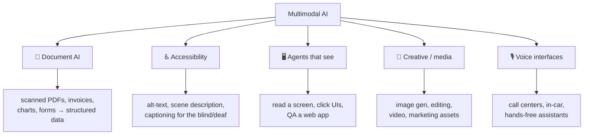
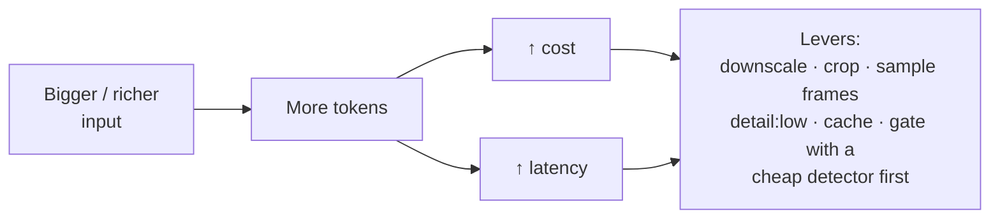
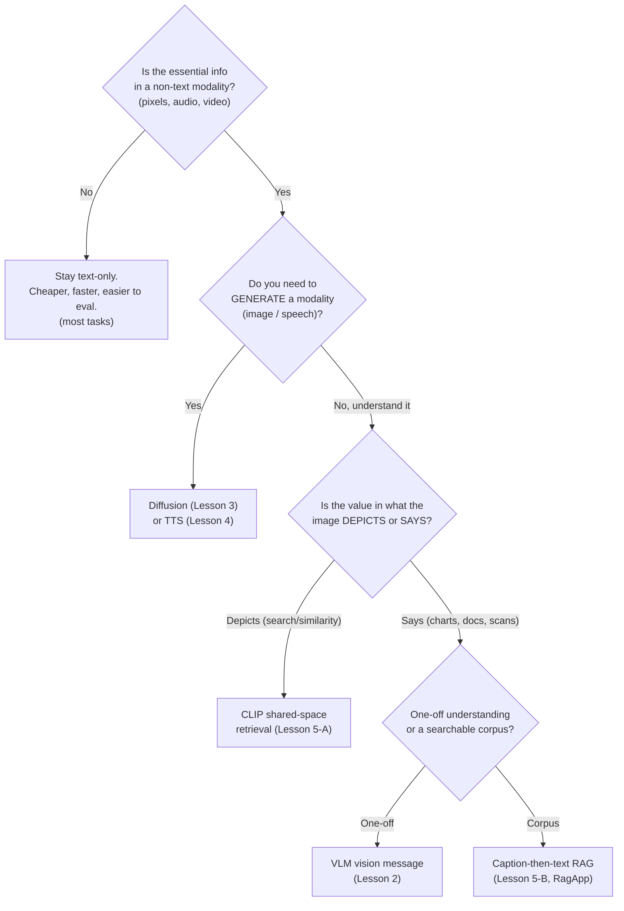

# 6 · Applications & Tradeoffs

*Multimodal AI module · Lesson 6 of 6 · [← prev: Multimodal RAG](05-multimodal-rag.md) · [index →](README.md)*

The previous lessons were *how*. This one is *when* and *whether*. Multimodal capability is powerful and not free — every image, audio second, and video frame costs tokens, latency, and evaluation headache. This closes the module with real use cases, the cost/latency reality, why evaluation is hard, and a decision tree for reaching (or not reaching) for multimodality.

---

## 6.1 Where multimodal actually pays off

| Domain | What multimodality unlocks | Modality mix |
|--------|----------------------------|--------------|
| **Document AI** | Extract from image-only PDFs, read charts/tables rendered as images, understand layout — the [RagApp visual track](../18_ragapp/06-visual-extraction-and-vlm.md) | Image → text |
| **Accessibility** | Auto alt-text, live scene description, captioning — genuinely life-changing, not a demo | Image/audio → text/speech |
| **Screen / computer-use agents** | An agent that *sees* the UI (screenshots), reasons, and acts — see [`../05_multi-agent-frameworks/`](../05_multi-agent-frameworks/README.md) | Image → action |
| **Creative & media** | Generate/edit images and video, storyboarding, product mockups ([Lesson 3](03-image-generation.md)) | Text → image |
| **Voice interfaces** | Phone agents, in-car, hands-free ([Lesson 4](04-audio-and-voice-agents.md)) | Speech ↔ speech |

---

## 6.2 The cost & latency reality

Multimodal inputs are **token-hungry** and **slow** relative to text. Ballpark intuitions (not exact figures — always measure your provider):

- **Images cost tokens by resolution.** A high-detail image is tiled into many patches; a full-page 300-DPI scan can cost as much as a page of text or more. Sending 20 pages at `detail: high` is a real bill. Downscale, crop to the region of interest, or use `detail: low` when a thumbnail suffices ([Lesson 2 §2.3](02-vision-language-models.md)).
- **Audio and video scale with duration.** Video is the extreme — sampling even 1 frame/second of a 10-minute clip is 600 images. Sample sparsely and only around moments of interest.
- **Generation is slow.** A diffusion image is ~20–50 U-Net passes ([Lesson 3](03-image-generation.md)); voice has a hard real-time latency budget ([Lesson 4](04-audio-and-voice-agents.md)).

> **Rule of thumb:** don't send the whole modality to the big model by default. **Gate** it — a cheap heuristic or small classifier decides *which* pages/frames/seconds are worth an expensive multimodal call. This is exactly the [RagApp visual-detection heuristic](../18_ragapp/06-visual-extraction-and-vlm.md): cheap local signals decide which PDF pages get the VLM, so most text pages never pay the vision cost.

---

## 6.3 Why evaluation is harder than text

Text tasks often have a checkable answer. Multimodal outputs frequently don't, which breaks naive eval:

| Challenge | Why it's hard | Mitigation |
|-----------|---------------|------------|
| **Open-ended outputs** | "Describe this image" has no single ground truth | Rubric-based grading; **VLM-as-judge**; human spot-checks (see [`../16_evals/`](../16_evals/README.md)) |
| **Generated images** | Aesthetic quality is subjective; no exact match | Human preference (Elo), CLIPScore for prompt-adherence, FID for distribution realism |
| **Speech (STT/TTS)** | Transcripts vary; naturalness is perceptual | WER for STT; MOS / listening tests for TTS |
| **Grounding / hallucination** | Did it read the *actual* pixels or guess? | Ask for verbatim transcription of labels; check against the source image |
| **Data leakage** | Benchmark images may be in pretraining | Prefer fresh/private eval sets |

> Multimodal eval leans on **human judgment and model-graded rubrics** far more than text eval. Budget for it — a demo that "looks great" is not an evaluated system. The LLM-as-judge patterns in [`../16_evals/`](../16_evals/README.md) carry straight over as **VLM-as-judge**.

---

## 6.4 Decision tree — should you go multimodal?

**The honest default:** *most* tasks are still best served text-only — it's cheaper, faster, and far easier to evaluate. Add a modality only when the information genuinely lives there. When you do, **gate the expensive calls** and **budget for real evaluation**.

---

## 6.5 Takeaways

- Multimodal earns its keep in **document AI, accessibility, screen/computer-use agents, creative media, and voice** — where the information is genuinely non-text.
- It's **token-hungry and slow**: images cost by resolution, audio/video by duration, generation by denoising steps. **Gate** expensive calls behind a cheap detector (like the RagApp visual-detection heuristic) and downscale/crop/sample.
- **Evaluation is the hard part** — outputs are open-ended, so lean on **rubrics, VLM-as-judge, WER/MOS, and human review**; guard against benchmark leakage. It builds on [`../16_evals/`](../16_evals/README.md).
- Use the **decision tree**: stay text-only unless the essential signal is another modality; then pick generate vs understand, and depicts (CLIP) vs says (caption-then-text RAG).
- Module arc: modalities align in a **shared space** → **VLMs** read images → **diffusion** writes them → **voice** cascades speech → **multimodal RAG** retrieves across modalities → and you now know **when not to bother**.

⬅️ Back to the [module index](README.md) · Related: [`../12_rag/`](../12_rag/README.md) · [`../06_vector-databases/`](../06_vector-databases/README.md) · [`../05_multi-agent-frameworks/`](../05_multi-agent-frameworks/README.md) · [`../18_ragapp/06-visual-extraction-and-vlm.md`](../18_ragapp/06-visual-extraction-and-vlm.md)
