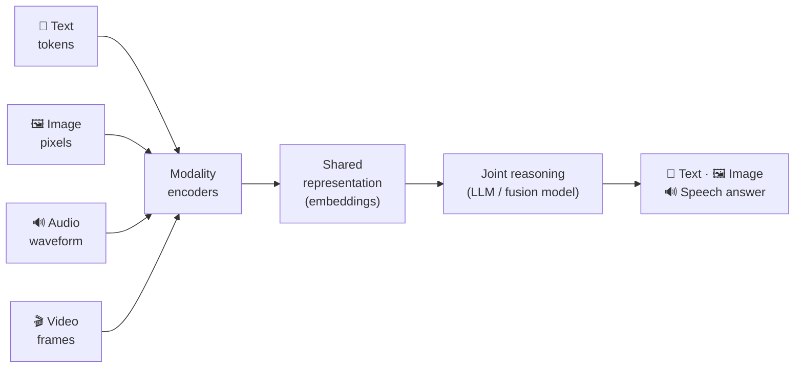

# 🎨 Multimodal AI

> Everything else in this repo is **text in, text out**. This module is about the *other* modalities — **images, audio, and video** — and how modern models fuse them into a single shared understanding so a model can *look*, *listen*, and *speak*, not just read.

These notes are a **reference module** (concept + code + diagrams), not a transcript. They assume you're comfortable calling an LLM and doing text RAG (see [`../12_rag/`](../12_rag/README.md)) and prompting (see [`../01_prompt-engineering/`](../01_prompt-engineering/README.md)). Multimodal is what you reach for once text alone can't see the chart, hear the caller, or draw the mockup.

---

## 🗺️ The one idea: many modalities, one representation

Every multimodal system is a variation on the same move — **encode each modality into vectors that live in a shared space**, let a model reason over them jointly, then decode back out to whatever modality you need.

**Golden rule:** the hard part is never the pixels or the waveform — it's *aligning* them with language so the model can talk about what it sees and hears. Almost everything below (CLIP, VLMs, diffusion conditioning, multimodal RAG) is a different way to build or exploit that alignment.

---

## 📓 Lessons

| # | Lesson | What you'll learn |
|---|--------|-------------------|
| 1 | [What is Multimodal AI?](01-what-is-multimodal.md) | Modalities, why joint understanding matters, unified vs modality-specific, the shift to natively-multimodal LLMs |
| 2 | [Vision-Language Models](02-vision-language-models.md) | Vision encoder + projector + LLM, CLIP contrastive pretraining, LLaVA architecture, calling a VLM via API |
| 3 | [Image Generation](03-image-generation.md) | Diffusion intuition (forward/reverse), Stable Diffusion vs DALL·E, prompting, img2img / inpainting / ControlNet |
| 4 | [Audio & Voice Agents](04-audio-and-voice-agents.md) | STT → LLM → TTS pipeline, Whisper, latency & streaming for real-time voice, cascaded vs speech-to-speech |
| 5 | [Multimodal RAG](05-multimodal-rag.md) | Cross-modal retrieval in a shared CLIP space vs caption-then-text RAG; ties to vector DBs and the RagApp visual track |
| 6 | [Applications & Tradeoffs](06-applications-and-tradeoffs.md) | Document AI, accessibility, screen agents; cost/latency; evaluation challenges; when to go multimodal |

---

## ⚡ The whole module in one cheat sheet

| Want… | Reach for… |
|-------|-----------|
| A model to **describe / reason about an image** | A **VLM** via a vision message (GPT-4o, Claude vision) — [Lesson 2](02-vision-language-models.md) |
| To **search images with text** (or vice-versa) | **CLIP** embeddings in a shared space — [Lesson 2](02-vision-language-models.md) · [Lesson 5](05-multimodal-rag.md) |
| To **generate an image** from a prompt | **Diffusion** — DALL·E / gpt-image-1 (API) or Stable Diffusion (open) — [Lesson 3](03-image-generation.md) |
| To **edit part of an image** | **Inpainting** / img2img / **ControlNet** — [Lesson 3](03-image-generation.md) |
| To **transcribe speech** | **Whisper** (STT) — [Lesson 4](04-audio-and-voice-agents.md) |
| To **build a talking agent** | **STT → LLM → TTS** cascade, or a speech-to-speech Realtime API — [Lesson 4](04-audio-and-voice-agents.md) |
| To **RAG over image-heavy docs** | **Caption-then-text RAG** (VLM describes → embed text) — [Lesson 5](05-multimodal-rag.md) |
| To decide **whether you even need multimodal** | The decision tree in [Lesson 6](06-applications-and-tradeoffs.md) |

---

## 🔗 Where this connects

- **Prompting still applies** — a vision message is still a prompt: [`../01_prompt-engineering/`](../01_prompt-engineering/README.md).
- **Retrieval** — multimodal RAG builds on the text RAG pipeline: [`../12_rag/`](../12_rag/README.md).
- **Vector databases** — cross-modal search needs a vector store: [`../06_vector-databases/`](../06_vector-databases/README.md).
- **Agents** — voice agents and screen-seeing agents are multi-agent patterns: [`../05_multi-agent-frameworks/`](../05_multi-agent-frameworks/README.md).
- **Real project** — the RagApp ingestion pipeline already runs a VLM over image-dense PDF pages: [`../18_ragapp/06-visual-extraction-and-vlm.md`](../18_ragapp/06-visual-extraction-and-vlm.md).

---

*Reference notes for personal study. Names real models/methods with their origins where useful (CLIP — Radford et al. 2021; DDPM — Ho et al. 2020; Latent Diffusion / Stable Diffusion — Rombach et al. 2022; LLaVA — Liu et al. 2023; Whisper — Radford et al. 2022; GPT-4o 2024, Claude 3 vision 2024).*
