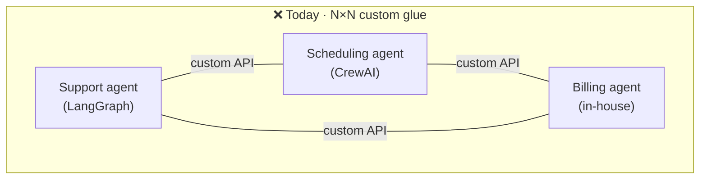
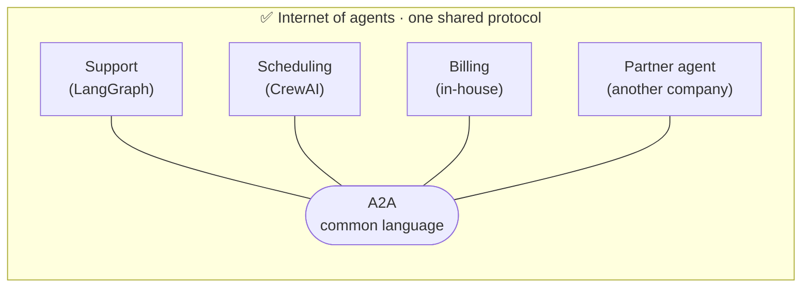
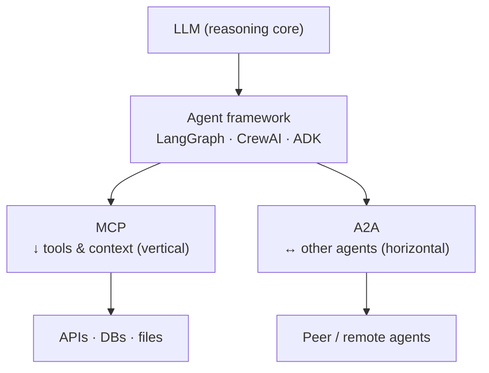

# 1 · Why Agent Interop?

*A2A Protocol module · Lesson 1 of 5 · [← module home](README.md) · [next → Core Concepts](02-core-concepts.md)*

Single agents are getting good. The next wall isn't *making* an agent — it's making agents **built by different people, on different frameworks, owned by different orgs, actually work together.** A2A exists to knock down that wall.

---

## 1.1 The problem: every agent is an island

Today each team ships an agent inside its own stack. A support agent is built in [LangGraph](../13_langgraph/README.md); a scheduling agent in CrewAI; a billing agent as a bespoke service. Each has its own memory, prompts, tools, and API shape. When you want them to collaborate, you hand-write brittle glue for every pair.

The cost is **quadratic**: three agents need three integrations, ten agents need forty-five, and every new agent re-negotiates auth, payload shape, and error handling with everyone else. Nobody can reuse an agent they didn't build.

| Symptom | Root cause |
|---------|-----------|
| "Our CRM agent can't call the finance team's agent." | No shared wire format or discovery mechanism |
| Rewriting the same integration per vendor | No standard contract for *send task / get result* |
| Can't swap CrewAI agent for a LangGraph one | Collaboration is coupled to a framework's internals |
| Security signs off once, per integration, forever | No common auth story across agents |

---

## 1.2 The vision: an "internet of agents"

The web scaled because everyone agreed on **HTTP + URLs + HTML** — you don't need to know what language a server is written in to `GET` a page. A2A applies the same idea to agents: agree on a small, neutral protocol at the *boundary*, and let each agent stay a black box internally.

Now integration is **linear**: speak A2A once, and you can discover and delegate to *any* A2A-speaking agent — including agents run by other companies you've never coordinated with. An agent becomes a reusable, composable service, like a microservice with a brain.

---

## 1.3 Where A2A fits in the stack

A2A does not replace your agent framework, your model, or your tools. It sits **at the seam between agents**.

- **Model** = the brain.
- **Framework** ([LangGraph](../13_langgraph/README.md), CrewAI, Google ADK) = how *one* agent is wired.
- **[MCP](../15_mcp/README.md)** = how that agent reaches *down* to tools and data.
- **A2A** = how that agent reaches *across* to *other agents* as peers.

We unpack the MCP-vs-A2A relationship carefully in [Lesson 4](04-a2a-vs-mcp.md) — for now, hold the mental image: **MCP is vertical, A2A is horizontal, and you usually want both.**

---

## 1.4 What A2A deliberately does *not* do

Good protocols are opinionated about staying small. A2A intentionally leaves alone:

| A2A does | A2A does **not** |
|----------|------------------|
| Standardize *discovery* (Agent Cards) | Dictate how you build the agent inside |
| Standardize *task exchange* & results | Force a shared model, memory, or prompt |
| Ride on existing web standards (HTTP, JSON-RPC, SSE) | Invent a new transport or runtime |
| Preserve each agent as an **opaque** peer | Require agents to expose internal tools/state |

This "opaque agent" stance is the key to enterprise adoption: two companies can collaborate without either revealing its intellectual property or internal architecture — more in [Lesson 5](05-security-and-adoption.md).

---

## Takeaways

- Custom agent-to-agent glue scales **quadratically** and couples collaboration to each framework — the core pain A2A removes.
- A2A's goal is an **"internet of agents"**: agree on a thin, neutral protocol at the boundary, keep every agent a black box inside.
- A2A lives **at the seam between agents** — orthogonal to your model, your framework, and your tools.
- Remember the axes: **A2A = horizontal (agent↔agent)**, **[MCP](../15_mcp/README.md) = vertical (agent↔tools)** — complementary, not competing.

➡️ Next: [Core Concepts](02-core-concepts.md) — the Agent Card, tasks, messages, artifacts, and parts.
