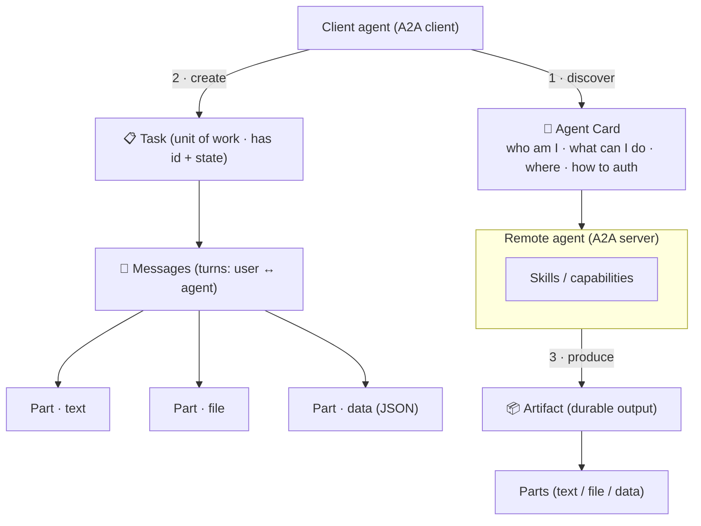
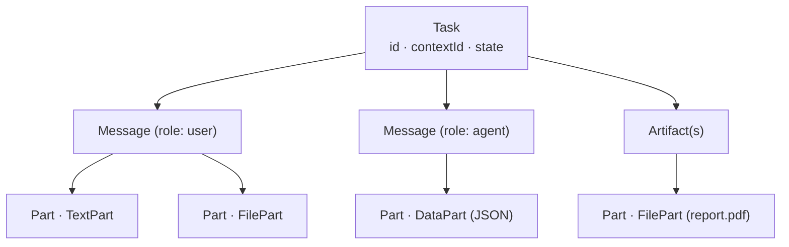

# 2 · Core Concepts

*A2A Protocol module · Lesson 2 of 5 · [← Why Agent Interop](01-why-agent-interop.md) · [next → Task Lifecycle](03-task-lifecycle.md)*

A2A has a small vocabulary. Learn six nouns — **Agent Card, client agent, remote agent, task, message, artifact** (plus the atom, the **part**) — and you can read any A2A exchange.

---

## 2.1 The building blocks at a glance



| Concept | Role | Analogy |
|---------|------|---------|
| **Agent Card** | Machine-readable description of an agent | A service's OpenAPI doc + business card |
| **Client agent** | The agent that *initiates* and delegates work | The caller |
| **Remote agent** | The agent that *receives* and performs work | The callee / service |
| **Task** | The stateful unit of work being requested | A ticket / job |
| **Message** | A single conversational turn within a task | A chat bubble |
| **Part** | The atomic content chunk inside a message/artifact | A MIME body part |
| **Artifact** | The concrete output the remote agent returns | The deliverable |

> **Client vs remote is a *role*, not a type.** The same agent is a *remote* agent when others call it and a *client* agent when it calls out. Chains form naturally: A → B → C.

---

## 2.2 The Agent Card — capability discovery

The Agent Card is how an agent advertises itself. It's a JSON document, typically served at a **well-known URL** (e.g. `https://agent.example.com/.well-known/agent-card.json`) so clients can fetch it without prior arrangement. It tells a would-be caller *what the agent can do, where to reach it, what modalities it speaks, and how to authenticate.*

```json
{
  "name": "Scheduling Agent",
  "description": "Books, reschedules and cancels appointments across calendars.",
  "url": "https://agent.example.com/a2a",
  "version": "1.4.0",
  "provider": { "organization": "Acme Corp" },
  "capabilities": {
    "streaming": true,
    "pushNotifications": true
  },
  "defaultInputModes": ["text/plain", "application/json"],
  "defaultOutputModes": ["text/plain", "application/json"],
  "skills": [
    {
      "id": "book_appointment",
      "name": "Book appointment",
      "description": "Find a free slot and confirm a booking.",
      "tags": ["calendar", "scheduling"],
      "examples": ["Book a 30-min call with Dana next Tuesday afternoon"]
    }
  ],
  "securitySchemes": {
    "oauth2": { "type": "oauth2", "flows": { "clientCredentials": {} } }
  }
}
```

> ⚠️ **Field names above are illustrative.** The exact schema evolves across spec versions; treat this as the *shape* of an Agent Card (identity, endpoint, capabilities, modalities, skills, auth), not a normative field list.

| Card section | Answers | Why the client cares |
|--------------|---------|----------------------|
| `name` / `description` | Who is this? | Human + LLM-readable routing |
| `url` | Where do I send tasks? | The A2A endpoint |
| `capabilities` | Streaming? Push? | Whether it can stream partial results |
| `defaultInput/OutputModes` | Text? JSON? Audio? Files? | **Modality negotiation** |
| `skills` | What discrete things can it do? | Match a need to an agent |
| `securitySchemes` | How do I authenticate? | Set up trust before calling ([Lesson 5](05-security-and-adoption.md)) |

Discovery can be a well-known URL, a private registry/catalog, or a card handed over directly — A2A standardizes the *card*, not any single directory.

---

## 2.3 Tasks, messages, artifacts, parts

Once a client picks an agent, it opens a **task**. Everything else nests inside.



- **Task** — the top-level, *stateful* container. Has an `id`, usually a `contextId`/session id to group related tasks, and a current **state** (submitted, working, input-required, completed, failed…). The full lifecycle is [Lesson 3](03-task-lifecycle.md).
- **Message** — one turn, tagged with a **role** (`user` = the client agent's side, `agent` = the remote agent's side). Carries one or more parts.
- **Part** — the atomic unit of content. Common kinds:

  | Part kind | Carries | Example |
  |-----------|---------|---------|
  | **TextPart** | Plain / formatted text | "Book Tuesday 2pm" |
  | **FilePart** | Bytes or a URI + mime type | a PDF, an image, audio |
  | **DataPart** | Structured JSON | a form, a typed record |

- **Artifact** — the *durable output* the remote agent produces for a task (a generated report, a booked-confirmation record, an image). Also composed of parts, so outputs are multi-modal by construction.

> **Message vs Artifact:** messages are the back-and-forth *conversation*; an artifact is the *result you keep*. A task can accrue many messages but yield one or more artifacts.

---

## 2.4 A minimal client sketch

Conceptually, using a remote agent is: **fetch card → send task → read artifact.**

```python
# Pseudocode — illustrates the flow, not a specific SDK signature.
card = a2a.fetch_agent_card("https://agent.example.com/.well-known/agent-card.json")

client = a2a.Client(card, auth=oauth2_token)   # trust set up from card's securitySchemes

task = client.send_message(
    message={
        "role": "user",
        "parts": [{"kind": "text", "text": "Book a 30-min call with Dana next Tuesday PM"}],
    }
)

# task.state advances: submitted → working → (maybe input-required) → completed
for artifact in task.artifacts:
    for part in artifact.parts:
        print(part)   # e.g. a DataPart with the confirmed booking
```

The wire format underneath is **JSON-RPC 2.0 over HTTP** — we look at the actual request/response and the streaming variants next.

---

## Takeaways

- The whole vocabulary is six nouns: **Agent Card, client agent, remote agent, task, message, artifact** — plus the **part** as the atomic content unit.
- The **Agent Card** is machine-readable self-description (identity, endpoint, capabilities, modalities, skills, auth), usually at a **well-known URL** — the basis of discovery.
- **Client vs remote is a role**, so agents chain: an agent can be both, forming multi-hop delegation.
- **Tasks** are stateful containers; **messages** are turns; **parts** (text/file/data) make everything **multi-modal**; **artifacts** are the durable results.

➡️ Next: [The Task Lifecycle](03-task-lifecycle.md) — states, streaming, and push notifications for long jobs.
