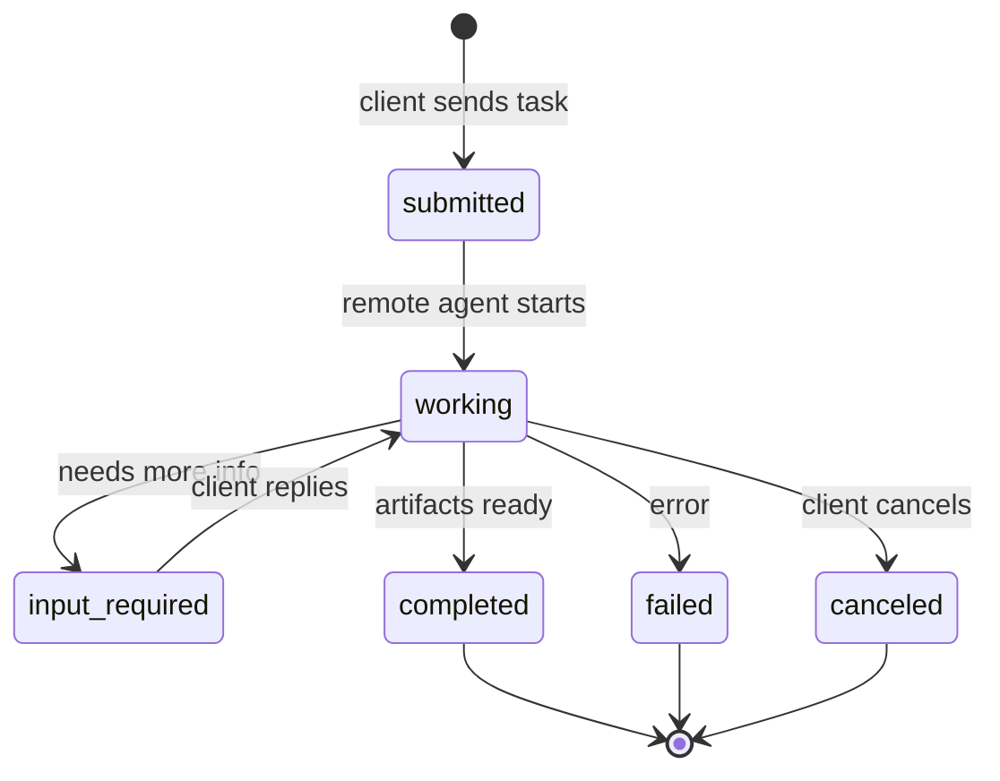
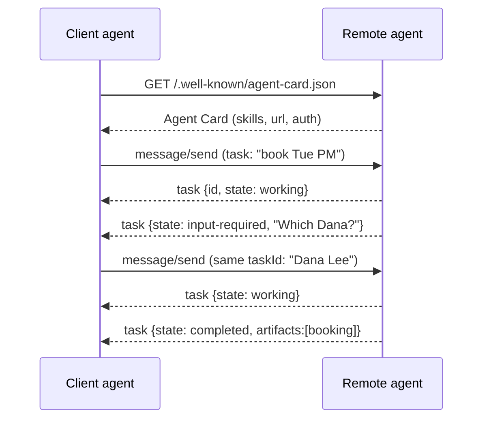
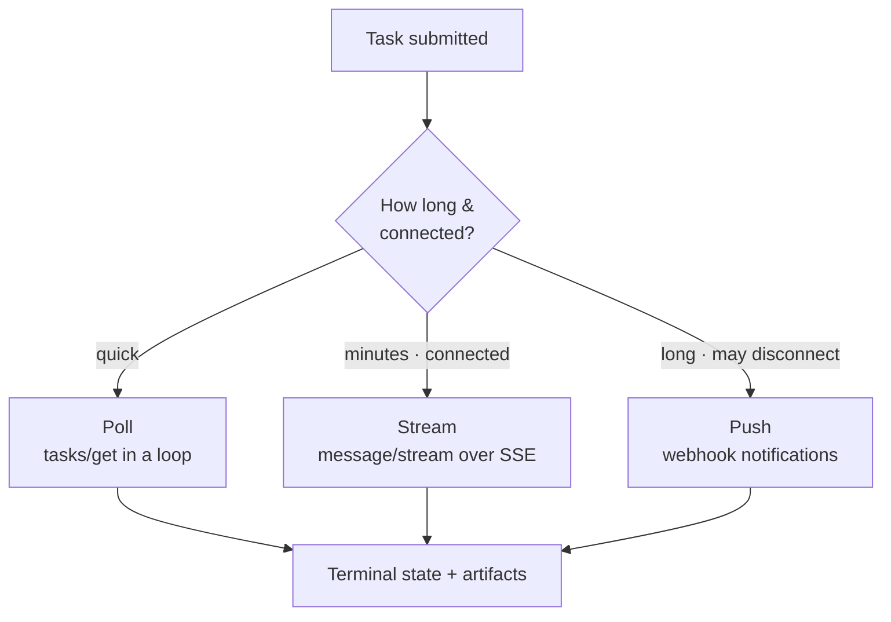

# 3 · The Task Lifecycle

*A2A Protocol module · Lesson 3 of 5 · [← Core Concepts](02-core-concepts.md) · [next → A2A vs MCP](04-a2a-vs-mcp.md)*

A task is the beating heart of A2A. It's a **stateful object** that moves through a well-defined set of states — and because real agent work can take seconds, minutes, or hours, A2A gives you three ways to follow along: **poll**, **stream (SSE)**, or **get pushed (webhook)**.

---

## 3.1 The task state machine



| State | Meaning | Terminal? |
|-------|---------|:---------:|
| **submitted** | Received, not yet started | no |
| **working** | Agent is actively processing | no |
| **input-required** | Agent paused, needs more from the client | no |
| **completed** | Finished successfully; artifacts available | ✅ |
| **failed** | Ended with an error | ✅ |
| **canceled** | Client (or system) stopped it | ✅ |

> **input-required is the superpower.** It lets an agent pause mid-task to ask a clarifying question ("Which Dana?"), receive an answer as a new message on the *same* task, and resume — turning a one-shot call into a genuine multi-turn collaboration. (Some spec versions also model `rejected` and an `auth-required` state; treat the set above as the stable core.)

---

## 3.2 A client ↔ remote sequence



The client discovers once, then drives the task with successive messages carrying the **same task id** until a terminal state.

---

## 3.3 The wire format — JSON-RPC 2.0 over HTTP

A2A rides on **JSON-RPC 2.0**. A request to start/continue a task looks like:

```json
{
  "jsonrpc": "2.0",
  "id": "req-42",
  "method": "message/send",
  "params": {
    "message": {
      "role": "user",
      "parts": [
        { "kind": "text", "text": "Book a 30-min call with Dana next Tuesday PM" }
      ]
    }
  }
}
```

A representative response — the task object with its current state:

```json
{
  "jsonrpc": "2.0",
  "id": "req-42",
  "result": {
    "id": "task-9f3",
    "contextId": "ctx-7",
    "status": { "state": "working" },
    "artifacts": []
  }
}
```

> ⚠️ **Method names are version-sensitive.** Current spec drafts use `message/send` (and `message/stream`); earlier drafts used `tasks/send` / `tasks/sendSubscribe`. The *pattern* — a JSON-RPC method that submits a message and returns a task with a `state` — is what's stable. Prefer describing it that way over memorizing exact strings.

| JSON-RPC method (illustrative) | Does |
|--------------------------------|------|
| `message/send` | Submit a message; get the task back (synchronous-ish) |
| `message/stream` | Submit and **subscribe** to a stream of updates (SSE) |
| `tasks/get` | Poll a task's current state/artifacts by id |
| `tasks/cancel` | Request cancellation of a running task |
| `tasks/pushNotificationConfig/set` | Register a webhook for push updates |

---

## 3.4 Following long-running tasks — three modes

Agent work is often *not* instant. A2A supports three consumption patterns:



| Mode | How | Best for |
|------|-----|----------|
| **Poll** | Call `tasks/get` repeatedly | Simple clients, short tasks |
| **Stream (SSE)** | `message/stream` opens a **Server-Sent Events** channel; the agent emits incremental status + artifact updates | Live progress, token-by-token output, "typing…" UX |
| **Push (webhook)** | Client registers a callback URL; the remote agent **POSTs** state changes when they happen | Hours-long jobs, disconnected/serverless clients |

**Streaming (SSE):** the client subscribes and receives a sequence of events — status transitions (`working` → `completed`) and partial artifact chunks — over one long-lived HTTP response. Great when the client stays connected and wants to render progress.

**Push notifications:** for jobs that outlive a connection, the client pre-registers a webhook (with its own auth so the callback can be trusted). When the task changes state, the remote agent calls back — no need to hold a socket open. Ideal for "kick off a 2-hour analysis and tell me when it's done."

> These map naturally onto agent frameworks: a [LangGraph](../13_langgraph/README.md) graph can *be* the remote agent, streaming node-by-node progress out over A2A's SSE channel while it runs.

---

## Takeaways

- A task moves through a small **state machine**: submitted → working → (input-required ⇄ working) → completed / failed / canceled.
- **input-required** turns a single call into a **multi-turn** exchange on the same task id — clarify, resume, finish.
- The wire format is **JSON-RPC 2.0 over HTTP**; learn the *pattern* (submit message → task with `state`), since exact method names shift across spec versions.
- Follow long jobs three ways — **poll**, **stream via SSE**, or **push via webhook** — chosen by task length and whether the client stays connected.

➡️ Next: [A2A vs MCP](04-a2a-vs-mcp.md) — the vertical/horizontal split and how they layer together.
