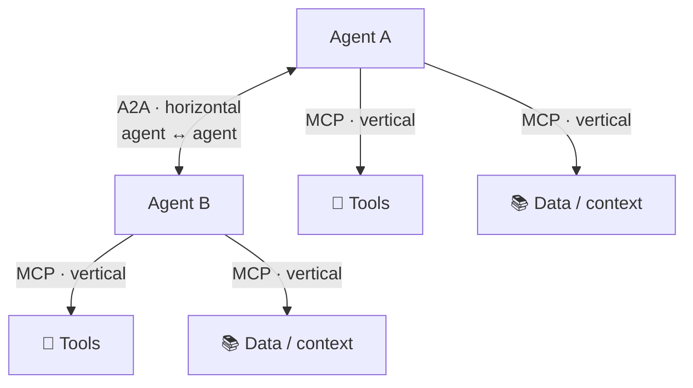
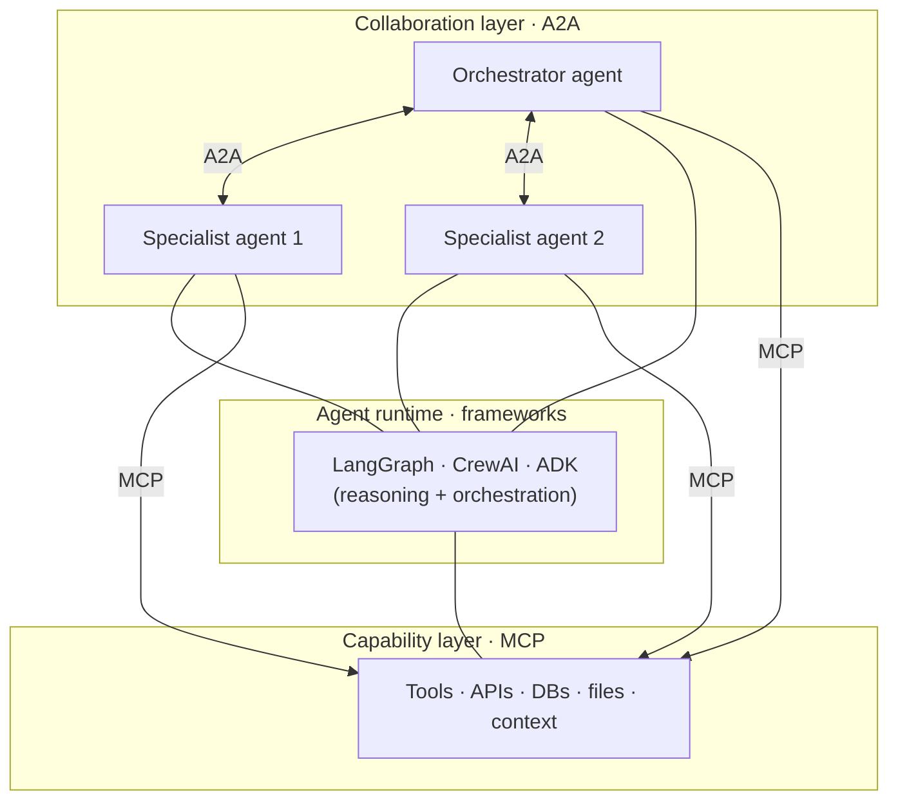
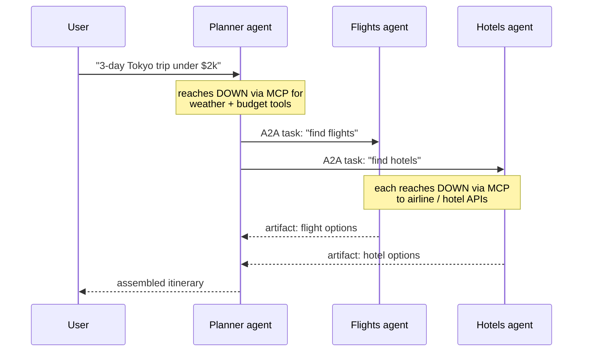

# 4 · A2A vs MCP

*A2A Protocol module · Lesson 4 of 5 · [← Task Lifecycle](03-task-lifecycle.md) · [next → Security & Adoption](05-security-and-adoption.md)*

This is the question everyone asks: *"Isn't A2A just MCP?"* No. They solve **different axes** of the same problem and are explicitly designed to **compose**. The one-line intuition:

> **[MCP](../15_mcp/README.md) connects an agent *down* to tools and context (vertical). A2A connects agents *across* to one another (horizontal).**

---

## 4.1 Two axes, one system

Each agent uses **MCP** to reach the tools and data it needs to *do its own job*, and uses **A2A** to *delegate to or collaborate with* other agents. Different direction, different concern.

---

## 4.2 The layered architecture (both together)

Read it top-down: **A2A** is the collaboration fabric between agents; each agent is built on a **framework**; and every agent reaches its **tools/data via MCP**. A single request can travel across A2A to a specialist, which then fans out over MCP to the systems it controls.

---

## 4.3 Side-by-side comparison

| Dimension | **MCP** | **A2A** |
|-----------|---------|---------|
| **Connects** | Agent ↔ tools / data / context | Agent ↔ agent |
| **Axis** | Vertical (down) | Horizontal (across) |
| **Other side is** | A **tool/resource** (passive) | Another **agent** (autonomous) |
| **Core unit** | Tool call / resource read | Task (stateful, multi-turn) |
| **Discovery** | Server lists its tools/resources | Agent Card advertises skills |
| **Interaction** | Structured request → structured result | Conversational, may need clarification |
| **State** | Largely stateless per call | Task has a lifecycle & session |
| **Transport** | JSON-RPC 2.0 (STDIO / HTTP+SSE) | JSON-RPC 2.0 over HTTP (+ SSE / webhooks) |
| **Origin** | Anthropic (2024) | Google (2025) → Linux Foundation |
| **Mental model** | "USB-C for AI" — plug in a capability | "HTTP for agents" — call a peer |

> They even **share DNA** — both lean on JSON-RPC 2.0 and HTTP/SSE — which is why they slot together cleanly rather than fighting over the transport.

---

## 4.4 A worked example — travel booking

A user asks a **planner agent**: *"Plan a 3-day trip to Tokyo under $2,000."*

- **A2A (horizontal):** planner ↔ flights agent, planner ↔ hotels agent — delegation between *autonomous* peers.
- **MCP (vertical):** each agent reaches *down* to airline APIs, hotel inventory, a weather tool, a budget calculator.

Neither protocol alone is enough: MCP has no notion of "ask another agent to figure this out," and A2A has no notion of "call this specific API." Together they cover the whole picture.

---

## 4.5 When do you need which?

| You need to… | Reach for |
|--------------|-----------|
| Give one agent access to a database, API, or file | **MCP** |
| Let an agent read fresh context/documents | **MCP** |
| Delegate a sub-goal to a specialist agent | **A2A** |
| Compose agents from **different vendors/frameworks** | **A2A** |
| Build a multi-agent app where agents also use tools | **Both** |
| Expose *your* agent for others to call *and* have it use tools | **Both** |

> **Rule of thumb:** if the other side is a *dumb* capability you invoke, that's **MCP**. If the other side is a *smart* peer that reasons and can push back, that's **A2A**.

---

## Takeaways

- **MCP = vertical (agent↔tools/context); A2A = horizontal (agent↔agent).** Different axes, not rivals.
- They **layer**: A2A is the collaboration fabric on top, each agent reaches its tools **via MCP** underneath — and both share JSON-RPC/HTTP roots, so they compose cleanly.
- The tell: **tool = passive capability → MCP**; **peer = autonomous, stateful, can ask questions → A2A**.
- Real multi-agent systems use **both** — see how frameworks tie them together in [Lesson 5](05-security-and-adoption.md) and the [Multi-Agent Frameworks](../05_multi-agent-frameworks/README.md) module.

➡️ Next: [Security & Adoption](05-security-and-adoption.md) — trust between agents, guardrails, and governance.
