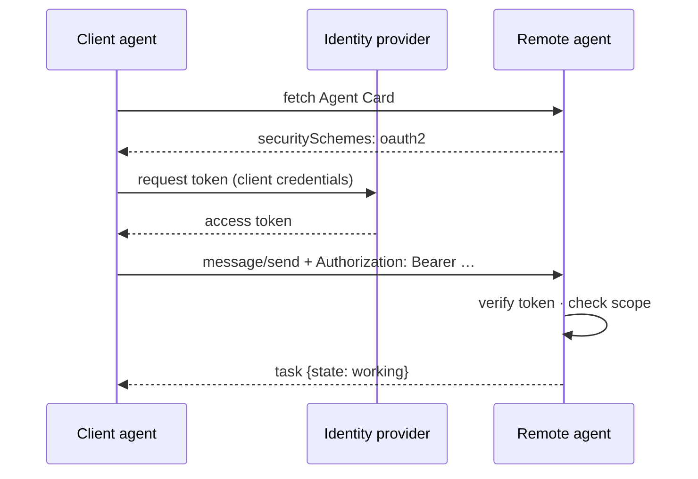
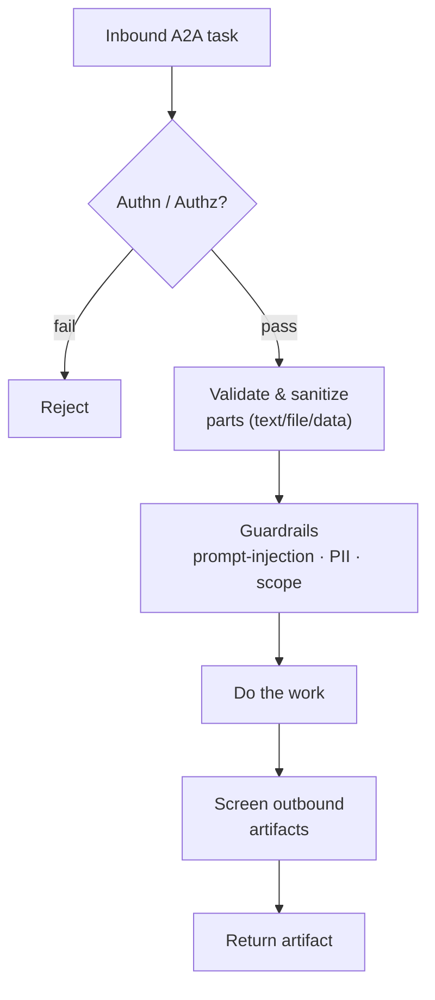
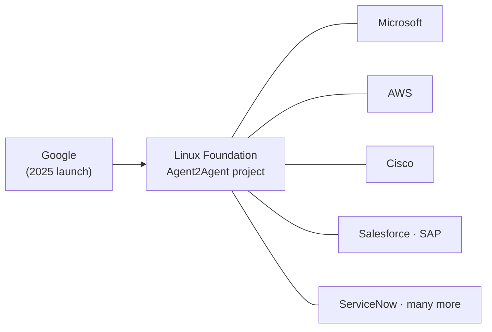
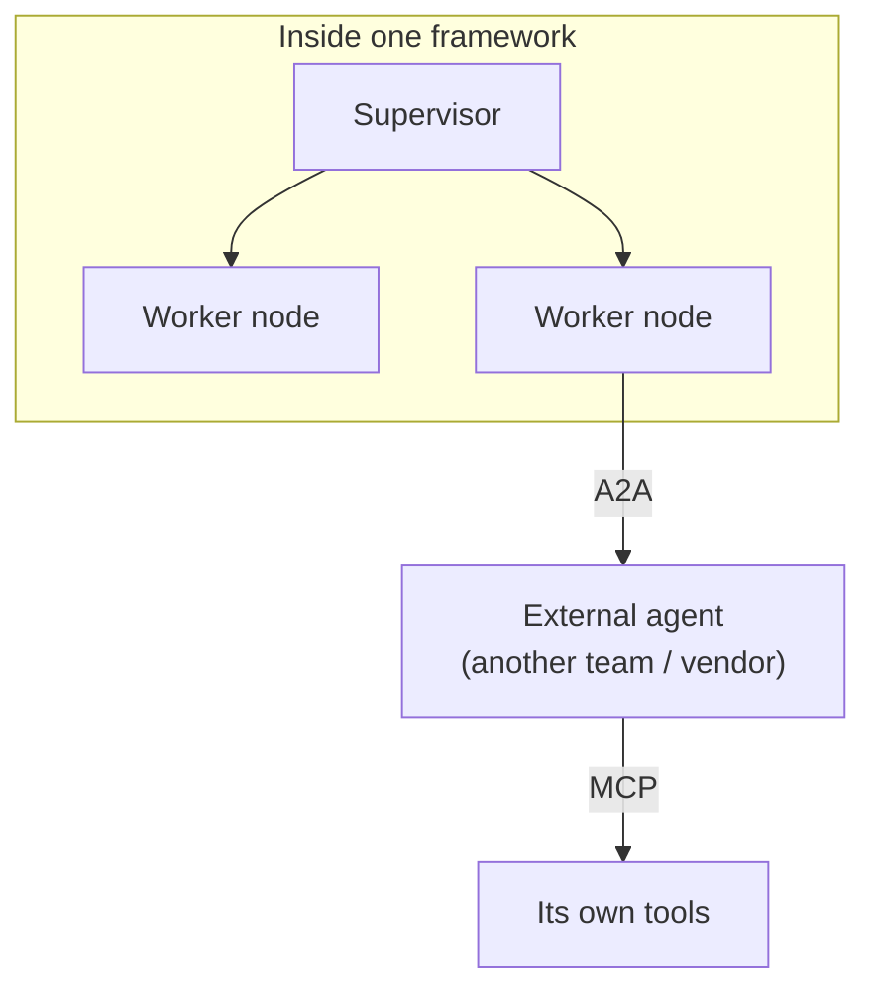

# 5 · Security & Adoption

*A2A Protocol module · Lesson 5 of 5 · [← A2A vs MCP](04-a2a-vs-mcp.md) · [next → Multi-Agent Frameworks](../05_multi-agent-frameworks/README.md)*

Once agents can call *each other* — including agents run by other companies — the interesting questions become **trust and security**, not plumbing. A2A was built "secure by default" on boring, battle-tested web standards, precisely so it can cross organizational boundaries safely.

---

## 5.1 Authentication between agents

A2A doesn't invent a new auth system. It **declares** an agent's requirements in the Agent Card and then rides existing web auth — OAuth 2.0, API keys, OIDC, mTLS — exactly the schemes enterprises already run.

| Layer | Mechanism | Note |
|-------|-----------|------|
| **Transport** | HTTPS / TLS | Encryption in transit, baseline |
| **Auth scheme** | OAuth 2.0, API key, OIDC, mTLS | Declared in the card's `securitySchemes` |
| **Authorization** | Scopes / roles per skill | Least privilege on *what* a caller may invoke |
| **Push callbacks** | Signed / authenticated webhooks | So the *client's* callback URL can trust the caller back |

> **Opaque by design.** Agents collaborate **without** exposing internal tools, prompts, memory, or model weights. That black-box boundary is a *security feature*: a partner agent gets a task and returns an artifact — never a window into your IP or infrastructure.

---

## 5.2 New trust surface, new guardrails

Agent-to-agent calls widen the attack surface. Everything from the [LLM Security & Guardrails](../03_llm-security-and-guardrails/README.md) module applies — and then some, because now an *agent* can be the adversary or the victim.

| Threat | Where it bites | Mitigation |
|--------|----------------|-----------|
| **Prompt injection via a task message** | A malicious client embeds instructions in a Part | Treat all inbound parts as **untrusted data**, not instructions |
| **Over-broad delegation** | Client asks for more than it should | Per-skill **scopes**; least privilege |
| **Data exfiltration in artifacts** | Sensitive data leaks in the output | **Screen outbound** artifacts; DLP/PII filters |
| **Spoofed / rogue agent** | You call an impostor endpoint | Verify identity; pin trusted cards/registries |
| **Malicious push callback** | Fake webhook floods the client | Authenticate callbacks; verify signatures |

> The same rule as prompt engineering holds across the boundary: **instructions come from your own policy; everything arriving over the wire is data.** An A2A task from another agent is *untrusted input* until validated.

---

## 5.3 Governance — open and vendor-neutral

A2A launched from Google in 2025 with a large partner roster, then was **donated to the Linux Foundation** as an independently governed, open-source project. That move matters: an interop standard only works if no single vendor controls it.

- **Open governance** → competitors can adopt it without betting on a rival's roadmap.
- **Open spec + SDKs** → implementations exist across languages; agents interoperate regardless of who built them.
- **Built on standards** (HTTP, JSON-RPC, SSE, OAuth) → it slots into existing enterprise infra, security review, and observability rather than demanding new stacks.

---

## 5.4 How A2A complements multi-agent frameworks

Frameworks like [LangGraph](../13_langgraph/README.md), CrewAI, and Google's ADK orchestrate agents *within one process/codebase*. A2A extends that orchestration *across* process, vendor, and org boundaries.

| Scope | Handled by |
|-------|-----------|
| Orchestrating nodes/agents you own, in-process | **Framework** (LangGraph, CrewAI, ADK) |
| Each agent reaching its own tools & data | **[MCP](../15_mcp/README.md)** |
| Reaching agents *outside* your codebase/org | **A2A** |

The natural pattern: build a system with a framework, let each agent use MCP for tools, and **expose (or consume) an A2A endpoint** wherever an agent needs to collaborate beyond your walls. Internal orchestration and external interop are complementary — see the [Multi-Agent Frameworks](../05_multi-agent-frameworks/README.md) module for the in-process side.

---

## Takeaways

- A2A is **"secure by default"** on existing standards — HTTPS, OAuth 2.0/OIDC/mTLS/API keys — declared per agent in the Agent Card's `securitySchemes`.
- **Opaque agents** are a security feature: peers exchange tasks and artifacts without exposing internal tools, prompts, or IP.
- Treat every inbound task as **untrusted data** — apply auth, per-skill scopes, injection/PII guardrails, and outbound artifact screening ([LLM Security & Guardrails](../03_llm-security-and-guardrails/README.md)).
- Now under **Linux Foundation** open governance with broad industry backing — vendor-neutrality is what makes an interop standard credible.
- A2A **extends** multi-agent frameworks: framework = in-process orchestration, MCP = tools, **A2A = cross-org/vendor collaboration.**

➡️ Back to the [module home](README.md) · related: [MCP](../15_mcp/README.md) · [Multi-Agent Frameworks](../05_multi-agent-frameworks/README.md) · [LangGraph](../13_langgraph/README.md) · [LLM Security & Guardrails](../03_llm-security-and-guardrails/README.md)
