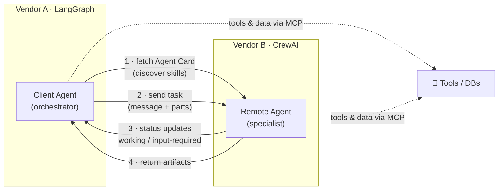

# 🤝 A2A — The Agent2Agent Protocol

> An open standard for letting **autonomous agents built by different teams, vendors, and frameworks talk to each other** — so an agent written in LangGraph can hand work to an agent written in CrewAI without either knowing the other's internals. Think **"HTTP for agents."**

These notes are a **reference module** (concept + code + diagrams), not a transcript. A2A is the *horizontal* counterpart to MCP: where [MCP](../15_mcp/README.md) connects one agent **down** to tools and data, A2A connects agents **across** to one another as peers. They are **complementary, not competitors** — most real systems will use both.

> **Origin:** Announced by Google in 2025 with ~50 launch partners, and later donated to the **Linux Foundation** as a vendor-neutral, open-governance project (with Microsoft, AWS, Cisco, Salesforce, SAP, ServiceNow and others on board).

---

## 🗺️ Two agents interoperating via A2A

The two agents never share memory, prompts, or tools. They exchange a **public capability card**, then a **task** carrying **messages** and receive **artifacts** back — a clean contract across a trust boundary.

---

## 📓 Lessons

| # | Lesson | What you'll learn |
|---|--------|-------------------|
| 1 | [Why Agent Interop?](01-why-agent-interop.md) | The siloed-agents problem; the "internet of agents" vision; where A2A fits |
| 2 | [Core Concepts](02-core-concepts.md) | Agent Card, client vs remote agent, tasks, messages, artifacts, parts |
| 3 | [The Task Lifecycle](03-task-lifecycle.md) | Discovery → send → working/input-required/completed/failed; SSE streaming & push |
| 4 | [A2A vs MCP](04-a2a-vs-mcp.md) | Horizontal vs vertical; the layered architecture; when you need which (or both) |
| 5 | [Security & Adoption](05-security-and-adoption.md) | Inter-agent auth & trust, guardrails, Linux Foundation governance, ecosystem |

---

## ⚡ The whole module in one cheat sheet

| Concept | In one line |
|---------|-------------|
| **A2A** | Open protocol for agent-to-agent collaboration — "HTTP for agents." |
| **Agent Card** | Public JSON metadata describing an agent's identity, skills, endpoint & auth. |
| **Client / Remote agent** | The agent that *initiates* work / the agent that *performs* it. |
| **Task** | The unit of work, with an ID and a lifecycle (submitted → working → completed…). |
| **Message / Part** | A turn in the conversation / the atomic content chunk (text, file, data). |
| **Artifact** | The durable output a remote agent returns for a task. |
| **Transport** | JSON-RPC 2.0 over HTTP(S); **SSE** for streaming; **webhooks** for push. |
| **Opaque agents** | Peers collaborate *without* exposing internal state, tools, or IP. |

---

## A2A vs MCP in one line

> **MCP** gives a single agent *hands* (tools) and *eyes* (context). **A2A** gives many agents a shared *language* to delegate to one another. Vertical vs horizontal — see [Lesson 4](04-a2a-vs-mcp.md).

Related modules: [MCP](../15_mcp/README.md) · [Multi-Agent Frameworks](../05_multi-agent-frameworks/README.md) · [LangGraph](../13_langgraph/README.md) · [LLM Security & Guardrails](../03_llm-security-and-guardrails/README.md)

---

*Reference notes for personal study. A2A design described faithfully at a conceptual level; where an exact field or method name may vary between spec versions, it is flagged as illustrative rather than normative — accuracy over false precision.*
