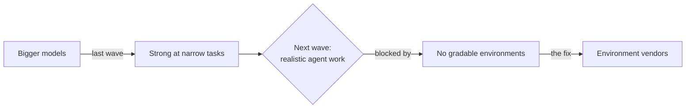
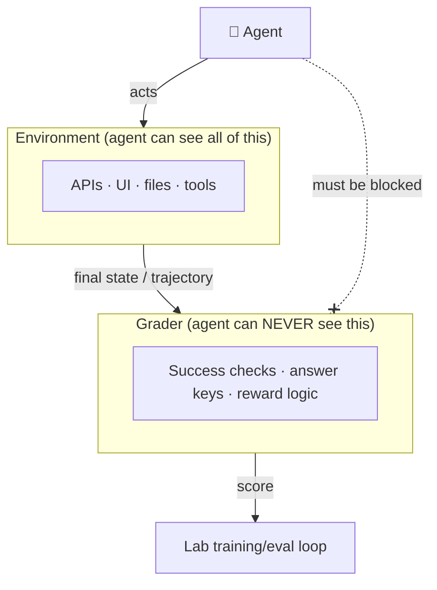

# Lesson 1 — The Role & the Frontier-Lab Customer

> **One-liner:** Frontier labs have the algorithms and the compute; what they lack is **realistic, gradable environments** to train and evaluate agents in. This role builds and operates those environments — and the customer on the other side is a frontier AI lab.

---

## 🎯 TL;DR

The last wave of AI progress came from bigger models and better algorithms. The *next* wave — agents that can do realistic, judgment-heavy software work — is bottlenecked on something less glamorous: **there is nowhere good to train and test them.** Real products are messy, stateful, and un-gradable at scale. So a market has formed for companies that build **high-fidelity, programmatically-operable, automatically-graded recreations** of real software (a GitHub, a Stripe, a Linear, a Kubernetes). Their customers are the labs. Your job as an "RL Environments & Infrastructure" engineer is to build those environments and the platform that runs dozens of them reliably.

---

## 1. Why environments are the bottleneck

A frontier model in 2025 is already strong at *narrow* tasks — write this function, fix this failing test. It breaks down on *realistic* work: "triage this bug across three services, reproduce it, fix it, and update the dashboards." That work is **long-horizon, stateful, and tool-heavy**, and there's no clean way to score it.

To improve a model at something, a lab needs a **signal**: a way to run the model on a task and get a number back that says *how well it did*. For math and code you can sometimes check the answer directly. For "operate Datadog to find the root cause," you can't — unless someone has built a faithful Datadog-like environment with tasks and a grader. That "someone" is the environment vendor.

> This is the same lesson as classical RL: **the reward signal, not the algorithm, decides what the agent becomes good at** — see [`reinforcement-learning/06`](../../DL/04_reinforcement-learning/06-designing-the-best-reward-function.md). An environment is just the apparatus that produces that signal for a *software product* instead of a game.

---

## 2. What the customer actually needs

A frontier lab isn't buying a demo. It's buying **signal it can trust at scale**. Concretely, a good environment delivers:

| The lab needs… | Because… |
|---|---|
| **Fidelity** | If the fake product behaves differently from the real one, the agent learns the wrong thing |
| **Programmatic operation** (OpenAPI / MCP) | The training loop drives thousands of rollouts with no human in the loop |
| **Deterministic, reproducible runs** | A grade is only meaningful if the same actions always produce the same result |
| **Automated, rigorous grading** | Human grading doesn't scale to millions of rollouts; the grader must be code |
| **Grading integrity** | The agent must not be able to see or game the grader — see §4 |
| **Scale & reliability** | Dozens of environments, thousands of concurrent sandboxes, self-healing |

Two consumption modes for that signal:

- **RL post-training** — the environment sits *inside* the training loop. Each rollout's reward nudges the policy. High volume, latency-sensitive. (See [Lesson 2](02-rl-environments-for-agents.md).)
- **Evaluation** — the environment scores a *fixed* model to measure a capability. Lower volume, correctness-critical. (See [`evals/`](../16_evals/README.md) and [Lesson 6](06-running-frontier-models-and-failure-analysis.md).)

The same environment often serves both.

---

## 3. The vendor ecosystem (where RL-environment vendors sit)

A whole layer of companies now sells **data, environments, and evaluation** to frontier labs. Rough map (fast-moving; treat as illustrative, not authoritative):

| Category | Examples | What they provide |
|---|---|---|
| **RL environments & agentic data** | specialized RL-env vendors & AI data labs (several 2024–25 entrants, some with open "environment hubs") | Faithful gradable environments; expert task data; RL rollouts |
| **Eval / observability tooling** | Braintrust, LangSmith, Arize, Weights & Biases | Harnesses to run and track evals |
| **Open agentic benchmarks** | SWE-bench, τ-bench (tau-bench), GAIA, WebArena, OSWorld, Terminal-Bench | Public reference environments/tasks the whole field measures against |
| **The customers (labs)** | OpenAI, Anthropic, Google DeepMind, Meta, xAI, Mistral | Train and evaluate frontier models against all of the above |

The public benchmarks are worth studying closely: they are exactly the artifact you're building, but open-source, so they show the accepted shape of "a task + a gradable environment." **SWE-bench** (resolve real GitHub issues, graded by the repo's own test suite) and **τ-bench** (operate a retail/airline tool API with a simulated user, graded on final DB state) are the two canonical templates for this module.

---

## 4. The one non-negotiable: grading integrity

Write this on the wall: **the grading layer stays strictly separate from the environment code.** It's called out as "a core integrity principle" in the role for a reason.

If any part of how a task is scored is visible to the agent — a hidden answer file in the container, a comment in the API code, an assertion the agent can read — a capable model *will* find it and optimize the number without doing the work. Your signal silently becomes garbage, and the lab trains toward a lie.

Enforce it *architecturally*, not by convention: the grader runs in a **separate process/container** with no route the agent can reach, reads only the environment's post-run state, and its code never ships inside the sandbox image. Lesson 5 is all about this.

---

## 5. What "good at this job" looks like

The JD lists the traits; here's what each means in practice:

- **Systems thinking** — turn a messy one-off ("I manually set up this repo and eyeballed the result") into a *deterministic machine* (seeded state, captured trajectory, coded grader, one command).
- **Agent intuition** — anticipate where a model takes shortcuts, and tell *"the model genuinely can't do this"* from *"my grader is wrong."* (Lesson 6.)
- **Reverse-engineering** — read an unfamiliar product and reproduce its behavior and edge cases fast. (Lesson 3.)
- **Directing coding agents** — you'll build environments *with* coding agents; prompt them well and catch subtle failures. (See [`claude-code/`](../17_claude-code/README.md).)
- **Reliability standards** — deterministic, observable, self-healing tooling. (Lesson 7.)

---

## 6. Key terms

| Term | Meaning |
|------|---------|
| **Frontier lab** | An organization training state-of-the-art foundation models (the customer) |
| **Environment** | A faithful, programmatically-operable recreation of a real software product |
| **Grader / reward layer** | Code that converts an agent's run into a score; kept separate from the env |
| **RL post-training** | Improving a base model with reinforcement learning after pre-training |
| **Eval harness** | A system that runs a fixed model against tasks and reports scores |
| **Grading integrity** | The principle that grading logic is never reachable by the agent |
| **SWE-bench / τ-bench** | Canonical open agentic benchmarks; reference templates for env + grader |

---

## ✍️ Notes / follow-ups
- The mental model to carry through the module: **you ship three artifacts — an environment, a set of tasks, and a grader — and a platform that runs them at scale.** Everything else is detail.
- **Next:** [Lesson 2 — RL Environments for Agents](02-rl-environments-for-agents.md), which grounds the RL vocabulary (state/action/reward/trajectory) in an agent operating software, and connects to the [reinforcement-learning notes](../../DL/04_reinforcement-learning/README.md).
