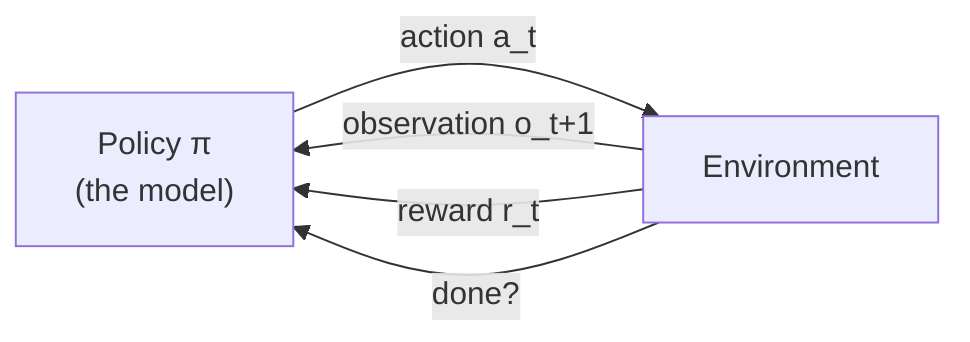
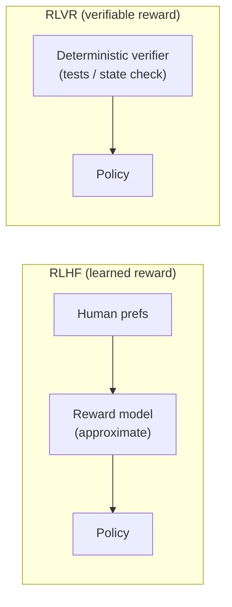

# Lesson 2 — RL Environments for Agents

> **One-liner:** Classic RL environments (a game, a robot) and modern *agentic* environments (an agent operating GitHub) are the **same abstraction** — `reset → step → reward` — just with a software product as the world and tool calls as the actions.

---

## 🎯 TL;DR

If you've seen `gym.make("LunarLander-v2")`, you already know the interface: an environment exposes `reset()` (start a fresh episode) and `step(action)` (take an action, get back the new observation, a reward, and whether the episode is done). An **agentic environment for an LLM** keeps that exact shape. The "world" is a recreated software product; the "observations" are API/tool responses and page state; the "actions" are tool calls (`create_issue`, `run_query`, `click`); and the "reward" comes from a grader checking the final state. Understanding this mapping is what lets you reuse decades of RL thinking — especially **reward design** — for agent training.

> Prerequisite vocabulary (agent, state, action, reward, policy, value, trajectory) lives in [`reinforcement-learning/01–02`](../../DL/04_reinforcement-learning/README.md). This lesson assumes it and maps it onto agents.

---

## 1. The classic loop, unchanged



The five nouns of RL, translated to an agent operating a product:

| RL noun | Classic (Lunar Lander) | Agentic (a Linear-like tracker) |
|---|---|---|
| **State** | Position, velocity, angle | The DB / app state: issues, projects, users |
| **Observation** | Sensor readings | The tool/API response the agent sees |
| **Action** | Fire engine | A tool call: `create_issue(title=…, assignee=…)` |
| **Reward** | +100 landing, −100 crash | Grader output after the task: 1.0 solved / 0.0 not |
| **Policy (π)** | NN mapping state→thrust | The LLM mapping context→next tool call |
| **Trajectory** | The whole flight | The full sequence of tool calls + responses |

The profound part: **nothing about the RL machinery changes.** What changes is that the action space is now "any tool call the product supports" and the state is a full application, not a physics vector.

---

## 2. Sparse rewards are the default (and the problem)

Most realistic agent tasks are **sparse-reward**: the agent does 40 tool calls and gets a single 0/1 at the end. That's the hardest regime to learn from — exactly the [Lesson 6 sparse-vs-shaped](../../DL/04_reinforcement-learning/06-designing-the-best-reward-function.md) tension, now at the scale of a software workflow.

Two levers the environment builder controls:

- **Outcome reward** (sparse, honest): grade only the final state. "Is the bug actually fixed?" Hard to hack, hard to learn from.
- **Shaped / process reward** (dense, risky): give partial credit for sub-goals ("reproduced the bug", "wrote a test"). Faster learning, but every shaping term is a new reward-hacking surface.

For *training*, labs increasingly want **verifiable outcome rewards** and let the RL algorithm handle the sparsity. For *evaluation*, outcome reward is almost always what you report. Lesson 5 covers how to build both without leaking a hackable proxy.

---

## 3. RLVR — RL with Verifiable Rewards

The idea driving a lot of 2025 agent training: **only reward things you can *check*.** Instead of a learned reward model guessing whether an answer looks good (classic RLHF), the reward comes from a deterministic verifier — unit tests pass, the DB reaches the target state, the returned number equals ground truth.



Why environments matter *so much* under RLVR: the verifier is only as good as the environment it checks. A faithful, deterministic environment with a rigorous grader **is** the verifier. This is the technical reason the environment-vendor market exists — RLVR turned "build me a checkable world" into the core input to model training.

| | RLHF | RLVR |
|---|---|---|
| Reward source | Learned model of human preference | Deterministic check against ground truth |
| Failure mode | Reward model is wrong / gameable | Environment or grader is wrong / non-deterministic |
| What you must build | Preference data | **Gradable environments** ← this job |

---

## 4. The trajectory is the unit of data

Everything downstream — grading, failure analysis, dataset curation — operates on the **trajectory**: the complete, ordered record of one task attempt.

```jsonc
// one rollout / trajectory (simplified)
{
  "task_id": "linear-triage-0007",
  "seed": 42,
  "steps": [
    {"t": 0, "action": {"tool": "list_issues", "args": {"project": "APP"}},
             "observation": {"issues": [/* ... */]}},
    {"t": 1, "action": {"tool": "create_issue",
             "args": {"title": "Login 500", "assignee": "u_12"}},
             "observation": {"id": "APP-91", "status": "open"}},
    {"t": 2, "action": {"tool": "finish"}, "observation": null}
  ],
  "final_state_ref": "snapshot://run-abc123",   // what the grader reads
  "reward": null                                 // filled in by the grader, separately
}
```

Design principles for trajectories:
- **Capture everything** — every tool call, args, response, timestamps, token counts. You can't analyze what you didn't record.
- **Reference, don't inline, big state** — store a snapshot pointer the grader can load, not the whole DB in the log.
- **`reward` is filled by the grader, not the agent** — and ideally in a separate step, so the boundary from [Lesson 1 §4](01-the-role-and-the-frontier-lab-customer.md) is preserved even in the data schema.

---

## 5. Episode, done-conditions, and horizon

Real tasks need explicit **termination**, or a stuck agent loops forever and burns compute:

| Termination | Trigger |
|---|---|
| **Success** | Agent calls `finish` and the grader can now check outcome |
| **Failure** | Irrecoverable env error, or an explicit give-up |
| **Truncation** | Step budget (max tool calls) or wall-clock / token budget exceeded |

Truncation matters for both fairness and cost: an environment that lets one rollout run 500 steps distorts both the grade and your infra bill. Budgets are part of the *task definition* (Lesson 4).

---

## 6. Key terms

| Term | Meaning |
|------|---------|
| **`reset` / `step`** | The two-method environment interface inherited from Gym |
| **Observation** | What the agent receives after an action (tool/API response, page state) |
| **Outcome vs process reward** | Grade only the end state vs give partial credit for sub-goals |
| **RLVR** | RL with Verifiable Rewards — reward from a deterministic checker, not a learned model |
| **Trajectory / rollout** | The full ordered record of one task attempt |
| **Horizon / truncation** | The step or time budget that force-ends an episode |

---

## ✍️ Notes / follow-ups
- The takeaway: **an agentic environment is a Gym environment whose world is a software product** — so RL's hardest-won lesson (reward design decides everything) applies directly to agent training.
- **Cross-links:** RL foundations → [`reinforcement-learning/`](../../DL/04_reinforcement-learning/README.md); reward hacking in depth → [Lesson 5](05-designing-rigorous-graders.md).
- **Next:** [Lesson 3 — Engineering High-Fidelity Environments](03-engineering-high-fidelity-environments.md) — how to actually build the "world" faithfully and expose it via OpenAPI + MCP.
