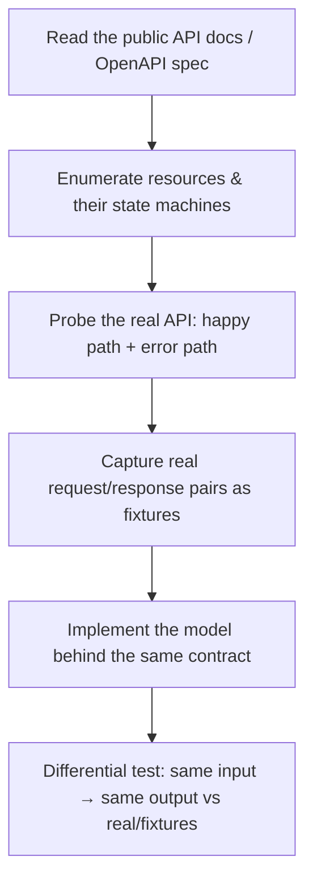
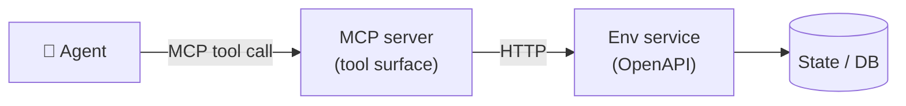

# Lesson 3 — Engineering High-Fidelity Environments

> **One-liner:** Recreate a real product faithfully enough that a frontier agent can't tell the difference — then expose it via **OpenAPI** and make it **MCP-ready** so agents operate it programmatically.

---

## 🎯 TL;DR

A high-fidelity environment is a working backend that mimics a real product's **behavior, not its brand**: the same resources, the same API shapes, the same status codes, the same annoying edge cases. You build it as a normal web service (FastAPI/Express + a database), give it a clean **OpenAPI** contract, wrap it as an **MCP server** so any agent can call its tools, and — critically — make it **deterministic and resettable** so every task starts from a known state. Fidelity + determinism are what separate a toy from something a lab will train on.

---

## 1. Fidelity means behavioral parity, not a pixel copy

You are not cloning Stripe's marketing site. You're reproducing the *contract an agent experiences*:

| Dimension | What "faithful" means |
|---|---|
| **Resources & relationships** | Same entities (customers, invoices, charges) and how they link |
| **API surface** | Same endpoints, verbs, pagination, filtering semantics |
| **Validation & errors** | Same 4xx/5xx behavior, same error bodies, same idempotency rules |
| **Edge cases** | Rate limits, partial failures, eventual consistency, race conditions |
| **State transitions** | An invoice can't go `paid → draft`; enforce the real state machine |

> **Why edge cases are the whole point:** frontier models already ace the happy path. The signal that distinguishes a strong agent from a weak one lives in the messy cases — a webhook that fires twice, a paginated list that changes under you, a 409 conflict. If your environment only implements the happy path, it can't produce discriminating signal. This is the "growing intuition for how agents behave" the JD asks for, applied to *environment design*.

---

## 2. Reverse-engineering an unfamiliar product, fast

The JD calls out "read an unfamiliar product and reverse-engineer its behavior quickly." A repeatable method:



- **Start from the contract**, not the UI. Most target products publish an OpenAPI/Swagger spec or SDK — that's your ground-truth surface.
- **Record real fixtures** where you legitimately can (a sandbox account, public endpoints), so you can *differential-test* your clone against captured responses.
- **Model the state machine explicitly.** Most fidelity bugs are illegal transitions your clone allowed but the real product forbids.
- **Direct a coding agent to draft the CRUD**, then *you* review for the subtle behavior it got wrong — this is exactly the "fluency directing coding agents / catching subtle failures" skill (see [`claude-code/`](../17_claude-code/README.md)).

---

## 3. Build it as a normal service with a clean OpenAPI contract

The environment is just a web service. FastAPI is a natural fit because it generates OpenAPI for free — and OpenAPI is what makes the env consumable by tooling *and* convertible to MCP.

```python
# app.py — a faithful slice of a "Linear-like" issue tracker
from fastapi import FastAPI, HTTPException
from pydantic import BaseModel
from enum import Enum

app = FastAPI(title="Linear-like Env", version="1.0.0")

class Status(str, Enum):
    backlog = "backlog"; todo = "todo"; in_progress = "in_progress"; done = "done"

# legal transitions — enforcing the real state machine is where fidelity lives
LEGAL = {Status.backlog: {Status.todo}, Status.todo: {Status.in_progress},
         Status.in_progress: {Status.done, Status.todo}, Status.done: set()}

class Issue(BaseModel):
    title: str
    assignee_id: str | None = None
    status: Status = Status.backlog

DB: dict[str, dict] = {}
_seq = 0

@app.post("/issues", status_code=201)
def create_issue(issue: Issue):
    global _seq
    _seq += 1
    iid = f"APP-{_seq}"
    DB[iid] = {"id": iid, **issue.model_dump()}
    return DB[iid]

@app.patch("/issues/{iid}")
def update_status(iid: str, new: Status):
    if iid not in DB:
        raise HTTPException(404, "issue not found")
    cur = Status(DB[iid]["status"])
    if new not in LEGAL[cur]:                      # reject illegal transition like the real product
        raise HTTPException(409, f"illegal transition {cur} -> {new}")
    DB[iid]["status"] = new
    return DB[iid]
```

`GET /openapi.json` now describes the whole surface. That spec is the artifact everything else keys off.

---

## 4. Make it MCP-ready

Frontier agents operate tools over the **Model Context Protocol** — a standard way to expose "here are the tools, here's how to call them" so the same agent can drive any MCP server. (Full protocol notes: [`AI/15_mcp/`](../15_mcp/README.md).) Making an environment MCP-ready means each meaningful action is an MCP **tool** with a typed schema.

```python
# mcp_server.py — expose env actions as MCP tools
from mcp.server.fastmcp import FastMCP
import httpx

mcp = FastMCP("linear-like-env")
ENV = "http://localhost:8000"   # the FastAPI env from §3

@mcp.tool()
def create_issue(title: str, assignee_id: str | None = None) -> dict:
    """Create a new issue in the tracker."""
    r = httpx.post(f"{ENV}/issues", json={"title": title, "assignee_id": assignee_id})
    r.raise_for_status()
    return r.json()

@mcp.tool()
def set_status(issue_id: str, status: str) -> dict:
    """Move an issue to a new status. Rejects illegal transitions."""
    return httpx.patch(f"{ENV}/issues/{issue_id}", params={"new": status}).json()

if __name__ == "__main__":
    mcp.run()   # now any MCP-capable agent can operate the environment
```



You can also **auto-generate** the MCP layer from the OpenAPI spec (each operation → one tool). Hand-writing gives you cleaner tool descriptions; generating scales to a big surface. Most teams do both — generate, then curate the descriptions the agent sees.

---

## 5. Determinism & resettability — the part beginners skip

A grade is only meaningful if runs are reproducible. Bake these in from day one:

| Requirement | How |
|---|---|
| **Seeded state** | Every task loads a fixed fixture/snapshot; `reset(seed)` restores it exactly |
| **No wall-clock/random leakage** | Inject a fake clock and a seeded RNG; never call `now()`/`random()` directly |
| **Isolation per run** | Fresh DB (or transaction rollback / container) per rollout — no cross-run bleed |
| **Fast reset** | Snapshot-restore, not "re-run 200 API calls"; you'll reset millions of times |

```python
# deterministic reset via snapshot
import copy
_SNAPSHOTS: dict[int, dict] = {}

def seed_state(seed: int, fixture: dict):
    _SNAPSHOTS[seed] = copy.deepcopy(fixture)

def reset(seed: int):
    global DB, _seq
    DB = copy.deepcopy(_SNAPSHOTS[seed])          # identical starting world every time
    _seq = len(DB)
```

If the same seed + same action sequence can ever produce two different final states, your grader can't be trusted — fix determinism *before* writing the grader.

---

## 6. Key terms

| Term | Meaning |
|------|---------|
| **Fidelity** | Behavioral parity with the real product, especially on edge cases |
| **OpenAPI** | Machine-readable contract of an HTTP API; FastAPI emits it automatically |
| **MCP-ready** | Env actions exposed as MCP tools so any agent can operate it |
| **Differential testing** | Comparing your clone's responses to the real product's captured responses |
| **Reset / seed** | Restoring a known deterministic starting state for each task |
| **State machine** | The legal transitions between resource states you must enforce |

---

## ✍️ Notes / follow-ups
- The three-layer stack to remember: **state/DB → OpenAPI service → MCP tool surface**, all resettable by seed.
- **Cross-links:** MCP deep dive → [`AI/15_mcp/`](../15_mcp/README.md); directing coding agents to help build → [`claude-code/`](../17_claude-code/README.md).
- **Next:** [Lesson 4 — Task Generation & Data Pipelines](04-task-generation-and-data-pipelines.md) — turning this environment into a library of gradable tasks.
