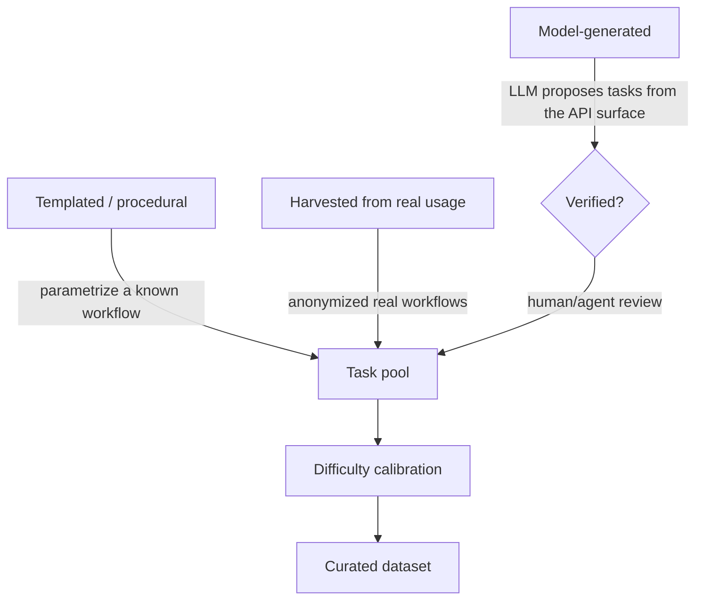
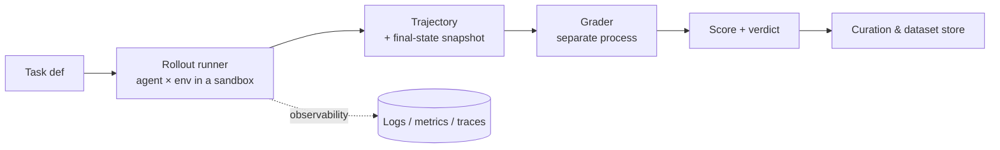

# Lesson 4 — Task Generation & Data Pipelines

> **One-liner:** An environment is inert until you attach **tasks** — each a deterministic starting state, a goal, a step budget, and a hook for the grader — and build the pipeline that turns agent runs into clean, gradable data at scale.

---

## 🎯 TL;DR

The environment is the *world*; a **task** is a *job to do in that world* plus everything needed to grade it fairly. A task pins the initial state (by seed), states the goal for the agent, sets budgets, and names the grader + its hidden success criteria. Then you need a **pipeline**: generate tasks, run agents to produce trajectories, capture those trajectories, grade them, and curate the good ones into a dataset. This lesson is the "own the data and evaluation pipelines" half of the job.

---

## 1. Anatomy of a task

```jsonc
// task definition — the contract between env, agent, and grader
{
  "task_id": "linear-triage-0007",
  "env": "linear-like@1.0.0",
  "seed": 42,                          // -> reset() loads this exact world (Lesson 3 §5)
  "prompt": "A user reports login returns 500. Create a P1 bug in project APP, \
             assign it to the on-call engineer, and move it to in_progress.",
  "budgets": {"max_steps": 25, "max_tokens": 60000, "wall_clock_s": 300},
  "grader": {"id": "graders/linear_triage_v2", "params": {"project": "APP"}},
  "success_criteria_private": "HIDDEN — lives with the grader, never shipped to the agent"
}
```

Two rules that keep you honest:
- **The `prompt` the agent sees and the `success_criteria` the grader uses are different objects, stored separately.** The agent gets intent; the grader gets the checkable spec. (This is [Lesson 1 §4](01-the-role-and-the-frontier-lab-customer.md) enforced in the data model.)
- **The seed makes the task reproducible.** Anyone can re-run task 0007 and get the identical world.

---

## 2. Where tasks come from



| Source | Pros | Watch out for |
|---|---|---|
| **Templated / procedural** | Deterministic, scalable, easy to grade | Can be repetitive; agents overfit the template |
| **Model-generated** | Diverse, cheap to produce many | Many are unsolvable, ambiguous, or ungradable → **must verify** |
| **Harvested from real workflows** | Maximum realism | Privacy/anonymization; harder to make deterministic |

**Model-generated tasks are a trap if you skip verification.** An LLM will happily emit a task whose "correct" answer is impossible in your environment, or whose success criteria are ambiguous. Every generated task must pass a **solvability check** (at least one known action sequence achieves the goal) before it enters the pool.

---

## 3. Calibrating difficulty

A dataset that's all-easy or all-impossible produces no learning signal. You want a spread, measured empirically:

- Run a few reference models against each candidate task; record pass rate.
- **Drop tasks at 0% and 100%** — the first are broken or too hard to give signal; the second are trivial. The informative band is the middle.
- Tag each task with a difficulty estimate so the lab can sample a curriculum (easy→hard).

> This mirrors evals' **saturation** concern — a benchmark everyone passes stops discriminating. See [`evals/08-benchmarking-saturation-vs-contamination`](../16_evals/08-benchmarking-saturation-vs-contamination.md).

---

## 4. The pipeline: runs → trajectories → grades → dataset



Each stage, and what makes it production-grade:

| Stage | Do this | Don't |
|---|---|---|
| **Rollout** | One task per isolated sandbox; enforce budgets; record everything | Share state across rollouts |
| **Trajectory capture** | Structured log (Lesson 2 §4) + a **snapshot** of final state for the grader | Inline the whole DB into every log line |
| **Grading** | Run the grader in a **separate process/container** over the snapshot | Let the grader run inside the agent's sandbox |
| **Curation** | Version tasks + trajectories + grades together; keep failures | Silently drop runs (you lose failure-analysis signal) |

The pipeline is where the JD's "turn a messy one-off workflow into a scalable, deterministic machine" lands. The messy version is "I ran the agent by hand and looked at the result." The machine version is: one command fans out N tasks × K samples across sandboxes, captures every trajectory, grades them out-of-band, and writes a versioned dataset — reproducibly.

---

## 5. Sampling: N tasks × K attempts

For both training and eval you rarely run each task once. You run **K samples per task** (temperature > 0) to estimate a distribution, which powers metrics like **pass@k** and **pass^k** (Lesson 6). So the runner is a fan-out:

```python
# conceptual rollout fan-out (see Lesson 7 for the real orchestration)
async def run_suite(tasks, agent, k=5):
    jobs = [rollout(task, agent, sample=i)      # each in its own sandbox
            for task in tasks for i in range(k)]
    trajectories = await gather_with_concurrency(jobs, limit=64)
    return trajectories                          # graded separately, out-of-band
```

Determinism note: the *environment* is seeded and deterministic; the *agent* is intentionally stochastic across the K samples. Keep those two sources of randomness cleanly separated — env randomness is a bug, agent randomness is the point.

---

## 6. Data hygiene & contamination

Because these datasets may end up shaping model training, treat leakage seriously:

- **Hold out** a private eval split that never enters any training pipeline.
- **Watch for contamination** — if your tasks (or near-duplicates) leak into pre-training corpora, scores inflate meaninglessly. (See [`evals/08`](../16_evals/08-benchmarking-saturation-vs-contamination.md).)
- **Version everything** — env version, task version, grader version travel *with* each trajectory, so a score is always reproducible and attributable.

---

## 7. Key terms

| Term | Meaning |
|------|---------|
| **Task definition** | Seed + prompt + budgets + grader reference + private success criteria |
| **Solvability check** | Verifying at least one action sequence achieves the goal before accepting a task |
| **Difficulty calibration** | Using reference-model pass rates to keep only discriminating tasks |
| **Rollout runner** | The system that executes agent × env in an isolated sandbox to produce a trajectory |
| **Curation** | Versioning and selecting tasks/trajectories/grades into a clean dataset |
| **pass@k / pass^k** | Metrics over K samples per task (any-succeed vs all-succeed) |

---

## ✍️ Notes / follow-ups
- The mental model: **task = seed + goal + budgets + grader hook**, and the **pipeline turns runs into versioned, gradable data.**
- **Cross-links:** benchmark saturation/contamination → [`evals/08`](../16_evals/08-benchmarking-saturation-vs-contamination.md); the grading step in depth → [Lesson 5](05-designing-rigorous-graders.md); running the fan-out at scale → [Lesson 7](07-the-environment-platform-and-infra.md).
- **Next:** [Lesson 5 — Designing Rigorous Graders](05-designing-rigorous-graders.md).
