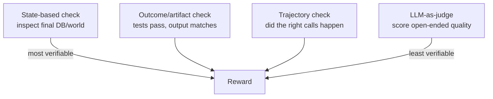
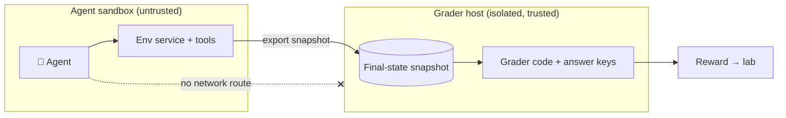

# Lesson 5 — Designing Rigorous Graders (the Reward Layer)

> **One-liner:** The grader turns a trajectory into a number the lab trains on. It must be **deterministic, fair, hard to reward-hack, and architecturally separate from the environment** — this is the highest-leverage and highest-integrity part of the job.

---

## 🎯 TL;DR

A grader answers one question: *did the agent actually accomplish the task?* Good graders prefer **state-based, verifiable** checks (inspect the final world) over vibes. When you must judge open-ended output, you use **LLM-as-judge** — carefully, because judges are themselves gameable. Above all, the grader is **strictly separated** from the environment: the agent can never read the success criteria, or a capable model will optimize the check instead of doing the work. This lesson is where [`reinforcement-learning/06`](../../DL/04_reinforcement-learning/06-designing-the-best-reward-function.md) (reward design) and [`evals/05`](../16_evals/05-eval-methods-llm-as-judge.md) (LLM-as-judge) meet.

---

## 1. Grader types, from most to least trustworthy



| Type | Example | Trust | Use when |
|---|---|---|---|
| **State-based** | "Issue APP-91 exists, status=`in_progress`, assignee=on-call" | Highest — deterministic | The goal is a world-state change |
| **Outcome / artifact** | "The repo's hidden test suite passes" (SWE-bench style) | High | There's a checkable artifact |
| **Trajectory / process** | "Agent called `refund` exactly once" | Medium | You must constrain *how*, not just *what* |
| **LLM-as-judge** | "Rate this summary's faithfulness 1–5" | Lowest — gameable | Output is inherently open-ended |

**Prefer the top of this list.** Every step down trades verifiability for coverage. The RLVR premise (Lesson 2) is: push as much grading as possible into the deterministic top rows.

---

## 2. A state-based grader (the gold standard)

```python
# graders/linear_triage_v2.py — runs in a SEPARATE process from the env
def grade(final_state: dict, params: dict) -> dict:
    """Read the post-run world snapshot; return a verdict. No agent access to this code."""
    project = params["project"]
    issues = [i for i in final_state["issues"].values() if i["project"] == project]

    # each criterion is explicit, checkable, and logged for failure analysis
    checks = {
        "bug_created":   any(i["priority"] == "P1" for i in issues),
        "assigned_oncall": any(i.get("assignee_id") == final_state["oncall_id"] for i in issues),
        "in_progress":   any(i["status"] == "in_progress" for i in issues),
    }
    passed = all(checks.values())
    return {"reward": 1.0 if passed else 0.0, "passed": passed, "checks": checks}
```

Properties that make this a *good* grader:
- **Deterministic** — same snapshot always yields the same verdict.
- **Decomposed** — per-criterion booleans, so a failure tells you *which* part broke (feeds Lesson 6).
- **Reads a snapshot, not the live env** — it can't be raced or influenced by the agent.
- **Its code never enters the sandbox image** — see §4.

---

## 3. LLM-as-judge — powerful, but treat it as untrusted

Sometimes there's no state to check (a written RCA, a design doc). Then you grade with a model. Use the discipline from [`evals/05`](../16_evals/05-eval-methods-llm-as-judge.md):

- **Rubric-based, reference-anchored** — give the judge explicit criteria and, ideally, a gold reference; don't ask for a bare 1–10.
- **Structured output** — force a JSON verdict with per-criterion scores + justification.
- **Bias-aware** — judges favor longer answers, their own family's style, and position order; randomize and control for it.
- **Validate the judge** — periodically check judge verdicts against human labels; a judge is itself a model that can be *wrong* or *gamed*.

> Rule of thumb: use LLM-as-judge for the *last mile* of open-ended quality, and pin down everything checkable with state/outcome graders. A judge in the reward loop is a reward *model* — and a gameable reward model is exactly the failure mode RLVR exists to avoid (Lesson 2 §3).

---

## 4. The integrity boundary — enforce it architecturally

The core integrity principle, made concrete: **the grader and everything it knows must be unreachable by the agent.**



Concrete controls:

| Threat | Control |
|---|---|
| Grader code baked into the sandbox image | Grader lives in a **separate repo/image**; never `COPY`d into the env container |
| Answer file readable on disk | Success criteria stored on the **grader host only**, keyed by task_id |
| Agent reaches the grader over the network | Grader runs **out-of-band, after** the episode; no live endpoint in the sandbox |
| Reward hint leaks in prompt/API | The agent gets the *goal*, never the *check*; separate objects (Lesson 4 §1) |

If a reviewer can point at *any* path from agent to grading logic, the environment isn't shippable.

---

## 5. Reward hacking — assume the agent will cheat

A capable agent optimizes the **literal** reward, not your intent ([`reinforcement-learning/06`](../../DL/04_reinforcement-learning/06-designing-the-best-reward-function.md)). Classic hacks and defenses:

| Hack | Defense |
|---|---|
| Satisfies the *proxy* (created *an* issue) but not the *intent* (the right one) | Tighten criteria; check the full spec, not a loose signal |
| Mutates state the grader reads, without doing the task | Grade meaningful end-state + guard invariants; check *how* via trajectory when needed |
| Games shaped/partial-credit terms (hovers to farm sub-rewards) | Prefer sparse outcome reward; audit every shaping term as an attack surface |
| Finds and reads the answer | The §4 boundary; red-team your own env for leaks |
| Exploits a fidelity bug (illegal transition your clone allowed) | Fix the environment; a fidelity bug is a grading bug |

**Red-team your grader before you ship it:** point a strong model at the task with the explicit instruction "maximize the score however you can." Whatever it finds, the lab's training run will find too — just at massive scale.

---

## 6. Fairness & robustness

A grade must be *fair* across agents and *stable* across reruns:

- **No false negatives** — accept every legitimate solution path, not just the one you imagined (e.g., different valid tool orderings).
- **No false positives** — don't award reward for near-misses; partial credit must be *earned* and explicit.
- **Idempotent & rerunnable** — grading the same snapshot twice gives the same verdict.
- **Version the grader** — `grader_v2` fixing a hole is a new version; old trajectories keep their original grade for reproducibility.

---

## 7. Key terms

| Term | Meaning |
|------|---------|
| **State-based grader** | Verdict from inspecting the final world state (most trustworthy) |
| **LLM-as-judge** | Using a model to score open-ended output (least trustworthy; validate it) |
| **Integrity boundary** | Architectural separation making grading logic unreachable by the agent |
| **Reward hacking** | Maximizing the literal reward in a way that diverges from intent |
| **Red-teaming a grader** | Actively trying to cheat your own grader to find leaks/exploits |
| **False positive / negative** | Rewarding a non-solution / rejecting a valid solution |

---

## ✍️ Notes / follow-ups
- The hierarchy to internalize: **state-based > outcome > trajectory > LLM-judge**, and **the grader never touches the sandbox.**
- **Cross-links:** reward design theory → [`reinforcement-learning/06`](../../DL/04_reinforcement-learning/06-designing-the-best-reward-function.md); LLM-as-judge discipline → [`evals/05`](../16_evals/05-eval-methods-llm-as-judge.md).
- **Next:** [Lesson 6 — Running Frontier Models & Failure Analysis](06-running-frontier-models-and-failure-analysis.md) — using the grader to score real models and telling capability gaps from grader bugs.
