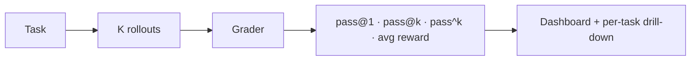
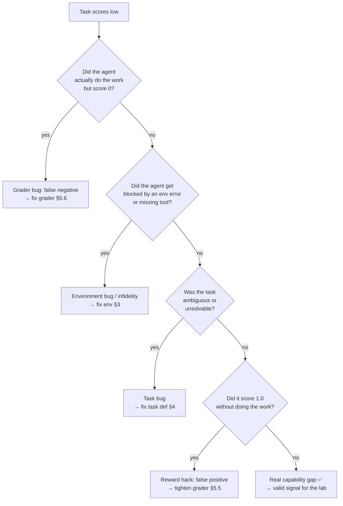
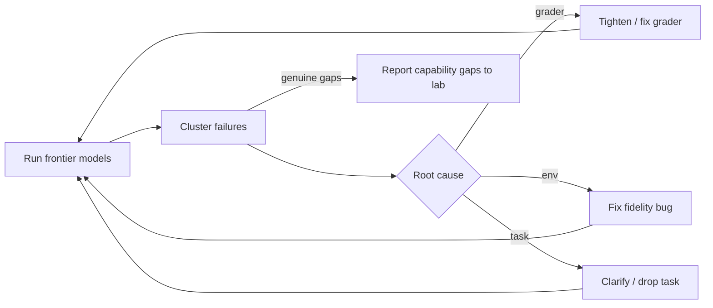

# Lesson 6 — Running Frontier Models & Failure Analysis

> **One-liner:** Run frontier models against your tasks, read the trajectories, and answer the question that defines this job: *is this failure a real capability gap, or a bug in my grader/environment?*

---

## 🎯 TL;DR

Building the environment is half the job; the other half is **using it** — running strong models against your tasks, aggregating scores with the right metrics (pass@k, pass^k), and *reading the failures*. Most first-draft environments are **too easy on themselves**: a low score often means your grader is wrong, your environment leaked, or the task was ambiguous — not that the model is weak. The core skill is a disciplined triage that separates *model can't* from *env/grader broke*, and then tightens the environment until each task is rigorous and fair.

---

## 1. Metrics: score a distribution, not a single run

Agents are stochastic, so you sample K attempts per task (Lesson 4 §5) and summarize:

| Metric | Definition | Tells you |
|---|---|---|
| **pass@1** | P(success) on a single attempt | Baseline reliability |
| **pass@k** | P(≥1 of k attempts succeeds) | Ceiling / "can it ever do this?" |
| **pass^k** (a.k.a. pass-hat) | P(all k attempts succeed) | Consistency / trustworthiness |
| **avg reward** | Mean reward across rollouts | Continuous signal for RL |
| **cost/latency** | Tokens, tool calls, wall-clock per solve | Efficiency, and infra budget |

pass@k and pass^k tell opposite halves of the story: a model can be at 90% pass@8 (it *can* do it) but 20% pass^8 (it *rarely does it reliably*). Labs care about both — capability *and* consistency.

---

## 2. The central triage: capability gap vs grader bug

This is the JD's headline skill: *"telling a real capability gap apart from a grader bug."* When a task scores low, **suspect your own machine first.**

Only the bottom-right leaf — *the agent genuinely tried, the env behaved, the task was fair, and it still failed* — is a **real capability gap** worth reporting to the customer. Everything else is your bug. Reversing this instinct (assuming the model is dumb) is the most common way to ship a broken environment.

---

## 3. Reading a trajectory

The trajectory (Lesson 2 §4) is your evidence. A repeatable review pass:

1. **Where did it diverge?** Find the first step where the agent's path left the solution path.
2. **What did it see?** Inspect the observation at that step — was the env response faithful, or misleading/buggy?
3. **What did it intend?** Read the reasoning/tool args — did it misunderstand the task, or hit an env wall?
4. **What did the grader say, per-criterion?** Decomposed checks (Lesson 5 §2) localize the failure instantly.
5. **Cluster, don't anecdote.** Tag many failures and look for the *dominant* mode; fix that first.

| Failure signature in the trajectory | Likely cause |
|---|---|
| Agent produced the right end-state, reward=0 | Grader false negative |
| Agent stuck retrying a call that 500s | Environment bug / infidelity |
| Agent asks clarifying questions, gives up | Ambiguous task prompt |
| Agent "finishes" instantly with reward=1 | Reward hack / leaked answer |
| Agent explores sensibly, runs out of budget | Real difficulty (or budget too tight) |

---

## 4. Online vs offline — where these runs happen

Two contexts, from [`evals/06`](../16_evals/06-offline-vs-online-evals.md):

- **Offline** — a fixed suite run in CI on every env/grader change. This is your regression harness: it catches the day you accidentally make a task unsolvable or a grader too lenient.
- **Online / in-the-loop** — the environment feeding an actual RL training run, or a live eval leaderboard. Higher volume, tighter latency and reliability demands (Lesson 7).

A healthy environment ships with an offline suite of reference-model runs so any regression in fidelity or grading shows up as a score change *before* it reaches a customer's training run.

---

## 5. Closing the loop — iterate to rigorous and fair

Failure analysis isn't a report; it's the input to the next iteration:

You stop iterating on a task when: it's solvable, the grader has no known false pos/neg, strong models land in the discriminating band (not 0%, not 100%), and a red-team pass finds no reward hack. *Then* the residual failures are trustworthy capability signal — the product the lab is paying for.

---

## 6. Key terms

| Term | Meaning |
|------|---------|
| **pass@k** | Probability at least one of k attempts succeeds (capability ceiling) |
| **pass^k** | Probability all k attempts succeed (consistency) |
| **Capability gap** | A failure that persists when env, grader, and task are all correct |
| **False negative/positive** | Grader rejects a valid solve / rewards a non-solve |
| **Failure clustering** | Grouping failures by root cause to fix the dominant mode first |
| **Regression suite** | Offline reference-model runs that catch env/grader regressions in CI |

---

## ✍️ Notes / follow-ups
- The reflex to build: **when a score looks wrong, debug your own environment before blaming the model.** That instinct is the difference between shipping signal and shipping noise.
- **Cross-links:** offline vs online → [`evals/06`](../16_evals/06-offline-vs-online-evals.md); the grader you're debugging → [Lesson 5](05-designing-rigorous-graders.md); running at scale → [Lesson 7](07-the-environment-platform-and-infra.md).
- **Next:** [Lesson 7 — The Environment Platform & Infra](07-the-environment-platform-and-infra.md).
