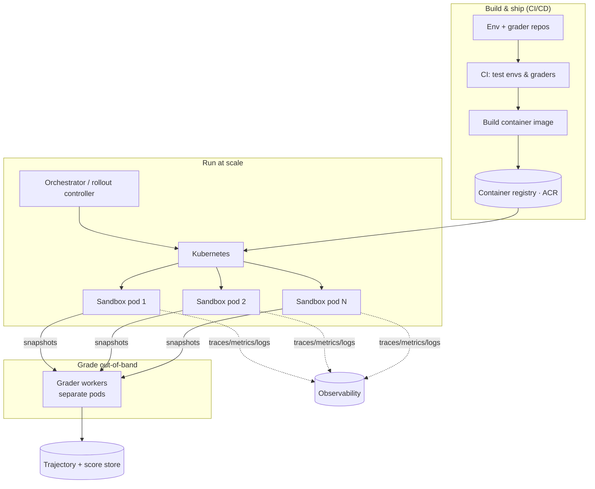
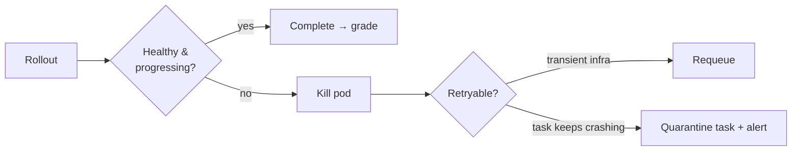

# Lesson 7 — The Environment Platform & Infra

> **One-liner:** Getting one environment right is hard; running **dozens** reliably — thousands of isolated, deterministic, observable sandboxes on demand — is the real engineering challenge, and it's the "Infrastructure" half of the job title.

---

## 🎯 TL;DR

An environment on your laptop is a demo. A *platform* packages each environment as a container (Docker + **supervisord** to run the several processes an env needs), publishes it to a **registry** (e.g., Azure Container Registry), and orchestrates thousands of ephemeral, sandboxed runs on **Kubernetes** — with **CI/CD** to build/test/ship envs, **observability** to see every rollout, and **self-healing** so a stuck sandbox never wedges a training run. The whole thing must stay **deterministic and reproducible** at scale.

---

## 1. The shape of the platform



Each rollout is: **pull image → start a sandbox pod → run agent×env to termination → export snapshot → tear down → grade separately.** Thousands of these run concurrently, come and go in seconds-to-minutes, and must not interfere.

---

## 2. Containerizing an environment (Docker + supervisord)

A realistic environment is rarely one process — it might be an API server, a database, a worker, a mock third-party service. **supervisord** runs and supervises them inside one container so the whole env comes up as a unit.

```ini
# supervisord.conf — bring up the whole environment as one supervised unit
[supervisord]
nodaemon=true

[program:api]
command=uvicorn app:app --host 0.0.0.0 --port 8000
autorestart=true
stdout_logfile=/var/log/api.log

[program:worker]
command=python worker.py
autorestart=true

[program:mcp]
command=python mcp_server.py         ; the tool surface from Lesson 3 §4
autorestart=true
```

```dockerfile
# Dockerfile — NOTE: grader code is deliberately NOT copied in (Lesson 5 §4)
FROM python:3.12-slim
WORKDIR /env
COPY requirements.txt .
RUN pip install --no-cache-dir -r requirements.txt
COPY app.py worker.py mcp_server.py supervisord.conf ./
COPY fixtures/ ./fixtures/            # seed data for deterministic reset
EXPOSE 8000
CMD ["supervisord", "-c", "supervisord.conf"]
```

Two habits that pay off: **pin every dependency** (determinism starts at the image) and **keep the grader out of the image** (integrity starts at the build).

---

## 3. Registry & CI/CD

Images are versioned artifacts. Build them in CI, test them, push to a registry, and let the orchestrator pull by immutable tag/digest.

```yaml
# .github/workflows/env-ci.yml — build, test, publish an environment image
name: env-ci
on: { push: { branches: [main] } }
jobs:
  build-test-push:
    runs-on: ubuntu-latest
    steps:
      - uses: actions/checkout@v4
      - name: Test env + grader (separately)
        run: |
          pytest tests/env         # fidelity + determinism tests
          pytest tests/graders     # grader correctness (in its own package)
      - name: Build image
        run: docker build -t $ACR/linear-like-env:${{ github.sha }} .
      - name: Push to Azure Container Registry
        run: |
          az acr login --name $ACR_NAME
          docker push $ACR/linear-like-env:${{ github.sha }}
```

CI is also where the **offline regression suite** (Lesson 6 §4) runs: reference-model rollouts whose scores must stay within tolerance, so a fidelity or grading regression fails the build instead of silently corrupting a customer's training run.

> **Determinism reproducibility check for CI:** run the same seeded task twice in the pipeline and assert identical final-state snapshots. If they differ, the env has nondeterminism (uncontrolled clock/RNG/ordering) and the build should fail.

---

## 4. Orchestration & sandboxing on Kubernetes

The orchestrator turns "run 5,000 rollouts" into pods and reaps them. Key concerns:

| Concern | Why it matters | Typical approach |
|---|---|---|
| **Isolation** | Agent code/actions must not escape or affect other runs | One pod per rollout; namespaces, seccomp, non-root, dropped capabilities |
| **Ephemerality** | Runs are short-lived and disposable | `Job`/`Pod` per rollout, TTL cleanup |
| **Resource limits** | A runaway rollout can't starve others | CPU/mem requests+limits; per-pod quotas |
| **Concurrency & queueing** | Thousands of tasks, finite cluster | A work queue + autoscaling worker pool |
| **Network policy** | Sandbox must not reach the grader or the internet (unless task needs it) | `NetworkPolicy` denying egress to grader/host services |
| **Budgets** | Enforce step/time budgets from the task def | Activity deadlines; kill on breach |

```yaml
# a single rollout as an isolated, budgeted, egress-locked Job
apiVersion: batch/v1
kind: Job
metadata: { name: rollout-linear-0007-s3 }
spec:
  activeDeadlineSeconds: 300           # wall-clock budget (Lesson 2 §5)
  backoffLimit: 0                      # a rollout is not retried silently
  template:
    spec:
      restartPolicy: Never
      automountServiceAccountToken: false
      containers:
        - name: env
          image: myacr.azurecr.io/linear-like-env@sha256:...   # immutable digest
          resources:
            requests: { cpu: "500m", memory: "512Mi" }
            limits:   { cpu: "1",    memory: "1Gi" }
          securityContext:
            runAsNonRoot: true
            allowPrivilegeEscalation: false
            capabilities: { drop: ["ALL"] }
```

The **sandbox is a security boundary**, not just a resource boundary: you are running an agent that can execute arbitrary tool calls (and sometimes arbitrary code). Treat every rollout as untrusted — this is the "secure/sandboxed code-execution environments" nice-to-have in the JD.

---

## 5. Observability

You can't debug (Lesson 6) or trust what you can't see. Instrument three layers:

| Layer | Capture |
|---|---|
| **Rollout** | Full trajectory, per-step tool calls/latency, budget usage, final verdict |
| **Environment** | API error rates, latency, restarts (supervisord), fidelity assertions firing |
| **Platform** | Pod scheduling latency, failure/OOM rates, queue depth, cost per rollout |

Emit structured traces (e.g., OpenTelemetry) so a single `task_id`+`sample` stitches together the agent's reasoning, the env's responses, and the grader's verdict into one view. Eval-observability tools (LangSmith, Braintrust, Arize; see [`evals/`](../16_evals/README.md)) plug in here for the trajectory layer.

---

## 6. Reliability: deterministic, observable, self-healing

The JD's reliability bar, made concrete:

- **Deterministic** — pinned images, seeded state, injected clock/RNG, immutable digests. Same inputs → same outputs, every time.
- **Observable** — every rollout traceable end-to-end; regressions visible as metric changes.
- **Self-healing** — health/liveness probes restart wedged envs; the controller detects stuck rollouts (no progress within deadline), kills and requeues them, and quarantines a task that repeatedly crashes so one bad task can't stall a whole training run.



---

## 7. Key terms

| Term | Meaning |
|------|---------|
| **supervisord** | Process supervisor that runs an env's multiple processes inside one container |
| **Container registry (ACR)** | Versioned store of env images the orchestrator pulls from |
| **Orchestrator / rollout controller** | The service that turns "run N rollouts" into scheduled, reaped pods |
| **Sandbox** | An isolated, budgeted, egress-locked pod running one untrusted rollout |
| **NetworkPolicy** | K8s rule enforcing the no-route-to-grader integrity boundary |
| **Self-healing** | Detecting and recovering from stuck/failed rollouts without human intervention |

---

## ✍️ Notes / follow-ups
- The scaling insight from the JD: **one environment is a craft problem; dozens reliably is a systems problem** — orchestration, isolation, observability, and self-healing are where that problem is won.
- **Cross-links:** what runs inside the container → [Lesson 3](03-engineering-high-fidelity-environments.md); why grader pods are separate → [Lesson 5 §4](05-designing-rigorous-graders.md); observability for evals → [`evals/`](../16_evals/README.md).
- **Next:** [Lesson 8 — Build Your First Gradable Environment](08-build-your-first-gradable-environment.md) — assemble everything into a shippable mini-project.
