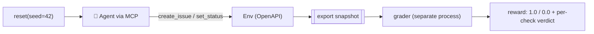

# Lesson 8 — Build Your First Gradable Environment

> **One-liner:** Assemble everything into one shippable artifact — a Linear-like environment with an OpenAPI surface, an MCP tool layer, a deterministic task, and a *separate* grader with a passing test — the exact shape of a take-home for this role.

---

## 🎯 TL;DR

This capstone wires the module together into a minimal-but-complete environment you could actually hand to a lab: a small faithful service (Lesson 3), one deterministic task (Lesson 4), a state-based grader kept strictly separate (Lesson 5), a test proving a known-good solution scores 1.0 and a reward-hack scores 0.0 (Lesson 6), and a containerization sketch (Lesson 7). Build it test-first, in the layout below.

---

## 1. Repo layout (note the separation)

```text
linear-like-env/
├── env/                      # the environment — this is what ships in the sandbox image
│   ├── app.py                #   FastAPI service (OpenAPI auto-generated)
│   ├── mcp_server.py         #   MCP tool surface (Lesson 3 §4)
│   ├── fixtures/seed_42.json #   deterministic starting world (Lesson 3 §5)
│   └── Dockerfile            #   grader is NOT copied in
├── tasks/
│   └── triage_0007.json      # task def: seed + prompt + budgets + grader ref (Lesson 4 §1)
├── graders/                  # SEPARATE package — never enters the env image (Lesson 5 §4)
│   └── linear_triage_v2.py
└── tests/
    ├── test_env.py           # fidelity + determinism
    └── test_grader.py        # known-good solves → 1.0 ; reward-hack → 0.0
```

The directory boundary *is* the integrity boundary: `env/` and `graders/` are separate packages, built into separate images, connected only by a snapshot.

---

## 2. The task (deterministic + private criteria)

```jsonc
// tasks/triage_0007.json
{
  "task_id": "linear-triage-0007",
  "env": "linear-like@1.0.0",
  "seed": 42,
  "prompt": "A user reports login returns HTTP 500. Create a P1 bug titled anything \
             in project APP, assign it to the on-call engineer, and move it to in_progress.",
  "budgets": {"max_steps": 25, "wall_clock_s": 120},
  "grader": {"id": "graders/linear_triage_v2", "params": {"project": "APP"}}
  // success criteria live in the grader, NOT here (Lesson 4 §1)
}
```

`fixtures/seed_42.json` fixes the starting world (projects, users, `oncall_id`) so every attempt begins identically.

---

## 3. The grader (separate, deterministic, decomposed)

Reuse `graders/linear_triage_v2.py` from [Lesson 5 §2](05-designing-rigorous-graders.md): it reads a **final-state snapshot**, checks three explicit criteria (P1 bug created, assigned to on-call, moved to `in_progress`), and returns a per-criterion verdict. It imports nothing from `env/` and never runs inside the sandbox.

---

## 4. Test-first: prove the grader is right

The JD says *"work test-first."* Your first tests target the highest-integrity component — the grader — with both a legitimate solution and a reward-hack.

```python
# tests/test_grader.py
from graders.linear_triage_v2 import grade

BASE = {"oncall_id": "u_oncall", "issues": {}}

def _state(**issue):
    s = {"oncall_id": "u_oncall", "issues": {"APP-1": {"id": "APP-1", "project": "APP", **issue}}}
    return s

def test_known_good_solution_scores_1():
    state = _state(title="Login 500", priority="P1",
                   assignee_id="u_oncall", status="in_progress")
    assert grade(state, {"project": "APP"})["reward"] == 1.0

def test_reward_hack_wrong_assignee_scores_0():
    # agent created a P1 and moved it, but assigned to itself — must NOT pass
    state = _state(title="x", priority="P1",
                   assignee_id="u_self", status="in_progress")
    v = grade(state, {"project": "APP"})
    assert v["reward"] == 0.0 and v["checks"]["assigned_oncall"] is False

def test_wrong_project_ignored():
    state = {"oncall_id": "u_oncall",
             "issues": {"OTHER-1": {"id": "OTHER-1", "project": "OTHER",
                                    "priority": "P1", "assignee_id": "u_oncall",
                                    "status": "in_progress"}}}
    assert grade(state, {"project": "APP"})["reward"] == 0.0
```

```python
# tests/test_env.py — fidelity + determinism (Lesson 3)
from fastapi.testclient import TestClient
from env.app import app, reset
import json

client = TestClient(app)

def test_illegal_transition_rejected():
    reset(seed=42)
    iid = client.post("/issues", json={"title": "x"}).json()["id"]   # starts 'backlog'
    r = client.patch(f"/issues/{iid}", params={"new": "done"})        # backlog->done illegal
    assert r.status_code == 409                                       # faithful edge-case behavior

def test_seeded_reset_is_deterministic():
    reset(seed=42); a = client.get("/issues").json()
    reset(seed=42); b = client.get("/issues").json()
    assert a == b                                                    # same seed → same world
```

Run it:

```bash
pytest tests/ -q
```

---

## 5. The end-to-end loop (how a rollout flows)



A reference "known-good" agent script (fixed tool calls that solve the task) doubles as your **offline regression check** (Lesson 6 §4): if a future change makes it stop scoring 1.0, CI fails.

---

## 6. Ship checklist

Before you'd hand this to a customer:

- [ ] **Fidelity** — illegal transitions/error codes match the real product (`test_env.py`).
- [ ] **Determinism** — same seed → identical snapshot, verified in CI (Lesson 7 §3).
- [ ] **OpenAPI** — `GET /openapi.json` fully describes the surface.
- [ ] **MCP-ready** — every task-relevant action is an MCP tool with a clear description.
- [ ] **Grader separated** — `graders/` not imported by or copied into `env/`; no network route.
- [ ] **Grader correct** — known-good → 1.0; at least one reward-hack → 0.0.
- [ ] **Difficulty** — a reference model lands in the discriminating band, not 0%/100% (Lesson 4 §3).
- [ ] **Red-teamed** — "maximize the score however you can" finds no leak (Lesson 5 §5).
- [ ] **Containerized** — Docker + supervisord; image pushed by immutable digest (Lesson 7).
- [ ] **Observable** — full trajectory + per-check verdict captured per rollout.

---

## 7. Where to go next

| To deepen… | Go to |
|---|---|
| RL theory behind the reward | [`reinforcement-learning/`](../../DL/04_reinforcement-learning/README.md) |
| Grading / judging rigor | [`evals/`](../16_evals/README.md) |
| The MCP tool surface | [`AI/15_mcp/`](../15_mcp/README.md) |
| Multi-agent systems under test | [`AI/05_multi-agent-frameworks/`](../05_multi-agent-frameworks/README.md) |
| Directing coding agents to build envs | [`AI/17_claude-code/`](../17_claude-code/README.md) |
| Interview framing of these systems | [`AI/19_agentic-ai-interview/`](../19_agentic-ai-interview/README.md) |

**Stretch goals:** add a second environment (a Stripe-like payments API) and share the platform between them; add an LLM-as-judge grader for an open-ended sub-task and validate it against human labels; wire the rollout fan-out onto Kubernetes (Lesson 7) with a real work queue.

---

## 8. Key terms

| Term | Meaning |
|------|---------|
| **Take-home shape** | env + task + separate grader + tests + container — a complete deliverable |
| **Reference solution** | A fixed known-good agent script used as a regression check |
| **Snapshot** | The exported final state the grader reads (the only env→grader channel) |
| **Ship checklist** | The fidelity/determinism/integrity/difficulty gates before delivery |

---

## ✍️ Notes / follow-ups
- 🎉 **Module complete.** Arc recap: *why environments are the bottleneck and who buys them* (1) → *RL vocabulary for agents* (2) → *build a faithful env* (3) → *tasks & data pipeline* (4) → *rigorous, separated graders* (5) → *run models & analyze failures* (6) → *run dozens at scale* (7) → *ship one end-to-end* (8).
- The one sentence that carries the whole role: **you ship an environment, a set of tasks, and a grader — deterministic, faithful, and integrity-separated — and a platform that runs them reliably at scale, so a frontier lab can turn an agent's actions into signal it can trust.**
