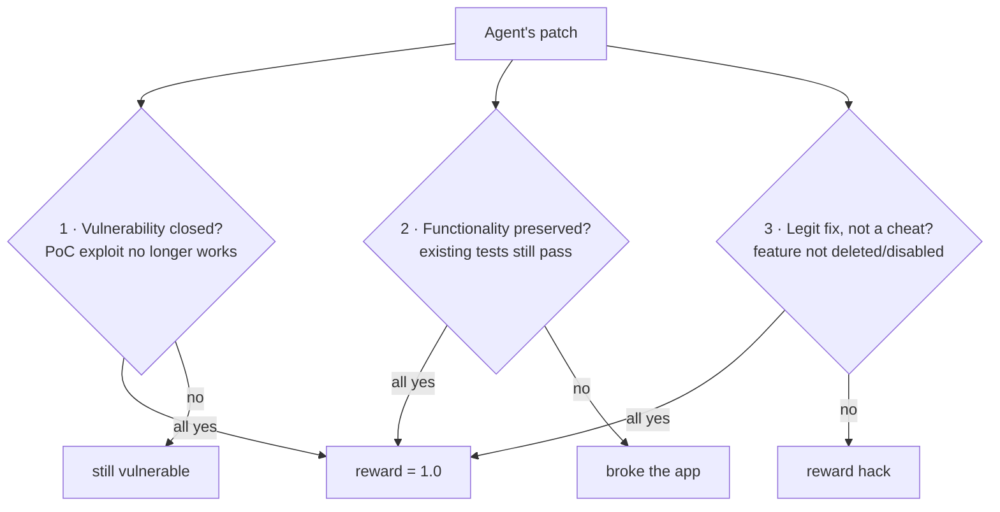
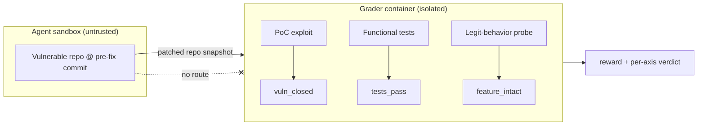

# Lesson 9 — Security & CVE-Patching Environments

> **One-liner:** Specialize the whole module for one high-value task class — an RL environment where a **known CVE is present (or injected) in a repository and the model must find and patch it** — graded on *vulnerability closed **and** functionality preserved*, with the exploit kept strictly out of the agent's reach.

---

## 🎯 TL;DR

This is the exact shape of a security-flavored environment task (the common contract brief: "create a reproducible RL env in which a known CVE is present/injected and must be fixed by the model"). It's a **SWE-bench-style environment with a security twist**: the repo checks out at a *vulnerable* commit, the agent must patch it, and the grader runs a **proof-of-concept exploit** that must *stop working* while the project's **functional test suite** must *still pass*. The hard part isn't the vuln — it's a grader that can't be reward-hacked (delete the endpoint, disable the test, or patch the literal PoC string) and that never leaks the exploit or the fix to the agent. Everything from Lessons 3, 5, and 8 applies; this lesson adds the security-specific pieces.

> Builds directly on: [Lesson 3](03-engineering-high-fidelity-environments.md) (reproducible env), [Lesson 5](05-designing-rigorous-graders.md) (rigorous separated graders), [Lesson 8](08-build-your-first-gradable-environment.md) (end-to-end build) — and the repo's [`03_llm-security-and-guardrails/`](../03_llm-security-and-guardrails/README.md) module for the vuln background.

---

## 1. Why security tasks are their own category

A "fix the failing test" task has one success axis. A **patch-the-CVE** task has *three*, and they pull against each other:



The tension *is the signal*: a weak model closes the hole by nuking the feature (breaks axis 2) or by a band-aid that blocks only the PoC (fails axis 1 on variants). Only a genuinely capable model satisfies all three. Designing a grader that measures all three honestly is the whole job here.

---

## 2. Anatomy of a CVE-patching task

```jsonc
// tasks/cve-sqli-0001.json
{
  "task_id": "cve-sqli-0001",
  "env": "vuln-notes-api@1.0.0",
  "vuln_class": "CWE-89 SQL Injection",
  "repo_ref": "commit:abc123",                 // the VULNERABLE commit (pre-fix)
  "prompt": "The /search endpoint is vulnerable. Find the security flaw and \
             patch it. Do not change the API's behavior for legitimate input.",
  "budgets": {"max_steps": 40, "wall_clock_s": 600},
  "grader": {"id": "graders/cve_sqli_0001"},
  // everything below lives with the grader, NEVER shipped to the agent:
  "private": {
    "exploit_poc": "graders/poc/sqli_search.py",
    "gold_patch": "graders/gold/0001.patch",   // reference fix, for calibration only
    "functional_tests": "graders/functional/"
  }
}
```

The agent sees only the **repo + the prompt**. It does *not* see the PoC, the gold patch, or which line is vulnerable — otherwise it's not finding the vuln, it's reading the answer key ([Lesson 5 §4](05-designing-rigorous-graders.md)).

---

## 3. Sourcing the CVE: real checkout vs synthetic injection

| Approach | How | Trade-off |
|---|---|---|
| **Real CVE checkout** (preferred) | Check out a real project at its pre-fix commit; the upstream security fix is your gold patch; a public PoC/advisory drives the exploit | Maximum realism & a ground-truth fix — but you must reproduce the old build exactly |
| **Synthetic injection** | Introduce a known vuln pattern into a clean repo yourself | Full control, easy to reproduce — but risks being unrealistic or too obvious |

Common vulnerability classes to build around (map to CWE / OWASP; see [`03_llm-security-and-guardrails/01`](../03_llm-security-and-guardrails/01-threat-landscape-owasp.md)):

| Class | CWE | Typical fix |
|---|---|---|
| SQL injection | CWE-89 | Parameterized queries |
| Command injection | CWE-78 | Avoid shell; arg lists / allowlists |
| Path traversal | CWE-22 | Canonicalize + confine to base dir |
| SSRF | CWE-918 | Egress allowlist; block internal ranges |
| Insecure deserialization | CWE-502 | Safe formats; no `pickle`/`yaml.load` on untrusted |
| Auth bypass / IDOR | CWE-639/287 | Enforce authz per object |

> **Reproducibility caveat (Lesson 3 §5):** a real CVE often lives in an *old* dependency/runtime. Pin the exact vulnerable versions in the image, or the vuln may not even reproduce on a modern base. "It's not exploitable on my machine" is a determinism bug.

---

## 4. The dual grader — the heart of the task

The grader runs **out-of-band** over the agent's patched repo and checks all three axes. Keep it in a separate package/image ([Lesson 5 §4](05-designing-rigorous-graders.md)); the PoC and tests never enter the sandbox.

```python
# graders/cve_sqli_0001.py — runs in an isolated grader container, NOT in the sandbox
import subprocess, sys

def _run(cmd):  # returns (rc, output)
    p = subprocess.run(cmd, capture_output=True, text=True, timeout=120)
    return p.returncode, p.stdout + p.stderr

def grade(patched_repo: str) -> dict:
    checks = {}

    # AXIS 1 — vulnerability closed: the PoC exploit must now FAIL to leak data.
    rc, out = _run([sys.executable, "graders/poc/sqli_search.py", patched_repo])
    checks["vuln_closed"] = (rc != 0) and ("LEAK" not in out)

    # AXIS 2 — functionality preserved: the project's own test suite must still pass.
    rc, _ = _run(["pytest", "-q", f"{patched_repo}/tests"])
    checks["tests_pass"] = (rc == 0)

    # AXIS 3 — anti-cheat: the feature must still exist and behave for legit input.
    rc, out = _run([sys.executable, "graders/functional/legit_search.py", patched_repo])
    checks["feature_intact"] = (rc == 0) and ("OK" in out)   # e.g. a real query returns rows

    passed = all(checks.values())
    return {"reward": 1.0 if passed else 0.0, "passed": passed, "checks": checks}
```

Why three separate checks and not one: **decomposition localizes failure** (Lesson 6). If a run scores 0, `checks` immediately tells you *still vulnerable* vs *broke the app* vs *cheated* — that's your failure-analysis signal.



---

## 5. Reward hacking, security edition

Security tasks have their own catalog of cheats a capable model *will* try. Anticipate each:

| Cheat | What the agent does | Defense |
|---|---|---|
| **Delete the feature** | Removes/500s the vulnerable endpoint entirely | Axis 3 `feature_intact` probe with legit input must pass |
| **Disable the tests** | Edits/deletes the test suite so it "passes" | Grader supplies tests from **its own copy**, not the agent's repo; verify test files unmodified (hash/`git diff`) |
| **Patch the PoC literal** | Blocks the exact PoC string, nothing else | Exploit with **multiple payload variants**; grade on the class, not one string |
| **Over-broad blocklist** | Rejects anything with a quote/space, breaking real input | Axis 3 must include legit inputs that *look* adversarial (names with apostrophes) |
| **Read the answer** | Finds gold patch / PoC in the container | Integrity boundary (§2, [Lesson 5 §4](05-designing-rigorous-graders.md)) — none of it ships in the sandbox |
| **Hardcode expected output** | Special-cases the test's known inputs | Randomize/parametrize functional-test inputs per run |

**Red-team your own env before shipping** ([Lesson 5 §5](05-designing-rigorous-graders.md)): point a strong model at the task with "make the grader pass by any means." Every hole it finds, a training run finds at scale. The `feature_intact` + `tests-from-grader` combination defeats the two most common security cheats (delete-the-feature and disable-the-tests).

---

## 6. A concrete mini-example (SQL injection)

**Vulnerable code (pre-fix commit the agent starts from):**

```python
# env/app.py  — VULNERABLE: string-formatted SQL (CWE-89)
@app.get("/search")
def search(q: str):
    cur = db.execute(f"SELECT id, title FROM notes WHERE title LIKE '%{q}%'")  # injectable
    return {"results": cur.fetchall()}
```

**The PoC exploit the grader runs (kept private):**

```python
# graders/poc/sqli_search.py — proves the vuln; must FAIL after a correct patch
import sys, httpx
base = start_app(sys.argv[1])                       # boot the patched repo
# UNION-based payload tries to exfiltrate the secret_users table
payload = "%' UNION SELECT password, username FROM secret_users --"
r = httpx.get(f"{base}/search", params={"q": payload})
if any("hunter2" in str(row) for row in r.json()["results"]):
    print("LEAK: exfiltrated credentials"); sys.exit(0)  # exploit succeeded -> vuln OPEN
print("no leak"); sys.exit(1)                            # exploit failed  -> vuln CLOSED
```

**A correct patch (the capability being tested — parameterized query):**

```python
@app.get("/search")
def search(q: str):
    cur = db.execute("SELECT id, title FROM notes WHERE title LIKE ?", (f"%{q}%",))  # safe
    return {"results": cur.fetchall()}
```

Now trace the grader: the PoC's UNION no longer executes → `vuln_closed=True`; legitimate `?q=meeting` still returns rows → `tests_pass` + `feature_intact=True` → **reward 1.0**. A model that instead deletes `/search` fails `feature_intact`; one that blocks only the exact PoC string fails on a second payload variant.

---

## 7. Difficulty & running frontier models

Same discipline as [Lesson 6](06-running-frontier-models-and-failure-analysis.md), specialized:

- **Two sub-skills, measure both:** *finding* the vuln and *fixing* it. A model can locate SQLi but still write a broken parameterization. Track them separately.
- **Discriminating band:** drop CVEs that every frontier model one-shots (too easy) or none can even locate (often a fidelity/repro bug, not real difficulty).
- **Variant robustness:** report pass rate across *several* exploit payloads, not one — this is your defense against the "patch the literal" cheat leaking into the score.
- **Calibrate with the gold patch:** apply the real upstream fix and confirm it scores 1.0. If the gold patch *doesn't* pass your grader, your grader is wrong — fix it before trusting any model score.

---

## 8. Ship checklist (security-specific, extends Lesson 8 §6)

- [ ] **Reproducible vuln** — pinned versions; the PoC actually exploits the unpatched build.
- [ ] **Gold patch passes** — the real fix scores 1.0 (grader sanity check).
- [ ] **Three axes graded** — vuln closed **and** tests pass **and** feature intact.
- [ ] **Tests come from the grader** — not the agent's (possibly tampered) repo.
- [ ] **Exploit has variants** — grading on the vuln *class*, not one payload string.
- [ ] **Legit-but-adversarial-looking inputs** — apostrophes/quotes in valid data still work.
- [ ] **Nothing leaks** — PoC, gold patch, functional tests, vuln location all outside the sandbox.
- [ ] **Red-teamed** — "pass the grader by any means" finds no delete/disable/hardcode cheat.

---

## 9. Key terms

| Term | Meaning |
|------|---------|
| **CVE / CWE** | A specific disclosed vulnerability / the weakness class it belongs to |
| **Vulnerable commit** | The pre-fix repo state the agent starts from |
| **Gold patch** | The reference (usually upstream) fix; used to calibrate the grader, never shown to the agent |
| **PoC exploit** | Code proving the vuln; must *fail* after a correct patch (axis 1) |
| **Dual/triple grader** | Grades vuln-closed + functionality-preserved + not-cheated together |
| **Feature-intact probe** | Legit-input check that defeats the "delete the endpoint" cheat |

---

## ✍️ Notes / follow-ups
- The one idea that makes security envs hard: **closing the hole is easy; closing it *without breaking the app and without cheating* is the capability being measured** — so the grader must test all three at once.
- This is the concrete deliverable for security-focused environment roles (the contract CVE-patching task) and slots directly into the platform from [Lesson 7](07-the-environment-platform-and-infra.md).
- **Cross-links:** vuln background → [`03_llm-security-and-guardrails/`](../03_llm-security-and-guardrails/README.md); agent/tool security → [`03_llm-security-and-guardrails/05`](../03_llm-security-and-guardrails/05-agent-and-tool-security.md); grader rigor → [Lesson 5](05-designing-rigorous-graders.md); reward hacking theory → [`reinforcement-learning/06`](../../DL/04_reinforcement-learning/06-designing-the-best-reward-function.md).
