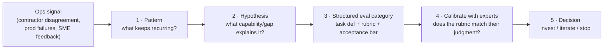
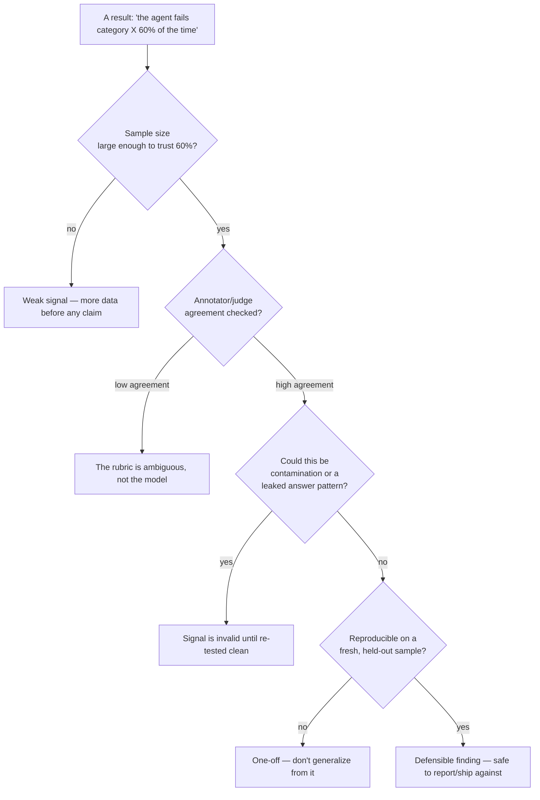

# Lesson 10 — Ops-to-Research Translation & Research Signal Judgment

> **One-liner:** Two skills that sit *above* building any single environment or grader — turning messy, real-world ops signal (contractor disagreement, production failures, SME feedback) into a well-specified research question, and knowing when the resulting signal is actually strong enough to act on, report, or ship against.

---

## 🎯 TL;DR

Lessons 1–9 teach you to build one rigorous environment. This lesson is about running a **whole program** of them: deciding *which* environments/evals are worth building at all, translating vague real-world observations into structured task/data categories, and — the highest-leverage skill — acting as a **quality gate** that blocks a claim, pauses work, or forces a scope change when the underlying signal doesn't support it. This is Lesson 6's capability-gap-vs-grader-bug triage, generalized from one task to an entire research initiative.

---

## 1. The translation pipeline: ops signal → research question

"Ops-to-research translation" means the ambiguous, real-world side of the business (contractor/annotator behavior, production incident reports, domain-expert complaints, a client's vague "the agent feels unreliable") never arrives as a clean hypothesis — someone has to turn it into one.



**Worked example:**

| Stage | Concrete instance |
|---|---|
| Ops signal | Three different contractors flag that an agent "gives confident wrong answers" on multi-step spreadsheet tasks — no two flag the exact same task. |
| Pattern | Re-reading 12 flagged transcripts: failures cluster around tasks needing a value carried across **more than 2** intermediate steps, not spreadsheet skill generally. |
| Hypothesis | The model loses track of an intermediate value past a small number of reasoning hops, and confabulates a plausible-looking one instead of saying it's unsure. |
| Structured eval category | A new task family: "N-hop value-carry" tasks, parameterized by hop count (2, 3, 4, 5), graded on **both** final-answer correctness and whether the agent flags uncertainty when it should. |
| Calibration | Show 5 borderline transcripts to two domain SMEs; if they disagree with the rubric's verdict more than ~10% of the time, the rubric — not the model — is the thing to fix first. |
| Decision | If the category shows a real, reproducible gap across hop counts → invest (build the full env). If it only reproduces on one cherry-picked example → stop; it was noise, not signal. |

The skill being exercised isn't "write a task" (Lesson 4) — it's the four steps *before* that: noticing the pattern, forming a falsifiable hypothesis, and only then reaching for the environment/task-authoring toolkit.

---

## 2. Research signal judgment: when is a result trustworthy?

This is Lesson 6 §2's triage (capability gap vs. grader bug), but the same discipline applies one level up — to an entire result, dataset, or eval category before it's presented as a finding.



| Question to ask before trusting *any* number | Failure mode it catches |
|---|---|
| Is the sample size big enough for this % to mean anything? | Small-N noise dressed up as a rate |
| Did I check inter-annotator / inter-judge agreement? | An ambiguous rubric masquerading as a model failure |
| Could the eval data have leaked into training? | Contamination inflating (or deflating) a score |
| Does it reproduce on a fresh sample I haven't looked at yet? | Overfitting the analysis to the examples that first caught your eye |
| Am I the one person who's decided this is real? | No second opinion / calibration pass |

This table is the concrete form of "research signal judgment" — it's not a personality trait, it's a checklist you run *before* a number leaves the room.

---

## 3. Being the quality gate — what "blocking a claim" actually looks like

The highest-leverage, most uncomfortable part of this skill: having the standing (and the nerve) to say a result **isn't ready**, even when a client, a researcher, or a deadline wants it to be.

```text
Block/pause when:
  - sample size is below your pre-agreed minimum for this claim class
  - annotator/judge agreement is below threshold and hasn't been investigated
  - the result contradicts a simpler explanation you haven't ruled out yet
  - the finding would justify a scope/resourcing decision bigger than the evidence supports

Don't block on:
  - a result you merely find surprising (surprising ≠ wrong — investigate, don't gatekeep by instinct)
  - missing polish that doesn't affect the claim's validity
```

The output of a block is never just "no" — it's a **specific, falsifiable next step**: "re-run on 3x the sample," "get a second SME to re-grade the disputed 20%," "check these 5 transcripts for leakage." A quality gate that can't say what would change its mind isn't rigor, it's gut feel with better vocabulary.

---

## 4. ML-oriented data design, at the program level

Lesson 4 covers designing *one* task/data pipeline. At the MTS/program level, the same design choices (task definitions, annotation schemas, rubrics) get an added dimension: **incentive design** for the humans producing the data.

| Design lever | Program-level question |
|---|---|
| Task/annotation schema | Does it force the specific judgment you need, or does it let an annotator take a shortcut that still "completes" the task? |
| Rubric | Is every criterion independently checkable ([00_jobs Lesson 14](../00_jobs/14_domain-sme-ai-data-contributor-contract/README.md)'s pattern), or does it quietly rely on a single grader's taste? |
| Incentives | Are contributors paid/rated in a way that rewards catching subtle errors, or one that rewards throughput and quietly encourages rubber-stamping? |
| Coverage | Which task categories are over-represented because they're *easy to author*, versus which real failure modes have no category yet (the gap this whole lesson exists to find)? |

Misaligned incentives are the single most common way a data pipeline silently degrades — contributors optimize for whatever's actually measured, not for what you meant.

---

## 5. Translating findings for stakeholders

The last mile of this role: a defensible finding is worthless if it's communicated as either false certainty or an unreadable pile of caveats.

| Audience | What they need from you |
|---|---|
| Researchers | The exact failure mode, sample size, and what you've already ruled out (grader bug? contamination?) — so they don't re-derive your triage. |
| Client-facing / non-technical stakeholders | The *decision* the finding supports ("invest here," "not ready to claim X yet") and the confidence level in plain terms — not the raw statistics. |
| Ops/contributor teams | What changes in the task/rubric/incentive design, specifically — not just "quality needs to improve." |

A good translation states the claim, the evidence class behind it (Lesson §2's checklist), and the recommended action — in that order, every time.

---

## Key terms

| Term | Meaning |
|------|---------|
| **Ops-to-research translation** | Converting ambiguous, real-world signal (ops/contractor/production) into a structured, testable research question |
| **Research signal judgment** | The discipline of checking sample size, agreement, contamination, and reproducibility before trusting a result |
| **Quality gate** | The authority (and responsibility) to block, pause, or rescope work when the evidence doesn't support the claim |
| **Incentive design (data ops)** | Structuring contributor pay/rating so the measured behavior matches the intended judgment, not a shortcut |
| **Falsifiable next step** | A concrete action that would resolve a blocked claim — the required output of any "not ready" verdict |

## ✍️ Notes / follow-ups

- This lesson generalizes Lesson 6's capability-gap-vs-grader-bug triage from one environment to a whole research program — re-read [Lesson 6 §2](06-running-frontier-models-and-failure-analysis.md#2-the-central-triage-capability-gap-vs-grader-bug) side by side with §2 here.
- The rubric-design discipline referenced in §4 is the same one exercised hands-on in [`00_jobs` Lesson 14's project](../00_jobs/14_domain-sme-ai-data-contributor-contract/project.md) and [`00_jobs` Lesson 15's project](../00_jobs/15_agentic-coding-evaluator-contract/project.md) — this lesson is the "why it matters at the program level" for the same skill.
- General eval rigor this lesson leans on (contamination, offline/online, LLM-as-judge calibration): [`16_evals`](../16_evals/README.md).
- **Full job mapping:** [`00_jobs` Lesson 16 — Member of Technical Staff, Frontier AI](../00_jobs/16_member-of-technical-staff-frontier-ai/README.md).
