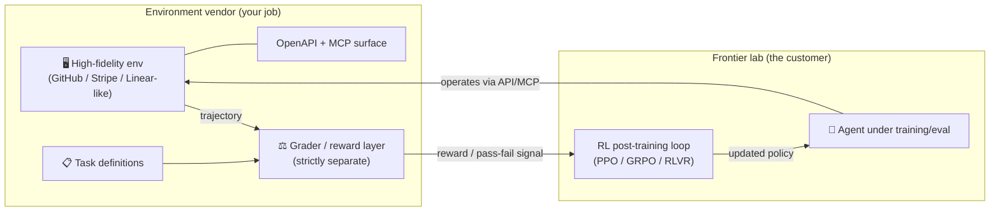
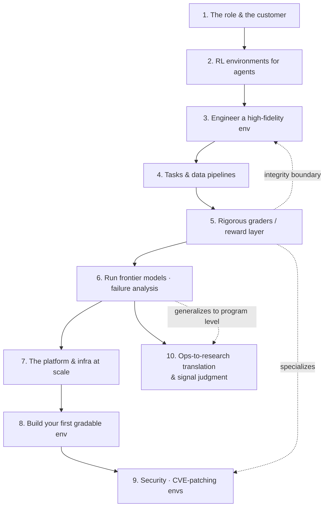

# 🏗️ RL Environments & Infrastructure — Building the Training Grounds for Frontier Agents

> A **reference module** (concept + code + diagrams) that reverse-engineers a real job archetype: **Software Engineer — RL Environments & Infrastructure** (the kind of role at AI-data-labs / RL-environment vendors, whose *customers are frontier AI labs*).
>
> The one-sentence thesis of the whole field: **the bottleneck for the next generation of AI agents is not algorithms — it's the lack of realistic, gradable environments to train and evaluate them in.** This module teaches you to build those environments and the infrastructure that runs them at scale.

These notes are written as a curriculum, not a transcript. They translate a dense job description into the concepts, systems, and code you'd actually need to do the work — and cross-link to the sibling modules in this repo where the deeper theory already lives.

---

## 🎯 Who is the customer, and what do they buy?

This is the framing that makes the whole role make sense: **your customers are frontier labs** — the teams training the world's most capable models (OpenAI, Anthropic, Google DeepMind, Meta, xAI, Mistral, and similar). They already have the algorithms and the GPUs. What they are starved for is **environments**: faithful, programmatically-operable recreations of real software products, wired with tasks and **automated grading**, so an agent can *do work* inside them and be *measured* on the outcome.

The lab plugs your environment into its **RL post-training loop** (reward signal → policy update) or its **eval harness** (score a fixed model). Either way, the product you ship is a *machine that turns an agent's actions into clean, trustworthy signal.* Get that wrong and the lab either trains toward the wrong thing or gets a misleading capability read — both extremely expensive mistakes. That's why the quality bar (fidelity, determinism, grading integrity) is the entire game.

---

## 📓 Lessons

| # | Lesson | What you'll learn |
|---|--------|-------------------|
| 1 | [The Role & the Frontier-Lab Customer](01-the-role-and-the-frontier-lab-customer.md) | Why environments are the bottleneck; who buys them and why; the vendor ecosystem; the grading-integrity principle |
| 2 | [RL Environments for Agents](02-rl-environments-for-agents.md) | Classic Gym RL → *agentic* environments; state/action/reward for an agent operating software; trajectories; RLVR |
| 3 | [Engineering High-Fidelity Environments](03-engineering-high-fidelity-environments.md) | Reverse-engineering a real product; faithful APIs & edge cases; exposing OpenAPI; making it **MCP-ready**; determinism |
| 4 | [Task Generation & Data Pipelines](04-task-generation-and-data-pipelines.md) | Turning a product into gradable tasks; seeding initial state; trajectory capture; curation & difficulty calibration at scale |
| 5 | [Designing Rigorous Graders (the Reward Layer)](05-designing-rigorous-graders.md) | State/outcome graders vs LLM-as-judge; verifiable rewards; reward hacking; fairness; the grader↔env separation |
| 6 | [Running Frontier Models & Failure Analysis](06-running-frontier-models-and-failure-analysis.md) | Rollouts, pass@k; telling a real capability gap from a grader bug; failure-mode analysis; iterate to fair |
| 7 | [The Environment Platform & Infra](07-the-environment-platform-and-infra.md) | Orchestration, sandboxing, Docker + supervisord, container registries, Kubernetes, CI/CD, observability, self-healing |
| 8 | [Build Your First Gradable Environment](08-build-your-first-gradable-environment.md) | End-to-end mini-project: a Linear-like task API → OpenAPI → MCP → grader → pytest; a shippable checklist |
| 9 | [Security & CVE-Patching Environments](09-security-cve-patching-environments.md) | *Specialization* — inject a known CVE; a dual grader (vuln-closed + tests-pass + not-cheated); security-edition reward hacking |
| 10 | [Ops-to-Research Translation & Research Signal Judgment](10-ops-to-research-translation-and-signal-judgment.md) | *Program-level* — turning messy ops signal into a structured eval category; when a result is trustworthy enough to act on; being the quality gate; incentive design |

---

## 🧭 The arc (how the lessons connect)

- **Lessons 1–2** = *why* — the market, the customer, and the RL vocabulary that frames everything.
- **Lessons 3–5** = *the craft* — the three artifacts you actually ship: the environment, the tasks, the grader.
- **Lessons 6–7** = *making it real* — running models against it and running dozens of them reliably at scale.
- **Lesson 8** = *do it* — a hands-on build that ties the module together.
- **Lesson 9** = *specialize* — the security/CVE-patching task class (contract security-env authoring roles), which reuses Lessons 3, 5, and 8.
- **Lesson 10** = *zoom out* — the program-level judgment (which environments/evals are worth building, when a result is trustworthy) that sits above any single environment; this is the Member of Technical Staff / research-quality-lead layer of the role.

---

## 🗂️ Core cheat-sheet

| Concept | In one line |
|---------|-------------|
| **Environment** | A faithful, programmatically-operable recreation of a real software product |
| **High fidelity** | Faithful enough (UX, APIs, edge cases) that a frontier agent can't tell it from the real thing |
| **Task** | A concrete job + a deterministic starting state + a definition of success |
| **Grader / reward layer** | The code that turns a trajectory into a score — kept *strictly separate* from the environment |
| **Trajectory (rollout)** | The full sequence of an agent's states, actions, and tool calls for one task attempt |
| **RLVR** | RL with Verifiable Rewards — reward comes from a checkable ground truth, not a vibe |
| **Reward hacking** | Agent maximizes the literal signal in a way that diverges from your true intent |
| **Grading integrity** | Grader logic never leaks into the env the agent can see — else the agent games it |
| **MCP-ready** | The env exposes its tools/data over the Model Context Protocol so agents operate it programmatically |
| **Determinism** | Same seed + same actions → same result; the precondition for a fair, reproducible grade |
| **Sandboxing** | Each run is isolated (container/VM) so agent actions can't escape or interfere across runs |
| **Ops-to-research translation** | Turning ambiguous real-world/ops signal into a structured, testable eval category |
| **Research signal judgment** | Checking sample size, agreement, contamination, and reproducibility before trusting a result |
| **Quality gate** | The authority to block/pause/rescope work when evidence doesn't support a claim |

---

## 🔗 How this module links to the rest of the repo

This role sits at the intersection of several tracks you've already got notes on. Lean on them:

- **Reinforcement learning** → [`DL/04_reinforcement-learning/`](../../DL/04_reinforcement-learning/README.md) — value functions, reward design, and reward hacking. **[Lesson 6 there](../../DL/04_reinforcement-learning/06-designing-the-best-reward-function.md) is the theoretical core of Lesson 5 here.**
- **Evaluations** → [`AI/16_evals/`](../16_evals/README.md) — LLM-as-judge, offline vs online evals, benchmark saturation/contamination. Graders *are* evals; Lessons 5–6 build on this.
- **Model Context Protocol** → [`AI/15_mcp/`](../15_mcp/README.md) — how you make an environment "MCP-ready" so an agent operates it as a tool surface (Lesson 3).
- **Multi-agent frameworks** → [`AI/05_multi-agent-frameworks/`](../05_multi-agent-frameworks/README.md) — agent topologies and pitfalls; useful when the agent-under-test is itself multi-agent.
- **A2A protocol** → [`AI/09_a2a-protocol/`](../09_a2a-protocol/README.md) — the horizontal counterpart to MCP.
- **Claude Code** → [`AI/17_claude-code/`](../17_claude-code/README.md) — "fluency directing coding agents" is a listed job skill; this is the reference for it.
- **LLM security & guardrails** → [`AI/03_llm-security-and-guardrails/`](../03_llm-security-and-guardrails/README.md) — vulnerability background for Lesson 9's security/CVE-patching environments.
- **Agentic-AI interview prep** → [`AI/19_agentic-ai-interview/`](../19_agentic-ai-interview/README.md) — for the systems-design framing of these problems.

---

## ✅ Map to the job description

| The JD says… | Covered in |
|---|---|
| "Build the environment platform … orchestration, sandboxing, observability, CI/CD" | Lesson 7 |
| "Own the data and evaluation pipelines … task generation, trajectory capture, automated grading, failure analysis" | Lessons 4 & 6 |
| "Engineer high-fidelity environments … expose via OpenAPI and make them MCP-ready" | Lesson 3 |
| "Design rigorous graders … grading layer stays strictly separate from environment code" | Lesson 5 |
| "Ship across the stack and the infra … Docker, supervisord, ACR, Kubernetes, CI/CD" | Lessons 7 & 8 |
| "Read an unfamiliar product and reverse-engineer its behavior quickly" | Lesson 3 |
| "Tell a real capability gap apart from a grader bug" | Lesson 6 |
| "Fluency directing coding agents" | cross-link → [`claude-code/`](../17_claude-code/README.md) |
| Security/SecOps env: "inject a known CVE … fixed by the model" (contract security-env authoring) | Lesson 9 |
| "Translate ambiguous, real-world behavior into structured evaluation frameworks and new data categories" | Lesson 10 §1 |
| "Strong judgment around research signal quality and when work is (or is not) ready to be externalized" | Lesson 10 §2–3 |
| "Design ML-oriented data systems … task definitions, annotation schemas, rubrics, incentives" | Lessons 4 & 10 §4 |
| "Act as a quality gate: block claims, pause work, or force scope changes" | Lesson 10 §3 |

---

## 🧱 Skills checklist (what "good" looks like here)

- [ ] I can take a real product and reproduce its API + edge-case behavior faithfully, with an OpenAPI spec.
- [ ] I can wrap that environment as an **MCP server** so an agent can operate it programmatically.
- [ ] I can seed a **deterministic** initial state and capture a full **trajectory** for one task attempt.
- [ ] I can write a **grader** that is deterministic, fair, hard to reward-hack, and *physically separate* from the env.
- [ ] I can run a frontier model against a task, read the trajectory, and decide: *capability gap or grader bug?*
- [ ] I can containerize a run (Docker + supervisord), push to a registry, and orchestrate dozens on Kubernetes.
- [ ] I build tooling that is **deterministic, observable, and self-healing**.
- [ ] I can turn a vague ops complaint into a structured, falsifiable eval category — and calibrate the rubric with a domain expert before trusting it.
- [ ] I can look at a headline result and name the three things (sample size, agreement, contamination) I'd check before repeating it to a stakeholder.

---

## 📐 How each page is structured
- **TL;DR** — the one thing to remember.
- **Core concepts** — distilled, with tables and Mermaid diagrams.
- **Code / patterns** — concise, correct, copy-pasteable snippets.
- **Key terms** — quick glossary.
- **Notes** — cross-links to related lessons + what's next.

_A reference module written from the job description + accurate subject-matter knowledge of RL environments, agent evaluation, and the container/Kubernetes infra stack. Company names and benchmarks are illustrative of a fast-moving 2025-era ecosystem — verify specifics before quoting them._
