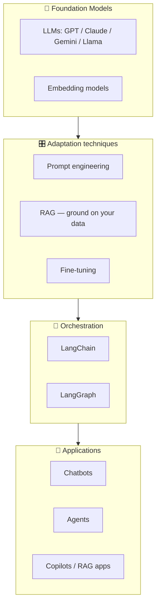

# 00. GenAI Roadmap for Beginners  (Intro)

> 📺 [Watch on YouTube](https://www.youtube.com/playlist?list=PLKnIA16_RmvaTbihpo4MtzVm4XOQa0ER0) · ⏱️ ~50 min · CampusX — Generative AI using LangChain

---

## 🎯 What You'll Learn
- What Generative AI actually is, and how it differs from traditional (discriminative) ML.
- The two hats you can wear in GenAI — **builder** vs **user** — and why this playlist is about *building*.
- A mental map of the whole GenAI stack: foundation models → adaptation (prompting / RAG / fine-tuning) → orchestration (LangChain / LangGraph) → apps.
- The concrete skills and topics this course covers, in the order you should learn them.
- Where LangChain fits and what to learn *after* it.

---

## 📖 Overview / Why It Matters
Generative AI is the branch of AI concerned with **creating new content** — text, code, images, audio, video — rather than only classifying or predicting from existing data. The wave started with large **foundation models** (LLMs like GPT, Claude, Gemini, Llama) trained on internet-scale data. These models are general-purpose "reasoning engines" you can point at almost any language task.

This first video sets the map for the whole playlist: it separates the *theory* of how these models work from the *engineering* of building applications on top of them, and positions **LangChain** as the orchestration layer that makes app-building practical.



---

## 🧠 Key Concepts

### Discriminative vs Generative
Traditional ML is mostly **discriminative**: given input `X`, predict a label `Y` (spam / not-spam, price, class). **Generative** models learn the underlying distribution well enough to *sample new data* from it — write an essay, generate an image, complete code. LLMs are generative models over text (technically, next-token predictors trained at massive scale that exhibit emergent reasoning).

### Builder vs User
There are two ways to engage with GenAI:
- **User** — you consume GenAI products (ChatGPT, Copilot). Skill needed: good prompting.
- **Builder** — you *build* GenAI products for others. Skills needed: models, prompts, RAG, tools, agents, orchestration frameworks, evaluation, deployment.

This playlist trains the **builder**. LangChain is the primary tool because it abstracts away the plumbing (model APIs, retrieval, memory, tool calling) so you focus on product logic.

### The GenAI application stack
1. **Foundation models** — the raw capability (text + embeddings).
2. **Adaptation** — how you make a general model useful for *your* problem:
   - **Prompt engineering** — steer behavior with instructions/examples (cheapest).
   - **RAG (Retrieval-Augmented Generation)** — inject your private/up-to-date data at query time (best for knowledge tasks; see the [RAG notes](../12_rag/README.md)).
   - **Fine-tuning** — change the model's weights on your data (most expensive; for style/format/domain shifts).
3. **Orchestration** — frameworks (**LangChain**, **LangGraph**) that wire models + data + tools + memory into a working app.
4. **Applications** — chatbots, RAG assistants, and autonomous **agents**.

### What to learn, in order
This course's spine: **Models → Prompts → Structured Output → Output Parsers → Chains → Runnables → RAG (loaders, splitters, vector stores, retrievers) → Tools → Tool Calling → Agents**, then graduate to **LangGraph** for stateful, controllable agents.

---

## 💻 Code Examples
No code in this intro video — it is conceptual. The very first line of code appears in [Models](04_langchain-models.md). A taste of where you're headed:

```python
from langchain_openai import ChatOpenAI
from langchain_core.prompts import ChatPromptTemplate
from langchain_core.output_parsers import StrOutputParser

model = ChatOpenAI(model="gpt-4o-mini", temperature=0)
prompt = ChatPromptTemplate.from_template("Explain {topic} to a 5-year-old.")
chain = prompt | model | StrOutputParser()      # ← LangChain "chain"

print(chain.invoke({"topic": "generative AI"}))
```

---

## 📊 Adaptation techniques — when to use which

| Technique | Changes weights? | Cost | Best for | Covered in |
|---|---|---|---|---|
| Prompt engineering | No | 💲 | Steering tone/format, quick wins | [Prompts](05_prompts.md) |
| RAG | No | 💲💲 | Grounding on private / fresh knowledge | [RAG notes](../12_rag/README.md) |
| Fine-tuning | Yes | 💲💲💲 | Domain style, strict formats, latency | (out of scope here) |
| Agents + Tools | No | 💲💲 | Taking actions, multi-step tasks | [Tools](17_tools.md) → [Agents](19_end-to-end-agent.md) |

---

## ⚠️ Gotchas & Tips
- **Don't jump straight to fine-tuning.** 90% of app problems are solved with better prompting + RAG. Fine-tune only when those genuinely fall short.
- **Learn the components before the shortcuts.** Understanding models/prompts/chains makes debugging LangChain trivial; skipping them makes it feel like magic that breaks.
- **Model choice is a dial, not a religion** — the LangChain interface lets you swap providers, so start cheap (e.g. a mini model) and upgrade only where quality demands it.
- GenAI moves fast: internalize the *concepts* (this map) — specific model names and package versions will change.

---

## 🧠 Key Takeaways
- Generative AI = models that **create** content; LLMs are the text-generating foundation models powering this era.
- There are two roles — **user** and **builder**; this playlist makes you a **builder**.
- The stack is **foundation models → adaptation (prompt/RAG/fine-tune) → orchestration (LangChain/LangGraph) → apps**.
- **Prompting and RAG** solve most problems before you ever need fine-tuning.
- LangChain is the orchestration layer; the recommended learning order is models → prompts → outputs → chains → runnables → RAG → tools → agents.
- After LangChain, level up to **LangGraph** for production-grade, stateful agents.

---

## ❓ Revision Questions
1. What distinguishes a generative model from a discriminative one?
2. Define the "builder vs user" split. Which does this course target, and why does that make LangChain central?
3. Name the four layers of the GenAI application stack and give one example of each.
4. Compare prompt engineering, RAG, and fine-tuning on cost and on *what* they change. When would you reach for each?
5. What is the recommended topic order for learning LangChain, and what comes after it?
6. Why is fine-tuning usually the *last* tool you should reach for?
