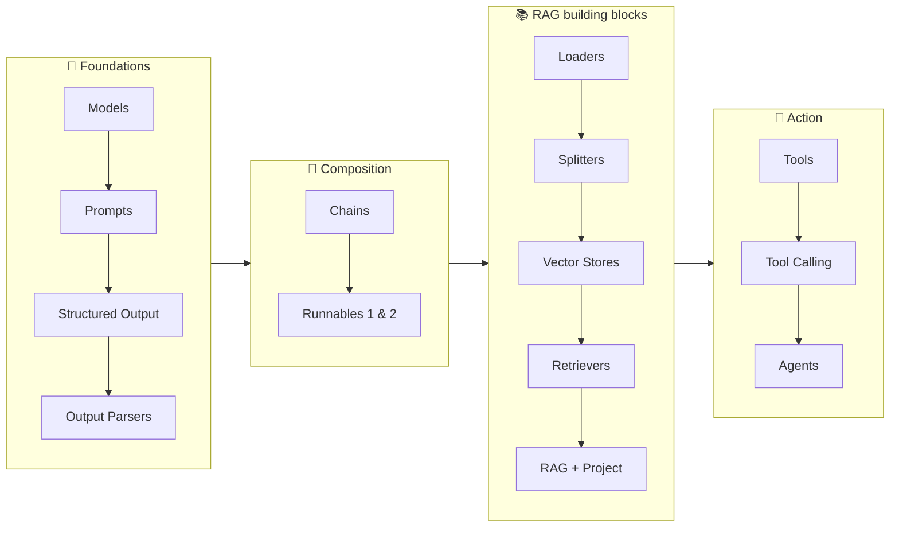

# 01. Generative AI using LangChain — Playlist Overview  (Intro)

> 📺 [Watch on YouTube](https://www.youtube.com/playlist?list=PLKnIA16_RmvaTbihpo4MtzVm4XOQa0ER0) · ⏱️ ~15 min · CampusX — Generative AI using LangChain

---

## 🎯 What You'll Learn
- The goal and target audience of this playlist.
- The full syllabus and the order topics are taught in.
- The prerequisites you should have before starting.
- The philosophy: learn the **components** deeply, then compose them.

---

## 📖 Overview / Why It Matters
This short video is the "table of contents" for the course. The playlist teaches you to **build GenAI applications with LangChain**, bottom-up: start with the smallest building blocks (models, prompts), learn how to compose them (chains, runnables), connect them to your own data (RAG), and finally give them the ability to act (tools, agents). By the end you can build chatbots, RAG assistants, and autonomous agents.

The teaching philosophy is deliberate: **master each component in isolation first**, because once you understand models, prompts, output parsing, and runnables, every higher-level abstraction (chains, agents, even LangGraph) becomes obvious rather than magical.

---

## 🧠 Key Concepts

### Who this is for
Developers/ML practitioners who can write Python and want to build production LLM apps. You don't need prior LLM experience, but comfort with Python (functions, classes, type hints, virtual environments) is assumed.

### Prerequisites
- **Python** fundamentals (incl. `pip`/venv, environment variables, basic OOP & type hints).
- Willingness to get **API keys** (OpenAI/Anthropic/Google) — or run models locally via [Ollama](20_ollama-masterclass.md) / HuggingFace.
- Optional but helpful: a rough sense of what embeddings/vectors are (the [RAG notes](../12_rag/README.md) cover this from scratch).

### The syllabus (this repo's note map)
The playlist is organized in four arcs:



### Learning philosophy — components first
LangChain can look like a huge, intimidating framework. The course tames it by teaching the **six core components** (Models, Prompts, Chains, Indexes, Memory, Agents — see [Components](03_langchain-components.md)) one at a time with runnable code, then showing how they snap together. Depth on the primitives beats breadth on the abstractions.

---

## 💻 Code Examples
Conceptual video — no code. Environment setup you'll reuse throughout:

```bash
python -m venv .venv && source .venv/bin/activate
pip install langchain langchain-core langchain-openai langchain-community \
            langchain-text-splitters python-dotenv
```

```python
# .env  →  loaded once at the top of every script
# OPENAI_API_KEY=sk-...
from dotenv import load_dotenv
load_dotenv()
```

---

## 📊 Course Roadmap at a Glance

| Arc | Topics | Notes |
|---|---|---|
| 🧱 Foundations | Models, Prompts, Structured Output, Output Parsers | [04](04_langchain-models.md) · [05](05_prompts.md) · [06](06_structured-output.md) · [07](07_output-parsers.md) |
| 🔗 Composition | Chains, Runnables (Part 1 & 2) | [08](08_chains.md) · [09](09_runnables-part1.md) · [10](10_runnables-part2.md) |
| 📚 RAG | Loaders, Splitters, Vector Stores, Retrievers, RAG, Project | [11](11_document-loaders.md)–[16](16_youtube-chatbot-rag.md) |
| 🤖 Action | Tools, Tool Calling, Agents | [17](17_tools.md) · [18](18_tool-calling.md) · [19](19_end-to-end-agent.md) |
| ⭐ Bonus | Ollama (local LLMs) | [20](20_ollama-masterclass.md) |

---

## ⚠️ Gotchas & Tips
- **Follow the order.** Later topics assume earlier ones (agents assume tool calling, which assumes models + messages).
- Set up your `.env` + venv once at the start so every example just runs.
- The videos are in Hindi/Hinglish; these notes are the English distillation for revision.
- Keep the [Components](03_langchain-components.md) map handy — it's the skeleton everything hangs off.

---

## 🧠 Key Takeaways
- The playlist teaches **building** GenAI apps with LangChain, bottom-up, in four arcs: Foundations → Composition → RAG → Action.
- Prerequisites are Python + (API keys or a local model runtime).
- Philosophy: **learn each component deeply, then compose** — abstractions become easy once primitives are solid.
- This repo mirrors the syllabus as numbered notes 00–20; the [README](../../README.md) is the index.

---

## ❓ Revision Questions
1. What are the four arcs of the course, in order?
2. What are the prerequisites, and what are your options if you don't want to pay for a cloud API?
3. Why does the course insist on learning components before higher-level abstractions?
4. Which note would you open first if you'd never seen an embedding before?
5. What environment setup do you do once, up front, that every example relies on?
