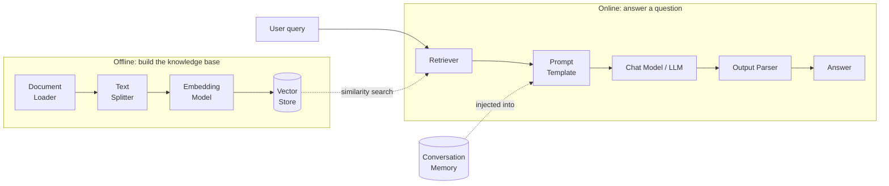

# 02. Introduction to LangChain  (Video 1)

> 📺 [Watch on YouTube](https://www.youtube.com/playlist?list=PLKnIA16_RmvaTbihpo4MtzVm4XOQa0ER0) · ⏱️ ~37:44 · CampusX — Generative AI using LangChain

---

## 🎯 What You'll Learn

- What **LangChain** actually is: an open-source **orchestration framework** for building LLM-powered applications (chatbots, RAG systems, agents, summarizers, Q&A).
- The concrete **motivating problem** — why a seemingly simple app like "chat with your PDF" secretly requires stitching together a dozen moving parts, and why doing that by hand is painful.
- The five core **benefits** LangChain gives you: composable **chains** (LCEL), **model-agnostic** interfaces, a huge **integration ecosystem**, built-in **memory/state**, and an **open-source** community.
- The kinds of applications you can build: conversational chatbots, **RAG** ("chat with docs"), autonomous **agents**, auto-summarization, and structured extraction.
- The **split-package architecture** of the LangChain ecosystem (`langchain-core`, `langchain`, `langchain-community`, partner packages) and the sibling projects **LangGraph** and **LangSmith** — plus *why* the monolithic package was broken apart.
- Where LangChain sits versus alternatives like **LlamaIndex** and **Haystack**.
- The **roadmap** for the rest of the course: models → prompts → structured output → output parsers → chains → runnables → RAG → tools → agents.

---

## 📖 Overview / Why It Matters

**LangChain is an open-source framework that acts as the orchestration layer for LLM applications.** On its own, a Large Language Model is just a text-in/text-out function behind an API. Real applications need much more than a single API call: they need to fetch and preprocess data, remember conversation history, decide when to call external tools, retry on failure, swap models, and glue all of that into a coherent flow. LangChain is the "plumbing" that wires these pieces together into a reproducible **pipeline** — which in LangChain's vocabulary is called a **chain**.

The cleanest way to understand *why* LangChain exists is to try to build a real product without it.

### The motivating story: "Chat with your book / PDF"

Imagine you want to build a semantic-search-and-chat system over a large PDF — say a 500-page textbook — so a user can ask *"summarize chapter 7"* or *"where does the author discuss backpropagation?"* and get grounded answers. Under the hood you need **all** of the following, in sequence:

1. **Document loading** — read the PDF (or website, Notion page, database row) into a normalized `Document` object with text + metadata.
2. **Text splitting** — break that huge document into smaller **chunks** that fit an LLM/embedding-model context window and embed well. (See the detailed [text-splitters notes](../12_rag/03_text-splitters.md).)
3. **Embeddings** — convert each chunk into a numeric vector that captures its meaning.
4. **Vector database** — store those vectors so they can be searched by similarity (FAISS, Chroma, Pinecone, etc.).
5. **Similarity search / retrieval** — embed the user's question and pull back the top-k most relevant chunks.
6. **Prompt construction** — assemble a prompt that stuffs the retrieved chunks + the user's question into a template ("Answer using only the context below…").
7. **LLM call** — send that prompt to a model and get an answer.
8. **Conversation memory** — remember previous turns so follow-up questions ("and what about the next chapter?") make sense.

Every one of those steps has its own libraries, data formats, and edge cases. Wiring them together by hand — and then keeping them working when you switch the PDF loader, the vector DB, or the model provider — is tedious, brittle, and repetitive. **LangChain is the glue that standardizes each step behind a common interface and lets you compose them into one pipeline.** That's the whole pitch: it turns a pile of incompatible SDKs into a small number of interchangeable, composable building blocks.



This is the canonical LangChain application shape. Note the two phases: an **offline ingestion** pass (load → split → embed → store) that you run once, and an **online query** pass (retrieve → prompt → model → parse) that runs per request. LangChain provides a dedicated abstraction for *every box in this diagram*.

---

## 🧠 Key Concepts

### 1. LangChain is an orchestration layer, not a model

A common misconception is that LangChain is itself an AI model. It is not. LangChain **does not train, host, or serve any LLM.** It is a coordination framework that sits *above* model providers (OpenAI, Anthropic, Google, HuggingFace, local models via Ollama, etc.) and *above* infrastructure (vector databases, document sources, external APIs). Its value is entirely in **abstraction and composition** — giving every category of component a uniform interface so you can plug pieces together and swap them out.

### 2. Chains and LCEL — the "composition" idea

The framework's namesake concept is the **chain**: a sequence of steps where the output of one step is the input to the next, executed as a single unit. Modern LangChain expresses chains with **LCEL (LangChain Expression Language)** using the pipe operator `|`, so a pipeline reads left-to-right like a Unix pipe:

```python
chain = prompt | model | output_parser
```

Because each component implements a common **Runnable** interface (with `.invoke()`, `.batch()`, `.stream()`, and async variants), *any* Runnable can be piped into *any* other. You get streaming, batching, and async **for free** across the whole chain, and you can build arbitrarily complex flows (parallel branches, conditional routing) from the same primitives. Chains and runnables are covered in depth later in the course.

### 3. Model-agnostic (provider-agnostic) interfaces

LangChain defines abstract base classes — most importantly `BaseChatModel` and `Embeddings` — and every provider ships a concrete implementation. Because your application code depends on the *interface*, switching providers is close to a one-line change:

```python
# from langchain_openai import ChatOpenAI
# model = ChatOpenAI(model="gpt-4o-mini")

from langchain_anthropic import ChatAnthropic
model = ChatAnthropic(model="claude-3-5-sonnet-latest")
```

The rest of your chain (`prompt | model | parser`) doesn't change at all. This decoupling is a huge deal in practice: model quality, price, and availability shift constantly, and you don't want your business logic welded to a single vendor's SDK.

### 4. A huge ecosystem of ready-made integrations

Almost anything you'd want to connect to already has a LangChain integration: document loaders (PDF, CSV, Notion, Slack, Google Drive, web pages), 60+ vector stores (FAISS, Chroma, Pinecone, Weaviate, pgvector), embedding providers, chat models, and hundreds of **tools** (search, calculators, code execution, SQL). This is the single biggest time-saver: you rarely have to write the integration glue yourself, and swapping one integration for another (e.g. Chroma → Pinecone) is usually a constructor change, not a rewrite.

### 5. Built-in memory and state handling

Raw LLM APIs are **stateless** — each call is independent and the model has no memory of prior turns. Conversational apps need the *illusion* of memory, which means replaying/condensing prior turns into every request. LangChain provides memory abstractions (and, more recently, message-history wrappers and LangGraph checkpointers) that capture, trim, or summarize conversation state and inject it back into the prompt, so you don't have to hand-manage the growing message list yourself.

### 6. Open source and community-driven

LangChain is MIT-licensed and one of the most active projects in the GenAI space. Practically, that means: fast-moving support for new models the day they launch, a large body of examples and Stack Overflow answers, and community-contributed integrations. The flip side (see Gotchas) is that the API surface has evolved quickly, so you must be careful to follow **current** idioms.

### 7. The split-package architecture

Early LangChain was **one monolithic package**. As it exploded in popularity, that became a problem: every third-party integration (dozens of vector DBs, hundreds of loaders) lived in the same package, so a bug or breaking change in one obscure integration could break unrelated apps, dependency conflicts multiplied, and the install got heavy. The team responded by **splitting the project into focused packages**:

- **`langchain-core`** — the lightweight foundation: the base abstractions and interfaces (Runnable, `BaseChatModel`, `BaseMessage`, prompt templates, output parsers). Almost no heavy dependencies. Everything else builds on it.
- **`langchain`** — the "batteries" that combine those primitives into higher-level constructs: chains, agents, retrieval strategies, and general-purpose logic that isn't tied to a specific vendor.
- **`langchain-community`** — the long tail of **third-party integrations** contributed by the community (many loaders, vector stores, tools). Kept separate so its churn doesn't destabilize the core.
- **Partner packages** — first-class, independently versioned integrations maintained alongside a specific provider, e.g. `langchain-openai`, `langchain-anthropic`, `langchain-google-genai`, `langchain-huggingface`. These are separate installs so you only pull in the SDKs you actually use, and each can be released on the provider's cadence.

The payoff of this split: a **small, stable core**; independent versioning (a provider can ship a fix without a full LangChain release); lighter installs (you don't drag in every vendor SDK); and clearer ownership. The cost is that you now assemble your dependency list from several packages and must keep them roughly version-compatible.

### 8. Sibling projects: LangGraph and LangSmith

LangChain has grown into an ecosystem with two important sibling libraries:

- **LangGraph** — a library for building **stateful, multi-step agent workflows as graphs**. Where a plain chain is a straight line, LangGraph lets you model nodes and edges with **loops, branches, human-in-the-loop pauses, and persistent state (checkpointing)**. It's the recommended way to build reliable, controllable agents and cyclic RAG flows. (See the [RAG-with-LangGraph notes](../12_rag/07_rag-with-langgraph.md).)
- **LangSmith** — a **observability, tracing, evaluation, and monitoring** platform. It records every step of a chain/agent run (inputs, outputs, latency, token cost, errors) so you can debug non-deterministic LLM behavior, build evaluation datasets, and monitor production quality. It's a hosted service (with a generous free tier), not an open-source library like the others.

### 9. Where LangChain sits — alternatives

LangChain is not the only orchestration framework. Two notable alternatives:

- **LlamaIndex** — originally focused specifically on **data indexing and retrieval (RAG)**; extremely strong for "chat with your data" ingestion pipelines, and now has agent features too.
- **Haystack** — a production-oriented, pipeline-based NLP/LLM framework (from deepset), popular for search and RAG systems with a strong emphasis on deployable pipelines.

Rule of thumb: **LangChain** is the broadest, most integration-rich general-purpose orchestrator; **LlamaIndex** leans RAG-first; **Haystack** leans production-search/pipeline-first. They overlap heavily and are all reasonable choices.

### 10. The course roadmap

The rest of this playlist builds up the LangChain toolbox in dependency order:

**models → prompts → structured output → output parsers → chains → runnables → RAG building blocks → tools → agents.**

You start with the atoms (talking to a model, templating prompts), learn to get *structured* data back out (parsers), then learn to *compose* atoms (chains/runnables), then assemble them into the big applications (RAG, then tool-using agents).

---

## 💻 Code Examples

Every snippet below uses the modern **split-package** imports. Install what you need:

```bash
pip install langchain langchain-core langchain-openai
# add integrations as needed, e.g.:
# pip install langchain-community langchain-anthropic langchain-google-genai
```

Set your provider key (never hard-code it):

```bash
export OPENAI_API_KEY="sk-..."
```

### 1. "Hello world" — a single ChatOpenAI call

```python
from langchain_openai import ChatOpenAI

# The model object reads OPENAI_API_KEY from the environment automatically.
model = ChatOpenAI(model="gpt-4o-mini", temperature=0)

response = model.invoke("Explain what LangChain is in one sentence.")
print(response.content)   # -> a string; `response` is an AIMessage object
```

`model.invoke(...)` returns an `AIMessage`, not a bare string — `.content` holds the text, and the object also carries metadata like token usage. This `invoke` method is the same across *every* chat model, which is exactly what makes providers swappable.

### 2. Swapping the provider — same code, different model

```python
# OpenAI
from langchain_openai import ChatOpenAI
model = ChatOpenAI(model="gpt-4o-mini")

# Anthropic — one import change, everything downstream is identical
from langchain_anthropic import ChatAnthropic
model = ChatAnthropic(model="claude-3-5-sonnet-latest")

# Google Gemini
from langchain_google_genai import ChatGoogleGenerativeAI
model = ChatGoogleGenerativeAI(model="gemini-1.5-flash")

print(model.invoke("Say hi in five words.").content)
```

### 3. A minimal chain with LCEL — `prompt | model | parser`

This is the composition idea in its smallest useful form: a prompt template, a model, and an output parser piped together into one runnable.

```python
from langchain_core.prompts import ChatPromptTemplate
from langchain_core.output_parsers import StrOutputParser
from langchain_openai import ChatOpenAI

prompt = ChatPromptTemplate.from_template(
    "You are a helpful tutor. Explain {topic} to a {level} in 3 bullet points."
)
model = ChatOpenAI(model="gpt-4o-mini", temperature=0)
parser = StrOutputParser()          # pulls the plain string out of the AIMessage

chain = prompt | model | parser     # <-- LCEL: a single composed Runnable

print(chain.invoke({"topic": "vector embeddings", "level": "beginner"}))
```

Because `chain` is itself a Runnable, you also get `chain.batch([...])` and `chain.stream({...})` with no extra work.

### 4. Sketch of the RAG pipeline LangChain assembles for you

This is not meant to be run as-is (it omits data), but it shows how every box in the earlier diagram maps to a LangChain component — and how little glue *you* write:

```python
from langchain_community.document_loaders import PyPDFLoader
from langchain_text_splitters import RecursiveCharacterTextSplitter
from langchain_openai import OpenAIEmbeddings, ChatOpenAI
from langchain_community.vectorstores import FAISS
from langchain_core.prompts import ChatPromptTemplate
from langchain_core.output_parsers import StrOutputParser
from langchain_core.runnables import RunnablePassthrough

# --- Offline: build the knowledge base ---
docs   = PyPDFLoader("book.pdf").load()                       # 1. load
chunks = RecursiveCharacterTextSplitter(chunk_size=1000,
                                        chunk_overlap=150).split_documents(docs)  # 2. split
store  = FAISS.from_documents(chunks, OpenAIEmbeddings())      # 3+4. embed + store
retriever = store.as_retriever(search_kwargs={"k": 4})        # 5. retriever

# --- Online: answer a question ---
prompt = ChatPromptTemplate.from_template(
    "Answer using ONLY this context:\n\n{context}\n\nQuestion: {question}"
)
model  = ChatOpenAI(model="gpt-4o-mini", temperature=0)

rag_chain = (
    {"context": retriever, "question": RunnablePassthrough()}  # 6. build inputs
    | prompt                                                   # construct prompt
    | model                                                    # 7. LLM call
    | StrOutputParser()
)

print(rag_chain.invoke("What does chapter 7 cover?"))
```

Every numbered comment corresponds to one of the eight steps from the motivating story — and LangChain provides a first-class abstraction for each. The full version of this is built step-by-step in the RAG notes ([what-is-RAG](../12_rag/01_what-is-rag.md), [document loaders](../12_rag/02_document-loaders.md), [vector stores](../12_rag/04_vector-stores.md), [retrievers](../12_rag/05_retrievers.md)).

---

## 📊 Comparison / Reference Table

**LangChain ecosystem packages & projects**

| Package / project | Install | What lives here | Depends on |
|---|---|---|---|
| **`langchain-core`** | `pip install langchain-core` | Base abstractions & interfaces: Runnable, `BaseChatModel`, `BaseMessage`, prompt templates, output parsers. Small, stable, few deps. | (foundation) |
| **`langchain`** | `pip install langchain` | Higher-level, vendor-neutral logic: chains, agents, retrieval strategies. | `langchain-core` |
| **`langchain-community`** | `pip install langchain-community` | Long tail of third-party integrations: many loaders, vector stores, tools. | `langchain-core` |
| **`langchain-openai`** | `pip install langchain-openai` | OpenAI partner package: `ChatOpenAI`, `OpenAIEmbeddings`. | `langchain-core` |
| **`langchain-anthropic`** | `pip install langchain-anthropic` | Anthropic partner package: `ChatAnthropic`. | `langchain-core` |
| **`langchain-google-genai`** | `pip install langchain-google-genai` | Google Gemini partner package: `ChatGoogleGenerativeAI`. | `langchain-core` |
| **`langchain-huggingface`** | `pip install langchain-huggingface` | HuggingFace models & embeddings (hosted or local). | `langchain-core` |
| **`langgraph`** | `pip install langgraph` | Stateful agent/workflow **graphs**: loops, branches, checkpointed state, human-in-the-loop. | `langchain-core` |
| **LangSmith** | (hosted service + `langsmith` SDK) | Tracing, observability, evaluation, monitoring of runs. Not an orchestration lib. | — |

**LangChain vs. alternatives (one-liners)**

| Framework | Sweet spot |
|---|---|
| **LangChain** | Broadest general-purpose orchestrator; richest integration ecosystem; chains + agents + RAG. |
| **LlamaIndex** | RAG-first — data ingestion, indexing, and retrieval over your own data. |
| **Haystack** | Production-grade, pipeline-oriented search/RAG (from deepset). |

---

## ⚠️ Gotchas & Tips

- **LangChain is not an LLM.** It calls models; it doesn't provide one. You still need a provider API key (or a local model server like Ollama) for anything to work.
- **Mind the split packages.** Import from the *right* package: base classes from `langchain_core`, model classes from the partner package (`langchain_openai`, etc.), integrations from `langchain_community`. Old tutorials importing everything from a single top-level `langchain` module are outdated.
- **The API moved fast — prefer modern idioms.** Legacy `LLMChain`, `initialize_agent`, and the old `langchain.text_splitter`/`langchain.embeddings` import paths still appear in blog posts but are deprecated. Use **LCEL (`prompt | model | parser`)**, the split-package imports, and **LangGraph** for agents.
- **`invoke()` returns a message object, not a string.** For chat models you get an `AIMessage`; use `.content` for the text, or add a `StrOutputParser()` to the end of your chain to get a plain string.
- **Keep versions in sync.** Because packages version independently, a stale `langchain-core` against a newer `langchain-openai` can cause subtle import/interface errors. Upgrade them together.
- **Never hard-code API keys.** Load them from environment variables (or a `.env` via `python-dotenv`). Keys in source code are a security and cost risk.
- **LangSmith is worth turning on early.** LLM apps are non-deterministic and multi-step; setting `LANGCHAIN_TRACING_V2=true` gives you a trace of every step, which makes debugging chains and agents dramatically easier.
- **Don't reach for an agent when a chain will do.** Agents (LLM-decided control flow) are powerful but slower, costlier, and less predictable. If your flow is fixed, a plain chain is cheaper and more reliable.
- **Cost & latency scale with steps.** Every retrieval, tool call, and model call in a chain adds latency and tokens. Watch `k` (retrieved chunks) and prompt size — the RAG prompt is often the biggest token cost.

---

## 🧠 Key Takeaways

- **LangChain is an open-source orchestration framework for LLM apps** — it standardizes and composes the components around a model (loaders, splitters, embeddings, vector stores, retrievers, prompts, memory, tools), it is *not* a model itself.
- Real LLM apps like **"chat with a PDF" need ~8 stitched-together steps** (load → split → embed → store → retrieve → prompt → call → remember); LangChain is the glue that turns those into one composable **chain**.
- The core value props: **composable chains via LCEL**, **model-agnostic** interfaces (swap providers in one line), a **massive integration ecosystem**, **built-in memory/state**, and an active **open-source** community.
- Everything shares one **Runnable** interface, so `prompt | model | parser` pipelines get `.invoke()` / `.batch()` / `.stream()` and async for free, and any component can be swapped.
- The ecosystem is **split into focused packages** — `langchain-core` (abstractions), `langchain` (chains/agents), `langchain-community` (third-party integrations), and per-provider **partner packages** — to keep the core small and stable and installs light.
- **LangGraph** adds stateful, looping, checkpointed agent **graphs**; **LangSmith** adds tracing/observability/eval. Both are siblings of LangChain, not replacements.
- You can build **chatbots, RAG systems, autonomous agents, summarizers, and structured-extraction pipelines** on top of it.
- Alternatives exist — **LlamaIndex** (RAG-first) and **Haystack** (production pipelines) — but LangChain is the broadest, most integration-rich choice.
- Course path: **models → prompts → structured output → output parsers → chains → runnables → RAG → tools → agents.**

---

## ❓ Revision Questions

1. In one sentence, what is LangChain — and what is it explicitly *not*?
2. Walk through the ~8 components required to build a "chat with your PDF" system. Which of them does LangChain provide an abstraction for?
3. What is a **chain**, and what does **LCEL** let you write? Show the canonical `prompt | model | parser` form and explain why the pipe works.
4. What does "model-agnostic" mean in LangChain, and which base interface makes swapping OpenAI for Anthropic a near one-line change?
5. Name the five headline benefits of using LangChain over calling a raw model API yourself.
6. Why was the original monolithic `langchain` package split apart? Describe the responsibility of `langchain-core`, `langchain`, `langchain-community`, and the partner packages.
7. What problem does **built-in memory** solve, given that LLM API calls are stateless?
8. What is **LangGraph** for, and how does it differ from a plain LCEL chain? What is **LangSmith** for?
9. Give a one-line positioning of LangChain versus **LlamaIndex** and **Haystack**.
10. What does `ChatOpenAI(...).invoke("hi")` return, and how do you get a plain string out of a chain?
11. List the course roadmap topics in order, and explain why models and prompts come before chains and agents.
