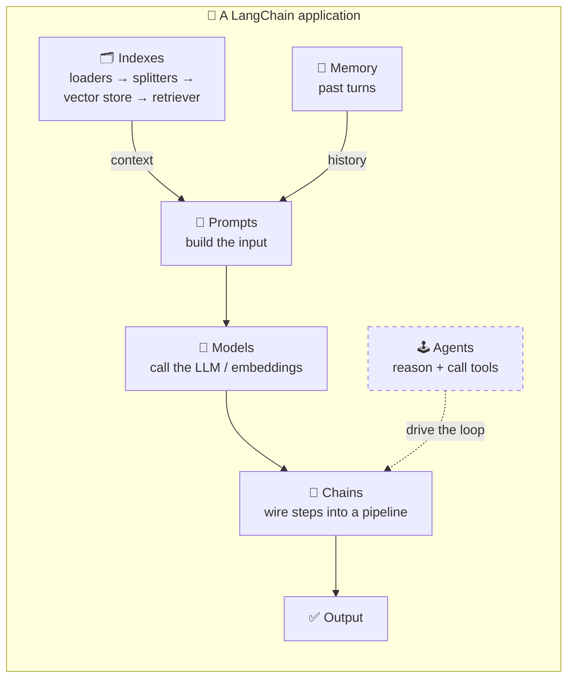

# 03. LangChain Components  (Video 2)

> 📺 [Watch on YouTube](https://www.youtube.com/playlist?list=PLKnIA16_RmvaTbihpo4MtzVm4XOQa0ER0) · ⏱️ ~53 min · CampusX — Generative AI using LangChain

---

## 🎯 What You'll Learn

- The **six core component families** that make up LangChain, and how each one solves a distinct problem: **Models, Prompts, Chains, Indexes, Memory, Agents**.
- Why LangChain exists as an **abstraction layer**: it standardises the interface to dozens of providers so your application code stays the same when you swap GPT-4 for Claude or Gemini.
- The difference between **LLMs and Chat Models**, and where **Embedding Models** fit in.
- Why **prompt templating** beats naive Python f-strings, and what `PromptTemplate`, `ChatPromptTemplate`, few-shot prompts, and `MessagesPlaceholder` are for.
- How **Chains** (the concept the framework is literally named after) connect components into pipelines using the **LCEL pipe operator**, and what sequential / parallel / conditional composition means.
- What the **Indexes** layer (loaders → splitters → vector stores → retrievers) does — the plumbing that connects an LLM to your private data (RAG).
- Why LLM API calls are **stateless**, and how **Memory** restores conversational context.
- What makes an **Agent** more than a chatbot: reasoning + tool use in a loop (ReAct).

---

## 📖 Overview / Why It Matters

Before touching a single line of LangChain code, it pays to build a **mental map** of the whole framework. Almost everything you will ever do in LangChain is some combination of six component families. Learn the map once and the rest of the playlist becomes "just details" hanging off these six pegs.

Why does LangChain even exist? A modern GenAI application is never *just* an LLM call. A realistic app has to: pick a model (and maybe switch it later), format a dynamic prompt, chain several steps together, pull in private/external knowledge, remember the conversation so far, and sometimes act on the world (search the web, hit an API, run code). Writing all of that by hand against each provider's raw SDK is repetitive and brittle. **LangChain is the orchestration layer that gives every one of these concerns a clean, provider-agnostic abstraction.**

The single most important idea in this video is **standardisation**. LangChain defines *interfaces*; providers supply *implementations*. Because your code talks to the interface (`invoke()`), swapping OpenAI for Anthropic for Google is a one-line import change — your prompts, chains, memory, and agents keep working untouched.



Read that diagram as: **Prompts** assemble an input (often enriched with retrieved context from **Indexes** and past turns from **Memory**), **Models** turn that input into output, **Chains** glue the steps together, and **Agents** sit on top when the app needs to decide *which* steps to run.

---

## 🧠 Key Concepts

### 1. Models — the interface to LLMs & embedding models

A **Model** is LangChain's standardised gateway to an AI model. Historically, building an AI app was hard for two reasons: models were huge (you couldn't host them yourself), and every provider exposed a *different* API. Providers solved hosting by offering inference over REST APIs, but the second problem remained — OpenAI's request/response shape differs from Anthropic's, which differs from Google's. **LangChain's Models component normalises all of them behind one interface**, so your code calls `.invoke(...)` regardless of who is behind it.

There are two sub-kinds:

**a) Language Models** — text in, text out. LangChain splits these into two classes:

- **LLMs** (`from langchain_openai import OpenAI`) — the older, "text completion" style. Input is a plain string, output is a plain string. General-purpose, not tuned for multi-turn chat. Largely legacy today.
- **Chat Models** (`from langchain_openai import ChatOpenAI`) — the modern default. Input is a **list of messages** with roles (`SystemMessage`, `HumanMessage`, `AIMessage`); output is an `AIMessage`. Tuned for conversation, tool-calling, and structured output. **Use Chat Models for essentially everything now** — the rest of the playlist does.

**b) Embedding Models** — text in, **vector** out. Instead of generating language, they compress the *meaning* of text into a fixed-length list of floats. These vectors power semantic search and are the backbone of the Indexes/RAG layer (comparing query and document vectors by cosine similarity).

The payoff of standardisation: switching providers is a one-line change and nothing downstream cares.

```python
# Provider A
from langchain_openai import ChatOpenAI
model = ChatOpenAI(model="gpt-4o-mini")

# Provider B — same interface, everything else unchanged
from langchain_anthropic import ChatAnthropic
model = ChatAnthropic(model="claude-3-5-sonnet-latest")
```

> Deep dive: [`04_langchain-models.md`](04_langchain-models.md) covers LLMs, Chat Models, embeddings, and open-source models (HuggingFace) in detail.

### 2. Prompts — dynamic, reusable inputs to models

A **prompt** is the input you send to a model, and the output is extremely sensitive to how it's phrased — this is the entire discipline of *prompt engineering*. LangChain treats prompts as **first-class, reusable, parameterised objects** rather than hand-built strings.

The core classes:

- **`PromptTemplate`** — a single-string template with `{placeholders}` that you fill at call time. Produces a string, ideal for LLMs.
- **`ChatPromptTemplate`** — a list of role-tagged message templates (system / human / ai), the right shape for Chat Models.
- **Few-shot prompts** (`FewShotPromptTemplate`, `FewShotChatMessagePromptTemplate`) — bake a handful of input→output *examples* into the prompt so the model learns the pattern by demonstration.
- **`MessagesPlaceholder`** — a slot inside a `ChatPromptTemplate` where you inject a *variable-length list of prior messages* at runtime. This is how conversation history gets threaded back into the prompt.

**Why templating beats f-strings.** An f-string builds the string *the moment Python evaluates it* — the template and its values are welded together immediately. LangChain templates keep the template and the variables **separate until `.invoke()`**, which buys you real advantages:

1. **Reusability & separation of concerns** — define the prompt once, fill it with different values across your app; prompt text lives apart from business logic.
2. **Validation** — declare the expected `input_variables`; LangChain errors early if one is missing, instead of silently producing a malformed prompt.
3. **Composability** — templates plug directly into chains and can be serialized (saved to / loaded from files), versioned, and shared.
4. **Ecosystem integration** — templates carry the metadata that few-shot helpers, `MessagesPlaceholder`, output parsers, and the LangChain Hub rely on.

> Deep dive: [`05_prompts.md`](05_prompts.md).

### 3. Chains — connecting components into pipelines

This is the component the **framework is named after**. A real app is rarely one call; it's a *pipeline*: format a prompt → call a model → parse the output → feed it to the next prompt, and so on. Chains let you **connect components so the output of one stage automatically becomes the input of the next**, with no manual glue code passing values around.

Modern LangChain expresses chains with **LCEL (LangChain Expression Language)** and its **pipe operator `|`**, which reads left-to-right like a Unix pipe:

```python
chain = prompt | model | parser
```

Any object implementing the **Runnable** interface can sit in a pipe, so prompts, models, parsers, retrievers, and even other chains all compose uniformly. Beyond simple left-to-right flow, chains support:

- **Sequential** — step after step (the pipe above). Output of stage *N* feeds stage *N+1* automatically.
- **Parallel** — run several branches on the same input at once (`RunnableParallel`), e.g. generate a summary *and* a set of keywords from one document simultaneously, then merge.
- **Conditional / branching** — route to different sub-chains based on the input (`RunnableBranch`), e.g. send billing questions down one path and technical questions down another.

The big win is that you *describe* the dataflow declaratively and LangChain handles execution, streaming, batching, and async for free.

> Deep dive: [`08_chains.md`](08_chains.md). The Runnable interface that makes LCEL work is its own topic later in the playlist.

### 4. Indexes — connecting an LLM to external / private knowledge

LLMs only know what was in their training data. They have never seen your company wiki, your PDFs, or last week's data. **Indexes are the component family that connects a model to external and private knowledge** — this layer *is* the RAG (Retrieval-Augmented Generation) data pipeline. It has four sub-components that always appear together:

- **Document Loaders** — pull raw content in from a source (text file, PDF, web page, CSV, Notion, a directory…) and normalise it into `Document` objects (`page_content` + `metadata`).
- **Text Splitters** — chop large documents into smaller **chunks** that fit a model's context window and embed well.
- **Vector Stores** — embed each chunk into a vector and store it in a database (Chroma, FAISS, Pinecone…) built for fast **similarity search**.
- **Retrievers** — at query time, embed the user's question and fetch the most relevant chunks from the vector store to stitch into the prompt as *context*.

Put together: **load → split → embed & store → retrieve → augment the prompt → generate a grounded answer.** This is how you build a chatbot that answers questions about *your* documents without hallucinating.

> These four are covered in depth in the RAG notes: [Indexes / RAG overview](../12_rag/README.md) · [Document Loaders](../12_rag/02_document-loaders.md) · [Text Splitters](../12_rag/03_text-splitters.md) · [Vector Stores](../12_rag/04_vector-stores.md) · [Retrievers](../12_rag/05_retrievers.md). Here we only note their *role* in the component map.

### 5. Memory — making stateless calls feel like a conversation

A crucial, easy-to-miss fact: **LLM API calls are stateless.** Each call to the model is completely independent — the model retains nothing between requests. If you ask "Who is the CEO of Tesla?" and then "How old is *he*?", the second call has no idea who "he" is, because the first exchange was never carried over.

**Memory** is the component that fixes this by **persisting conversation context and re-injecting it into each new prompt** (typically via a `MessagesPlaceholder`). Classic memory types from the video:

- **`ConversationBufferMemory`** — stores the *entire* transcript verbatim and replays all of it. Simple and lossless, but token cost grows with every turn and eventually blows past the context window.
- **`ConversationBufferWindowMemory`** — keeps only the last **N** turns (a sliding window). Bounds cost, but forgets anything older than the window.
- **Summarization-based memory** (e.g. `ConversationSummaryMemory`) — uses an LLM to compress older turns into a running summary, keeping long conversations affordable at the cost of some fidelity.

> **Modern note:** these legacy `Conversation*Memory` classes are deprecated. Production apps today manage state with **message-history wrappers** (`RunnableWithMessageHistory`) or, more commonly, **LangGraph's persistent state / checkpointers**, which give you durable, thread-scoped memory. The *concept* — stateless calls need external context — is unchanged; only the mechanism has moved on.

### 6. Agents — LLMs that reason and take actions

An **Agent** is the most advanced component: think of it as a **chatbot + reasoning ability + access to tools**. A plain chatbot can only *talk*; an agent can *act*. Give it **tools** (a web search, a calculator, a weather API, your own functions) and it can decide, on its own, which tool to call, with what arguments, inspect the result, and keep going until the task is done.

At a high level agents run a **ReAct loop** (Reason + Act):

1. **Reason** — the LLM thinks about the goal and decides the next step.
2. **Act** — it calls a tool with chosen arguments.
3. **Observe** — it reads the tool's output.
4. **Repeat** — it loops back to reasoning with that new observation, until it has enough to produce a final answer.

Example: "What's the weather in the city where the next F1 race is?" — a single LLM call can't answer this, but an agent can: reason → search for the next race location → observe "Monaco" → call a weather tool for Monaco → observe → answer. This capacity for **multi-step reasoning + tool use** is what separates agents from every other component.

> Bridge to later videos: tool creation is covered in [`17_tools.md`](17_tools.md), and a full agent build in [`19_end-to-end-agent.md`](19_end-to-end-agent.md).

---

## 💻 Code Examples

### 1. Models — one interface, swappable providers

```python
from langchain_core.messages import SystemMessage, HumanMessage

# A Chat Model (modern default)
from langchain_openai import ChatOpenAI
model = ChatOpenAI(model="gpt-4o-mini", temperature=0)

response = model.invoke([
    SystemMessage(content="You are a terse assistant."),
    HumanMessage(content="Name the six core LangChain components."),
])
print(response.content)          # an AIMessage; .content is the text
```

```python
# An Embedding Model — text -> vector
from langchain_openai import OpenAIEmbeddings

embeddings = OpenAIEmbeddings(model="text-embedding-3-small")
vec = embeddings.embed_query("LangChain standardises model APIs")
print(len(vec))                  # e.g. 1536 floats
```

### 2. Prompts — templates over f-strings

```python
from langchain_core.prompts import ChatPromptTemplate, MessagesPlaceholder

prompt = ChatPromptTemplate.from_messages([
    ("system", "You are an expert in {domain}. Answer concisely."),
    MessagesPlaceholder("history"),          # prior turns injected at runtime
    ("human", "{question}"),
])

# Template + values stay separate until invoke -> validated, reusable
messages = prompt.invoke({
    "domain": "LangChain",
    "history": [],                            # a list of past messages
    "question": "What does the Chains component do?",
})
```

### 3. Chains — LCEL pipe operator

```python
from langchain_core.prompts import ChatPromptTemplate
from langchain_core.output_parsers import StrOutputParser
from langchain_openai import ChatOpenAI

prompt = ChatPromptTemplate.from_template("Explain {topic} in one sentence.")
model = ChatOpenAI(model="gpt-4o-mini")
parser = StrOutputParser()

# output of each stage feeds the next automatically
chain = prompt | model | parser
print(chain.invoke({"topic": "LangChain chains"}))
```

```python
# Parallel composition: two branches on the same input, merged
from langchain_core.runnables import RunnableParallel

summary = ChatPromptTemplate.from_template("Summarise: {text}") | model | parser
keywords = ChatPromptTemplate.from_template("3 keywords for: {text}") | model | parser

both = RunnableParallel(summary=summary, keywords=keywords)
print(both.invoke({"text": "LangChain is an orchestration framework..."}))
```

### 4. Indexes — the shape of a RAG pipeline (role only)

```python
from langchain_community.document_loaders import PyPDFLoader
from langchain_text_splitters import RecursiveCharacterTextSplitter
from langchain_openai import OpenAIEmbeddings
from langchain_community.vectorstores import Chroma

docs = PyPDFLoader("handbook.pdf").load()                       # loader
chunks = RecursiveCharacterTextSplitter(
    chunk_size=1000, chunk_overlap=150).split_documents(docs)   # splitter
store = Chroma.from_documents(chunks, OpenAIEmbeddings())        # vector store
retriever = store.as_retriever(search_kwargs={"k": 4})          # retriever
# retriever.invoke("question") -> top-k relevant chunks to drop into the prompt
```

### 5. Memory — modern message-history state

```python
# Legacy (deprecated) idea, shown for the mental model:
#   from langchain.memory import ConversationBufferMemory
# Modern approach: attach durable history to any runnable.
from langchain_core.runnables.history import RunnableWithMessageHistory
from langchain_community.chat_message_histories import ChatMessageHistory

store = {}
def get_history(session_id: str):
    return store.setdefault(session_id, ChatMessageHistory())

chat = RunnableWithMessageHistory(
    prompt | model,                 # the prompt uses MessagesPlaceholder("history")
    get_history,
    input_messages_key="question",
    history_messages_key="history",
)
chat.invoke({"domain": "cars", "question": "Who founded Tesla?"},
            config={"configurable": {"session_id": "u1"}})
chat.invoke({"domain": "cars", "question": "How old is he?"},   # "he" now resolves
            config={"configurable": {"session_id": "u1"}})
```

### 6. Agents — reason + act with tools

```python
from langchain_core.tools import tool
from langchain.agents import create_react_agent, AgentExecutor
from langchain import hub

@tool
def get_weather(city: str) -> str:
    """Return the current weather for a city."""
    return f"Sunny, 24C in {city}"

react_prompt = hub.pull("hwchase17/react")
agent = create_react_agent(model, [get_weather], react_prompt)
executor = AgentExecutor(agent=agent, tools=[get_weather])
executor.invoke({"input": "What's the weather in Monaco?"})
# The agent reasons -> calls get_weather("Monaco") -> observes -> answers
```

---

## 📊 Comparison / Reference Table

| Component | Purpose (the problem it solves) | Key classes / APIs | Covered in depth |
|---|---|---|---|
| **Models** | One standard interface to any LLM / chat / embedding provider; swappable backends | `ChatOpenAI`, `ChatAnthropic`, `OpenAI`, `OpenAIEmbeddings`, `HuggingFaceEmbeddings` | [`04_langchain-models.md`](04_langchain-models.md) |
| **Prompts** | Dynamic, reusable, validated inputs to models — beats raw f-strings | `PromptTemplate`, `ChatPromptTemplate`, `FewShotPromptTemplate`, `MessagesPlaceholder` | [`05_prompts.md`](05_prompts.md) |
| **Chains** | Connect components into sequential / parallel / conditional pipelines | LCEL `\|`, `Runnable`, `RunnableParallel`, `RunnableBranch` | [`08_chains.md`](08_chains.md) |
| **Indexes** | Connect the LLM to external / private knowledge (the RAG data layer) | `*Loader`, `RecursiveCharacterTextSplitter`, `Chroma`/`FAISS`, `.as_retriever()` | [RAG notes](../12_rag/README.md) |
| **Memory** | Restore conversation context across otherwise-stateless calls | `RunnableWithMessageHistory`, `ChatMessageHistory`, LangGraph state (legacy: `Conversation*Memory`) | this note + LangGraph videos |
| **Agents** | LLMs that reason and take actions via tools (ReAct loop) | `create_react_agent`, `AgentExecutor`, `@tool` | [`17_tools.md`](17_tools.md), [`19_end-to-end-agent.md`](19_end-to-end-agent.md) |

---

## ⚠️ Gotchas & Tips

- **Prefer Chat Models over LLMs.** The plain `LLM` (text-completion) classes are effectively legacy; new provider features (tool calling, structured output, vision) target Chat Models. Reach for `ChatOpenAI`/`ChatAnthropic`, not `OpenAI`.
- **f-strings vs templates.** A quick f-string works for a throwaway script, but as soon as a prompt is reused, validated, chained, or saved, use a LangChain template. The value is in the *separation* of template and data, not just the substitution.
- **"Chains" is a mindset, not just a class.** Modern LangChain builds pipelines with the LCEL pipe (`|`) over the `Runnable` interface — you'll rarely instantiate the old `LLMChain`/`SequentialChain` classes in new code.
- **Indexes ≠ a single class.** It's a *family* (loader + splitter + vector store + retriever). Getting good RAG results is mostly about the splitter and retriever settings, not the model — see the RAG notes.
- **Memory classes are deprecated.** The `ConversationBufferMemory` family still teaches the concept, but production code uses `RunnableWithMessageHistory` or LangGraph checkpointers. Don't build new apps on the old classes.
- **Buffer memory grows unbounded.** Full-transcript memory eventually overflows the context window and inflates cost every turn. Use a window or summary strategy for long chats.
- **Agents are powerful but non-deterministic.** They can loop, call the wrong tool, or run up token cost. Cap iterations (`max_iterations`), give tools crisp docstrings (the model reads them to decide), and add guardrails before shipping.
- **Split packages.** Import base classes from `langchain_core`, providers from `langchain_openai` / `langchain_anthropic` / `langchain_huggingface`, and community integrations from `langchain_community`. The monolithic `langchain` imports you'll see in old tutorials are mostly deprecated.

---

## 🧠 Key Takeaways

- LangChain is an **orchestration / abstraction layer**; almost every app is a composition of **six components: Models, Prompts, Chains, Indexes, Memory, Agents**.
- **Models** give one standardised interface to every provider (Language Models = *LLMs* vs *Chat Models*; plus *Embedding Models* that emit vectors). Swapping providers is a one-line change.
- **Prompts** are reusable, parameterised, validated inputs. Templates (`PromptTemplate`, `ChatPromptTemplate`, few-shot, `MessagesPlaceholder`) beat f-strings because they keep template and data separate and integrate with the rest of the stack.
- **Chains** — the concept the framework is named after — wire components into pipelines with the LCEL **pipe operator `|`**; supports **sequential, parallel, and conditional** flows, with each step's output feeding the next automatically.
- **Indexes** are the **RAG data layer**: Document Loaders → Text Splitters → Vector Stores → Retrievers, connecting the LLM to external/private knowledge.
- **Memory** exists because **LLM API calls are stateless**; it re-injects conversation context. Legacy types: buffer, window, summary. Modern apps use message-history wrappers + LangGraph state.
- **Agents** = chatbot + reasoning + tools. They run a **ReAct loop** (reason → act → observe → repeat) to accomplish multi-step tasks a single model call cannot.
- Master this six-part map first; every later video is a deep dive into one of these pegs.

---

## ❓ Revision Questions

1. Name the six core component families of LangChain and give a one-line purpose for each.
2. What core problem does the **Models** component solve, and why is provider-swappability such a big deal in practice?
3. Distinguish **LLMs** from **Chat Models**. Which should you default to today, and why? Where do **Embedding Models** fit?
4. Give three concrete reasons a `PromptTemplate` is better than a Python f-string for building prompts.
5. What is `MessagesPlaceholder` for, and which other component relies on it to work?
6. Explain the **LCEL pipe operator**. What does `prompt | model | parser` do, step by step?
7. Contrast **sequential**, **parallel**, and **conditional** chain composition, with an example use case for each.
8. List the four sub-components of the **Indexes** layer in order, and describe what each contributes to a RAG pipeline.
9. Why are LLM API calls described as **stateless**, and how does the Memory component compensate? Compare buffer vs window vs summary memory, and note the modern replacement.
10. What distinguishes an **Agent** from a plain chatbot? Walk through the **ReAct loop** for the query "What's the weather in the city hosting the next F1 race?"
