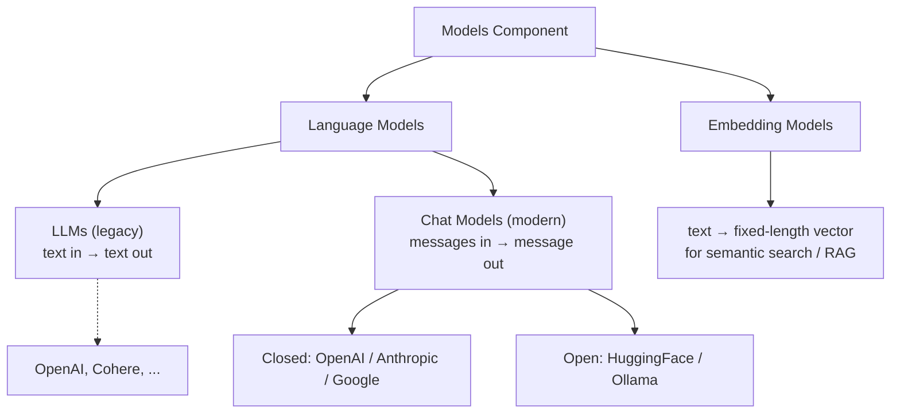

# 04. LangChain Models — In-depth  (Video 3)

> 📺 [Watch on YouTube](https://www.youtube.com/playlist?list=PLKnIA16_RmvaTbihpo4MtzVm4XOQa0ER0) · ⏱️ ~1:42:03 · CampusX — Generative AI using LangChain

---

## 🎯 What You'll Learn

- What the **Models** component is: LangChain's single, uniform interface over many different model providers, and why that abstraction is the whole point.
- The two families of models LangChain exposes — **Language Models** (text/chat generation) and **Embedding Models** (text → vectors) — and how they differ.
- Inside Language Models: the distinction between legacy **LLMs** (`OpenAI`, plain text-in/text-out) and modern **Chat Models** (`ChatOpenAI`, message-in/message-out), and *why chat models won*.
- **Closed-source** providers (OpenAI, Anthropic, Google) vs **open-source** providers (HuggingFace hosted + local, Ollama), including how each is authenticated and instantiated.
- Environment setup with `.env` + `python-dotenv`, and the core parameters every model shares — `temperature`, `max_tokens`/`max_completion_tokens`, `model`.
- How `.invoke()` behaves: LLMs return a plain string; chat models return an **`AIMessage`** object whose text lives in `.content`.
- Embedding models in practice: `embed_query()` vs `embed_documents()`, output dimensionality, and open vs closed embedders.
- A runnable **document-similarity mini-project** — embed a corpus + a query, rank with cosine similarity, return the best match.
- The real-world **cost / privacy / latency** trade-offs between closed APIs and open/local models.

---

## 📖 Overview / Why It Matters

LangChain is built out of a handful of composable components — Models, Prompts, Chains, Indexes/Retrievers, Memory, and Agents. **Models is the first and most fundamental of them**, because almost every GenAI application ultimately boils down to "send text to a model, get something back." It is the layer everything else stands on.

The problem the Models component solves is **fragmentation**. Every provider ships its own SDK, its own request/response shapes, its own parameter names, its own auth. OpenAI's client looks nothing like Anthropic's, which looks nothing like a locally-hosted HuggingFace pipeline. If your application code talked to each of these directly, swapping providers — or supporting several at once — would mean rewriting large chunks of code.

LangChain's Models component is a **common interface** sitting in front of all of them. You learn one API — construct a model object, call `.invoke()`, read the result — and the same code works whether the model is OpenAI's `gpt-4o`, Anthropic's Claude, Google's Gemini, or a model running on your own GPU. Switching providers becomes (close to) a one-line change. This is the single most valuable idea in the whole video: **write once, swap providers freely.**



---

## 🧠 Key Concepts

### 1. Two families: Language Models and Embedding Models

The Models component splits into two distinct families that do fundamentally different jobs:

- **Language Models** take text (or messages) in and generate text out. They are the "brain" — used for chatbots, summarization, Q&A, agents, code generation, everything conversational or generative.
- **Embedding Models** take text in and return a **fixed-length vector of floats** — a numeric fingerprint of the text's meaning. They generate *no* natural language; their output is used for **semantic search, similarity, clustering, and RAG** (feeding a vector store so you can retrieve the most relevant chunks for a query).

Do not confuse them: a language model *answers*; an embedding model *positions text in a vector space*. A RAG pipeline uses both — embeddings to find relevant context, then a language model to answer using that context.

### 2. Language Models split again: LLMs vs Chat Models

Within language models there are two sub-types, and understanding the difference matters because LangChain exposes them through different classes.

**LLMs (legacy, general-purpose)** are the original interface: **a single string goes in, a single string comes out.** No notion of roles, no conversation structure — just text completion. In LangChain these are the `OpenAI`, `Cohere`, etc. classes.

```python
from langchain_openai import OpenAI          # ← the legacy LLM class
```

**Chat Models (modern standard)** are purpose-built for conversation. Instead of a raw string, they consume a **list of messages**, each tagged with a **role**, and they emit a message back. In LangChain these are the `ChatOpenAI`, `ChatAnthropic`, `ChatGoogleGenerativeAI` classes.

```python
from langchain_openai import ChatOpenAI      # ← the modern chat class
```

**Why chat models won — and why you should default to them:**

1. **Roles.** Chat models understand `system` (sets behaviour/persona), `human` (the user's turn), and `ai` (the model's prior replies). A system message like *"You are a terse SQL expert"* steers every subsequent answer — something a plain LLM cannot express cleanly.
2. **Multi-turn memory of structure.** Because the input is an ordered list of role-tagged messages, chat models natively handle back-and-forth conversation: you pass the whole history and the model knows who said what.
3. **They are what providers now train and optimize for.** Instruction-tuned, RLHF-aligned models (GPT-4o, Claude, Gemini) are chat models. The old text-completion LLM endpoints are increasingly legacy or deprecated.

The video's rule of thumb: **use chat models for essentially everything.** The plain-LLM interface survives mostly for backward compatibility.

### 3. Closed-source vs open-source providers

The same `ChatModel` interface fronts two very different worlds.

**Closed-source (proprietary API)** — you don't get the weights; you call a hosted endpoint over the network and pay per token. You need an **API key**. LangChain integration packages:

| Provider | Package | Class |
|---|---|---|
| OpenAI | `langchain_openai` | `ChatOpenAI` |
| Anthropic | `langchain_anthropic` | `ChatAnthropic` |
| Google | `langchain_google_genai` | `ChatGoogleGenerativeAI` |

**Open-source** — the model weights are public (Llama, Mistral, Gemma, Falcon, the `sentence-transformers` family, etc.). You can either call them through a hosted inference service or **download and run them yourself**. Two routes covered in the video:

- **HuggingFace** via `langchain_huggingface`:
  - `HuggingFaceEndpoint` + `ChatHuggingFace` → hosted **Inference** on HuggingFace's servers (needs a HF token, but no local GPU).
  - `HuggingFacePipeline` → **runs the model locally** on your own machine/GPU (downloads weights, no per-token cost, full privacy).
- **Ollama** → another popular way to run open models **locally** with a one-line install and a simple `ChatOllama` wrapper. See the dedicated notes: [Ollama masterclass](20_ollama-masterclass.md).

The closed-vs-open decision is a genuine engineering trade-off (cost, privacy, latency, hardware) — covered in [Gotchas & Tips](#-gotchas--tips) and the [comparison table](#-comparison--reference-table).

### 4. Setup: API keys, `.env`, and `python-dotenv`

Closed providers authenticate with a secret key, and **you must never hard-code it** in source. The standard pattern:

1. Create a `.env` file in your project root (and add it to `.gitignore`):

   ```bash
   OPENAI_API_KEY="sk-..."
   ANTHROPIC_API_KEY="sk-ant-..."
   GOOGLE_API_KEY="AIza..."
   HUGGINGFACEHUB_API_TOKEN="hf_..."
   ```

2. Load it at program start with `python-dotenv`:

   ```python
   from dotenv import load_dotenv
   load_dotenv()          # reads .env → populates os.environ
   ```

LangChain's provider classes automatically read the conventional environment variable name (`OPENAI_API_KEY`, `ANTHROPIC_API_KEY`, `GOOGLE_API_KEY`, `HUGGINGFACEHUB_API_TOKEN`), so once `load_dotenv()` has run you usually don't pass the key explicitly — just construct the model.

### 5. Core parameters every model shares

Because of the common interface, the same handful of constructor arguments recur across providers:

- **`model`** — the specific model name/ID (e.g. `"gpt-4o-mini"`, `"claude-sonnet-4-6"`, `"gemini-1.5-flash"`). Model IDs are provider-specific.
- **`temperature`** — controls randomness/creativity of sampling, typically `0.0`–`1.0` (some providers go to `2.0`):
  - **`0`** → deterministic, focused, repeatable. Use for factual Q&A, extraction, classification, code.
  - **higher (0.7–1.0+)** → more diverse, creative, surprising. Use for brainstorming, story/poetry, marketing copy.
- **`max_tokens` / `max_completion_tokens`** — caps the length of the *generated* output. (Newer OpenAI models use `max_completion_tokens`; most others still use `max_tokens`. Setting it too low truncates the answer mid-sentence.)

### 6. `.invoke()` and the `AIMessage` return type — a key gotcha

Every model object is called the same way: `model.invoke(input)`. But **what comes back differs by model type**, and this trips people up:

- A **plain LLM** (`OpenAI`) returns a **string** directly.
- A **chat model** (`ChatOpenAI`, `ChatAnthropic`, …) returns an **`AIMessage` object**, not a string. The generated text lives in `.content`; metadata (token usage, finish reason, model name) lives in `.response_metadata` / `.usage_metadata`.

```python
result = chat_model.invoke("What is the capital of France?")
print(result)            # → AIMessage(content='Paris', ...)   ← the whole object
print(result.content)    # → 'Paris'                            ← just the text
```

So with chat models you almost always want `.content`. Forgetting this and printing the raw `AIMessage` is the single most common beginner confusion in this video.

### 7. Embedding models in practice

An embedding model turns text into a vector. Two methods matter:

- **`embed_query(text)`** — embeds **one** string (typically the user's search query). Returns a single vector (a `list[float]`).
- **`embed_documents([text, text, ...])`** — embeds a **list** of strings (your corpus/knowledge base) in one call. Returns a list of vectors.

For OpenAI embeddings you can also request a **reduced dimensionality** with `dimensions=` (e.g. shrink `text-embedding-3-small`'s native 1536 down to 300) to save storage/compute at a small accuracy cost. Open-source `sentence-transformers` models (e.g. `all-MiniLM-L6-v2`, 384-dim) run locally for free and keep your data on-prem.

The rule for similarity to be meaningful: **the query and the documents must be embedded with the same model.** Vectors from different models live in different spaces and are not comparable.

---

## 💻 Code Examples

Every snippet assumes you've created a `.env` with the relevant keys and called `load_dotenv()`.

### 1. Setup — load environment variables

```python
from dotenv import load_dotenv
load_dotenv()   # pulls OPENAI_API_KEY / ANTHROPIC_API_KEY / GOOGLE_API_KEY / HF token into os.environ
```

### 2. Legacy LLM — `OpenAI` (text-in / text-out)

```python
from langchain_openai import OpenAI

llm = OpenAI(model="gpt-3.5-turbo-instruct")   # a completion (non-chat) model

result = llm.invoke("What is the capital of India?")
print(result)        # → a plain string, e.g. "\n\nThe capital of India is New Delhi."
print(type(result))  # → <class 'str'>
```

Note there is **no `.content`** here — a plain LLM already gives you the string.

### 3. Chat model — `ChatOpenAI` (the modern default)

```python
from langchain_openai import ChatOpenAI

model = ChatOpenAI(
    model="gpt-4o-mini",
    temperature=0.7,             # a little creative
    max_completion_tokens=256,   # cap the reply length
)

result = model.invoke("Write a one-line pitch for a note-taking app.")
print(result.content)   # ← chat models return an AIMessage; read .content
```

Set `temperature=0` for factual/deterministic output; raise it for creative output.

### 4. Chat model — Anthropic Claude (`ChatAnthropic`)

```python
from langchain_anthropic import ChatAnthropic

model = ChatAnthropic(
    model="claude-sonnet-4-6",   # a current balanced Claude chat model
    temperature=0.5,
    max_tokens=512,
)

result = model.invoke("Give me three uses of embeddings in RAG.")
print(result.content)
```

The code is *identical in shape* to `ChatOpenAI` — only the import, class, and model ID change. That is the common-interface payoff. (Anthropic's most capable current model is `claude-opus-4-8`; pick per your cost/quality needs.)

### 5. Chat model — Google Gemini (`ChatGoogleGenerativeAI`)

```python
from langchain_google_genai import ChatGoogleGenerativeAI

model = ChatGoogleGenerativeAI(
    model="gemini-1.5-flash",
    temperature=0.7,
)

result = model.invoke("Explain vectors like I'm five.")
print(result.content)
```

Again: same `.invoke()` call, same `.content` access — only the provider wrapper differs.

### 6. Open-source, hosted — HuggingFace `HuggingFaceEndpoint` + `ChatHuggingFace`

Runs an open model on **HuggingFace's** inference servers (needs `HUGGINGFACEHUB_API_TOKEN`, but no local GPU).

```python
from langchain_huggingface import HuggingFaceEndpoint, ChatHuggingFace

endpoint = HuggingFaceEndpoint(
    repo_id="meta-llama/Llama-3.1-8B-Instruct",
    task="text-generation",
    max_new_tokens=256,
    temperature=0.7,
)

model = ChatHuggingFace(llm=endpoint)   # wrap the endpoint in a chat interface

result = model.invoke("What is the capital of India?")
print(result.content)
```

`HuggingFaceEndpoint` is the raw LLM handle; `ChatHuggingFace` wraps it so it behaves like the other chat models (roles, `AIMessage` output).

### 7. Open-source, local — HuggingFace `HuggingFacePipeline` (runs on your GPU)

Downloads the weights and runs inference **locally** — no API calls, no per-token cost, full data privacy. First run is slow (downloading the model); needs enough RAM/VRAM.

```python
from langchain_huggingface import HuggingFacePipeline, ChatHuggingFace

llm = HuggingFacePipeline.from_model_id(
    model_id="TinyLlama/TinyLlama-1.1B-Chat-v1.0",
    task="text-generation",
    pipeline_kwargs={"max_new_tokens": 128, "temperature": 0.7},
)

model = ChatHuggingFace(llm=llm)
result = model.invoke("Name two open-source LLMs.")
print(result.content)
```

The **same `ChatHuggingFace` wrapper** works whether the underlying `llm` is a hosted `HuggingFaceEndpoint` or a local `HuggingFacePipeline`. Set `HF_HOME` to control where weights are cached.

> **Another local route:** [Ollama](20_ollama-masterclass.md) is a popular alternative — `pip install langchain-ollama`, `ollama pull llama3`, then `from langchain_ollama import ChatOllama`.

### 8. Embedding models — OpenAI (`embed_query` vs `embed_documents`)

```python
from langchain_openai import OpenAIEmbeddings

embeddings = OpenAIEmbeddings(
    model="text-embedding-3-small",
    dimensions=300,          # optional: shrink from native 1536 to save space
)

# one string → one vector
vec = embeddings.embed_query("Delhi is the capital of India")
print(len(vec))              # → 300

# many strings → many vectors (use for your corpus)
docs = [
    "Delhi is the capital of India",
    "Paris is the capital of France",
    "Cricket is a popular sport in India",
]
doc_vecs = embeddings.embed_documents(docs)
print(len(doc_vecs), len(doc_vecs[0]))   # → 3 300
```

### 9. Embedding models — open-source, local (`HuggingFaceEmbeddings`)

```python
from langchain_huggingface import HuggingFaceEmbeddings

embeddings = HuggingFaceEmbeddings(
    model_name="sentence-transformers/all-MiniLM-L6-v2",   # 384-dim, runs locally, free
)

vec = embeddings.embed_query("Delhi is the capital of India")
print(len(vec))   # → 384
```

Same `embed_query` / `embed_documents` API as OpenAI — swap the class, keep the code.

### 10. Mini-project — document similarity with cosine similarity

Embed a small knowledge base, embed a user query, and return the most semantically similar document. This is the atomic operation at the heart of every RAG retriever.

```python
from dotenv import load_dotenv
from langchain_openai import OpenAIEmbeddings
from sklearn.metrics.pairwise import cosine_similarity
import numpy as np

load_dotenv()

# 1. Knowledge base + the incoming query
documents = [
    "Virat Kohli is an Indian cricketer known for his aggressive batting.",
    "MS Dhoni is a former captain famous for his calm finishing and wicketkeeping.",
    "Sachin Tendulkar, the 'God of Cricket', holds many batting records.",
    "Rohit Sharma is known for his elegant stroke play and double centuries.",
]
query = "Tell me about Dhoni."

# 2. Embed everything with the SAME model
embeddings = OpenAIEmbeddings(model="text-embedding-3-small")
doc_vectors = embeddings.embed_documents(documents)   # list[list[float]]
query_vector = embeddings.embed_query(query)          # list[float]

# 3. Cosine similarity between the query and every document
#    cosine_similarity expects 2D arrays → reshape the query to (1, dim)
scores = cosine_similarity([query_vector], doc_vectors)[0]   # → array of 4 scores

# 4. Pick the highest-scoring document
best_index = int(np.argmax(scores))
print(f"Query : {query}")
print(f"Match : {documents[best_index]}")
print(f"Score : {scores[best_index]:.4f}")
```

Expected output — the Dhoni sentence wins even though the query never repeats its exact wording, because embeddings capture *meaning*, not keywords:

```
Query : Tell me about Dhoni.
Match : MS Dhoni is a former captain famous for his calm finishing and wicketkeeping.
Score : 0.55xx
```

**Pure-numpy version** (no scikit-learn dependency):

```python
import numpy as np

def cosine(a, b):
    a, b = np.array(a), np.array(b)
    return float(np.dot(a, b) / (np.linalg.norm(a) * np.linalg.norm(b)))

scores = [cosine(query_vector, dv) for dv in doc_vectors]
best_index = int(np.argmax(scores))
print(documents[best_index], round(scores[best_index], 4))
```

To turn this toy into real RAG you'd swap the Python list + `argmax` for a **vector store** (FAISS, Chroma, Pinecone) that indexes the document vectors and does approximate nearest-neighbour search at scale — see the [vector stores notes](../12_rag/04_vector-stores.md) and [text splitters notes](../12_rag/03_text-splitters.md).

---

## 📊 Comparison / Reference Table

### LLMs vs Chat Models

| Aspect | LLM (legacy) | Chat Model (modern) |
|---|---|---|
| LangChain class | `OpenAI`, `Cohere`, … | `ChatOpenAI`, `ChatAnthropic`, `ChatGoogleGenerativeAI`, `ChatHuggingFace`, `ChatOllama` |
| Input | a single **string** | a list of **role-tagged messages** (`system`/`human`/`ai`) |
| Output of `.invoke()` | a plain **string** | an **`AIMessage`** — read `.content` |
| Roles / system prompt | ✗ no native concept | ✓ system / human / ai |
| Multi-turn conversation | awkward (manual string stitching) | ✓ native (pass the message list) |
| Training / tuning focus | older text-completion | instruction-tuned + RLHF (GPT-4o, Claude, Gemini) |
| Status | mostly legacy | **the default — use these** |

### Closed-source vs Open-source models

| Dimension | Closed-source (OpenAI / Anthropic / Google) | Open-source (HuggingFace / Ollama, self-hosted) |
|---|---|---|
| **Cost** | Pay **per token**; scales with usage; no hardware to buy | **No per-token fee**; you pay for GPU/compute (or free on your own machine) |
| **Control / customization** | Limited — you use the model as given, can't see weights, limited fine-tuning | Full — inspect/modify weights, fine-tune, quantize, run any version |
| **Privacy / data** | Prompts leave your network → sent to the provider's servers | Data can stay **fully on-prem** with local models — best for sensitive data |
| **Hardware needs** | None — it's just an API call | Local models need real GPU/RAM (VRAM), setup, and ops |
| **Ease of use** | Very easy — key + one line, top-tier quality out of the box | More setup (drivers, weights, memory tuning); quality varies by model |
| **Latency** | Network round-trip + provider queueing; usually fast & scalable | Local avoids the network but is bounded by *your* hardware; can be slower on weak GPUs |
| **Model quality (frontier)** | Generally the strongest models available | Rapidly closing the gap (Llama, Mistral, Gemma) but frontier still favours closed |
| **API key** | Required | HF hosted: token required · local: none |

### Common constructor parameters

| Parameter | Meaning | Typical values |
|---|---|---|
| `model` | Provider-specific model ID | `"gpt-4o-mini"`, `"claude-sonnet-4-6"`, `"gemini-1.5-flash"` |
| `temperature` | Randomness / creativity | `0` = deterministic/factual · `0.7–1.0+` = creative |
| `max_tokens` / `max_completion_tokens` | Cap on generated output length | `256`, `512`, `1024`, … |

---

## ⚠️ Gotchas & Tips

- **Chat models return an `AIMessage`, not a string.** Always read `result.content`. Printing the raw object dumps metadata and confuses beginners.
- **Newer OpenAI models want `max_completion_tokens`, not `max_tokens`.** If you get a parameter error about `max_tokens`, switch the name. Most non-OpenAI providers still use `max_tokens`.
- **Never commit API keys.** Keep them in `.env`, add `.env` to `.gitignore`, and load with `load_dotenv()`. A leaked key can rack up real charges.
- **`temperature=0` is not a guarantee of identical output** across every provider/version, but it's the right lever for "make this as factual/repeatable as possible."
- **Use the split packages, not monolithic `langchain`.** Modern LangChain lives in `langchain_openai`, `langchain_anthropic`, `langchain_google_genai`, `langchain_huggingface`, etc. Install only what you use (`pip install langchain-openai langchain-anthropic ...`).
- **Query and documents must share the same embedding model.** Vectors from different models aren't comparable — similarity scores become meaningless.
- **First local run is slow.** `HuggingFacePipeline` / Ollama download multi-GB weights on first use and need enough VRAM/RAM; a tiny model like `TinyLlama-1.1B` is fine for laptops, an 8B+ model wants a real GPU.
- **`OpenAIEmbeddings(dimensions=...)`** only works for models that support dimensionality reduction (the `text-embedding-3-*` family). Smaller dimensions = less storage/compute but slightly lower fidelity.
- **Cost vs privacy vs latency is a real decision, not a default.** Sensitive data or high steady volume → lean open/local. Prototyping, frontier quality, or spiky low volume → closed APIs are simpler and often cheaper overall.
- **Model IDs go stale.** Provider model names change over time; check the provider's current catalog rather than copying an old string from a tutorial.

---

## 🧠 Key Takeaways

- The **Models** component is LangChain's **common interface** over every provider — learn one API (`construct → .invoke() → read result`) and swap providers with a one-line change.
- Models split into **Language Models** (generate text) and **Embedding Models** (text → vectors for semantic search / RAG). They do different jobs; RAG uses both.
- Language models come in two flavours: legacy **LLMs** (`OpenAI`, string-in/string-out) and modern **Chat Models** (`ChatOpenAI`, messages-in/`AIMessage`-out). **Default to chat models** — roles, multi-turn structure, and provider optimization all favour them.
- **Chat models return an `AIMessage`** — the text is in `.content`. This is the #1 gotcha.
- **Closed** providers (OpenAI `ChatOpenAI`, Anthropic `ChatAnthropic`, Google `ChatGoogleGenerativeAI`) need an **API key** and charge per token; **open** providers (HuggingFace `HuggingFaceEndpoint`+`ChatHuggingFace` hosted, `HuggingFacePipeline` local, or Ollama) let you run public-weight models — locally for free and privately.
- Configure keys via **`.env` + `python-dotenv`** and `load_dotenv()`; never hard-code secrets.
- Core parameters are shared across providers: **`temperature`** (0 = factual, high = creative), **`max_tokens`/`max_completion_tokens`**, and **`model`**.
- Embedding models expose **`embed_query()`** (one string) and **`embed_documents()`** (a list); a query + corpus + **cosine similarity** gives you a minimal document-retrieval engine — the core of RAG.
- Closed vs open is a genuine trade-off across **cost, control, privacy, hardware, ease, and latency** — choose per project, not by habit.

---

## ❓ Revision Questions

1. What single problem does LangChain's Models component solve, and why is that so valuable when building production apps?
2. Name the two families of models in LangChain and state what each one takes as input and produces as output.
3. What is the difference between an **LLM** and a **Chat Model** in LangChain? Give the class name for each and explain *why* chat models became the modern standard.
4. When you call `.invoke()` on a `ChatOpenAI` object, what type comes back, and how do you get the plain text out of it? How does this differ from calling `.invoke()` on a legacy `OpenAI` object?
5. List the three closed-source providers covered, their LangChain integration packages, and the class you'd use for each. What do all three require to authenticate?
6. Compare `HuggingFaceEndpoint` + `ChatHuggingFace` against `HuggingFacePipeline`. Which runs on HuggingFace's servers and which runs on your own machine, and what are the practical consequences of each?
7. How do you keep API keys out of your source code? Which library and function load them, and what environment-variable names do the OpenAI/Anthropic/Google classes expect?
8. Explain `temperature`. What values would you use for (a) a factual database-query assistant and (b) a poetry generator, and why?
9. What is the difference between `embed_query()` and `embed_documents()`? Why must the query and the corpus be embedded with the *same* model?
10. Walk through the document-similarity mini-project: what are the four steps, why is cosine similarity used, and how would you scale this from a Python list to a real RAG system?
