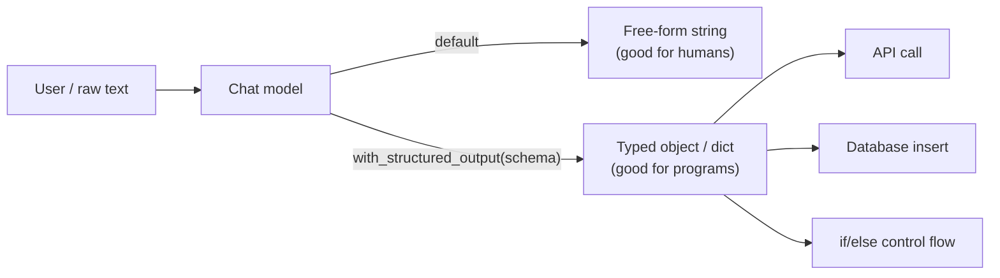
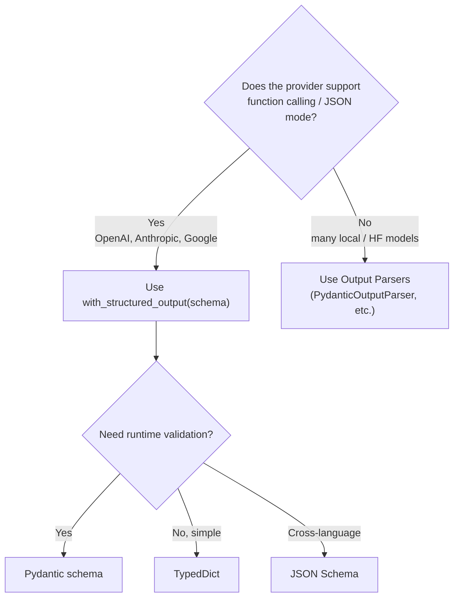

# 06. Structured Output in LangChain  (Video 5)

> 📺 [Watch on YouTube](https://www.youtube.com/playlist?list=PLKnIA16_RmvaTbihpo4MtzVm4XOQa0ER0) · ⏱️ ~1:08:13 · CampusX — Generative AI using LangChain

---

## 🎯 What You'll Learn

- Why raw LLM output (free-form text) is hard to *program against*, and what "structured output" actually means.
- `llm.with_structured_output(schema)` — the single most important mechanism for getting typed, validated data out of a chat model.
- The **three ways to define the schema** you pass to it, with full runnable examples of each:
  1. **`TypedDict`** — lightweight type hints, zero runtime validation.
  2. **`pydantic.BaseModel`** — type hints **plus** runtime validation, coercion, and defaults (the recommended default).
  3. **Raw JSON Schema** — a plain `dict`, for cross-language pipelines or when you can't add a Pydantic dependency.
- How `Annotated[...]` / `Field(description=...)` feed **hints to the model**, not just the type checker — and why those descriptions materially improve extraction quality.
- The `method` argument: `"function_calling"` vs `"json_mode"`, and why provider support differs.
- The hard limitation: `with_structured_output` needs **provider-side support**. When it isn't there (many local / HuggingFace models), you fall back to **[Output Parsers](07_output-parsers.md)**.

---

## 📖 Overview / Why It Matters

An LLM's native output is a single string of natural language. That's perfect when a human is going to *read* it, but useless the moment a **program** has to consume it. Consider what you actually want to do with model output in a real application:

- **Call an API** with specific fields (e.g. create a ticket with `priority`, `assignee`, `tags`).
- **Store it in a database** — you need columns/types, not a paragraph.
- **Drive control flow** — `if sentiment == "neg": escalate()`.

None of that works if all you have is `"The customer seems pretty unhappy about the battery life, though they liked the screen..."`. You need the model to hand you back a **structured, typed object** — a dict or a Python object with named fields — that downstream code can index into deterministically.

**Structured output** is exactly this: constraining the model so that instead of prose, it returns data conforming to a schema you define. This is the backbone of nearly every serious LLM feature — extraction, classification, routing, tool/agent calls, and "chat with your data" pipelines all depend on it.



Where this sits in the course: this is the bridge between "prompting a model" and "building applications." Once output is structured, everything after it — chains, agents, tools — becomes reliable.

---

## 🧠 Key Concepts

### The core problem: text isn't programmable

Ask a model to "analyse this product review" and you get a helpful paragraph. But a paragraph has no `sentiment` field, no `pros` list, no reviewer `name` you can pull out reliably. You *could* try to regex it or ask the model to "reply in JSON" and then `json.loads` the string — but the model will sometimes wrap it in markdown fences, add a preamble ("Sure! Here's the JSON:"), or emit invalid JSON. Structured output solves this at the framework level so you stop hand-parsing text.

### `with_structured_output()` — the primary mechanism

Every LangChain chat model exposes:

```python
structured_model = model.with_structured_output(schema)
```

This returns a **new runnable**. When you `.invoke()` it, instead of an `AIMessage` containing a string, you get back **an instance of your schema** — a `dict` (for `TypedDict` / JSON Schema) or a **Pydantic object** (for a `BaseModel`). Under the hood LangChain translates your schema into the provider's native structured-output machinery (usually tool/function calling) and parses the response back into your type. You define the shape once; LangChain handles the prompting and parsing.

There are **three ways** to describe the `schema` you pass in.

### Way 1 — `TypedDict`

`TypedDict` (from `typing`) lets you declare the *shape* of a dictionary: which keys exist and what type each value should be. It's pure typing sugar — great for editor autocomplete and static checkers like `mypy`.

The key idea for LLM work is `Annotated[type, "description"]`: the type still says "this is a `str`", but the string is a **natural-language hint sent to the model** telling it what to put there. Descriptions dramatically improve extraction accuracy — they're effectively a mini-prompt per field.

```python
from typing import TypedDict, Annotated, Optional, Literal

class Review(TypedDict):
    key_themes: Annotated[list[str], "All key themes discussed in the review"]
    summary: Annotated[str, "A brief summary of the review"]
    sentiment: Annotated[Literal["pos", "neg"], "Overall sentiment of the review"]
```

**The big caveat: no runtime validation.** `TypedDict` is a hint to the *type checker only*. At runtime it's just a plain `dict` — Python does nothing to enforce that `sentiment` is actually `"pos"` or `"neg"`, or that `key_themes` is really a list. If the model returns something off-spec, `TypedDict` won't catch it. Use it for simple, low-risk typing where you trust the provider's structured mode.

### Way 2 — Pydantic (`BaseModel`) — the recommended default

Pydantic gives you everything `TypedDict` does **plus real runtime validation and coercion**. You subclass `BaseModel` and declare fields, optionally with `Field(...)` metadata:

- `Field(description=...)` — the per-field hint sent to the model (same role as `Annotated`).
- `Field(default=...)` — a fallback so optional fields aren't required.
- Constraints like `gt=`, `ge=`, `lt=`, `le=` — validated at runtime (e.g. a 1–5 rating).
- `Optional[X]` + `default=None` — the field may be absent.
- `Literal[...]` — restrict to a fixed set of allowed values (great for enums like sentiment).

When the response comes back, Pydantic **validates and coerces** it (e.g. the string `"4"` becomes `int 4`), and raises a clear `ValidationError` if the data can't be made to fit. You get a real object with attribute access (`result.sentiment`) and IDE autocomplete. This is why Pydantic is the recommended default for anything that matters.

```python
from pydantic import BaseModel, Field
from typing import Optional, Literal

class Review(BaseModel):
    key_themes: list[str] = Field(description="All key themes discussed in the review")
    summary: str = Field(description="A brief summary of the review")
    sentiment: Literal["pos", "neg"] = Field(description="Overall sentiment of the review")
    rating: Optional[int] = Field(default=None, gt=0, le=5, description="Star rating out of 5")
```

### Way 3 — Raw JSON Schema

Sometimes you can't (or don't want to) use Pydantic — for example, your schema is defined in another language/service, or your team standardises on JSON Schema as the contract. You can pass a plain `dict` that follows the [JSON Schema](https://json-schema.org/) spec directly:

```python
json_schema = {
    "title": "Review",
    "type": "object",
    "properties": {
        "summary": {"type": "string", "description": "A brief summary of the review"},
        "sentiment": {"type": "string", "enum": ["pos", "neg"], "description": "Overall sentiment"},
    },
    "required": ["summary", "sentiment"],
}
```

This is the most portable option — the same schema `dict` can live in a config file and be shared across services and languages. The trade-off: you write more boilerplate by hand, and you get **no Python-side validation** beyond what the provider enforces (the result comes back as a plain `dict`).

### The `method` argument: `function_calling` vs `json_mode`

`with_structured_output` has an optional `method` parameter controlling *how* the constraint is imposed at the provider level:

- **`method="function_calling"`** (the common default) — LangChain registers your schema as a **tool/function** and asks the model to "call" it. The model's function-call arguments *are* your structured object. This is the most robust and widely supported approach; it's what OpenAI, Anthropic, and Google all support.
- **`method="json_mode"`** — instructs the provider to guarantee **syntactically valid JSON** in the response body. Not every provider supports it, and when using it you typically must also **describe the desired shape in your prompt** (JSON mode guarantees *valid JSON*, not that it matches your fields). Only reach for it when a provider supports JSON mode but not function calling, or when the docs recommend it.

```python
structured_model = model.with_structured_output(Review, method="json_mode")
```

Provider support genuinely differs — always check which methods your model exposes rather than assuming.

### Limitation: it needs provider support (else use Output Parsers)

`with_structured_output` is not magic done in Python — it delegates to the model provider's structured-output / function-calling API. That works great with **OpenAI, Anthropic, and Google Gemini**. But **many local or open-source models (e.g. plain HuggingFace / TGI endpoints) don't implement function calling or JSON mode**, so calling `with_structured_output` on them raises an error.

When the provider can't do it, you fall back to **[Output Parsers](07_output-parsers.md)** (`StructuredOutputParser`, `PydanticOutputParser`, `JsonOutputParser`, etc.). Those work with *any* model: you inject formatting instructions into the prompt yourself, then parse the returned string. `with_structured_output` is the convenient, reliable path when the provider supports it; output parsers are the universal fallback when it doesn't.

---

## 💻 Code Examples

### 0. The starting point — free-form output

```python
from langchain_openai import ChatOpenAI

model = ChatOpenAI(model="gpt-4o-mini")
resp = model.invoke("Analyse this review: 'Great phone, terrible battery.'")
print(resp.content)   # a paragraph of prose — not programmatically usable
```

### 1. `TypedDict` schema

```python
from typing import TypedDict, Annotated, Optional, Literal
from langchain_openai import ChatOpenAI

class Review(TypedDict):
    key_themes: Annotated[list[str], "All key themes discussed in the review"]
    summary: Annotated[str, "A brief summary of the review"]
    sentiment: Annotated[Literal["pos", "neg"], "Overall sentiment of the review"]
    pros: Annotated[Optional[list[str]], "All the pros mentioned, as a list"]
    cons: Annotated[Optional[list[str]], "All the cons mentioned, as a list"]
    name: Annotated[Optional[str], "Name of the reviewer, if present"]

model = ChatOpenAI(model="gpt-4o-mini")
structured_model = model.with_structured_output(Review)

result = structured_model.invoke(review_text)   # returns a plain dict
print(result["sentiment"])
print(result["pros"])
```

### 2. Pydantic schema (recommended)

```python
from pydantic import BaseModel, Field
from typing import Optional, Literal
from langchain_openai import ChatOpenAI

class Review(BaseModel):
    key_themes: list[str] = Field(description="All key themes discussed in the review")
    summary: str = Field(description="A brief summary of the review")
    sentiment: Literal["pos", "neg"] = Field(description="Overall sentiment of the review")
    pros: Optional[list[str]] = Field(default=None, description="All the pros mentioned")
    cons: Optional[list[str]] = Field(default=None, description="All the cons mentioned")
    name: Optional[str] = Field(default=None, description="Name of the reviewer")
    rating: Optional[int] = Field(default=None, gt=0, le=5, description="Star rating out of 5")

model = ChatOpenAI(model="gpt-4o-mini")
structured_model = model.with_structured_output(Review)

result = structured_model.invoke(review_text)   # returns a Review object
print(result.sentiment)          # attribute access + IDE autocomplete
print(result.model_dump())       # -> dict, if you need one downstream
```

If the model returned `rating="4"`, Pydantic coerces it to `int 4`; if it returned `rating=9`, the `le=5` constraint raises a `ValidationError` — errors you'd never catch with `TypedDict`.

### 3. Raw JSON Schema

```python
from langchain_openai import ChatOpenAI

json_schema = {
    "title": "Review",
    "type": "object",
    "properties": {
        "key_themes": {
            "type": "array", "items": {"type": "string"},
            "description": "All key themes discussed in the review",
        },
        "summary": {"type": "string", "description": "A brief summary of the review"},
        "sentiment": {
            "type": "string", "enum": ["pos", "neg"],
            "description": "Overall sentiment of the review",
        },
        "pros": {"type": ["array", "null"], "items": {"type": "string"}},
        "cons": {"type": ["array", "null"], "items": {"type": "string"}},
        "name": {"type": ["string", "null"], "description": "Name of the reviewer"},
    },
    "required": ["key_themes", "summary", "sentiment"],
}

model = ChatOpenAI(model="gpt-4o-mini")
structured_model = model.with_structured_output(json_schema)

result = structured_model.invoke(review_text)   # returns a plain dict
print(result["sentiment"])
```

### 4. Worked example — extracting structure from a product review

```python
from pydantic import BaseModel, Field
from typing import Optional, Literal
from langchain_openai import ChatOpenAI

review_text = """
I've been using the Galaxy S24 Ultra for two weeks and the hardware is stunning.
The screen is gorgeous, the S-Pen is genuinely useful, and performance is blazing fast.
On the downside, it's heavy, the price is eye-watering, and the bloatware is annoying.
Overall a great flagship if you can stomach the cost.
Review by Nitish Kumar
"""

class Review(BaseModel):
    key_themes: list[str] = Field(description="All key themes discussed in the review")
    summary: str = Field(description="A brief summary of the review")
    sentiment: Literal["pos", "neg"] = Field(description="Overall sentiment of the review")
    pros: Optional[list[str]] = Field(default=None, description="All the pros mentioned")
    cons: Optional[list[str]] = Field(default=None, description="All the cons mentioned")
    name: Optional[str] = Field(default=None, description="Name of the reviewer")

model = ChatOpenAI(model="gpt-4o-mini")
structured_model = model.with_structured_output(Review)
result = structured_model.invoke(review_text)

# Now the output drives a program deterministically:
if result.sentiment == "neg":
    escalate_to_support(result.summary)
print(result.pros)     # ['Gorgeous screen', 'Useful S-Pen', 'Fast performance']
print(result.cons)     # ['Heavy', 'Expensive', 'Bloatware']
print(result.name)     # 'Nitish Kumar'
```

### 5. Choosing the `method`

```python
# Default path — tool/function calling (OpenAI, Anthropic, Google)
structured_model = model.with_structured_output(Review, method="function_calling")

# Only if the provider supports JSON mode but not function calling
structured_model = model.with_structured_output(Review, method="json_mode")
```

---

## 📊 Comparison / Reference Table

| Aspect | `TypedDict` | Pydantic `BaseModel` | Raw JSON Schema |
|---|---|---|---|
| **Runtime validation** | ❌ None — just a `dict` at runtime | ✅ Full validation + coercion + `ValidationError` | ⚠️ Only what the provider enforces |
| **Type / IDE support** | ✅ Static hints & autocomplete | ✅ Static hints, autocomplete, attribute access | ❌ Plain `dict` keys, no typing |
| **Field descriptions to model** | `Annotated[type, "..."]` | `Field(description="...")` | `"description": "..."` in the schema |
| **Defaults / constraints** | ❌ (no `gt`, `le`, defaults) | ✅ `default=`, `gt=`, `le=`, etc. | ⚠️ Some via JSON Schema keywords, no coercion |
| **Cross-language / portable** | ❌ Python-only | ❌ Python-only | ✅ Language-agnostic contract |
| **Return type from invoke** | `dict` | Pydantic object | `dict` |
| **Extra dependency** | None (stdlib `typing`) | Needs `pydantic` | None |
| **Recommended when** | Simple shape, you trust the model, no validation needed | **Default choice** — you want safety, coercion, and clean objects | You must share the schema across services/languages, or can't add Pydantic |

### Decision note — `with_structured_output` vs Output Parsers



**Rule of thumb:** reach for `with_structured_output` first — it's cleaner and more reliable. Fall back to [Output Parsers](07_output-parsers.md) only when the model can't do provider-side structured output, since parsers work with any model by injecting format instructions into the prompt.

---

## ⚠️ Gotchas & Tips

- **`TypedDict` gives you *zero* runtime safety.** It looks like validation but isn't — it's erased at runtime. If a field must be trustworthy (drives control flow, hits a DB), use Pydantic.
- **Descriptions are prompts, not comments.** `Annotated[..., "..."]` / `Field(description=...)` text is sent to the model. Vague descriptions → sloppy extraction. Be specific ("sentiment as `pos` or `neg`", "pros as a list of short phrases").
- **Use `Literal` for enums.** `Literal["pos", "neg"]` constrains the model far better than a free `str` and is validated by Pydantic.
- **Optional means optional — give it a default.** `Optional[list[str]] = Field(default=None, ...)` so the field can legitimately be absent instead of forcing the model to hallucinate a value.
- **`method` support is provider-specific.** `function_calling` is the safe default; only switch to `json_mode` when a provider needs it, and describe the shape in the prompt when you do.
- **`with_structured_output` raises on unsupported providers.** Plain HuggingFace / local models that lack function calling will error — that's your signal to switch to Output Parsers.
- **Pydantic v2 idioms:** use `result.model_dump()` (not the old `.dict()`) to convert to a plain dict, and `model_dump_json()` for a JSON string.
- **The result type varies by schema:** Pydantic → object; `TypedDict`/JSON Schema → `dict`. Write downstream code accordingly (attribute access vs `[]` indexing).
- **Nested structures work.** A Pydantic model can contain other Pydantic models / lists of them — useful for extracting hierarchical data (e.g. a list of line items inside an invoice).

---

## 🧠 Key Takeaways

- LLMs return **free-form text** by default; to *program against* output (APIs, DBs, control flow) you need it in a **structured, typed** shape.
- **`model.with_structured_output(schema)`** is the primary mechanism — it returns a runnable that emits an instance of your schema instead of a raw string.
- There are **three ways to define the schema**: `TypedDict` (typing only), **Pydantic `BaseModel`** (typing + runtime validation — the recommended default), and **raw JSON Schema** (portable, language-agnostic).
- **`Annotated[type, "desc"]`** and **`Field(description=...)`** send per-field hints to the model and are one of the biggest levers on extraction quality.
- **Pydantic adds real validation**: `Field(default=..., gt=..., le=...)`, `Optional`, `Literal`, plus coercion and clear `ValidationError`s — things `TypedDict` cannot do.
- The **`method`** argument picks the provider mechanism: `"function_calling"` (robust, widely supported) vs `"json_mode"` (valid-JSON guarantee, narrower support, describe shape in prompt).
- Return types differ: **Pydantic → object**, **`TypedDict` / JSON Schema → `dict`**.
- `with_structured_output` **requires provider support** (OpenAI / Anthropic / Google). When a model lacks it (many local/HF models), fall back to **[Output Parsers](07_output-parsers.md)**.

---

## ❓ Revision Questions

1. Why is raw LLM text output insufficient for programmatic use? Give two concrete downstream tasks that need structured output.
2. What does `model.with_structured_output(schema)` return, and what do you get back when you `.invoke()` it?
3. Name the three ways to define a schema for `with_structured_output`. Which return a `dict` and which returns an object?
4. What is the single biggest limitation of `TypedDict` for structured output, and why does it matter in production?
5. What role does `Annotated[type, "description"]` play, and why isn't it "just a comment"?
6. List four things Pydantic's `Field(...)` lets you specify that `TypedDict` cannot. What happens if the model returns a value that violates a `gt`/`le` constraint?
7. When would you choose raw JSON Schema over Pydantic despite the extra boilerplate?
8. Explain the difference between `method="function_calling"` and `method="json_mode"`. Why must you often describe the shape in the prompt when using JSON mode?
9. Which model providers support `with_structured_output` well, and what typically happens if you call it on a plain local/HuggingFace model?
10. When `with_structured_output` isn't available, what is the fallback, and why does that fallback work with any model?
