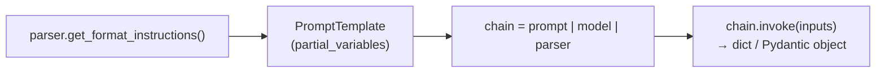

# 07. Output Parsers in LangChain  (Video 6)

> 📺 [Watch on YouTube](https://www.youtube.com/playlist?list=PLKnIA16_RmvaTbihpo4MtzVm4XOQa0ER0) · ⏱️ ~53:13 · CampusX — Generative AI using LangChain

---

## 🎯 What You'll Learn

- What an **Output Parser** is: a component that converts an LLM's raw text response into a clean, usable format (a `str`, a `dict`, or a validated object).
- Why parsers matter even for models that **cannot** do native structured output — they work with **any** LLM, including local / open-source ones (HuggingFace, Ollama, etc.).
- The four parsers covered in this video and exactly what each guarantees:
  1. **`StrOutputParser`** — pulls `.content` out of the message; the workhorse of chains.
  2. **`JsonOutputParser`** — forces JSON via format instructions; returns a Python `dict` (but you can't pin the schema).
  3. **`StructuredOutputParser`** — you declare the keys via `ResponseSchema`; returns a `dict` with exactly those keys (but no type checking).
  4. **`PydanticOutputParser`** — you pass a Pydantic model; format instructions **and** validation/coercion. The most robust option.
- The one common pattern that ties them all together: `parser.get_format_instructions()` → `PromptTemplate` `partial_variables` → `chain = prompt | model | parser`.
- How Output Parsers differ from [`with_structured_output`](06_structured-output.md), and when to reach for which.

---

## 📖 Overview / Why It Matters

An LLM's `.invoke()` almost always returns **unstructured text** wrapped in an `AIMessage`. That's fine for a chatbot, but useless the moment you want to *program against* the answer — store it in a database, pass it to another function, or feed it into the next step of a pipeline. You need it as a `str`, a `dict`, or a typed object.

An **Output Parser** is the LangChain component that sits *after* the model and performs that conversion:

```
PromptTemplate  →  Model  →  Output Parser
  (formats input)   (raw text)   (clean, typed output)
```

The previous video introduced [`with_structured_output`](06_structured-output.md), which also produces structured data. So why do we need parsers at all? Because `with_structured_output` leans on a model's **native function-calling / JSON-mode API** — a feature only *some* providers expose (OpenAI, Anthropic, Google, …). The instant you switch to a local model served through `HuggingFacePipeline`, a small open-source model, or any endpoint without function-calling, `with_structured_output` may simply not be available.

Output Parsers solve the same problem a different way: they **inject formatting instructions into the prompt** and then **parse the plain text the model returns**. Because that only requires a model that can read a prompt and emit text — i.e. *every* model — parsers work everywhere. The trade-off is reliability: you're *asking* the model (via the prompt) to produce a certain shape, not *forcing* it at the API level. A weak model can ignore the instructions and hand you malformed output.

That single idea — **"describe the format in the prompt, then parse what comes back"** — is the thread running through all four parsers below.

---

## 🧠 Key Concepts

### The universal parser interface

Every output parser exposes two methods that matter:

- **`get_format_instructions()`** — returns a string describing, in natural language + a schema, how the model should format its answer. You splice this string into the prompt.
- **`parse(text)`** (and the LCEL-friendly `invoke`) — takes the model's raw text output and converts it into the target Python type.

Because parsers implement the `Runnable` interface, you rarely call `parse()` by hand. Instead you drop the parser into a chain with the pipe operator and let LangChain call it for you.

### The one pattern to remember

Three of the four parsers (`JsonOutputParser`, `StructuredOutputParser`, `PydanticOutputParser`) follow the **exact same three-step recipe**:



1. Build the parser and grab its **format instructions**.
2. Feed those instructions into a `PromptTemplate` as a **`partial_variable`** (it's a constant for that prompt, so it's partially filled in advance rather than passed at invoke-time).
3. Compose `prompt | model | parser` and `.invoke()` it.

`StrOutputParser` is the odd one out — it needs no format instructions, because it isn't asking the model to do anything special; it just extracts `.content`.

### Why `partial_variables` for the format instructions

A `PromptTemplate` has two kinds of placeholders:

- **`input_variables`** — filled at `invoke()` time by the caller (e.g. `topic`).
- **`partial_variables`** — filled *now*, once, with a fixed value (e.g. the format-instruction string, which never changes between calls).

Putting `format_instruction` in `partial_variables` means the caller only ever supplies the *real* inputs and never has to remember to pass the boilerplate instructions.

### 1. `StrOutputParser` — the workhorse

`StrOutputParser` does almost nothing on its own: it takes the `AIMessage` a chat model returns and gives you back `message.content` — a plain string. So why bother?

Its value shows up in **chains**. Without it, every time you want to feed one model's output into the next prompt you must manually reach into `.content`:

```python
result1 = model.invoke(prompt1)          # AIMessage
prompt2 = template2.invoke({"text": result1.content})   # manual .content
result2 = model.invoke(prompt2)          # AIMessage
print(result2.content)                   # manual .content again
```

With `StrOutputParser` in the pipe, the string is handed off automatically, and the whole multi-step flow collapses into a single declarative chain:

```python
chain = template1 | model | parser | template2 | model | parser
```

This is why, in day-to-day LangChain code, `StrOutputParser` is by far the **most used** parser — it's the glue that lets `prompt | model | parser` chains stay clean.

### 2. `JsonOutputParser` — easy JSON, no schema control

`JsonOutputParser` asks the model to emit JSON and parses the result into a Python `dict`. Its `get_format_instructions()` returns something like *"Return a JSON object."* You inject that, and the parser handles turning the returned text into a `dict`.

**Big limitation:** you cannot dictate the *shape*. You can nudge the model in the prompt ("give me name, age and city"), but `JsonOutputParser` itself enforces nothing — the model decides the keys and nesting. If you need guaranteed keys, this isn't enough.

### 3. `StructuredOutputParser` — you name the keys

`StructuredOutputParser` lets you declare the output fields explicitly as a list of `ResponseSchema(name=..., description=...)` objects. From that list it builds detailed format instructions (a JSON template with your key names and descriptions), and it parses the model's response into a `dict` that has exactly those keys.

**What it fixes vs `JsonOutputParser`:** the *shape* is now under your control — you get back a dict with precisely the keys you asked for.

**What it still can't do:** **type validation.** If you declare a field meant to be an integer, `StructuredOutputParser` won't complain when the model returns a string. There's no enforcement of data types — only of key names. (It also lives in `langchain.output_parsers`, not `langchain_core`.)

### 4. `PydanticOutputParser` — schema + validation

`PydanticOutputParser` is the most robust of the four. You hand it a **Pydantic model**, and it does two things:

1. **Generates format instructions** from the model's JSON schema (field names, types, descriptions, and any constraints like `gt=18`), and injects them into the prompt.
2. **Validates and coerces** the model's response into an actual instance of your Pydantic class. Wrong types get coerced where possible; genuine violations (missing required field, `age` ≤ 18 when you declared `gt=18`) raise a validation error instead of silently passing through.

The result you get back is not a raw dict but a **typed object** with attribute access (`person.name`, `person.age`) and all the guarantees your model declared. This is the closest a prompt-instruction-based parser gets to the reliability of native structured output.

### Output Parsers vs `with_structured_output`

Both give you structured data, but by fundamentally different mechanisms:

| | Output Parsers | [`with_structured_output`](06_structured-output.md) |
|---|---|---|
| **Mechanism** | Instructions in the *prompt* + parse the text | Provider's native function-calling / JSON mode |
| **Model support** | **Any** model, incl. local / open-source | Only providers that expose the feature |
| **Reliability** | Lower — model may ignore the instructions | Higher — enforced at the API level |
| **Extra prompt tokens** | Yes (format instructions add to the prompt) | Minimal |

**Rule of thumb:** if your provider supports it, prefer `with_structured_output` for reliability. If you're on a local / open-source model, or want portability across providers, reach for an output parser — and use `PydanticOutputParser` when correctness matters.

---

## 💻 Code Examples

> All examples use modern split-package imports. Base classes come from `langchain_core`; `StructuredOutputParser`/`ResponseSchema` still live in `langchain.output_parsers`.

### 1. `StrOutputParser` — a two-step chain (generate → summarize)

```python
from langchain_openai import ChatOpenAI
from langchain_core.prompts import PromptTemplate
from langchain_core.output_parsers import StrOutputParser

model = ChatOpenAI()

# Step 1: write a detailed report on a topic
template1 = PromptTemplate(
    template="Write a detailed report on the topic: {topic}",
    input_variables=["topic"],
)

# Step 2: condense that report into 5 lines
template2 = PromptTemplate(
    template="Write a 5-line summary of the following text.\n\n{text}",
    input_variables=["text"],
)

parser = StrOutputParser()

# The parser hands the string forward, so template2 receives it as `text`.
chain = template1 | model | parser | template2 | model | parser

result = chain.invoke({"topic": "black holes"})
print(result)   # a plain string: the 5-line summary
```

**The same flow without `StrOutputParser`** (note the repeated manual `.content`):

```python
prompt1  = template1.invoke({"topic": "black holes"})
report   = model.invoke(prompt1)                       # AIMessage
prompt2  = template2.invoke({"text": report.content})  # reach into .content
summary  = model.invoke(prompt2)                        # AIMessage
print(summary.content)                                  # reach into .content again
```

### 2. `StrOutputParser` with a local / open-source model

The exact same parser works on a HuggingFace model with **no code changes** — this is the "works with any model" point in action:

```python
from langchain_huggingface import ChatHuggingFace, HuggingFaceEndpoint
from langchain_core.prompts import PromptTemplate
from langchain_core.output_parsers import StrOutputParser

llm = HuggingFaceEndpoint(
    repo_id="google/gemma-2-2b-it",
    task="text-generation",
)
model = ChatHuggingFace(llm=llm)

template = PromptTemplate(
    template="Write a 5-line summary of the topic: {topic}",
    input_variables=["topic"],
)

chain = template | model | StrOutputParser()
print(chain.invoke({"topic": "black holes"}))
```

### 3. `JsonOutputParser` — force JSON, get a `dict`

```python
from langchain_openai import ChatOpenAI
from langchain_core.prompts import PromptTemplate
from langchain_core.output_parsers import JsonOutputParser

model  = ChatOpenAI()
parser = JsonOutputParser()

template = PromptTemplate(
    template="Give me the name, age and city of a fictional person.\n{format_instruction}",
    input_variables=[],
    partial_variables={"format_instruction": parser.get_format_instructions()},
)

chain  = template | model | parser
result = chain.invoke({})

print(result)         # e.g. {'name': 'Ravi', 'age': 32, 'city': 'Mumbai'}
print(type(result))   # <class 'dict'>
```

You can *ask* for keys in the prompt, but `JsonOutputParser` won't guarantee them — the model is free to return different keys or nesting.

### 4. `StructuredOutputParser` — declare the keys with `ResponseSchema`

```python
from langchain_openai import ChatOpenAI
from langchain_core.prompts import PromptTemplate
from langchain.output_parsers import StructuredOutputParser, ResponseSchema

model = ChatOpenAI()

schema = [
    ResponseSchema(name="fact_1", description="Fact 1 about the topic"),
    ResponseSchema(name="fact_2", description="Fact 2 about the topic"),
    ResponseSchema(name="fact_3", description="Fact 3 about the topic"),
]

parser = StructuredOutputParser.from_response_schemas(schema)

template = PromptTemplate(
    template="Give 3 facts about {topic}.\n{format_instruction}",
    input_variables=["topic"],
    partial_variables={"format_instruction": parser.get_format_instructions()},
)

chain  = template | model | parser
result = chain.invoke({"topic": "black hole"})

print(result)   # {'fact_1': '...', 'fact_2': '...', 'fact_3': '...'}
```

The keys are now guaranteed — but if a field were meant to be a number, nothing stops the model from returning a string. There is **no type validation**.

### 5. `PydanticOutputParser` — schema instructions + validation

```python
from langchain_openai import ChatOpenAI
from langchain_core.prompts import PromptTemplate
from langchain_core.output_parsers import PydanticOutputParser
from pydantic import BaseModel, Field

model = ChatOpenAI()

class Person(BaseModel):
    name: str = Field(description="Name of the person")
    age:  int = Field(gt=18, description="Age of the person (must be > 18)")
    city: str = Field(description="Name of the city the person belongs to")

parser = PydanticOutputParser(pydantic_object=Person)

template = PromptTemplate(
    template="Generate the name, age and city of a fictional {place} person.\n{format_instruction}",
    input_variables=["place"],
    partial_variables={"format_instruction": parser.get_format_instructions()},
)

chain  = template | model | parser
person = chain.invoke({"place": "Indian"})

print(person)        # name='Aarav' age=27 city='Delhi'
print(type(person))  # <class '__main__.Person'>
print(person.age)    # 27  — real int, attribute access, validated (> 18)
```

Here `get_format_instructions()` emits the model's JSON schema (including the `gt=18` constraint), and the parser **coerces + validates** the response into a `Person`. A response with `age=15` or a missing field raises a validation error instead of slipping through.

---

## 📊 Comparison / Reference Table

| Parser | Import | Enforces schema/shape? | Validates types? | Needs format instructions? | Output type | Best for |
|---|---|---|---|---|---|---|
| **`StrOutputParser`** | `langchain_core.output_parsers` | — | — | No | `str` | Chaining steps together; **the most-used parser day to day** |
| **`JsonOutputParser`** | `langchain_core.output_parsers` | No (any JSON) | No | Yes | `dict` | Quick JSON when the exact keys don't matter |
| **`StructuredOutputParser`** | `langchain.output_parsers` | Yes (key names) | **No** | Yes | `dict` | Known set of keys, when type safety isn't required |
| **`PydanticOutputParser`** | `langchain_core.output_parsers` | Yes | **Yes** (coerces + validates) | Yes | Pydantic model | Robust, validated structured output on any model |

**Increasing robustness:** `JsonOutputParser` → `StructuredOutputParser` → `PydanticOutputParser`. `StrOutputParser` sits outside this axis — it's about *plumbing chains*, not shaping data.

---

## ⚠️ Gotchas & Tips

- **`StrOutputParser` is the one you'll actually use most.** Not because it's clever, but because nearly every chain ends `... | model | StrOutputParser()` so the next step (or your app code) gets a plain string instead of an `AIMessage`.
- **Parsers rely on the prompt, so they can fail.** Since the format is *requested* in the prompt rather than enforced by the API, a weak or small model may return prose, extra commentary, or malformed JSON — and the parser will raise. Prefer `PydanticOutputParser` (strict) over `JsonOutputParser` (lenient) when correctness matters, and keep prompts crisp.
- **Put format instructions in `partial_variables`, not `input_variables`.** They're a fixed constant for that template; making them a partial keeps `.invoke()` calls clean and prevents callers from having to pass boilerplate.
- **`StructuredOutputParser` validates key names, not types.** Declaring a field doesn't make it an `int`. If you need real types (or constraints like `gt`, `min_length`, enums), upgrade to `PydanticOutputParser`.
- **Watch your imports.** `StrOutputParser`, `JsonOutputParser`, and `PydanticOutputParser` come from `langchain_core.output_parsers`; `StructuredOutputParser` and `ResponseSchema` come from `langchain.output_parsers`.
- **Format instructions cost tokens.** `get_format_instructions()` (especially Pydantic's full JSON schema) adds to every prompt. Usually worth it, but it's real input-token spend at scale.
- **Portability is the killer feature.** The same parser code runs against OpenAI, Anthropic, Gemini, or a local HuggingFace/Ollama model. `with_structured_output` can't make that promise — see [structured output notes](06_structured-output.md).
- **Pydantic v2.** Modern LangChain uses Pydantic v2 (`from pydantic import BaseModel, Field`). Use `Field(description=...)` — those descriptions flow straight into the generated format instructions and materially improve output quality.

---

## 🧠 Key Takeaways

- An **Output Parser** converts an LLM's raw text response into a usable format — a `str`, a `dict`, or a validated object — and sits at the end of a `prompt | model | parser` chain.
- Parsers work by **putting formatting instructions in the prompt and parsing the returned text**, so they run on **any** model — including local / open-source ones that lack native function-calling.
- **`StrOutputParser`** simply extracts `.content`. Its real value is composing multi-step chains cleanly; it's the **most-used parser** in practice.
- **`JsonOutputParser`** forces JSON via `get_format_instructions()` and returns a `dict`, but **can't enforce a schema** — the model chooses the keys.
- **`StructuredOutputParser`** + `ResponseSchema` let you **fix the key names** (returns a `dict` with exactly those keys), but does **no type validation**.
- **`PydanticOutputParser`** takes a Pydantic model, generates schema-based format instructions, **and validates/coerces** the output into a typed object — the most robust of the four.
- The shared recipe: `parser.get_format_instructions()` → inject as a `PromptTemplate` **`partial_variable`** → `chain = prompt | model | parser` → `.invoke()`.
- **Output Parsers vs `with_structured_output`:** parsers are portable across any model but prompt-driven (less reliable); [`with_structured_output`](06_structured-output.md) uses native function-calling (more reliable, but provider-gated).

---

## ❓ Revision Questions

1. In one sentence, what does an Output Parser do, and where does it sit in a `prompt | model | parser` chain?
2. Why can Output Parsers work with local / open-source models when `with_structured_output` often can't? What's the mechanism behind each?
3. `StrOutputParser` "does almost nothing" — so why is it the most commonly used parser? Give a concrete before/after.
4. What is the shared three-step pattern used by `JsonOutputParser`, `StructuredOutputParser`, and `PydanticOutputParser`?
5. Why are format instructions placed in a `PromptTemplate`'s `partial_variables` rather than its `input_variables`?
6. What's the key limitation of `JsonOutputParser`, and how does `StructuredOutputParser` improve on it?
7. `StructuredOutputParser` lets you name your keys — what does it still *not* guarantee, and which parser fixes that?
8. What two distinct things does `PydanticOutputParser` do with the Pydantic model you pass it? What happens if the model returns `age=15` when you declared `Field(gt=18)`?
9. From which package do you import each of the four parsers? (Watch the `langchain_core` vs `langchain` split.)
10. When would you prefer `with_structured_output` over an output parser, and when would you go the other way?
