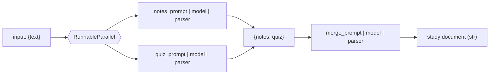
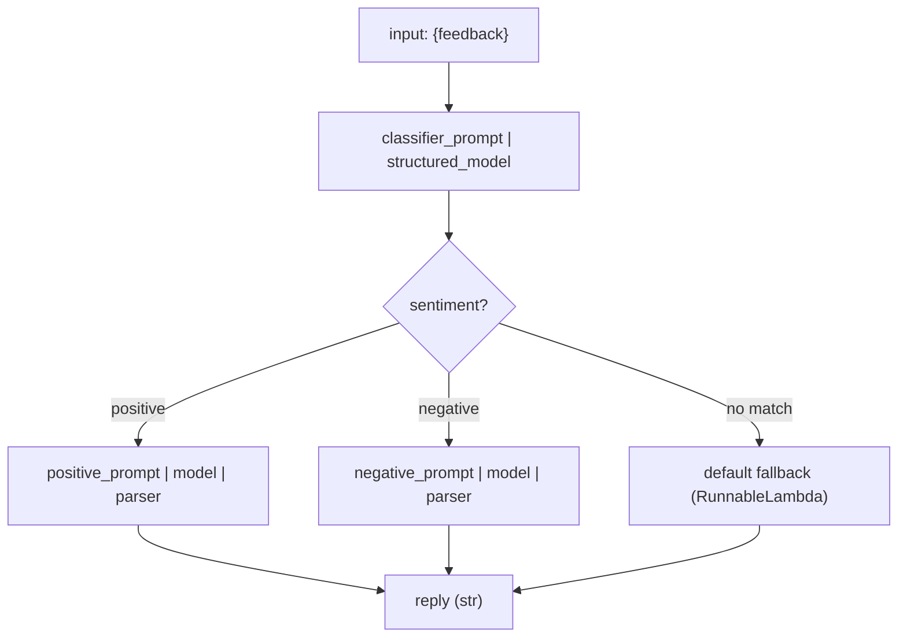

# 08. Chains in LangChain  (Video 7)

> 📺 [Watch on YouTube](https://www.youtube.com/playlist?list=PLKnIA16_RmvaTbihpo4MtzVm4XOQa0ER0) · ⏱️ ~54:01 · CampusX — Generative AI using LangChain

---

## 🎯 What You'll Learn

- What a **chain** is: a declarative pipeline that wires LangChain components together so you invoke the whole flow once instead of hand-calling each step.
- **LCEL (LangChain Expression Language)** and the **pipe (`|`) operator** — the syntax that glues components into a chain and streams each step's output into the next.
- How to build a **simple chain**: `prompt | model | StrOutputParser()`.
- How to build a **sequential chain** that feeds one LLM's output into a second prompt (topic → detailed report → 5-point summary).
- How to build a **parallel chain** with `RunnableParallel`, running two branches on the same input concurrently and merging them.
- How to build a **conditional chain** with `RunnableBranch`, routing to different prompts based on a (structured) classifier, with a mandatory fallback branch.
- How to **visualize** any chain's topology with `chain.get_graph().print_ascii()`.
- Why every chain is really just composed **Runnables** under the hood.

---

## 📖 Overview / Why It Matters

Up to this point we've used the core components in isolation — build a `PromptTemplate`, call `model.invoke(...)`, hand the result to an `OutputParser`. That works, but it's tedious and error-prone: you manually pass the output of every step into the input of the next, and any non-trivial application (report generator, RAG pipeline, multi-stage agent) becomes a tangle of intermediate variables and glue code.

A **chain** solves this. It lets you declare a pipeline of components once and then run the whole thing with a single `invoke`. The library handles the plumbing: the output of each stage is automatically piped as the input to the next.

**Manual (before):**

```python
prompt_value = prompt.invoke({"topic": "cricket"})
ai_message  = model.invoke(prompt_value)
answer      = parser.invoke(ai_message)
```

**Chain (after):**

```python
chain = prompt | model | parser
answer = chain.invoke({"topic": "cricket"})
```

Same result, but the intermediate `prompt_value` and `ai_message` never surface in your code — the chain threads them through internally. This is the payoff of **LCEL**: pipelines read top-to-bottom like a Unix shell command, they're easy to reorder, and every chain you build is itself a component you can drop into a *bigger* chain.

Chains sit on top of the **Runnable** abstraction (covered in [09_runnables-part1.md](09_runnables-part1.md) and [10_runnables-part2.md](10_runnables-part2.md)). Prompts, models, parsers, and the composition primitives (`RunnableParallel`, `RunnableBranch`, `RunnableLambda`, `RunnablePassthrough`) are all Runnables — that's *why* they can be `|`-piped together and why every chain automatically supports `invoke`, `batch`, and `stream`.

---

## 🧠 Key Concepts

### LCEL and the pipe operator

**LCEL** (LangChain Expression Language) is the declarative way to compose components. The `|` operator is overloaded (Python's `__or__`) so that `a | b` means "run `a`, then feed its output into `b`." The result of piping is itself a `Runnable` (a `RunnableSequence`), so it exposes the same interface as any single component:

- `chain.invoke(input)` — run once on one input.
- `chain.batch([in1, in2, ...])` — run on many inputs (parallelized).
- `chain.stream(input)` — stream partial output as it's produced.

The **type contract** between adjacent steps matters: a step's output type must be an acceptable input type for the next step. A `PromptTemplate` outputs a `PromptValue`, a chat model accepts a `PromptValue` and outputs an `AIMessage`, and `StrOutputParser` accepts an `AIMessage` and outputs a `str`. That's exactly why `prompt | model | parser` type-checks and runs cleanly.

### Simple chain

The most basic pipeline: one prompt, one model, one parser. `StrOutputParser` simply pulls the `.content` string out of the model's `AIMessage`, so the chain returns a plain string instead of a message object.

### Sequential chain

A chain isn't limited to three stages — you can keep piping. A **sequential chain** runs several LLM calls in order, where each call's output becomes (part of) the next call's input. Classic example: take a `topic`, generate a **detailed report**, then feed that report into a second prompt that produces a **5-point summary**. Structurally it's just:

```
prompt1 | model | parser | prompt2 | model | parser
```

The `str` coming out of the first `parser` becomes the input to `prompt2`. If `prompt2` expects a variable named `text`, the string flows into `{text}` automatically because a `PromptTemplate` with a single input variable will accept a bare string.

### Parallel chain (`RunnableParallel`)

Sometimes several independent steps depend on the *same* input and don't need each other's output — running them in sequence just wastes wall-clock time. `RunnableParallel` runs a **dict of branches concurrently** on the same input and returns a dict of their outputs, keyed by the same names.

Motivating example: given a document, generate **short notes** *and* a **quiz** at the same time, then **merge** both into a single study sheet with a third prompt.

```python
from langchain_core.runnables import RunnableParallel

parallel = RunnableParallel({
    "notes": notes_prompt | model | parser,
    "quiz":  quiz_prompt  | model | parser,
})
```

Calling `parallel.invoke({"text": doc})` fires both branches concurrently and returns `{"notes": ..., "quiz": ...}`. That dict then flows straight into a merge prompt whose input variables are `notes` and `quiz` — the keys line up automatically.



### Conditional chain (`RunnableBranch`)

A **conditional chain** picks *which* branch to run at runtime based on the input. `RunnableBranch` takes a sequence of `(condition, runnable)` pairs plus a **mandatory default** runnable at the end:

```python
RunnableBranch(
    (condition_1, runnable_1),
    (condition_2, runnable_2),
    default_runnable,          # fallback — runs if no condition matched
)
```

Each `condition` is a callable returning a bool; the **first** one that returns `True` wins and its runnable runs. If none match, the default runs. **The default is not optional** — omit it and you risk an unhandled input falling through with no branch to run.

Canonical example: classify the **sentiment** of customer feedback, then route to a "positive reply" prompt or a "negative reply" prompt. The reliable way to classify is a **structured classifier** — pair the model with a Pydantic schema via `with_structured_output(...)` so you get back a typed object (e.g. `sentiment="positive"`) instead of free text you'd have to parse fragilely with string matching.



### Visualizing a chain

Because a chain is a graph of Runnables, LangChain can render it. `chain.get_graph().print_ascii()` prints an ASCII diagram of the pipeline — the nodes and how they connect. It's the fastest way to sanity-check that a parallel or branching chain is wired the way you intended.

---

## 💻 Code Examples

Assume a common setup at the top of each script:

```python
from langchain_openai import ChatOpenAI
from langchain_core.prompts import PromptTemplate
from langchain_core.output_parsers import StrOutputParser

model  = ChatOpenAI(model="gpt-4o-mini")
parser = StrOutputParser()
```

### 1. Simple chain — 5 facts about a topic

```python
from langchain_core.prompts import PromptTemplate
from langchain_core.output_parsers import StrOutputParser
from langchain_openai import ChatOpenAI

prompt = PromptTemplate(
    template="Generate 5 interesting facts about {topic}.",
    input_variables=["topic"],
)
model  = ChatOpenAI(model="gpt-4o-mini")
parser = StrOutputParser()

chain = prompt | model | parser

result = chain.invoke({"topic": "cricket"})
print(result)

# Inspect the pipeline
chain.get_graph().print_ascii()
```

### 2. Sequential chain — topic → report → 5-point summary

```python
from langchain_core.prompts import PromptTemplate
from langchain_core.output_parsers import StrOutputParser
from langchain_openai import ChatOpenAI

model  = ChatOpenAI(model="gpt-4o-mini")
parser = StrOutputParser()

report_prompt = PromptTemplate(
    template="Generate a detailed report on {topic}.",
    input_variables=["topic"],
)

summary_prompt = PromptTemplate(
    template="Generate a 5-point summary from the following text:\n{text}",
    input_variables=["text"],
)

chain = report_prompt | model | parser | summary_prompt | model | parser

result = chain.invoke({"topic": "Unemployment in India"})
print(result)

chain.get_graph().print_ascii()
```

The string produced by the first `parser` flows into `summary_prompt`'s single `{text}` slot automatically.

### 3. Parallel chain — notes + quiz, then merge (`RunnableParallel`)

```python
from langchain_core.prompts import PromptTemplate
from langchain_core.output_parsers import StrOutputParser
from langchain_core.runnables import RunnableParallel
from langchain_openai import ChatOpenAI

model  = ChatOpenAI(model="gpt-4o-mini")
parser = StrOutputParser()

notes_prompt = PromptTemplate(
    template="Generate short, revision-friendly notes from the following text:\n{text}",
    input_variables=["text"],
)
quiz_prompt = PromptTemplate(
    template="Generate 5 short question-answer quiz items from the following text:\n{text}",
    input_variables=["text"],
)
merge_prompt = PromptTemplate(
    template="Merge the notes and quiz into a single study document.\n"
             "Notes:\n{notes}\n\nQuiz:\n{quiz}",
    input_variables=["notes", "quiz"],
)

# Two branches run concurrently on the SAME {text}; outputs keyed 'notes' / 'quiz'
parallel_chain = RunnableParallel({
    "notes": notes_prompt | model | parser,
    "quiz":  quiz_prompt  | model | parser,
})

# The dict {'notes': ..., 'quiz': ...} feeds straight into merge_prompt
chain = parallel_chain | merge_prompt | model | parser

document = """<a few paragraphs of source material here>"""
result = chain.invoke({"text": document})
print(result)

chain.get_graph().print_ascii()
```

### 4. Conditional chain — sentiment routing (`RunnableBranch` + structured classifier)

```python
from typing import Literal
from pydantic import BaseModel, Field

from langchain_core.prompts import PromptTemplate
from langchain_core.output_parsers import StrOutputParser
from langchain_core.runnables import RunnableBranch, RunnableLambda
from langchain_openai import ChatOpenAI

model  = ChatOpenAI(model="gpt-4o-mini")
parser = StrOutputParser()

# 1. Structured classifier — reliable, typed output instead of free text
class Feedback(BaseModel):
    sentiment: Literal["positive", "negative"] = Field(
        description="Sentiment of the customer feedback"
    )

structured_model = model.with_structured_output(Feedback)

classifier_prompt = PromptTemplate(
    template="Classify the sentiment of the following feedback as positive or negative:\n{feedback}",
    input_variables=["feedback"],
)

classifier_chain = classifier_prompt | structured_model   # -> Feedback object

# 2. The two reply branches
positive_prompt = PromptTemplate(
    template="Write a warm thank-you reply to this positive feedback:\n{feedback}",
    input_variables=["feedback"],
)
negative_prompt = PromptTemplate(
    template="Write an empathetic, apologetic reply to this negative feedback:\n{feedback}",
    input_variables=["feedback"],
)

# 3. Branch on the classifier's structured output. Conditions receive the whole
#    input dict, which carries the classifier's Feedback under 'sentiment'.
branch_chain = RunnableBranch(
    (lambda x: x["sentiment"] == "positive", positive_prompt | model | parser),
    (lambda x: x["sentiment"] == "negative", negative_prompt | model | parser),
    RunnableLambda(lambda x: "Could not determine sentiment."),  # mandatory fallback
)

# 4. Wire classifier -> branch. We reshape the classifier output into a dict
#    that carries both the original feedback and the detected sentiment.
def to_branch_input(feedback_obj: Feedback, original: str) -> dict:
    return {"feedback": original, "sentiment": feedback_obj.sentiment}

feedback_text = "The product broke after two days. Terrible experience."

feedback_obj = classifier_chain.invoke({"feedback": feedback_text})
result = branch_chain.invoke(to_branch_input(feedback_obj, feedback_text))
print(result)

branch_chain.get_graph().print_ascii()
```

> Tip: to make the whole thing a *single* LCEL chain you can use `RunnablePassthrough` /
> `RunnableParallel` to carry the original `feedback` alongside the classified `sentiment`,
> then pipe that dict into `branch_chain`. See [10_runnables-part2.md](10_runnables-part2.md).

---

## 📊 Comparison / Reference Table

| Chain type | LCEL primitive | Runs steps… | Use case |
|---|---|---|---|
| **Simple** | `prompt \| model \| parser` (a `RunnableSequence`) | One after another | Single-shot generation — e.g. 5 facts about a topic |
| **Sequential** | Longer `\|` pipe: `p1 \| model \| parser \| p2 \| model \| parser` | Strictly in order; each output feeds the next | Multi-stage transforms — e.g. report → 5-point summary |
| **Parallel** | `RunnableParallel({...})` | Concurrently on the same input | Independent branches on one input — e.g. notes **and** quiz, then merge |
| **Conditional** | `RunnableBranch((cond, r), ..., default)` | Only the first matching branch (else default) | Routing / dispatch — e.g. positive vs. negative reply by sentiment |
| **Glue / reshape** | `RunnableLambda`, `RunnablePassthrough` | Inline function / pass-through | Adapt shapes between steps, carry original input forward |

---

## ⚠️ Gotchas & Tips

- **Import location.** All composition primitives live in `langchain_core.runnables`: `from langchain_core.runnables import RunnableParallel, RunnableBranch, RunnableLambda, RunnablePassthrough`. Don't import them from the top-level `langchain` package.
- **Type contract between steps.** Each step's output must be a valid input for the next. A `PromptTemplate` with a *single* input variable happily accepts a bare string; with *multiple* variables it needs a dict, so make sure the previous step emits keys that match.
- **`RunnableBranch` default is mandatory.** The last positional argument is the fallback and is required. Without it, an input matching no condition has nowhere to go. Also: only the **first** matching condition runs — order your conditions from most specific to least.
- **Prefer structured output for routing.** Classifying with `with_structured_output(PydanticModel)` gives you a typed field (`x.sentiment`) instead of brittle string matching on free-form LLM text (`"positive" in text`). Constrain the field with `Literal[...]` so the model can't return surprises.
- **`RunnableParallel` needs matching keys downstream.** Its output dict keys (`notes`, `quiz`) must line up with the next prompt's input variables. Mismatched names are the #1 source of `KeyError`/missing-variable errors in parallel chains.
- **Parallelism ≠ free.** `RunnableParallel` runs branches concurrently, but each branch is still a separate LLM call — you pay for all of them. It saves latency, not tokens/cost.
- **`get_graph().print_ascii()` may need `grandalf`.** ASCII rendering depends on the optional `grandalf` package (`pip install grandalf`). Use it liberally while debugging parallel/branch topologies.
- **Everything is a Runnable.** A chain is itself a Runnable, so it composes into bigger chains and automatically supports `invoke`, `batch`, and `stream`. If a chain behaves oddly, drop back to the Runnable fundamentals in [09_runnables-part1.md](09_runnables-part1.md).

---

## 🧠 Key Takeaways

- A **chain** replaces manual `prompt.invoke → model.invoke → parser.invoke` plumbing with a single declarative pipeline you run via one `invoke`.
- **LCEL** and the **`|` operator** compose components; `a | b` pipes `a`'s output into `b`, and the result is itself a Runnable exposing `invoke` / `batch` / `stream`.
- **Simple chain** = `prompt | model | StrOutputParser()` — returns a plain string.
- **Sequential chain** just keeps piping: one LLM's output becomes the next prompt's input (report → summary).
- **`RunnableParallel`** runs a dict of branches **concurrently** on the same input and returns a dict; great for independent sub-tasks you later merge.
- **`RunnableBranch`** routes to the first branch whose condition is `True`, with a **mandatory default** fallback; pair it with a **structured (Pydantic) classifier** for reliable routing.
- Use **`RunnableLambda` / `RunnablePassthrough`** to reshape or carry data between steps when keys don't line up naturally.
- **`chain.get_graph().print_ascii()`** visualizes the pipeline — invaluable for verifying parallel and conditional wiring.
- Chains are built entirely on **Runnables** — see [Runnables Part 1](09_runnables-part1.md) and [Part 2](10_runnables-part2.md) for the underlying abstraction. (For where chains fit in a retrieval pipeline, compare the [text-splitter RAG notes](../12_rag/03_text-splitters.md).)

---

## ❓ Revision Questions

1. What problem do chains solve compared to calling `prompt.invoke`, `model.invoke`, and `parser.invoke` by hand?
2. What does the `|` operator do in LCEL, and what type of object results from piping several components together?
3. Write the simplest possible chain that generates 5 facts about a topic and returns a plain string. Which parser makes the output a `str` rather than an `AIMessage`?
4. In a sequential chain `report_prompt | model | parser | summary_prompt | model | parser`, how does the report's text reach the summary prompt? What must be true of `summary_prompt`'s input variables?
5. What does `RunnableParallel` do, what is the shape of its output, and why is it faster than running the same branches sequentially — but not cheaper?
6. In the notes + quiz example, why must the parallel branches' output keys match the merge prompt's input variables? What error appears if they don't?
7. Describe the structure of a `RunnableBranch`. Why is the final default argument mandatory, and which branch runs when two conditions are both `True`?
8. Why is a structured (Pydantic + `with_structured_output`) classifier preferable to string-matching an LLM's free-text sentiment output when routing in a conditional chain?
9. How would you inspect the topology of a parallel or conditional chain, and what optional dependency does that rendering rely on?
10. Explain the statement "every chain is just composed Runnables." What three standard methods does any chain therefore support?
