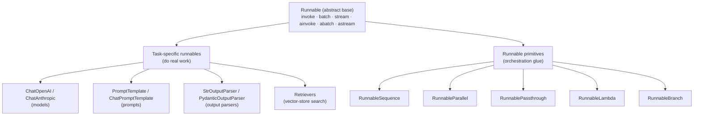

# 09. What are Runnables in LangChain — Part 1  (Video 8)

> 📺 [Watch on YouTube](https://www.youtube.com/playlist?list=PLKnIA16_RmvaTbihpo4MtzVm4XOQa0ER0) · ⏱️ ~1h 16m · CampusX — Generative AI using LangChain

---

## 🎯 What You'll Learn

- Why early LangChain's zoo of bespoke chain classes (`LLMChain`, `SimpleSequentialChain`, `SequentialChain`, `RetrievalQA`, …) didn't scale, and what problem that created.
- The **Runnable** abstraction: one standardized interface that *every* component implements, so any component can plug into any other — LEGO-brick / USB-port style composability.
- The core Runnable interface — `invoke()`, `batch()`, `stream()` — plus their async twins `ainvoke()`, `abatch()`, `astream()`, with a snippet for each.
- The two families of Runnables: **task-specific runnables** (the real components) and **runnable primitives** (the orchestration glue).
- What the `|` pipe operator actually does: `a | b` builds a `RunnableSequence([a, b])` — and why the pipe form and the explicit form are equivalent.
- A hand-rolled "toy Runnable" abstract base class that shows *why* a shared interface is the whole trick behind LCEL.
- A map of the five primitives (`RunnableSequence`, `RunnableParallel`, `RunnablePassthrough`, `RunnableLambda`, `RunnableBranch`) — introduced here, dissected in [Part 2](10_runnables-part2.md).

---

## 📖 Overview / Why It Matters

By this point in the playlist you've met the individual building blocks of a LangChain app: models (`ChatOpenAI`), prompts (`PromptTemplate`, `ChatPromptTemplate`), output parsers (`StrOutputParser`, `PydanticOutputParser`), retrievers, and so on. The natural next question is: **how do you wire these pieces together into a pipeline?**

The modern answer is **LCEL — the LangChain Expression Language** — and LCEL is built entirely on top of one idea: the **Runnable**. A Runnable is any object that exposes a small, fixed, standardized interface (`invoke`, `batch`, `stream`, and async variants). Because *every* component in modern LangChain is a Runnable, and every Runnable speaks the same interface, you can connect them together freely — the output of one becomes the input of the next — using nothing more than the `|` operator.

This note is the **conceptual foundation**: it explains *why* the Runnable abstraction was invented (by looking at the mess it replaced), *what* the interface is, and *how* the pieces compose. It deliberately keeps the primitives at an introductory level — the deep, worked examples of `RunnableSequence`, `RunnableParallel`, `RunnablePassthrough`, `RunnableLambda`, and `RunnableBranch` live in **[Runnables Part 2](10_runnables-part2.md)**.

---

## 🧠 Key Concepts

### 1. The history: a zoo of rigid, one-off chain classes

Early LangChain shipped a *separate class for every kind of pipeline you might want to build*. A few of the most common ones:

| Old chain class | What it did |
|---|---|
| `LLMChain` | prompt → LLM → (optional) parse, the atomic single-step chain |
| `SimpleSequentialChain` | run chains one after another, passing a single string forward |
| `SequentialChain` | like above, but with multiple named inputs/outputs between steps |
| `RetrievalQA` | retrieve documents, stuff them into a prompt, ask the LLM |
| `ConversationChain` | an LLM chain with conversational memory attached |

On the surface this looks convenient — there's a ready-made class for each scenario. But it created three structural problems:

1. **Every class had its own interface.** `LLMChain` was called one way, `RetrievalQA` another, `SequentialChain` another. There was no single "how do I run this thing" contract. Learning one class taught you almost nothing about the next.
2. **They didn't compose.** You couldn't cleanly take the output of a `RetrievalQA` and feed it into an `LLMChain` and then into a custom step — the classes weren't designed around a common plug shape, so gluing them together meant awkward adapter code.
3. **Every new capability meant a new class.** Want to add a branching step? A parallel fan-out step? A "pass the input through untouched" step? Each of these spawned yet another bespoke class with yet another interface. The surface area exploded, and it didn't scale — for the library maintainers *or* for the users trying to learn it.

The root cause is the same in all three: **there was no shared standard.** Components were built as independent silos.

### 2. The fix: a common interface every component implements

The insight behind LCEL is borrowed straight from good systems design: **agree on one standard interface, and make everything implement it.**

Two everyday analogies capture it:

- **LEGO bricks.** Every LEGO brick, regardless of size or color, has the same stud-and-socket connector. That single shared connector is *why* any brick snaps onto any other brick. The bricks don't need to know about each other; they only need to agree on the connector.
- **USB ports.** A keyboard, a mouse, a flash drive, and a webcam are wildly different devices, but they all expose the same USB plug. The port doesn't care what's on the other end — it just needs the standard shape.

In LangChain, that "standard connector" is the **`Runnable`** interface. A Runnable is any object that implements a fixed set of methods (below). Prompts are Runnables. Models are Runnables. Parsers are Runnables. Retrievers are Runnables. Even a plain Python function can be wrapped into a Runnable. Because they *all* speak the same interface, **any Runnable can connect to any other Runnable** — and the framework can offer generic tooling (streaming, batching, async, retries, fallbacks, tracing) that works uniformly across every component.

> The old chain classes still exist for backward compatibility, but they are effectively **deprecated**. New code should be written in LCEL using Runnables.

### 3. The standard Runnable interface

Every Runnable exposes the same small set of methods. There are three "core" methods, each with an async counterpart:

| Method | Input | Purpose |
|---|---|---|
| `invoke(input)` | a single input | Run the component once on one input, return one output. The workhorse. |
| `batch(inputs)` | a list of inputs | Run on many inputs, often with internal parallelism. Returns a list of outputs. |
| `stream(input)` | a single input | Run and **yield output incrementally** (e.g. token-by-token for an LLM) instead of waiting for the whole result. |
| `ainvoke` / `abatch` / `astream` | same as above | `async` versions for use inside `async def` code and event loops. |

The key property: **because every Runnable — a single model *or* a giant composed pipeline — implements these same methods, you call a one-line prompt and a hundred-step chain the exact same way.** That uniformity is the entire payoff.

```python
from langchain_openai import ChatOpenAI

model = ChatOpenAI(model="gpt-4o-mini")

# invoke — one input, one output
model.invoke("Give me a one-line joke about cricket.")

# batch — many inputs at once
model.batch([
    "Capital of France?",
    "Capital of Japan?",
    "Capital of Brazil?",
])

# stream — get tokens as they are generated
for chunk in model.stream("Write a short poem about the monsoon."):
    print(chunk.content, end="", flush=True)
```

```python
# async variants — same semantics, awaited inside an event loop
async def main():
    await model.ainvoke("Hello!")
    await model.abatch(["hi", "hey", "yo"])
    async for chunk in model.astream("Tell me a story."):
        print(chunk.content, end="", flush=True)
```

### 4. Two categories of Runnables

Runnables come in two flavors. Keeping them straight is the single most useful mental model here.

#### a) Task-specific runnables

These are the **actual components** — the ones that do real work — re-expressed as Runnables. Each performs a concrete task in a LangChain workflow:

- `ChatOpenAI`, `ChatAnthropic`, `ChatGoogleGenerativeAI` — call an LLM.
- `PromptTemplate`, `ChatPromptTemplate` — format a prompt from variables.
- `StrOutputParser`, `PydanticOutputParser`, `JsonOutputParser` — parse the model's output.
- retrievers (from vector stores, etc.) — fetch relevant documents.

You already know these from earlier videos. The only new fact is that *they are all Runnables*, so they all support `invoke`/`batch`/`stream` and can be piped together.

#### b) Runnable primitives

These are **orchestration building blocks** — they don't do domain work themselves; they exist purely to **wire task-specific runnables into larger structures**. Think of them as the connectors and control-flow of LCEL:

| Primitive | One-line purpose (deep dive → [Part 2](10_runnables-part2.md)) |
|---|---|
| `RunnableSequence` | Chain runnables end-to-end: output of each becomes the input of the next. What the `\|` operator builds. |
| `RunnableParallel` | Run several runnables on the **same input** at once, returning a dict of their results. |
| `RunnablePassthrough` | Forward the input onward **unchanged** — useful for keeping the original input alongside a transformed one. |
| `RunnableLambda` | Wrap **any plain Python function** so it becomes a Runnable and can join a chain. |
| `RunnableBranch` | **Conditional routing** — pick which runnable to execute based on the input (LCEL's `if/elif/else`). |

They're only *introduced* here. Part 2 walks through each with runnable examples.

### 5. The Runnable hierarchy



Everything descends from a single abstract `Runnable`, and everything therefore shares the same interface. That is the whole reason the two families in the middle can be freely combined.

### 6. Building a chain: explicit `RunnableSequence` vs the `|` pipe

There are two ways to connect Runnables in sequence, and they produce **exactly the same object**.

**Explicit form** — construct a `RunnableSequence` directly:

```python
from langchain_core.runnables import RunnableSequence

chain = RunnableSequence(prompt, model, parser)
result = chain.invoke({"topic": "cricket"})
```

**Pipe form** — use the `|` operator:

```python
chain = prompt | model | parser
result = chain.invoke({"topic": "cricket"})
```

Under the hood, `|` is just Python operator overloading. Every Runnable defines `__or__`, so writing `a | b` **calls `a.__or__(b)`, which returns a `RunnableSequence([a, b])`.** Chaining three of them, `a | b | c`, folds down to `RunnableSequence([a, b, c])`. That's it — there is no magic beyond "the pipe constructs a sequence for you." The pipe form is simply more readable, so it's what you'll see everywhere in idiomatic LCEL.

When you call `.invoke()` on the resulting sequence, it runs each step in order, feeding each step's output as the next step's input — precisely the behavior the old `SequentialChain` gave you, but now on a universal interface and with `batch`/`stream`/async for free.

### 7. A toy Runnable — why a shared interface is the whole trick

To really *feel* why the abstraction matters, it helps to build a miniature version by hand. We'll define an abstract `Runnable` base class with a single `invoke` method, implement two fake components against it, and write a tiny connector that chains any number of Runnables together — purely because they all share the same `invoke` contract.

```python
from abc import ABC, abstractmethod


class Runnable(ABC):
    """The one shared contract: everything must implement invoke()."""
    @abstractmethod
    def invoke(self, input_data):
        ...


class FakePromptTemplate(Runnable):
    """A stand-in 'prompt' component."""
    def __init__(self, template):
        self.template = template

    def invoke(self, input_data):
        return self.template.format(**input_data)


class FakeLLM(Runnable):
    """A stand-in 'model' component."""
    def invoke(self, input_data):
        # pretend we actually called an LLM with `input_data`
        return f"[LLM answer to] {input_data}"


class FakeStrParser(Runnable):
    """A stand-in 'output parser' component."""
    def invoke(self, input_data):
        return input_data.strip().upper()


class RunnableConnector(Runnable):
    """The connector: chain any list of Runnables by their shared invoke()."""
    def __init__(self, runnable_list):
        self.runnable_list = runnable_list

    def invoke(self, input_data):
        for runnable in self.runnable_list:
            input_data = runnable.invoke(input_data)  # output → next input
        return input_data


# Wire them together — this only works because they ALL implement invoke()
prompt = FakePromptTemplate("Write a joke about {topic}")
llm = FakeLLM()
parser = FakeStrParser()

chain = RunnableConnector([prompt, llm, parser])
print(chain.invoke({"topic": "cricket"}))
# -> [LLM ANSWER TO] WRITE A JOKE ABOUT CRICKET
```

The lesson: `RunnableConnector` doesn't know or care *what* each component is — a prompt, a model, a parser, or even another `RunnableConnector`. It only relies on the fact that **every element exposes the same `invoke` method.** That single shared contract is exactly what real LangChain's `RunnableSequence` (and the `|` operator) provides, just with `batch`, `stream`, async, error handling, and tracing layered on top. Once you see this toy version, LCEL stops looking like magic and starts looking like disciplined interface design.

---

## 💻 Code Examples

### 1. The classic three-step LCEL chain (prompt → model → parser)

```python
from langchain_core.prompts import PromptTemplate
from langchain_core.output_parsers import StrOutputParser
from langchain_openai import ChatOpenAI

prompt = PromptTemplate.from_template("Write a 2-line joke about {topic}.")
model = ChatOpenAI(model="gpt-4o-mini")
parser = StrOutputParser()

chain = prompt | model | parser          # RunnableSequence under the hood
print(chain.invoke({"topic": "programmers"}))
```

### 2. The same chain, built explicitly

```python
from langchain_core.runnables import RunnableSequence

chain = RunnableSequence(prompt, model, parser)   # identical behavior to prompt | model | parser
print(chain.invoke({"topic": "programmers"}))
```

### 3. A composed chain is itself a Runnable — so it also supports batch & stream

```python
# batch: run the whole pipeline over many inputs
chain.batch([
    {"topic": "cats"},
    {"topic": "databases"},
    {"topic": "Mondays"},
])

# stream: tokens flow out of the whole chain as they're generated
for piece in chain.stream({"topic": "the cloud"}):
    print(piece, end="", flush=True)
```

The point of examples 1–3: whether you have a single model or a three-stage pipeline, the calling convention (`invoke` / `batch` / `stream`) is identical — because both are Runnables.

### 4. Peeking at what the pipe builds

```python
chain = prompt | model | parser
print(type(chain))          # <class 'langchain_core.runnables.base.RunnableSequence'>
print(len(chain.steps))     # 3  -> [prompt, model, parser]
```

### 5. Introducing the primitives (shape only — details in Part 2)

```python
from langchain_core.runnables import (
    RunnableSequence,     # chain steps in order
    RunnableParallel,     # fan out to multiple runnables on the same input
    RunnablePassthrough,  # forward input unchanged
    RunnableLambda,       # wrap a plain Python function as a Runnable
    RunnableBranch,       # conditional routing (if/elif/else)
)

# e.g. wrapping a normal function so it can live inside a chain:
word_count = RunnableLambda(lambda text: len(text.split()))
print(word_count.invoke("how many words is this"))   # 5
```

See **[Runnables Part 2](10_runnables-part2.md)** for full, worked examples of each primitive.

---

## 📊 Comparison / Reference Table

**Old bespoke chains vs the modern Runnable approach**

| Aspect | Old chain classes (`LLMChain`, `SequentialChain`, `RetrievalQA`, …) | Modern Runnables (LCEL) |
|---|---|---|
| Interface | Different per class — no single contract | One shared interface: `invoke` / `batch` / `stream` (+ async) |
| Composability | Poor — classes weren't built to plug together | Excellent — any Runnable pipes into any Runnable via `\|` |
| Adding a new step type | Write a whole new class | Reuse a primitive (`RunnableLambda`, `RunnableBranch`, …) |
| Streaming / batching / async | Ad-hoc, inconsistent, often missing | Built in and uniform across every component |
| Status | Effectively deprecated (kept for back-compat) | The recommended way to build chains |

**The Runnable interface at a glance**

| Method | Sync | Async | Returns |
|---|---|---|---|
| Run once | `invoke(x)` | `ainvoke(x)` | single output |
| Run over a list | `batch(xs)` | `abatch(xs)` | list of outputs |
| Stream incrementally | `stream(x)` | `astream(x)` | generator / async-generator of chunks |

---

## ⚠️ Gotchas & Tips

- **Import primitives from `langchain_core.runnables`.** In modern split-package LangChain, `RunnableSequence`, `RunnableParallel`, `RunnablePassthrough`, `RunnableLambda`, and `RunnableBranch` all live in `langchain_core.runnables`. Older tutorials importing them from `langchain.schema.runnable` are outdated.
- **`prompt | model | parser` *is* a `RunnableSequence`.** The pipe operator is pure syntactic sugar via `__or__`; there's no separate mechanism to learn. If a chain misbehaves, remember you can inspect `chain.steps`.
- **Order matters in a sequence.** Each step's output type must match the next step's expected input type. A model returns a message object; put a `StrOutputParser` after it if the next step (or your `print`) expects a plain string.
- **Don't reach for the legacy chain classes in new code.** `LLMChain`, `SimpleSequentialChain`, `SequentialChain`, `RetrievalQA`, etc. still import, but they're deprecated. Anything they did, LCEL does more composably.
- **`batch` is not just a loop.** It can execute inputs concurrently (with a configurable `max_concurrency`), so it's usually faster than calling `invoke` in a Python `for` loop — and it's rate-limit-aware.
- **Use the async methods only inside an event loop.** `ainvoke`/`abatch`/`astream` must be `await`ed from `async def` code; calling them from ordinary synchronous code won't run them.
- **A whole chain is a Runnable too.** This is the recursive superpower: because a `RunnableSequence` is itself a Runnable, you can nest chains inside chains, pass a chain into a `RunnableParallel`, and so on. Composition has no special "top level."

---

## 🧠 Key Takeaways

- Early LangChain had a **separate rigid class for every pipeline** (`LLMChain`, `SequentialChain`, `RetrievalQA`, …); each had its own interface, they didn't compose, and every new capability meant a new class — it didn't scale.
- The fix is the **Runnable abstraction**: one standardized interface that **every** component implements, so any component connects to any other — LEGO-brick / USB-port composability.
- The interface is small and uniform: **`invoke` (one), `batch` (many), `stream` (incremental)**, plus async twins **`ainvoke` / `abatch` / `astream`**.
- Runnables split into **task-specific runnables** (models, prompts, parsers, retrievers — the real work) and **runnable primitives** (orchestration glue).
- The five primitives are **`RunnableSequence`, `RunnableParallel`, `RunnablePassthrough`, `RunnableLambda`, `RunnableBranch`** — introduced here, detailed in [Part 2](10_runnables-part2.md).
- The **`|` operator** overloads `__or__`: `a | b` builds a `RunnableSequence([a, b])`. The pipe form and the explicit `RunnableSequence(...)` form are **equivalent**.
- Because a composed chain is *itself* a Runnable, you call a one-line component and a hundred-step pipeline **exactly the same way**, and you can nest chains arbitrarily.
- A **toy `Runnable` base class + a connector** makes the point crisp: the connector works only because every element shares one `invoke` contract — that shared contract *is* LCEL.

---

## ❓ Revision Questions

1. Name three old LangChain chain classes and state the single structural weakness they all shared.
2. What is a Runnable? Explain the LEGO-brick / USB-port analogy and what plays the role of the "standard connector" in LangChain.
3. List the three core Runnable methods and their async counterparts, and say what each one is for.
4. What is the difference between a **task-specific runnable** and a **runnable primitive**? Give two examples of each.
5. What exactly does `a | b` do internally, and what type of object does `prompt | model | parser` produce?
6. Show two equivalent ways to build the same prompt → model → parser chain, and explain why they behave identically.
7. Why can you call `.batch()` and `.stream()` on a full multi-step chain and not just on a single model?
8. In the hand-rolled toy example, why does `RunnableConnector` not need to know what kind of component each list element is?
9. From which package should you import `RunnableSequence` and friends in modern LangChain, and why are the legacy chain classes discouraged?
10. Name all five runnable primitives and give a one-line purpose for each.
