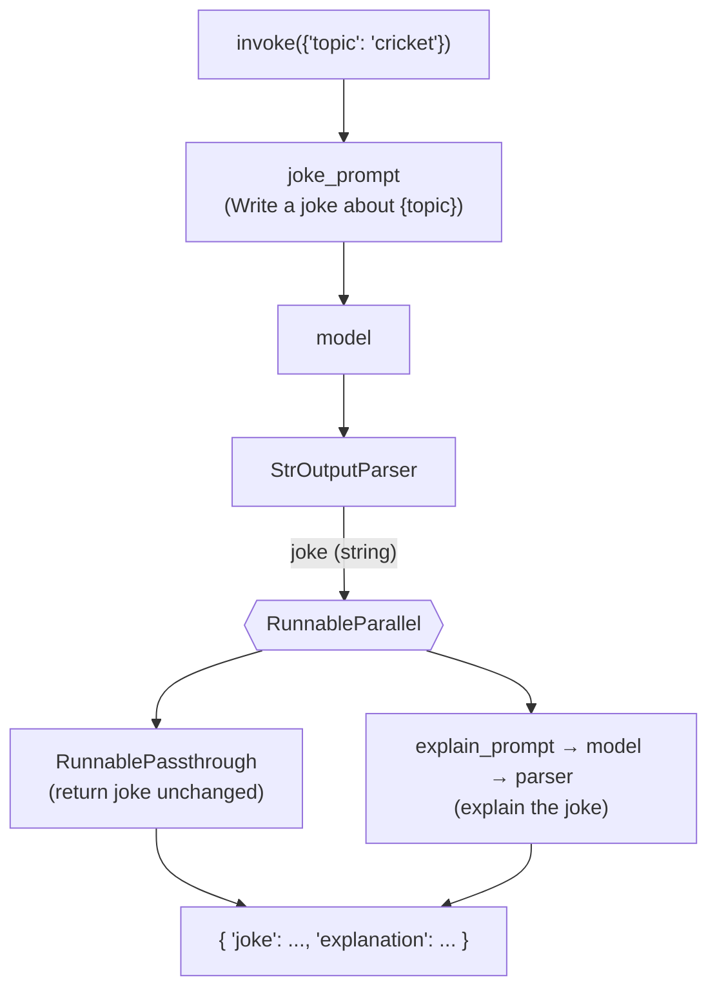

# 10. LangChain Runnables — Part 2  (Video 9)

> 📺 [Watch on YouTube](https://www.youtube.com/playlist?list=PLKnIA16_RmvaTbihpo4MtzVm4XOQa0ER0) · ⏱️ ~54:26 · CampusX — Generative AI using LangChain

---

## 🎯 What You'll Learn

- The **six core runnable primitives** that LangChain Expression Language (LCEL) is built from, each with a full runnable example:
  `RunnableSequence`, `RunnableParallel`, `RunnablePassthrough`, `RunnableLambda`, `RunnableBranch`, and `RunnablePassthrough.assign()`.
- Why the `|` (pipe) operator is *exactly* syntactic sugar for `RunnableSequence` — and when to reach for the explicit class instead.
- How to **fan out** one input to several runnables at once and collect a `dict` of results.
- How to **carry the original input forward** alongside computed values (the "pass-through" trick) so nothing you already have gets dropped mid-chain.
- How to wrap **arbitrary Python functions** as first-class runnables for glue / pre- / post-processing.
- How to add **conditional routing** to a chain (`if long → summarize, else → pass through`).
- The precise realization that the "chains" from [Video 8](08_chains.md) are *nothing but* these primitives composed together — every prompt, model, parser, and retriever is a `Runnable`.

---

## 📖 Overview / Why It Matters

[Part 1](09_runnables-part1.md) answered the *why*: LangChain needed a **common interface** so that every component — prompts, chat models, output parsers, retrievers, tools — could be snapped together like Lego. That interface is the `Runnable`. It guarantees every object exposes the same standard methods (`invoke`, `batch`, `stream`, plus async `ainvoke` / `abatch` / `astream`), which means the *output* of one runnable can always feed the *input* of the next.

This note is the hands-on half. LangChain ships a small set of **runnable primitives** — building-block runnables whose only job is to *combine other runnables* into a pipeline:

```
Task-specific runnables        Runnable primitives (the "connectors")
------------------------       --------------------------------------
ChatOpenAI / ChatAnthropic     RunnableSequence   (do A, then B, then C)
PromptTemplate                 RunnableParallel   (do A and B at once)
StrOutputParser                RunnablePassthrough(pass the input through unchanged)
Retriever                      RunnableLambda     (wrap a plain Python function)
...                            RunnableBranch     (if/else routing)
```

Once you internalize these six, the high-level `SequentialChain` / parallel / conditional "chains" from the previous video stop looking like magic: they are just these primitives wired together, and `prompt | model | parser` is literally `RunnableSequence(prompt, model, parser)`.

---

## 🧠 Key Concepts

### The `Runnable` interface (one-line recap)

Every object below is a `Runnable`, so every one of them answers to the same verbs:

| Method | Meaning |
|---|---|
| `.invoke(x)` | run once on a single input |
| `.batch([x1, x2, ...])` | run on many inputs (parallelized) |
| `.stream(x)` | run and yield output incrementally |
| `.ainvoke` / `.abatch` / `.astream` | async variants of the above |

Because the *primitives* are themselves `Runnable`s, they nest arbitrarily: a `RunnableParallel` can contain a `RunnableSequence` that contains a `RunnableBranch`, and the whole tree still exposes `.invoke()`.

### Shared setup (used by every example below)

```python
from langchain_openai import ChatOpenAI
from langchain_core.prompts import PromptTemplate
from langchain_core.output_parsers import StrOutputParser
from dotenv import load_dotenv

load_dotenv()

model  = ChatOpenAI()          # swap for ChatAnthropic() / ChatGoogleGenerativeAI() freely
parser = StrOutputParser()     # pulls the plain string out of an AIMessage
```

### 1. `RunnableSequence` — run steps in order

The workhorse. `RunnableSequence(a, b, c)` feeds the input to `a`, passes `a`'s output to `b`, `b`'s to `c`, and returns `c`'s output. It is the connective tissue of essentially every LangChain app.

**The `|` equivalence.** LangChain overloads the `__or__` operator on `Runnable`, so:

```python
chain = prompt | model | parser
# is compiled by Python into exactly:
chain = RunnableSequence(prompt, model, parser)
```

The pipe form is idiomatic and what you'll write day-to-day; the explicit class is useful when you want to build a sequence programmatically or make the structure obvious in teaching material.

### 2. `RunnableParallel` — fan out on the *same* input

`RunnableParallel` takes a **dict of runnables** and runs *all of them on the same input*, returning a dict with the same keys and each runnable's result as the value. Use it whenever you want several independent things computed from one input — e.g. from a single topic, produce a tweet **and** a LinkedIn post concurrently.

```python
parallel = RunnableParallel({
    "tweet":    tweet_prompt    | model | parser,
    "linkedin": linkedin_prompt | model | parser,
})
parallel.invoke({"topic": "AI"})
# -> {"tweet": "...", "linkedin": "..."}
```

The branches are independent, so LangChain can execute them in parallel — two LLM calls that overlap instead of running back-to-back.

### 3. `RunnablePassthrough` — the deliberate "do nothing"

`RunnablePassthrough()` returns its input **unchanged**. On its own it looks pointless — but inside a `RunnableParallel` it's the trick that lets you **keep a value you already computed** instead of throwing it away.

Classic problem: you generate a joke, then want to *both* return the joke *and* an explanation of it. If you only pipe the joke into the "explain" step, the joke itself is lost — the chain's output becomes just the explanation. `RunnablePassthrough` carries the joke forward in one branch while the other branch explains it:

```python
parallel = RunnableParallel({
    "joke":        RunnablePassthrough(),        # keep the joke as-is
    "explanation": explain_prompt | model | parser,  # compute the explanation
})
```

### 4. `RunnableLambda` — turn any function into a runnable

Not everything is an LLM call. Sometimes you need plain Python glue: count words, strip whitespace, parse JSON, reshape a dict. `RunnableLambda` wraps **any callable** so it satisfies the `Runnable` interface and can sit inside a chain like any other step.

```python
from langchain_core.runnables import RunnableLambda

def word_count(text: str) -> int:
    return len(text.split())

RunnableLambda(word_count).invoke("one two three")   # -> 3
```

This is how you slot pre-processing (clean the input before the prompt) and post-processing (reformat the model's output) into an otherwise LLM-only pipeline.

### 5. `RunnableBranch` — conditional routing (if / elif / else)

`RunnableBranch` is the runnable `if/else`. Its signature is a series of **`(condition, runnable)` tuples followed by a default runnable**:

```python
RunnableBranch(
    (condition_1, runnable_1),   # if condition_1(x): run runnable_1
    (condition_2, runnable_2),   # elif condition_2(x): run runnable_2
    default_runnable,            # else: run default_runnable
)
```

Each `condition` is a callable that receives the input and returns a bool. The first condition that returns `True` wins; if none match, the trailing `default_runnable` runs. Typical use: generate a report and, **only if it's longer than N words, summarize it** — otherwise pass it through unchanged (that "otherwise" is a perfect job for `RunnablePassthrough`).

### 6. `RunnablePassthrough.assign()` — add keys to a flowing dict

When a `dict` is flowing through your chain, `RunnablePassthrough.assign(**new_keys)` **keeps every existing key and adds new computed ones**. It's the ergonomic, LCEL-native version of "`RunnableParallel` + `RunnablePassthrough`":

```python
from langchain_core.runnables import RunnablePassthrough

# input: {"joke": "..."}  ->  output: {"joke": "...", "word_count": 7}
RunnablePassthrough.assign(
    word_count=lambda d: len(d["joke"].split())
)
```

This is *the* pattern behind real RAG chains, where you thread a retrieved `context` onto a dict that already carries the user's `question` (shown in Code Example 7).

### How these power the "chains" from Video 8

The three "chains" you built in [Video 8](08_chains.md) map one-to-one onto these primitives — they were never a separate concept:

| "Chain" from Video 8 | Is actually |
|---|---|
| Sequential chain (`prompt \| model \| parser`) | `RunnableSequence` |
| Parallel chain (generate several outputs) | `RunnableParallel` |
| Conditional chain (route on a condition) | `RunnableBranch` |

Because the `|` operator *builds* a `RunnableSequence`, and because prompts, models, parsers, and retrievers are all `Runnable`s, "writing a chain" and "composing runnables" are the same activity. LCEL is just the pleasant surface syntax over these primitives.

---

## 💻 Code Examples

### 1. `RunnableSequence` — joke generator → explain the joke

```python
from langchain_core.runnables import RunnableSequence

joke_prompt = PromptTemplate(
    template="Write a joke about {topic}",
    input_variables=["topic"],
)
explain_prompt = PromptTemplate(
    template="Explain the following joke: {text}",
    input_variables=["text"],
)

chain = RunnableSequence(joke_prompt, model, parser, explain_prompt, model, parser)

print(chain.invoke({"topic": "AI"}))
# 1) joke_prompt -> model -> parser  => the joke (string)
# 2) explain_prompt -> model -> parser => an explanation of that joke
```

Idiomatic pipe-operator equivalent (identical behavior):

```python
chain = joke_prompt | model | parser | explain_prompt | model | parser
```

> Note how the joke *string* flows straight into `explain_prompt`, even though that template expects a `{text}` variable. A `PromptTemplate` with **exactly one** input variable auto-wraps a bare string as `{"text": <string>}` — which is why single-variable prompts compose so cleanly in a sequence.

### 2. `RunnableParallel` — one topic → a tweet **and** a LinkedIn post

```python
from langchain_core.runnables import RunnableParallel

tweet_prompt = PromptTemplate(
    template="Write a Twitter/X post about {topic}",
    input_variables=["topic"],
)
linkedin_prompt = PromptTemplate(
    template="Write a LinkedIn post about {topic}",
    input_variables=["topic"],
)

parallel_chain = RunnableParallel({
    "tweet":    RunnableSequence(tweet_prompt,    model, parser),
    "linkedin": RunnableSequence(linkedin_prompt, model, parser),
})

result = parallel_chain.invoke({"topic": "AI in healthcare"})
print(result["tweet"])
print(result["linkedin"])
# result is a dict: {"tweet": "...", "linkedin": "..."}
```

Both branches receive the *same* `{"topic": ...}` input and run independently (and concurrently).

### 3. `RunnablePassthrough` — see it do nothing

```python
from langchain_core.runnables import RunnablePassthrough

passthrough = RunnablePassthrough()
print(passthrough.invoke({"name": "Nitish"}))   # -> {"name": "Nitish"}
print(passthrough.invoke("hello"))               # -> "hello"
```

### 4. Passthrough + Parallel — return `{"joke": ..., "explanation": ...}`

This is the canonical use of `RunnablePassthrough`: keep the generated joke while also explaining it.

```python
from langchain_core.runnables import RunnableSequence, RunnableParallel, RunnablePassthrough

joke_gen_chain = RunnableSequence(joke_prompt, model, parser)     # -> the joke (string)

parallel_chain = RunnableParallel({
    "joke":        RunnablePassthrough(),                          # carry the joke forward
    "explanation": RunnableSequence(explain_prompt, model, parser) # explain the same joke
})

final_chain = RunnableSequence(joke_gen_chain, parallel_chain)

print(final_chain.invoke({"topic": "cricket"}))
# {"joke": "Why did the batsman...", "explanation": "This is funny because..."}
```

The joke string produced by `joke_gen_chain` is handed to **both** branches of the parallel: one passes it through untouched, the other feeds it into `explain_prompt`. Without the passthrough, you'd lose the joke and only get the explanation.

### 5. `RunnableLambda` — a `word_count` step, plus post-processing

```python
from langchain_core.runnables import RunnableLambda

def word_count(text: str) -> int:
    return len(text.split())

joke_gen_chain = RunnableSequence(joke_prompt, model, parser)

final_chain = RunnableSequence(
    joke_gen_chain,
    RunnableParallel({
        "joke":       RunnablePassthrough(),
        "word_count": RunnableLambda(word_count),   # any Python fn becomes a step
    })
)

result = final_chain.invoke({"topic": "AI"})
final = f'{result["joke"]}\n\nword count - {result["word_count"]}'
print(final)
```

You can also inline a lambda without naming it — `RunnableLambda(lambda x: x.strip())` — handy for tiny reshaping/pre-processing steps.

### 6. `RunnableBranch` — summarize a long report, else pass it through

```python
from langchain_core.runnables import RunnableBranch, RunnableSequence, RunnablePassthrough

report_prompt = PromptTemplate(
    template="Write a detailed report on {topic}",
    input_variables=["topic"],
)
summary_prompt = PromptTemplate(
    template="Summarize the following text in a few lines:\n{text}",
    input_variables=["text"],
)

report_gen_chain = RunnableSequence(report_prompt, model, parser)

branch_chain = RunnableBranch(
    # (condition, runnable): if the report is long, summarize it
    (lambda text: len(text.split()) > 300, RunnableSequence(summary_prompt, model, parser)),
    # default: short reports pass through unchanged
    RunnablePassthrough(),
)

final_chain = RunnableSequence(report_gen_chain, branch_chain)

print(final_chain.invoke({"topic": "The Russia–Ukraine conflict"}))
```

Reading the branch: *"if the generated report has more than 300 words, run the summarizer; otherwise (default) return it as-is."* You can stack more `(condition, runnable)` tuples before the default for an `elif` ladder.

### 7. `RunnablePassthrough.assign()` — add a key without dropping the rest

`assign()` is the concise way to enrich a dict as it flows through. Here it reproduces Example 4 more cleanly — start with `{"joke": ...}`, then *add* `"explanation"` while **keeping** `"joke"`:

```python
from langchain_core.runnables import RunnableParallel, RunnablePassthrough

# Step 1: produce a dict {"joke": "..."}
build = RunnableParallel({"joke": RunnableSequence(joke_prompt, model, parser)})

# Step 2: .assign() adds "explanation" and preserves "joke"
final_chain = build | RunnablePassthrough.assign(
    explanation=(lambda d: d["joke"]) | explain_prompt | model | parser
)

print(final_chain.invoke({"topic": "cricket"}))
# {"joke": "...", "explanation": "..."}
```

And the reason `.assign()` matters in production — it's the backbone of an LCEL RAG chain, threading retrieved `context` onto a dict that already holds the user's `question`:

```python
rag_chain = (
    RunnablePassthrough.assign(context=lambda x: retriever.invoke(x["question"]))
    | rag_prompt      # uses both {context} and {question}
    | model
    | parser
)
rag_chain.invoke({"question": "What is LCEL?"})
```

---

## 📊 Comparison / Reference Table

| Primitive | Import (`from langchain_core.runnables import ...`) | What it does | Typical use |
|---|---|---|---|
| **RunnableSequence** | `RunnableSequence` | Runs steps in order; output of each feeds the next | Any linear pipeline; equal to `a \| b \| c` |
| **RunnableParallel** | `RunnableParallel` | Runs a dict of runnables on the **same** input, returns a dict of results | Fan-out: tweet + LinkedIn from one topic; parallel LLM calls |
| **RunnablePassthrough** | `RunnablePassthrough` | Returns its input unchanged | Carry an already-computed value forward inside a parallel branch |
| **RunnableLambda** | `RunnableLambda` | Wraps any Python callable as a runnable | Glue / pre- & post-processing (`word_count`, cleanup, reshape) |
| **RunnableBranch** | `RunnableBranch` | `if/elif/else` routing via `(condition, runnable), ..., default` | Conditional flows: summarize long text, else pass through |
| **`.assign()`** | `RunnablePassthrough` (`.assign(...)`) | Adds new keys to a flowing dict, keeping existing keys | Enrich a dict mid-chain; the standard RAG `context` injection |

### The passthrough + parallel pattern (Example 4), visualized



---

## ⚠️ Gotchas & Tips

- **`|` *is* `RunnableSequence`.** `prompt | model | parser` compiles to `RunnableSequence(prompt, model, parser)` via Python's `__or__`. There is no runtime difference — prefer the pipe for readability, the class when constructing sequences dynamically.
- **`RunnableParallel` runs branches concurrently.** If two branches each make an LLM call, they overlap — you get lower latency for free, but you also fire multiple API calls (watch your rate limits and cost).
- **Passthrough is not optional decoration.** Forgetting it is the #1 reason a chain "loses" a value: pipe a joke into an explainer and the joke itself is gone from the output unless a parallel branch passes it through.
- **Single-variable prompts auto-wrap strings.** A `PromptTemplate` with exactly one `input_variables` entry accepts a bare string and wraps it as `{var: string}`. Convenient, but if your template has **two or more** variables you must pass a proper `dict` (often built with `RunnableParallel` or `.assign()`).
- **`RunnableBranch` needs a default.** The final positional argument is the fallback runnable, not a tuple. If no condition matches and you omitted a default, the input passes through unchanged — but relying on that implicitly is a foot-gun; add an explicit `RunnablePassthrough()`.
- **Branch conditions are plain callables.** They receive the *input* to the branch and must return a bool. Keep them cheap and side-effect-free (`lambda x: len(x.split()) > 300`), not another LLM call, unless you really mean to.
- **`RunnableLambda` functions take exactly one argument** — whatever the previous step emitted. If you need multiple values, pass a dict and unpack inside the function.
- **`.assign()` adds, never replaces the container.** It returns the *whole* input dict plus the new keys. If you only want the computed values (dropping the originals), use `RunnableParallel` instead.
- **Prefer `langchain_core` imports.** All six primitives live in `langchain_core.runnables`, not the top-level `langchain` package — this keeps you on the stable, framework-agnostic base classes.

---

## 🧠 Key Takeaways

- LangChain's LCEL is built from a handful of **runnable primitives** whose only job is to *combine* other runnables into pipelines.
- **`RunnableSequence`** chains steps in order and is exactly what the `|` operator produces — `a | b | c` ⇔ `RunnableSequence(a, b, c)`.
- **`RunnableParallel`** runs a dict of runnables on the *same* input and returns a dict of results — the way to fan one input out into several outputs (e.g. tweet + LinkedIn post).
- **`RunnablePassthrough`** returns its input untouched; its real power is carrying an already-computed value forward inside a `RunnableParallel` so it isn't lost.
- **`RunnableLambda`** promotes any plain Python function to a first-class runnable, so pre-/post-processing and glue code sit naturally inside a chain.
- **`RunnableBranch`** adds `if/elif/else` routing with a `(condition, runnable), ..., default` signature — e.g. summarize a report only if it exceeds N words.
- **`RunnablePassthrough.assign(**keys)`** adds computed keys to a flowing dict while preserving existing ones — the concise, LCEL-native form of parallel-plus-passthrough, and the standard way RAG chains inject `context`.
- The "sequential / parallel / conditional chains" from [Video 8](08_chains.md) are literally `RunnableSequence` / `RunnableParallel` / `RunnableBranch` — because every prompt, model, parser, and retriever implements the `Runnable` interface, composing runnables *is* building chains.

---

## ❓ Revision Questions

1. What is the relationship between the `|` operator and `RunnableSequence`? Write the two equivalent forms of a `prompt → model → parser` chain.
2. In `RunnableParallel`, what does each branch receive as input, and what shape is the final output? Give an example where parallel execution reduces latency.
3. Explain, with the joke/explanation example, *why* `RunnablePassthrough` is needed. What would the chain output *without* it?
4. Write a `RunnableLambda` that wraps a `word_count(text)` function and show how you'd combine it with `RunnablePassthrough` to return both the text and its word count.
5. What is the exact signature of `RunnableBranch`? Where does the default runnable go, and what happens if no condition matches?
6. Sketch a `RunnableBranch` that summarizes a report only when it exceeds 300 words and otherwise leaves it unchanged. Which primitive is the "otherwise" branch?
7. How does `RunnablePassthrough.assign()` differ from `RunnableParallel`? When would you pick one over the other?
8. Why can you pipe a bare string into a `PromptTemplate` that declares `input_variables=["text"]`, but not into one that declares two variables?
9. How do the "sequential", "parallel", and "conditional" chains from Video 8 map onto the runnable primitives in this video?
10. Show the `RunnablePassthrough.assign()` pattern used to inject a retrieved `context` into a RAG chain that already carries a `question`. Why is `.assign()` the right tool there?
