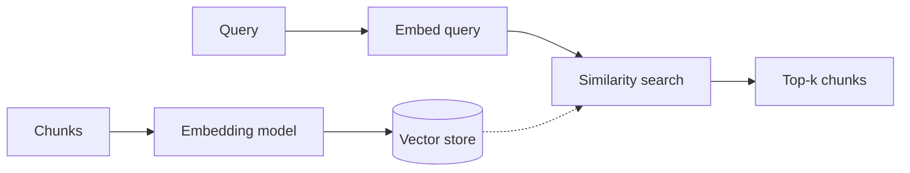

# 13. Vector Stores in LangChain  (Video 12)

> 📺 [Watch on YouTube](https://www.youtube.com/playlist?list=PLKnIA16_RmvaTbihpo4MtzVm4XOQa0ER0) · ⏱️ ~50 min · CampusX — Generative AI using LangChain
>
> 🔎 **RAG building block #3.** Full worked version in the RAG series — see **[detailed notes → `rag/04_vector-stores.md`](../12_rag/04_vector-stores.md)**. This page is the LangChain-course summary + pointers.

---

## 🎯 What You'll Learn
- What embeddings and vector stores are, and why RAG needs them.
- Similarity search (cosine) and how top-k retrieval works.
- Using Chroma / FAISS through LangChain's uniform API.
- Adding documents, persisting, and turning a store into a retriever.

---

## 📖 Overview / Why It Matters
Steps 3–4 of the pipeline (`Load → Split → **Embed + Store** → Retrieve`). After splitting, each chunk is turned into an **embedding** — a dense vector capturing its meaning. A **vector store** indexes those vectors so that, given a query vector, it can quickly return the most semantically similar chunks. This is the "memory" a RAG system searches at query time.



---

## 🧠 Key Concepts

### Embeddings + similarity
An embedding model maps text → a fixed-length vector. Semantically similar texts land near each other. Similarity is usually **cosine similarity** (angle between vectors). Retrieval = embed the query, find the k nearest chunk vectors.

### Vector store vs vector database
- A **vector store** is the LangChain abstraction (add texts, similarity search). In-memory or lightweight options: **FAISS**, **Chroma**.
- A full **vector database** (Pinecone, Weaviate, Qdrant, pgvector, Milvus) adds persistence, scaling, metadata filtering, and hybrid search. LangChain wraps them all behind the same interface.

### Core operations
- `from_documents(docs, embedding)` / `add_documents(docs)` — build/extend the index.
- `similarity_search(query, k=4)` — top-k by meaning.
- `similarity_search_with_score(...)` — include distances.
- `as_retriever(...)` — expose it as a `Retriever` for chains (see [Retrievers](14_retrievers.md)).

---

## 💻 Code Examples

```python
from langchain_openai import OpenAIEmbeddings
from langchain_community.vectorstores import Chroma

embeddings = OpenAIEmbeddings(model="text-embedding-3-small")

# Build a persistent Chroma store from chunks
vs = Chroma.from_documents(
    documents=chunks,
    embedding=embeddings,
    collection_name="my_docs",
    persist_directory="./chroma_db",
)

# Query
hits = vs.similarity_search("What is a transformer?", k=3)
for h in hits:
    print(h.metadata.get("source"), "→", h.page_content[:80])

# Use it downstream as a retriever
retriever = vs.as_retriever(search_kwargs={"k": 4})
```

```python
# FAISS (in-memory, save/load to disk)
from langchain_community.vectorstores import FAISS
vs = FAISS.from_documents(chunks, embeddings)
vs.save_local("faiss_index")
vs = FAISS.load_local("faiss_index", embeddings, allow_dangerous_deserialization=True)
```

---

## ⚠️ Gotchas & Tips
- **The embedding model used to index must be the same one used to query** — mismatched models give garbage similarity.
- Chroma persists with `persist_directory`; FAISS is in-memory unless you `save_local`.
- Store useful `metadata` on chunks so you can filter (e.g. by source/date) and cite results.
- `k` is a quality/latency knob — too small misses context, too large adds noise. Start around 4.

---

## 🧠 Key Takeaways
- Embeddings turn chunks into vectors; a **vector store** indexes them for fast semantic (cosine) search.
- FAISS/Chroma for local; Pinecone/Weaviate/Qdrant/pgvector for production — same LangChain API.
- Key ops: build (`from_documents`), search (`similarity_search`), expose (`as_retriever`).
- Always index and query with the **same** embedding model.
- 👉 Full walkthrough: [`rag/04_vector-stores.md`](../12_rag/04_vector-stores.md).

---

## ❓ Revision Questions
1. What is an embedding, and what similarity metric is typically used to compare embeddings?
2. Distinguish a vector store from a full vector database. Name one of each.
3. Why must the indexing and query embedding models match?
4. What does `as_retriever()` give you, and why is that useful for chains?
5. What does the parameter `k` control in `similarity_search`, and how does it trade off quality vs noise?
