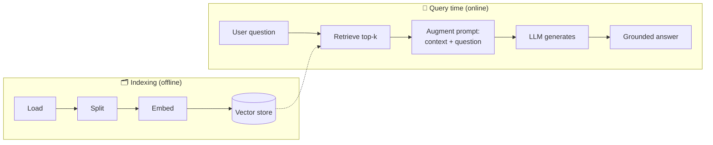

# 15. Retrieval-Augmented Generation (RAG) Explained  (Video 14)

> 📺 [Watch on YouTube](https://www.youtube.com/playlist?list=PLKnIA16_RmvaTbihpo4MtzVm4XOQa0ER0) · ⏱️ ~59 min · CampusX — Generative AI using LangChain
>
> 🔎 **The concept that ties the four building blocks together.** Full worked version in the RAG series — see **[detailed notes → `rag/01_what-is-rag.md`](../12_rag/01_what-is-rag.md)**. This page is the LangChain-course summary + pointers.

---

## 🎯 What You'll Learn
- The problem RAG solves (stale + closed-book LLMs, hallucination, no private data).
- The two phases: **indexing** (offline) and **retrieval + generation** (online).
- Why RAG usually beats fine-tuning for knowledge tasks.
- How the previous four videos (loaders → splitters → vector stores → retrievers) snap into one pipeline.

---

## 📖 Overview / Why It Matters
An LLM only "knows" what was in its training data — it's **closed-book**, has a knowledge cutoff, can't see your private documents, and will **hallucinate** confidently when it doesn't know. **RAG (Retrieval-Augmented Generation)** fixes this by making the model **open-book**: at query time you retrieve relevant chunks from *your* knowledge base and paste them into the prompt as context, so the model answers **grounded** in real, current, private data.



---

## 🧠 Key Concepts

### The two phases
1. **Indexing (offline, once):** `Load` ([11](11_document-loaders.md)) → `Split` ([12](12_text-splitters.md)) → `Embed + Store` ([13](13_vector-stores.md)). Build the searchable knowledge base.
2. **Retrieval + Generation (online, per query):** `Retrieve` ([14](14_retrievers.md)) the top-k relevant chunks → **augment** the prompt with them → **generate** the answer.

### Why "augmented"
The model's own weights are unchanged. You *augment* its input with retrieved context. The answer's quality depends heavily on retrieval quality — "garbage in, garbage out."

### RAG vs fine-tuning
| | RAG | Fine-tuning |
|---|---|---|
| Changes weights? | No | Yes |
| Fresh / changing data | ✅ update the store | ❌ retrain |
| Private data | ✅ keep in your DB | ⚠️ baked into weights |
| Citations | ✅ (via metadata) | ❌ |
| Best for | knowledge / Q&A | style, format, domain tone |

### Grounding & citations
Because chunks carry `metadata` (source, page, URL), a RAG app can **cite** where each answer came from and reduce hallucination — a major reason RAG dominates enterprise LLM apps.

---

## 💻 Code Examples
A minimal RAG chain in LCEL (see the full YouTube-chatbot project in [16](16_youtube-chatbot-rag.md)):

```python
from langchain_core.prompts import ChatPromptTemplate
from langchain_core.output_parsers import StrOutputParser
from langchain_core.runnables import RunnablePassthrough
from langchain_openai import ChatOpenAI

prompt = ChatPromptTemplate.from_template(
    "Answer ONLY from the context. If not in context, say you don't know.\n\n"
    "Context:\n{context}\n\nQuestion: {question}"
)
model = ChatOpenAI(model="gpt-4o-mini", temperature=0)

def format_docs(docs):
    return "\n\n".join(d.page_content for d in docs)

rag_chain = (
    {"context": retriever | format_docs, "question": RunnablePassthrough()}
    | prompt | model | StrOutputParser()
)

print(rag_chain.invoke("What does the document say about X?"))
```

---

## ⚠️ Gotchas & Tips
- **Retrieval quality caps answer quality.** Most RAG bugs are retrieval bugs (bad chunking, wrong `k`, mismatched embeddings) — not the LLM.
- Always instruct the model to answer **only from context** and to say "I don't know" otherwise — this is your main anti-hallucination lever.
- Keep `metadata` end-to-end so you can cite sources.
- For hard cases, the advanced variants — **Corrective RAG** and **Self-RAG** — add grading/self-checking (see the RAG series [`08`](../12_rag/08_corrective-rag-crag.md) / [`09`](../12_rag/09_self-rag.md)).

---

## 🧠 Key Takeaways
- RAG makes a closed-book LLM **open-book**: retrieve your data at query time and put it in the prompt.
- Two phases: **indexing** (load→split→embed→store) and **retrieval + generation**.
- Prefer RAG over fine-tuning for knowledge/Q&A: fresh data, private data, and citations, without touching weights.
- Answer quality is dominated by **retrieval** quality; ground the model and let it say "I don't know."
- 👉 Full conceptual walkthrough: [`rag/01_what-is-rag.md`](../12_rag/01_what-is-rag.md); build it in [16](16_youtube-chatbot-rag.md).

---

## ❓ Revision Questions
1. What core LLM limitations does RAG address?
2. Name the steps of the indexing phase and the query-time phase.
3. Why is it called "augmented" generation — what is *not* changed?
4. Give three reasons to choose RAG over fine-tuning for a knowledge task.
5. Why is "answer only from the context" a critical instruction in a RAG prompt?
6. If a RAG app gives wrong answers, where should you look first — the prompt/LLM or retrieval? Why?
