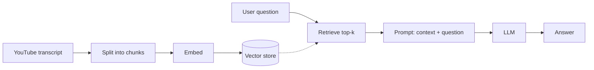

# 16. Project — YouTube Chatbot (End-to-End RAG)  (Video 15)

> 📺 [Watch on YouTube](https://www.youtube.com/playlist?list=PLKnIA16_RmvaTbihpo4MtzVm4XOQa0ER0) · ⏱️ ~46 min · CampusX — Generative AI using LangChain
>
> 🔎 **The capstone RAG project** — assembles loaders + splitters + vector stores + retrievers into a working app. Full worked version in the RAG series — see **[detailed notes → `rag/06_youtube-chatbot-rag.md`](../12_rag/06_youtube-chatbot-rag.md)**. This page is the LangChain-course summary + pointers.

---

## 🎯 What You'll Learn
- How to build a real RAG app end-to-end: **"chat with a YouTube video"**.
- Fetching a transcript, indexing it, and answering questions grounded in it.
- Wiring the whole pipeline as a single **LCEL chain** with `RunnableParallel` + `RunnablePassthrough`.

---

## 📖 Overview / Why It Matters
This is where everything clicks: you take a YouTube video's **transcript** as the knowledge source and build a chatbot that answers questions about that specific video. It exercises every RAG building block you just learned — and shows how LCEL ([Chains](08_chains.md) / [Runnables](10_runnables-part2.md)) glues them into one callable object.



---

## 🧠 Key Concepts

### Pipeline, end to end
1. **Ingest** — fetch the transcript with `youtube-transcript-api` (and optionally `YoutubeLoader`), join it into text.
2. **Split** — `RecursiveCharacterTextSplitter` into chunks.
3. **Index** — embed chunks (`OpenAIEmbeddings`) into a vector store (FAISS/Chroma).
4. **Retrieve** — `vectorstore.as_retriever(k=4)`.
5. **Augment + Generate** — stuff retrieved context + question into a prompt, call the model, parse output.

### The LCEL glue
The final chain uses `RunnableParallel` to build the prompt inputs — `context` comes from `retriever | format_docs`, `question` is passed straight through with `RunnablePassthrough` — then pipes into `prompt | model | StrOutputParser()`.

---

## 💻 Code Examples

```python
# 1. Ingest the transcript
from youtube_transcript_api import YouTubeTranscriptApi
video_id = "Gfr50f6ZBvo"
transcript = " ".join(
    seg["text"] for seg in YouTubeTranscriptApi.get_transcript(video_id, languages=["en"])
)

# 2. Split
from langchain_text_splitters import RecursiveCharacterTextSplitter
chunks = RecursiveCharacterTextSplitter(
    chunk_size=1000, chunk_overlap=200
).create_documents([transcript])

# 3. Index
from langchain_openai import OpenAIEmbeddings, ChatOpenAI
from langchain_community.vectorstores import FAISS
vectorstore = FAISS.from_documents(chunks, OpenAIEmbeddings(model="text-embedding-3-small"))
retriever = vectorstore.as_retriever(search_kwargs={"k": 4})

# 4. RAG chain (LCEL)
from langchain_core.prompts import ChatPromptTemplate
from langchain_core.output_parsers import StrOutputParser
from langchain_core.runnables import RunnableParallel, RunnablePassthrough

prompt = ChatPromptTemplate.from_template(
    "You are a helpful assistant. Answer ONLY from the transcript context.\n"
    "If the context is insufficient, say you don't know.\n\n"
    "{context}\n\nQuestion: {question}"
)
model = ChatOpenAI(model="gpt-4o-mini", temperature=0)

def format_docs(docs):
    return "\n\n".join(d.page_content for d in docs)

parallel = RunnableParallel({
    "context": retriever | format_docs,
    "question": RunnablePassthrough(),
})
chain = parallel | prompt | model | StrOutputParser()

print(chain.invoke("What is the main topic of the video?"))
```

---

## ⚠️ Gotchas & Tips
- Not every video has a transcript (or an English one) — handle the `TranscriptsDisabled` / no-transcript case.
- Tune `chunk_size`/`k` for transcripts — spoken text is rambly; slightly larger chunks often help.
- Add a "cite the timestamp/segment" step by keeping segment metadata if you need references.
- Wrap it in a Streamlit/Gradio UI for a real demo; add chat memory for multi-turn follow-ups.

---

## 🧠 Key Takeaways
- A complete RAG app = **ingest → split → index → retrieve → augment → generate**, all wired with LCEL.
- The transcript is just another data source; the same pattern works for PDFs, docs, or a website.
- `RunnableParallel` + `RunnablePassthrough` are the idiomatic way to assemble `{context, question}` for the prompt.
- Keep the "answer only from context" guardrail to stay grounded.
- 👉 Full project walkthrough: [`rag/06_youtube-chatbot-rag.md`](../12_rag/06_youtube-chatbot-rag.md).

---

## ❓ Revision Questions
1. What are the five stages of this end-to-end RAG app?
2. Which library fetches the YouTube transcript, and what failure cases must you handle?
3. How do `RunnableParallel` and `RunnablePassthrough` combine to build the prompt inputs?
4. Why join transcript segments into larger chunks rather than embedding each segment?
5. What single line makes this pattern reusable for PDFs or websites instead of YouTube?
