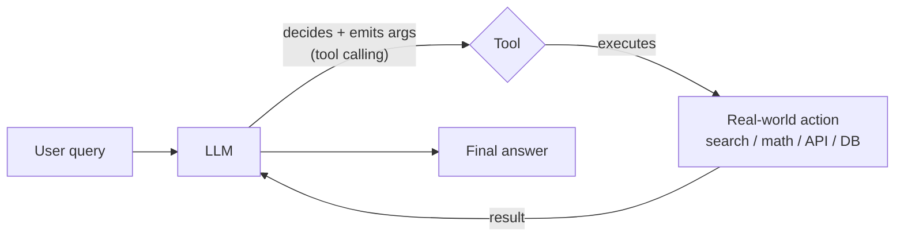

# 17. Tools in LangChain  (Video 16)

> 📺 [Watch on YouTube](https://www.youtube.com/playlist?list=PLKnIA16_RmvaTbihpo4MtzVm4XOQa0ER0) · ⏱️ ~45:16 · CampusX — Generative AI using LangChain

---

## 🎯 What You'll Learn

- What a **tool** is: a callable an LLM can invoke to *act on the world* — search the web, do math, hit an API, query a database — instead of only generating text.
- Why an LLM alone is "a brain with no hands," and how tools plus tool-calling close that gap.
- The three things every tool must expose: a **name**, a **description** (the LLM reads this to decide *when* to call the tool), and a **typed argument schema**.
- That in LangChain a tool is itself a **Runnable** — it has `.invoke()` and composes like everything else.
- How to use **built-in tools** (`DuckDuckGoSearchRun`, `ShellTool`, Wikipedia, …) from `langchain_community`.
- Three ways to build **custom tools** — the `@tool` decorator, `StructuredTool` + a Pydantic `args_schema`, and subclassing `BaseTool` — and when to reach for each.
- How to **inspect** a tool (`.name`, `.description`, `.args`, `.args_schema.model_json_schema()`) and how to bundle related tools into a **toolkit**.
- Where tools sit on the road to **agents**: tool → tool binding / tool calling → agent.

---

## 📖 Overview / Why It Matters

A raw LLM is a next-token predictor. Give it a prompt and it produces text — that's *all* it can do. It cannot look up today's stock price, run a calculation it isn't confident about, send an email, or read a row from your database. It has knowledge frozen at training time and no ability to perform side effects.

A **tool** is how we give that brain a pair of hands. Concretely, a tool is a plain Python function wrapped so that:

1. It carries a **name** and a natural-language **description** the model can read.
2. It declares a **typed argument schema** so the model knows exactly what inputs to produce.
3. It can be **executed** to produce a real result (a search hit, a number, an API response).

The LLM never runs the function itself. The loop is always: the model *decides* a tool should be called and *emits the arguments* (this is **tool calling**, covered in the next note); your code (or an agent) actually *executes* the tool and feeds the result back. This note is about the first half — **defining and understanding tools**. The mechanism that lets a model choose and populate them lives in [18_tool-calling.md](18_tool-calling.md), and the fully autonomous reason-act loop that ties it all together is in [19_end-to-end-agent.md](19_end-to-end-agent.md).



Where this sits in the LangChain component map: tools are one of the four pillars of an **agent** (LLM + tools + prompt + an agent loop). Everything in this note is a prerequisite for building agents.

---

## 🧠 Key Concepts

### What exactly is a "tool"?

A tool is a **callable with metadata**. Stripped down, it is:

| Part | Purpose | Who reads it |
|---|---|---|
| `name` | A short identifier for the tool | The LLM, when it selects a tool |
| `description` | Natural-language explanation of *what the tool does and when to use it* | The LLM, to decide **whether/when** to call it |
| `args_schema` | Typed schema of the inputs (names + types + per-field descriptions) | The LLM, to produce **correctly-shaped arguments** |
| the function body | The actual work — the side effect / computation | Your runtime, at execution time |

The single most important thing to internalize: **the description and the argument schema are prompt engineering.** They are literally serialized and sent to the model. A vague description ("does stuff") gives the model no basis for choosing the tool at the right moment; a precise one ("Multiply two integers together and return the product") makes tool selection reliable. Treat the docstring and type hints as part of your prompt, not as afterthoughts.

### A tool is a Runnable

In LangChain, a tool is not a special second-class object — it *is* a `Runnable`. That means once you have a tool `t`, you can execute it exactly like a prompt, model, or chain:

```python
result = multiply.invoke({"a": 3, "b": 4})   # -> 12
```

You pass arguments as a dict keyed by the schema's field names. Because tools are Runnables, they slot into LCEL pipelines and share the whole Runnable API (`.invoke`, `.batch`, `.stream`, async variants). See [Runnables notes](09_runnables-part1.md) for the broader interface.

### Built-in tools

LangChain ships a large catalog of ready-made tools in `langchain_community`, so you rarely have to write integrations for common needs (web search, shell, Wikipedia, Python REPL, SQL, requests, etc.). You just import, instantiate, and `.invoke()`.

The mental model: a **built-in tool** is a production-grade, tested wrapper around an external service. Use these before writing your own — don't reinvent a web-search tool.

### Custom tools — and the three ways to build them

When no built-in tool fits (e.g. "call *our* internal pricing API," "run *our* business rule"), you build a **custom tool**. LangChain gives three routes, in increasing order of control and ceremony:

1. **`@tool` decorator** — the quickest. Decorate an ordinary function. The **docstring becomes the description**, and the **type hints become the argument schema**. Best for simple, single-purpose tools.
2. **`StructuredTool` + a Pydantic `args_schema`** — when you want an *explicit, validated* multi-argument schema with per-field descriptions and validation rules. The schema is a Pydantic model you write separately, so it's self-documenting and enforced.
3. **Subclassing `BaseTool`** — the lowest-level, most flexible route. You control everything: `name`, `description`, `args_schema`, and the `_run` method (and optionally `_arun` for async). Both `@tool` and `StructuredTool` are conveniences built *on top of* `BaseTool`; subclass it directly when you need custom init logic, shared state, or complex behavior.

> Rule of thumb: reach for `@tool` by default, `StructuredTool` when you want an explicit validated schema, and `BaseTool` only when you genuinely need full control.

### Inspecting a tool

Every tool exposes its metadata for inspection — useful for debugging and for understanding what the model will actually see:

- `tool.name` — the name string.
- `tool.description` — the description string (from the docstring for `@tool`).
- `tool.args` — a dict describing the arguments.
- `tool.args_schema.model_json_schema()` — the full JSON Schema (Pydantic v2 method) that gets serialized to the model.

### Toolkits

A **toolkit** is simply a *group of related tools* packaged together for a common use case — e.g. a "math toolkit" (add, multiply), a Gmail toolkit, a SQL-database toolkit. The convention is a class that exposes a **`get_tools()`** method returning a list of tool instances. Toolkits keep related capabilities organized and let you hand a coherent bundle of abilities to an agent in one shot, instead of wiring up each tool individually.

---

## 💻 Code Examples

### 1. Using a built-in tool — `DuckDuckGoSearchRun`

```python
# pip install -U duckduckgo-search langchain-community
from langchain_community.tools import DuckDuckGoSearchRun

search = DuckDuckGoSearchRun()

# It's a Runnable — just invoke it.
result = search.invoke("What is the capital of France?")
print(result)   # a text blob of search results

# Inspect the built-in tool's metadata
print(search.name)          # 'duckduckgo_search'
print(search.description)   # what the LLM reads to decide when to use it
print(search.args)          # {'query': {'title': 'Query', 'type': 'string'}}
```

Another built-in — a shell tool that runs OS commands (use with care):

```python
from langchain_community.tools import ShellTool

shell = ShellTool()
print(shell.invoke({"commands": ["echo hello", "ls"]}))
```

### 2. Custom tool — Way 1: the `@tool` decorator

The fastest path. The docstring **is** the description; the type hints **are** the schema.

```python
from langchain_core.tools import tool

@tool
def multiply(a: int, b: int) -> int:
    """Multiply two numbers and return the product."""
    return a * b

# Execute it (it's a Runnable)
print(multiply.invoke({"a": 3, "b": 4}))   # 12

# Inspect what the LLM will see
print(multiply.name)          # 'multiply'
print(multiply.description)   # 'Multiply two numbers and return the product.'
print(multiply.args)          # {'a': {'title': 'A', 'type': 'integer'},
                              #  'b': {'title': 'B', 'type': 'integer'}}
print(multiply.args_schema.model_json_schema())
# {'title': 'multiply', 'description': 'Multiply two numbers...',
#  'type': 'object',
#  'properties': {'a': {'title': 'A', 'type': 'integer'},
#                 'b': {'title': 'B', 'type': 'integer'}},
#  'required': ['a', 'b']}
```

Note how the docstring and the `int` hints flowed automatically into the description and schema. This is why a good docstring matters — it's the model's only clue about when to call `multiply`.

### 3. Custom tool — Way 2: `StructuredTool` + Pydantic `args_schema`

Use this when you want an **explicit, validated** schema with per-field descriptions.

```python
from pydantic import BaseModel, Field
from langchain_core.tools import StructuredTool

# 1. Declare the input schema explicitly
class MultiplyInput(BaseModel):
    a: int = Field(description="The first number to multiply")
    b: int = Field(description="The second number to multiply")

# 2. The underlying function
def multiply_func(a: int, b: int) -> int:
    return a * b

# 3. Build the tool from the function + schema
multiply = StructuredTool.from_function(
    func=multiply_func,
    name="multiply",
    description="Multiply two numbers and return the product.",
    args_schema=MultiplyInput,
)

print(multiply.invoke({"a": 3, "b": 4}))   # 12
print(multiply.name)                        # 'multiply'
print(multiply.args)                        # includes the field descriptions
```

The payoff over `@tool`: the schema is a first-class, reusable Pydantic model. You get per-argument descriptions (great for guiding the LLM), and Pydantic **validates** inputs — a bad type is rejected before your function ever runs.

### 4. Custom tool — Way 3: subclassing `BaseTool`

Full control. You set the class attributes and implement `_run`.

```python
from typing import Type
from pydantic import BaseModel, Field
from langchain_core.tools import BaseTool

class MultiplyInput(BaseModel):
    a: int = Field(description="The first number to multiply")
    b: int = Field(description="The second number to multiply")

class MultiplyTool(BaseTool):
    name: str = "multiply"
    description: str = "Multiply two numbers and return the product."
    args_schema: Type[BaseModel] = MultiplyInput

    def _run(self, a: int, b: int) -> int:
        return a * b

    # Optional async variant:
    # async def _arun(self, a: int, b: int) -> int:
    #     return a * b

multiply = MultiplyTool()
print(multiply.invoke({"a": 3, "b": 4}))   # 12
print(multiply.name, "|", multiply.description)
```

`@tool` and `StructuredTool` are just ergonomic wrappers around this. Subclass directly when you need custom `__init__` (e.g. inject an API client), shared state across calls, or non-trivial execution logic.

### 5. A toolkit — grouping related tools

```python
from langchain_core.tools import tool

@tool
def add(a: int, b: int) -> int:
    """Add two numbers and return the sum."""
    return a + b

@tool
def multiply(a: int, b: int) -> int:
    """Multiply two numbers and return the product."""
    return a * b

class MathToolkit:
    """A toolkit bundling basic arithmetic tools."""
    def get_tools(self):
        return [add, multiply]

toolkit = MathToolkit()
tools = toolkit.get_tools()
for t in tools:
    print(t.name, "->", t.description)
# add -> Add two numbers and return the sum.
# multiply -> Multiply two numbers and return the product.
```

The `get_tools()` convention lets you hand an entire coherent capability set to an agent at once. (Many official integrations — SQL, Gmail, GitHub — ship as toolkits following exactly this pattern.)

### 6. The bridge to tool calling (preview)

Defining tools is useless until a *model* can pick and populate them. That's **tool binding**:

```python
from langchain_openai import ChatOpenAI

llm = ChatOpenAI(model="gpt-4o-mini")
llm_with_tools = llm.bind_tools([add, multiply])

# The model now *decides* whether to call a tool and emits arguments —
# it does NOT execute it. See 18_tool-calling.md for the full loop.
ai_msg = llm_with_tools.invoke("What is 3 times 4?")
print(ai_msg.tool_calls)
# [{'name': 'multiply', 'args': {'a': 3, 'b': 4}, 'id': '...'}]
```

Full details — reading `tool_calls`, executing them, and feeding results back with `ToolMessage` — are in [18_tool-calling.md](18_tool-calling.md).

---

## 📊 Comparison / Reference Table

| Method | Import | When to use | Pros | Cons |
|---|---|---|---|---|
| **`@tool` decorator** | `from langchain_core.tools import tool` | Simple, single-purpose tools; quick prototyping | Minimal boilerplate; docstring → description and type hints → schema automatically | Schema is implicit; limited control over per-field descriptions and validation |
| **`StructuredTool` + `args_schema`** | `from langchain_core.tools import StructuredTool` | Multi-arg tools needing an explicit, validated, well-documented schema | Reusable Pydantic schema; per-field descriptions; input validation | More code; you maintain schema + function separately |
| **Subclass `BaseTool`** | `from langchain_core.tools import BaseTool` | Full control — custom init, shared state, complex logic, custom sync/async behavior | Maximum flexibility; the base both others are built on | Most boilerplate; overkill for simple functions |
| **Built-in tools** | `from langchain_community.tools import ...` | A tested wrapper already exists (web search, shell, Wikipedia, SQL, …) | Zero integration work; production-tested | External deps; behavior/output format fixed by the wrapper |

---

## ⚠️ Gotchas & Tips

- **The description is prompt engineering, not documentation.** It is serialized and sent to the LLM verbatim; the model uses it to decide *when* to call the tool. Vague docstrings cause the model to skip or misuse the tool. Write them as instructions to the model.
- **Type hints are mandatory for `@tool`.** Without them the schema can't be inferred and the model won't know how to shape arguments. Always annotate parameters and the return type.
- **A tool never runs itself.** The LLM only *emits a tool call*; your code / the agent executes it. Forgetting this leads to confusion when `llm.bind_tools(...)` returns a message with empty content and populated `tool_calls` instead of a final answer.
- **Invoke with a dict keyed by field names**, e.g. `multiply.invoke({"a": 3, "b": 4})` — not positional args — because the schema is keyed by parameter name.
- **Pydantic v2:** use `model_json_schema()` (not the v1 `schema()`). LangChain's current tool objects expose the v2 API.
- **`ShellTool` and Python-REPL tools execute arbitrary code** — never expose them to untrusted input or an unsandboxed agent. Treat them like a remote-code-execution surface.
- **Built-in search tools have moving external dependencies.** `DuckDuckGoSearchRun` needs the `duckduckgo-search` package and can rate-limit or change output format; pin versions and handle failures.
- **Import base classes from `langchain_core.tools`** (`tool`, `StructuredTool`, `BaseTool`), and community integrations from `langchain_community.tools`. Keeping core vs. community straight avoids deprecation warnings.
- **Keep tools single-purpose and well-named.** A model chooses between tools by name + description; overlapping, do-everything tools make selection ambiguous.

---

## 🧠 Key Takeaways

- A **tool** is a callable an LLM can invoke to act on the world — it turns a text-only "brain" into something with "hands."
- Every tool has three model-facing parts: a **name**, a **description** (drives *when* it's called), and a **typed argument schema** (drives *how* it's called) — plus a function body your runtime executes.
- **In LangChain a tool is a Runnable** — you run it with `.invoke({...})`, and it composes with the rest of LCEL.
- **Built-in tools** (`DuckDuckGoSearchRun`, `ShellTool`, Wikipedia, SQL, …) live in `langchain_community`; prefer them over hand-rolling common integrations.
- Three ways to build **custom tools**: **`@tool`** (fastest — docstring becomes description, hints become schema), **`StructuredTool` + Pydantic `args_schema`** (explicit, validated, documented schema), and **subclassing `BaseTool`** (full control; the base the other two are built on).
- **Inspect** any tool via `.name`, `.description`, `.args`, and `.args_schema.model_json_schema()` to see exactly what the model receives.
- A **toolkit** groups related tools behind a `get_tools()` method, so you can hand a coherent capability bundle to an agent at once.
- Tools are inert until a model can select and populate them — that's **tool binding / tool calling** ([18_tool-calling.md](18_tool-calling.md)), which in turn is the foundation for **agents** ([19_end-to-end-agent.md](19_end-to-end-agent.md)).

---

## ❓ Revision Questions

1. Why can't an LLM by itself fetch a live stock price or query your database, and how does a tool solve this?
2. What are the three model-facing parts of a tool, and which one does the LLM use to decide *when* to call it versus *how* to call it?
3. What does it mean that "a tool is a Runnable" in LangChain? Show how you'd execute a `multiply` tool.
4. Name three built-in tools and the package they come from. How do you inspect a built-in tool's name and expected arguments?
5. Write a `multiply(a: int, b: int) -> int` tool using the `@tool` decorator. Where do its description and argument schema come from?
6. When would you choose `StructuredTool` with a Pydantic `args_schema` over the `@tool` decorator? What extra guarantees does it give you?
7. What does subclassing `BaseTool` let you do that the other two methods don't? Which method must you implement?
8. How do you print the full JSON Schema the model will receive for a tool? (Which Pydantic v2 method?)
9. What is a toolkit, and what is the conventional method name it exposes to hand out its tools?
10. After you define tools, what mechanism actually lets a model choose and populate them, and does the model itself execute the tool? Which note covers this next?
