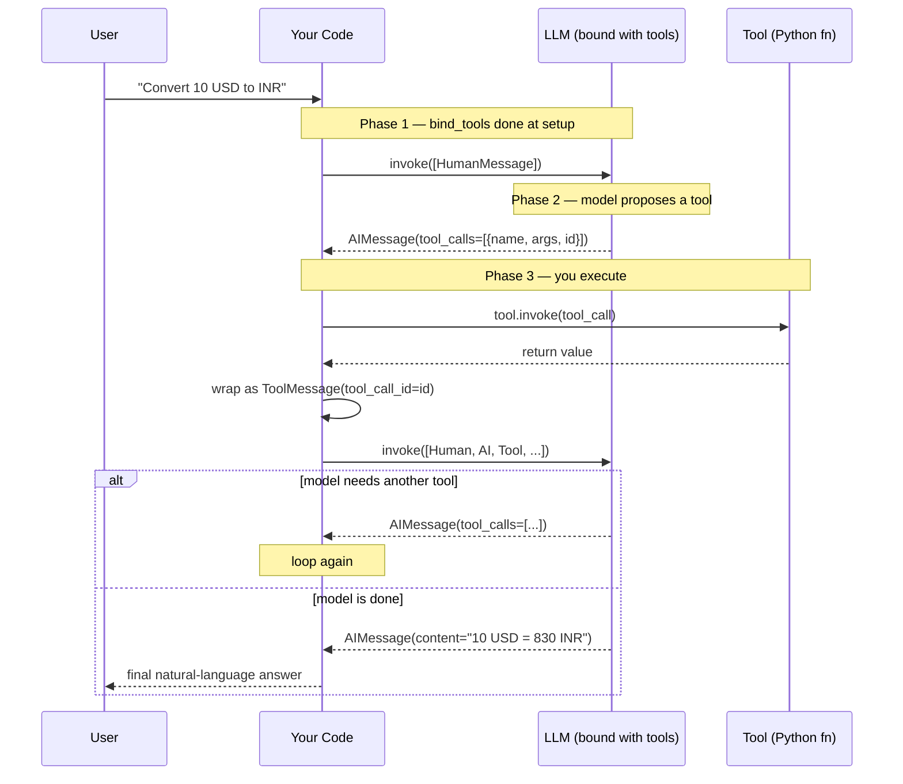

# 18. Tool Calling in LangChain  (Video 17)

> 📺 [Watch on YouTube](https://www.youtube.com/playlist?list=PLKnIA16_RmvaTbihpo4MtzVm4XOQa0ER0) · ⏱️ ~58:47 · CampusX — Generative AI using LangChain

---

## 🎯 What You'll Learn

- The three distinct phases of using a tool with an LLM — **tool binding**, **tool calling**, and **tool execution** — and why keeping them separate is the whole point.
- That an LLM **never runs your code**. It can only *decide* a tool is needed and hand you a structured **request** to run it; execution is always your job.
- How `llm.bind_tools([...])` advertises tool *schemas* to the model without touching the tool logic.
- How to read an `AIMessage.tool_calls` list of `{name, args, id}` and dispatch each one to the right tool with `tool.invoke(tool_call)`.
- What a **`ToolMessage`** is, why it carries a `tool_call_id`, and how it closes the loop by feeding the result back to the model.
- A full multi-step worked example — a currency-conversion assistant — where the model chains two tools together (`get_conversion_factor` → `convert`).
- How `InjectedToolArg` lets your code supply a value (the fetched rate) instead of letting the model hallucinate it.
- The mental model — **bind → propose → execute → ToolMessage → finalize** — that an Agent later automates for you.

---

## 📖 Overview / Why It Matters

In the [previous note on tools](17_tools.md) we built tools — self-contained Python functions wrapped so an LLM can understand them (`@tool`, `StructuredTool`, `BaseTool`). But building a tool is only half the story. A tool sitting in a variable does nothing on its own. The interesting, and initially confusing, question is: **how does the LLM actually decide to use it, and who runs it?**

The single most important idea in this entire topic is this:

> **The LLM does not execute tools. It only *requests* that a tool be executed. You (your code) execute it and hand the result back.**

An LLM is a text-in/text-out function. It has no Python runtime, no network access, no ability to call `requests.get(...)`. What it *can* do — if it has been told which tools exist and what arguments they take — is emit a structured message that says, in effect, *"I'd like to call `get_conversion_factor` with `base_currency='USD'` and `target_currency='INR'`."* That message is a **request**, not a result. Your code intercepts it, actually runs the function, captures the return value, and sends it back to the model so the model can continue.

This request/execute/respond dance is the beating heart of every agent. Understanding it manually here is what makes agents feel like magic rather than mystery later ([end-to-end agent](19_end-to-end-agent.md)). Tool calling breaks cleanly into three phases:

| Phase | Who does it | What happens |
|---|---|---|
| **1. Tool binding** | You (once, at setup) | You attach tool schemas to the model so it *knows they exist*. |
| **2. Tool calling** | The **model** | Given a query, the model decides whether a tool is needed and, if so, emits a `tool_calls` request. |
| **3. Tool execution** | You (your code) | You take each request, run the actual function, and wrap the result in a `ToolMessage`. |

Keep these three straight and the rest is bookkeeping.

---

## 🧠 Key Concepts

### 1. Tool binding — advertising schemas to the model

A plain chat model knows nothing about your tools. **Tool binding** is how you tell it. You call `bind_tools()` with a list of tool objects, and it returns a *new* runnable — the same model, but now aware of those tool schemas.

```python
llm_with_tools = llm.bind_tools([multiply, get_conversion_factor, convert])
```

What actually gets sent to the provider is each tool's **schema**, not its code: the tool's `name`, its `description` (which is why good docstrings matter — the model reads them to decide *when* to use a tool), and a JSON-schema description of its arguments and their types. The model uses these schemas purely to *reason about* which tool fits a request and how to fill in the arguments.

Three things to internalise:

- `bind_tools` does **not** change the original `llm`; it returns a bound copy. Keep both if you need a plain model elsewhere.
- The tool's **implementation never travels to the model.** Only the schema does. The model literally cannot run your function even if it wanted to.
- Binding is cheap and idempotent-feeling — you generally bind once at setup and reuse `llm_with_tools`.

### 2. Tool calling — the model returns a *request*, not a result

Now you invoke the bound model with a query. Two things can happen:

**Case A — no tool needed.** For a query like `"How are you?"`, the model just answers. The returned `AIMessage` has normal text in `.content`, and `.tool_calls` is an empty list `[]`.

**Case B — a tool is needed.** For a query like `"What is 3 multiplied by 10?"`, the model decides it wants the `multiply` tool. Now the returned `AIMessage` has an **empty `.content`** and a populated `.tool_calls`:

```python
result = llm_with_tools.invoke("What is 3 multiplied by 10?")

result.content      # ''  — no natural-language answer yet
result.tool_calls   # [{'name': 'multiply',
                    #   'args': {'a': 3, 'b': 10},
                    #   'id': 'call_9x2...',
                    #   'type': 'tool_call'}]
```

Each entry in `.tool_calls` is a dict with:

- **`name`** — which tool the model wants to call.
- **`args`** — the arguments it has filled in, parsed straight into a Python dict (the model read your schema to produce these).
- **`id`** — a unique call ID. This is crucial: when you return the result, you must quote this same ID so the model can match *this* result to *this* request. It's a correlation key.

This is the phase where beginners get tripped up. The model has **not multiplied anything.** It has looked at your query, matched it to a tool schema, extracted the arguments, and handed you a to-do item. The number `30` does not exist yet.

### 3. Tool execution — you run it and wrap the result in a `ToolMessage`

Now it's your turn. You take a `tool_call` and pass it to the actual tool object:

```python
tool_call = result.tool_calls[0]
tool_message = multiply.invoke(tool_call)     # pass the WHOLE tool_call dict
```

There are two ways to invoke, and the difference is important:

- `multiply.invoke(tool_call)` — pass the **entire tool_call dict** (with `name`, `args`, `id`). LangChain runs the tool with `args` **and** returns a fully-formed **`ToolMessage`** that already carries the matching `tool_call_id`. This is the preferred form.
- `multiply.invoke(tool_call["args"])` — pass **only the args**. This runs the tool and returns the **raw result** (a string/number), *not* a `ToolMessage`. You'd then have to build the `ToolMessage` and set its `tool_call_id` yourself.

A **`ToolMessage`** is a first-class LangChain message type (alongside `HumanMessage`, `AIMessage`, `SystemMessage`). It represents *"here is the output of a tool the model asked for."* Its two key attributes:

- **`content`** — the tool's return value (stringified).
- **`tool_call_id`** — echoes the `id` from the original request, so the model knows which of its (possibly several) requests this answers.

### 4. Closing the loop — feed the ToolMessage back so the model can finalize

The `ToolMessage` alone is not an answer to the user — it's a raw number like `"30"`. To get a natural-language reply (*"3 multiplied by 10 is 30."*), you send the whole conversation back to the model, now including the tool's result. You build a **messages list** that tells the full story:

1. The original **`HumanMessage`** (the user's question).
2. The **`AIMessage`** the model returned (the one carrying `tool_calls`).
3. The **`ToolMessage`(s)** you produced by executing.

Then invoke the LLM one more time on that list:

```python
messages = [HumanMessage(query)]
ai_message = llm_with_tools.invoke(messages)
messages.append(ai_message)                       # the request

for tool_call in ai_message.tool_calls:
    tool_message = multiply.invoke(tool_call)     # execute
    messages.append(tool_message)                 # the result

final = llm_with_tools.invoke(messages)           # finalize
print(final.content)   # "3 multiplied by 10 is 30."
```

The second invocation gives the model everything: what was asked, what tool it requested, and what that tool returned. Now it has enough to write a fluent final answer. **This second call is what people forget** — without it you're left holding a bare `ToolMessage` and wondering where the sentence went.

### 5. The full picture as a loop

The reason we keep the request and result as separate messages in a growing list is that a single query can require *several* tool calls, sometimes **chained** (the output of one feeds the input of the next). Each round trip appends more messages, and you keep looping until the model returns an `AIMessage` with content and **no** `tool_calls` — that's the signal it's done.



Notice the `alt` block: the loop repeats as long as the model keeps proposing tools. **That loop — deciding, executing, feeding back, repeating until done — is exactly what an [Agent](19_end-to-end-agent.md) automates.** Everything you do by hand in this note, an `AgentExecutor` does for you inside a `while` loop.

### 6. `InjectedToolArg` — some arguments come from *you*, not the model

Consider the currency example. To convert, you first need a live exchange **rate**, which you fetch from an API. The `convert` tool needs both an `amount` and a `rate`. But here's the danger: if you let the model fill in `rate`, it will **hallucinate a plausible-looking number** (say `82.5`) instead of using the real value your `get_conversion_factor` tool just fetched. That silently corrupts the answer.

`InjectedToolArg` solves this. You annotate an argument as injected, which tells LangChain (and the model) *"the model should not supply this; the calling code will inject it at execution time."* The model then only fills in `amount`, and you splice in the real `rate` yourself before executing.

```python
from typing import Annotated
from langchain_core.tools import tool, InjectedToolArg

@tool
def convert(
    amount: float,
    rate: Annotated[float, InjectedToolArg],
) -> float:
    """Convert `amount` in the base currency to the target currency using `rate`."""
    return amount * rate
```

When the model proposes a `convert` call, its `tool_calls` will contain only `{'amount': 10}` — no `rate`. Your code then injects the fetched rate before invoking:

```python
conversion_rate = 83.0  # obtained earlier from get_conversion_factor
tool_call["args"]["rate"] = conversion_rate   # inject the real value
tool_message = convert.invoke(tool_call)
```

This keeps a hard wall between *facts the model may invent* (which currency, how much) and *facts that must come from an authoritative source* (the live rate).

---

## 💻 Code Examples

### 1. Setup — bind a simple tool and read the tool_call

```python
from langchain_openai import ChatOpenAI
from langchain_core.tools import tool

@tool
def multiply(a: int, b: int) -> int:
    """Multiply two integers a and b and return the product."""
    return a * b

llm = ChatOpenAI(model="gpt-4o")
llm_with_tools = llm.bind_tools([multiply])

# Case A: no tool needed
print(llm_with_tools.invoke("Hi, how are you?").content)   # a normal greeting
# Case B: tool needed
result = llm_with_tools.invoke("What is 3 multiplied by 1000?")
print(result.content)      # ''  (empty — no answer yet)
print(result.tool_calls)   # [{'name': 'multiply', 'args': {'a': 3, 'b': 1000}, 'id': 'call_...'}]
```

### 2. Execute the tool call → get a ToolMessage

```python
tool_call = result.tool_calls[0]

# Preferred: pass the whole dict → returns a ToolMessage with tool_call_id set
tool_message = multiply.invoke(tool_call)
print(type(tool_message).__name__)      # ToolMessage
print(tool_message.content)             # '3000'
print(tool_message.tool_call_id)        # 'call_...' (matches the request)

# Alternative: pass only args → returns the RAW result (a number), not a ToolMessage
raw = multiply.invoke(tool_call["args"])
print(raw)                              # 3000
```

### 3. Close the loop for a natural-language answer

```python
from langchain_core.messages import HumanMessage

query = "What is 3 multiplied by 1000?"
messages = [HumanMessage(query)]

ai_message = llm_with_tools.invoke(messages)
messages.append(ai_message)                     # the model's request

for tc in ai_message.tool_calls:
    messages.append(multiply.invoke(tc))        # execute + append ToolMessage

final = llm_with_tools.invoke(messages)         # finalize
print(final.content)   # "3 multiplied by 1000 is 3000."
```

### 4. Full worked example — a currency-conversion assistant

Two tools that must be **chained**: first fetch the rate, then convert. `rate` is injected so the model can't invent it.

```python
import requests
from typing import Annotated
from langchain_openai import ChatOpenAI
from langchain_core.tools import tool, InjectedToolArg
from langchain_core.messages import HumanMessage

# --- Tool 1: fetch a live conversion factor -------------------------------
@tool
def get_conversion_factor(base_currency: str, target_currency: str) -> float:
    """Return the current conversion factor (rate) from base_currency to target_currency."""
    url = f"https://v6.exchangerate-api.com/v6/YOUR_API_KEY/pair/{base_currency}/{target_currency}"
    return requests.get(url).json()["conversion_rate"]

# --- Tool 2: convert an amount using an INJECTED rate ----------------------
@tool
def convert(
    amount: float,
    rate: Annotated[float, InjectedToolArg],
) -> float:
    """Convert `amount` from the base to the target currency using the provided `rate`."""
    return amount * rate

# --- Bind both tools -------------------------------------------------------
llm = ChatOpenAI(model="gpt-4o")
llm_with_tools = llm.bind_tools([get_conversion_factor, convert])

# --- Kick off the conversation --------------------------------------------
messages = [HumanMessage(
    "What is the conversion factor between USD and INR, "
    "and based on that convert 10 USD to INR?"
)]

# Round 1: model proposes get_conversion_factor (and possibly convert too)
ai_message = llm_with_tools.invoke(messages)
messages.append(ai_message)

# --- Execute every proposed tool call -------------------------------------
conversion_rate = None
for tool_call in ai_message.tool_calls:
    if tool_call["name"] == "get_conversion_factor":
        tool_message = get_conversion_factor.invoke(tool_call)
        conversion_rate = float(tool_message.content)   # capture the real rate
        messages.append(tool_message)
    elif tool_call["name"] == "convert":
        # INJECT the fetched rate — do NOT trust a model-supplied one
        tool_call["args"]["rate"] = conversion_rate
        tool_message = convert.invoke(tool_call)
        messages.append(tool_message)

# --- Finalize: let the model turn the tool outputs into prose --------------
final = llm_with_tools.invoke(messages)
print(final.content)
# e.g. "The conversion factor from USD to INR is 83.0, so 10 USD is 830.0 INR."
```

**Why the ordering works.** The model is smart enough to know `convert` depends on the rate. In practice it often proposes `get_conversion_factor` first, you feed the rate back, and *then* it proposes `convert` on the next round — a genuine multi-step chain. The `for` loop above handles both tools appearing in one round or across rounds; if `convert` shows up before the rate exists, you'd loop again after appending the rate. The robust production shape is a `while` loop that keeps invoking until `ai_message.tool_calls` is empty.

### 5. The robust loop shape (what an Agent generalises)

```python
tool_registry = {"get_conversion_factor": get_conversion_factor, "convert": convert}

messages = [HumanMessage("Convert 10 USD to INR using the live rate.")]
conversion_rate = None

while True:
    ai_message = llm_with_tools.invoke(messages)
    messages.append(ai_message)

    if not ai_message.tool_calls:      # model is done — no more tools requested
        print(ai_message.content)
        break

    for tool_call in ai_message.tool_calls:
        tool = tool_registry[tool_call["name"]]
        if tool_call["name"] == "convert":
            tool_call["args"]["rate"] = conversion_rate   # inject
        tool_message = tool.invoke(tool_call)
        if tool_call["name"] == "get_conversion_factor":
            conversion_rate = float(tool_message.content)
        messages.append(tool_message)
```

This `while` loop — invoke, check for tool_calls, execute, append, repeat until none — is **exactly** the control flow an `AgentExecutor` hides from you.

---

## 📊 Comparison / Reference Table

| Concept | Who acts | API / type | Produces | Key attribute |
|---|---|---|---|---|
| **Tool binding** | You (setup) | `llm.bind_tools([...])` | A new bound runnable | schemas advertised to model |
| **Tool calling** | The model | `llm_with_tools.invoke(...)` | `AIMessage` | `.tool_calls` → `[{name, args, id}]` |
| **Tool execution (full)** | You | `tool.invoke(tool_call)` | `ToolMessage` | `.content`, `.tool_call_id` |
| **Tool execution (args only)** | You | `tool.invoke(tool_call["args"])` | Raw value | no ToolMessage built for you |
| **Closing the loop** | You | `llm_with_tools.invoke(messages)` | `AIMessage` | `.content` (final answer), empty `.tool_calls` |
| **Injected arg** | You | `Annotated[T, InjectedToolArg]` | — | model omits it; code supplies it |

| Message type | Represents | Set by |
|---|---|---|
| `HumanMessage` | The user's query | You |
| `AIMessage` | Model's reply — either prose (`.content`) or a request (`.tool_calls`) | Model |
| `ToolMessage` | Output of an executed tool, tagged with `tool_call_id` | You (via `tool.invoke`) |
| `SystemMessage` | Standing instructions/persona | You |

---

## ⚠️ Gotchas & Tips

- **The LLM never runs your tool.** If you expect `result.content` to hold the answer after the first invoke, you'll get an empty string. The answer only appears after you execute the tool and invoke again. This is the #1 source of confusion.
- **Pass the whole `tool_call`, not just the args**, when you want a `ToolMessage` back. `tool.invoke(tool_call["args"])` returns a raw value and silently skips the `tool_call_id`, which breaks the correlation the model needs.
- **Always append messages in order** — `HumanMessage`, then the `AIMessage` with tool_calls, then the `ToolMessage`(s). Skipping the `AIMessage` (the request) or dropping the `tool_call_id` makes the provider reject the follow-up call, because a `ToolMessage` with no matching request is invalid.
- **Never let the model fill in authoritative values.** Rates, prices, IDs, user records — anything that must be *correct* rather than *plausible* — should be fetched by a tool and injected with `InjectedToolArg`, not left for the model to guess. Models hallucinate numbers confidently.
- **Match every `tool_call_id`.** If a request produced three tool_calls, you owe three `ToolMessage`s, each echoing the right `id`. Providers error out on unmatched or missing tool responses.
- **Empty `tool_calls` is your "done" signal.** In a loop, stop when the model returns content with no tool_calls — don't loop forever, and set a max-iterations cap in production to avoid runaway calls.
- **Good docstrings are not optional.** The model chooses tools from their `name` + `description`. A vague docstring leads to the wrong tool being called or no tool at all. Argument names and type hints become the JSON schema the model fills in.
- **`bind_tools` returns a new object.** Assign it (`llm_with_tools = llm.bind_tools([...])`); the original `llm` stays tool-unaware.
- **Not every provider supports tool calling equally.** OpenAI, Anthropic (`langchain_anthropic`), and Google (`langchain_google_genai`) all support it, but schema fidelity and reliability vary. Test your tool selection behaviour when you switch providers.

---

## 🧠 Key Takeaways

- Tool usage has **three phases**: **binding** (you advertise schemas), **calling** (the model proposes a tool), and **execution** (you run it). Keep them separate in your head.
- `llm.bind_tools([...])` sends only tool **schemas** (name, description, arg types) to the model and returns a new bound runnable. The tool's code never leaves your machine.
- Invoking the bound model returns an `AIMessage`. If a tool is needed, `.content` is empty and `.tool_calls` holds a list of `{name, args, id}` — a **request**, not a result.
- **You execute the tool**, not the LLM. `tool.invoke(tool_call)` runs it and returns a **`ToolMessage`** carrying the result plus the matching `tool_call_id`.
- To get a natural-language answer you must **close the loop**: append the `HumanMessage`, the `AIMessage`, and the `ToolMessage`(s) to a list and invoke the model again.
- Multi-step tasks **chain tools** — the output of one feeds the next. Loop until the model returns content with no more `tool_calls`.
- `InjectedToolArg` lets your code inject trustworthy values (e.g. a fetched exchange rate) so the model can't hallucinate them.
- The manual **bind → propose → execute → ToolMessage → finalize** loop you write here is precisely what an [Agent](19_end-to-end-agent.md) automates.

---

## ❓ Revision Questions

1. Explain, in one sentence, the single most important fact about who executes a tool. Why does it matter for reasoning about safety and correctness?
2. What are the three phases of tool usage? For each, state who performs it and what artifact it produces.
3. After `result = llm_with_tools.invoke("What is 3 times 10?")`, what would you expect `result.content` and `result.tool_calls` to contain, and why?
4. What are the three keys inside each entry of `.tool_calls`? What is the `id` used for downstream?
5. What is the difference between `tool.invoke(tool_call)` and `tool.invoke(tool_call["args"])`? When would you use each?
6. What is a `ToolMessage`, what two attributes matter most, and why must `tool_call_id` match the original request?
7. Describe the exact sequence of messages you must assemble to get a final natural-language answer after a tool runs. What breaks if you omit the `AIMessage`?
8. In the currency example, why is `rate` marked with `InjectedToolArg` instead of being left for the model to fill in? What could go wrong otherwise?
9. In a robust tool-calling loop, what condition signals that you should stop looping? Why also cap the iterations in production?
10. How does everything in this note map onto what an `AgentExecutor` does automatically?
