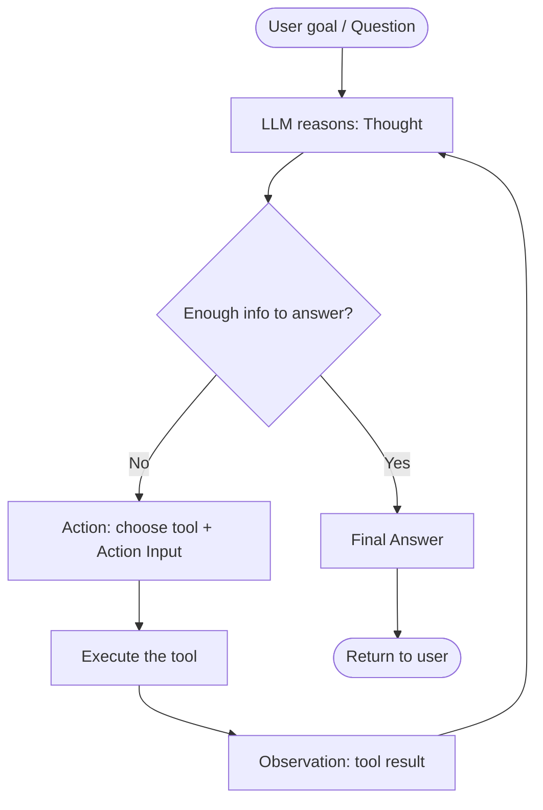

# 19. Building an end-to-end AI Agent in LangChain  (Video 18)

> 📺 [Watch on YouTube](https://www.youtube.com/playlist?list=PLKnIA16_RmvaTbihpo4MtzVm4XOQa0ER0) · ⏱️ ~1:12:47 · CampusX — Generative AI using LangChain

---

## 🎯 What You'll Learn

- What an **AI agent** actually is: an LLM that, given a goal, *decides its own sequence of actions* — which tools to call, in what order — instead of following a fixed script.
- The precise difference between a **chain** (steps you wire up in advance) and an **agent** (steps the model chooses at runtime).
- The **ReAct pattern** (Reason + Act): the `Thought → Action → Observation` loop that lets an LLM plan, act, and self-correct until it can answer.
- How the manual "bind → propose → execute → observe" loop from [18_tool-calling.md](18_tool-calling.md) is *exactly* what an agent automates for you.
- Building the same agent **two ways**: the classic `AgentExecutor` route (`create_react_agent` / `create_tool_calling_agent`), and the modern **LangGraph** route.
- A complete, runnable **worked project**: an agent with two tools — a web-search tool and a custom `@tool` weather tool — answering *"What's the current temperature of the capital of France?"* end to end.
- The real limitations of `AgentExecutor` (opaque loop, awkward memory / branching / human-in-the-loop) and why they motivate LangGraph.

---

## 📖 Overview / Why It Matters

Everything up to this point in the series — models, prompts, output parsers, chains, tools, tool binding — has been about wiring together **components you control**. Even a `RunnableSequence` is a pipeline whose steps *you* decide at build time. The LLM fills in blanks, but the *control flow* is fixed.

An **agent** flips that. You hand the LLM a **goal** and a **toolbox**, and the model itself decides:

- *which* tool to call,
- *with what arguments*,
- *in what order*, and
- *when it has enough information to stop and answer*.

That shift — from "the developer decides the steps" to "the model decides the steps" — is the entire idea. It's what turns a static Q&A app into something that can *do research*, chain multiple lookups together, and recover when a step returns something unexpected.

An agent is best understood as three parts:

```
Agent  =  LLM (the reasoning brain)  +  Tools (the hands)  +  an orchestration loop (the nervous system)
```

The LLM reasons about what to do next; the tools let it *act* on the world (search the web, hit an API, run code); and the loop keeps feeding tool results back into the LLM until it produces a final answer. This note builds exactly that, and shows how the loop you wrote by hand in the tool-calling video becomes automatic.

---

## 🧠 Key Concepts

### Chain vs Agent — predetermined vs dynamic control flow

A **chain** has a control flow you draw in advance. Take a translation-then-summarize chain: it *always* translates, *then* summarizes — the same two steps, in the same order, for every input. The LLM contributes content, not decisions about what happens next.

An **agent** has **dynamic, model-decided** control flow. For the goal *"What's the temperature in the capital of France?"* the agent might decide to search the web to find the capital, then call a weather API, then answer — but for *"What's the temperature in Paris?"* it would skip the first step entirely. Nobody hard-coded either path; the model chose it based on the goal and what it observed along the way.

Same building blocks (LLM + tools), completely different philosophy: a chain executes *your* plan; an agent forms and executes *its own*.

### What makes something "agentic"

Three capabilities distinguish an agent from a fancy chain:

1. **Goal-driven.** You give an objective ("find X"), not a procedure ("do step 1, then 2").
2. **Autonomous tool selection.** The model picks tools and arguments at runtime.
3. **Iterative loop with feedback.** It observes each result and *re-plans* — it can call another tool, retry with different arguments, or decide it's done.

That third point is the crucial one. A single tool call isn't an agent; the **loop** — act, observe, reason again — is what makes it one.

### The ReAct pattern (Reason + Act)

**ReAct** is the reasoning strategy most classic agents use. The LLM is prompted to interleave **reasoning traces** with **actions**, producing a strict cycle:

- **Thought** — the model reasons about what it needs and what to do next.
- **Action** — it names a tool and the input to call it with.
- **Observation** — the tool's return value is fed back in.
- …repeat Thought → Action → Observation…
- **Final Answer** — once the model judges it has enough, it stops looping and answers.

Interleaving *thinking* with *acting* is what makes ReAct robust: the model isn't forced to plan everything up front (it can't — it doesn't yet know what search will return), and it isn't acting blindly either. Each observation informs the next thought.

A concrete trace for *"What's the current temperature of the capital of France?"*:

```
Question: What's the current temperature of the capital of France?
Thought: I need the capital of France, then its current temperature. Let me confirm the capital.
Action: duckduckgo_search
Action Input: capital of France
Observation: Paris is the capital and most populous city of France.
Thought: The capital is Paris. Now I need Paris's current temperature.
Action: get_current_weather
Action Input: Paris
Observation: The current temperature in Paris is 24.3°C.
Thought: I now know the final answer.
Final Answer: The current temperature in Paris, the capital of France, is about 24.3°C.
```

Notice the model made **two different tool calls, in an order it chose**, and only answered once it had both pieces. That's the whole game.

### The ReAct loop, visually



The arrow from **Observation back to Thought** is the loop. `AgentExecutor` (or LangGraph) is the runtime that actually drives it: it parses the model's `Action`, invokes the matching tool, appends the `Observation`, and calls the model again — round and round until it sees a `Final Answer` (or hits a safety limit).

### How the manual tool-calling loop *becomes* an agent

In [18_tool-calling.md](18_tool-calling.md) you did all of this **by hand**:

1. **Bind** tools to the model (`llm.bind_tools([...])`).
2. Let the model **propose** a tool call (you read `ai_msg.tool_calls`).
3. **Execute** the tool yourself in Python.
4. Feed the result back as a `ToolMessage` (**observe**).
5. Call the model again — and write your own `while` loop to **repeat** until there were no more tool calls.

An agent is that exact loop, packaged. `create_react_agent` builds the "decide the next action" logic; `AgentExecutor` owns the `while` loop — parsing actions, running tools, appending observations, re-invoking the model, and stopping at the final answer. You stop writing the plumbing and just declare *llm + tools + prompt*.

```
Manual (video 18)                     Agent (video 18/this note)
─────────────────                     ──────────────────────────
bind_tools([...])            →        create_react_agent(llm, tools, prompt)
read ai_msg.tool_calls       →        AgentExecutor parses the Action
call the tool in Python      →        AgentExecutor invokes the tool
append ToolMessage           →        AgentExecutor appends the Observation
your own while-loop          →        AgentExecutor's loop
```

### Two ways to build it

**1. The classic `AgentExecutor` route.** Use `create_react_agent` for a text-based ReAct agent (works with any LLM, even ones without native tool-calling), or `create_tool_calling_agent` for chat models that support **native tool calling** (OpenAI, Anthropic, Gemini) — the latter is more reliable because the model emits structured tool calls instead of text the runtime has to parse. Either way you wrap the result in an `AgentExecutor` and call `.invoke({"input": ...})`.

**2. The modern LangGraph route.** Current LangChain guidance steers new agent work toward **LangGraph**, which models the loop as an explicit **state graph** you can inspect, extend, checkpoint (memory), branch, and pause for human approval. LangGraph ships a prebuilt `create_react_agent` that gives you a production-grade ReAct agent in one call. See the sibling repo: [Agentic AI using LangGraph](../13_langgraph/README.md).

> ⚠️ **Name clash to know:** `langchain.agents.create_react_agent` (legacy, builds an agent for `AgentExecutor`) and `langgraph.prebuilt.create_react_agent` (modern, returns a runnable graph) are **different functions with the same name**. Import path matters.

---

## 💻 Code Examples

### 1. Define the two tools

We use [Open-Meteo](https://open-meteo.com) for weather because it's free and needs **no API key** — so this snippet is genuinely runnable. The search tool is DuckDuckGo (also key-free).

```python
import requests
from langchain_core.tools import tool
from langchain_community.tools import DuckDuckGoSearchRun

# --- Tool 1: web search (prebuilt community tool) ---
search = DuckDuckGoSearchRun()   # name: "duckduckgo_search"

# --- Tool 2: custom weather tool via @tool ---
@tool
def get_current_weather(city: str) -> str:
    """Return the current temperature (in °C) for a given city name."""
    # Step 1: geocode the city name -> latitude/longitude
    geo = requests.get(
        "https://geocoding-api.open-meteo.com/v1/search",
        params={"name": city, "count": 1},
        timeout=10,
    ).json()
    if not geo.get("results"):
        return f"Could not find a location named {city!r}."
    loc = geo["results"][0]

    # Step 2: fetch current weather for those coordinates
    wx = requests.get(
        "https://api.open-meteo.com/v1/forecast",
        params={
            "latitude": loc["latitude"],
            "longitude": loc["longitude"],
            "current": "temperature_2m",
        },
        timeout=10,
    ).json()
    temp = wx["current"]["temperature_2m"]
    return f"The current temperature in {city} is {temp}°C."

tools = [search, get_current_weather]
```

The docstring on `get_current_weather` is **not optional** — it's the description the agent reads to decide *when* to call this tool. A vague docstring produces a confused agent.

> ⚙️ Requires `pip install -U langchain langchain-community langchain-openai duckduckgo-search langchainhub requests`.

### 2. Route A — classic `create_react_agent` + `AgentExecutor`

```python
from langchain import hub
from langchain_openai import ChatOpenAI
from langchain.agents import create_react_agent, AgentExecutor

# Any LLM works with the text-based ReAct prompt
llm = ChatOpenAI(model="gpt-4o-mini", temperature=0)

# Pull the community-standard ReAct prompt (has {tools}, {tool_names},
# {input}, {agent_scratchpad} placeholders the agent needs)
prompt = hub.pull("hwchase17/react")

# Build the reasoning agent, then wrap it in the loop runner
agent = create_react_agent(llm, tools, prompt)
executor = AgentExecutor(
    agent=agent,
    tools=tools,
    verbose=True,               # print the Thought/Action/Observation trace
    handle_parsing_errors=True, # recover if the model formats an Action badly
    max_iterations=10,          # safety cap on the loop
)

result = executor.invoke(
    {"input": "What's the current temperature of the capital of France?"}
)
print(result["output"])
```

With `verbose=True`, the console prints the live ReAct trace — the same `Thought → Action → Observation` cycle shown earlier — ending in the `Final Answer`. `result` is a dict; the answer is under `result["output"]`.

### 3. Route A′ — `create_tool_calling_agent` (native tool calling)

For chat models with native tool calling, this is the more reliable variant — the model returns *structured* tool calls, so there's no fragile text parsing.

```python
from langchain_openai import ChatOpenAI
from langchain_core.prompts import ChatPromptTemplate
from langchain.agents import create_tool_calling_agent, AgentExecutor

llm = ChatOpenAI(model="gpt-4o-mini", temperature=0)

# Tool-calling agents need a chat prompt with an agent_scratchpad placeholder
prompt = ChatPromptTemplate.from_messages([
    ("system", "You are a helpful assistant. Use the available tools when they help."),
    ("human", "{input}"),
    ("placeholder", "{agent_scratchpad}"),   # where intermediate steps go
])

agent = create_tool_calling_agent(llm, tools, prompt)
executor = AgentExecutor(agent=agent, tools=tools, verbose=True)

print(executor.invoke(
    {"input": "What's the current temperature of the capital of France?"}
)["output"])
```

The `agent_scratchpad` placeholder is where `AgentExecutor` injects the running list of `(action, observation)` pairs on each loop, so the model can see what it has already tried.

### 4. Route B — the modern LangGraph agent

Same tools, dramatically less ceremony, and a far more extensible runtime.

```python
from langgraph.prebuilt import create_react_agent   # NOTE: langgraph, not langchain
from langchain_openai import ChatOpenAI

# One call builds a full ReAct agent as a runnable state graph
agent = create_react_agent(ChatOpenAI(model="gpt-4o-mini"), tools=tools)

result = agent.invoke(
    {"messages": [("user", "What's the current temperature of the capital of France?")]}
)
print(result["messages"][-1].content)
```

Note the different I/O shape: LangGraph agents speak in a **message list** (`{"messages": [...]}`) and return the full conversation, with the answer as the last message. Because the loop is an explicit graph, you can now add persistent memory (a checkpointer), conditional branches, and human-in-the-loop pauses without rewriting the agent. That's the whole reason to prefer it — see [the LangGraph notes](../13_langgraph/README.md).

---

## 📊 Comparison / Reference Table

### Chain vs Agent

| Aspect | Chain | Agent |
|---|---|---|
| Control flow | **Fixed** — you wire the steps at build time | **Dynamic** — the model decides steps at runtime |
| Input you give | A procedure (do A, then B) | A goal (achieve X) |
| Tool selection | You choose, in code | The LLM chooses, per run |
| Loops / branching | Only what you explicitly code | Emergent — the model re-plans on each observation |
| Predictability | High, deterministic path | Lower; the path can differ per input |
| Best for | Well-defined, repeatable pipelines | Open-ended tasks needing lookups/decisions |

### `AgentExecutor` (classic) vs LangGraph (modern)

| Aspect | `AgentExecutor` | LangGraph |
|---|---|---|
| Mental model | A black-box `while` loop | An explicit **state graph** you define/inspect |
| Setup | `create_*_agent` + `AgentExecutor(...)` | `create_react_agent(...)` (prebuilt) or a custom graph |
| Loop control | Limited (`max_iterations`, early-stop) | Full — custom nodes, edges, conditions |
| Memory | Bolt-on, awkward | First-class via checkpointers |
| Branching / cycles | Hard to express | Native |
| Human-in-the-loop | Very hard | Built-in (interrupt / resume) |
| Observability | `verbose=True` text trace | Inspectable state at every node |
| Status | Legacy; still works | **Recommended** for new agent work |

### `create_*_agent` constructors

| Function | Import | Works with | How the model signals a tool |
|---|---|---|---|
| `create_react_agent` | `langchain.agents` | **Any** LLM (text completion) | Emits `Action:` / `Action Input:` **text** (parsed) |
| `create_tool_calling_agent` | `langchain.agents` | Chat models with **native tool calling** | Emits **structured** tool calls (no parsing) |
| `create_react_agent` | `langgraph.prebuilt` | Chat models with native tool calling | Structured tool calls, run inside a graph |

---

## ⚠️ Gotchas & Tips

- **Tool docstrings are the agent's instructions.** The `@tool` docstring and argument names/types are what the model uses to decide *whether* and *how* to call a tool. Write them like you're documenting an API for a stranger.
- **`hwchase17/react` needs specific placeholders.** The pulled prompt references `{tools}`, `{tool_names}`, `{input}`, and `{agent_scratchpad}`. If you write your own ReAct prompt and omit any of them, `create_react_agent` raises a validation error.
- **Two functions, one name.** `langchain.agents.create_react_agent` ≠ `langgraph.prebuilt.create_react_agent`. Double-check the import — mixing them up produces confusing type/shape errors (message-list vs `{"input": ...}`).
- **Text-parsing ReAct is brittle.** With `create_react_agent`, the runtime parses the model's free text for `Action:` lines. Smaller/weaker models drift from the format and blow up. Always set `handle_parsing_errors=True`, and prefer `create_tool_calling_agent` when your model supports native tool calls.
- **Always cap the loop.** Set `max_iterations` (and consider `max_execution_time`). Without a cap, a confused agent can loop, burning tokens and money, until it hits a provider limit.
- **`temperature=0` for reliability.** Agent reasoning is more consistent and less likely to hallucinate malformed actions at low temperature.
- **`verbose=True` is your debugger.** It prints the whole Thought/Action/Observation trace so you can see *why* the agent chose a tool — indispensable when an agent misbehaves.
- **Every tool call costs a round-trip.** Each loop iteration is another LLM call plus a tool call: real latency and real tokens. Fewer, better-scoped tools beat a dozen overlapping ones.
- **Web-search tools return unstructured text.** DuckDuckGo/Tavily results are noisy; the model may pull the wrong fact. For anything precision-critical, prefer a structured API tool (like the weather tool) over free-text search.
- **AgentExecutor is legacy.** It still works and is fine for learning, but for production — especially anything needing memory, branching, or human approval — build on LangGraph instead.

---

## 🧠 Key Takeaways

- An **agent** is `LLM + Tools + an orchestration loop`: give it a *goal*, and it autonomously decides which tools to call, in what order, looping until it can answer.
- The line between a **chain** and an **agent** is *who decides the steps*: a chain runs **your** predetermined plan; an agent forms and runs **its own** plan at runtime.
- The **ReAct pattern** interleaves `Thought → Action → Observation`, repeating until a `Final Answer`. Reasoning between actions is what lets the agent self-correct.
- An agent is just the **manual tool-calling loop from [18_tool-calling.md](18_tool-calling.md), automated** — bind, propose, execute, observe, repeat — so you stop writing the `while` loop yourself.
- **Classic route:** `create_react_agent` (any LLM, text-parsed) or `create_tool_calling_agent` (chat models, structured) → wrap in `AgentExecutor(..., verbose=True)` → `.invoke({"input": ...})`.
- **Custom tools** come from the `@tool` decorator; their docstrings and signatures *are* the interface the agent reasons over.
- `AgentExecutor`'s loop is **opaque and hard to extend** (memory, branching, human-in-the-loop are all awkward) — which is exactly why modern LangChain steers agent work to **[LangGraph](../13_langgraph/README.md)**.
- Beware the **name collision**: `langchain.agents.create_react_agent` (legacy) vs `langgraph.prebuilt.create_react_agent` (modern) are different functions.
- Practical hygiene: low temperature, `handle_parsing_errors=True`, a `max_iterations` cap, sharp tool docstrings, and `verbose=True` while debugging.

---

## ❓ Revision Questions

1. In one sentence, what is an AI agent, and what are its three constituent parts?
2. Explain the difference between a chain and an agent in terms of *who* decides the control flow and *when*.
3. What do the three phases of the ReAct loop — Thought, Action, Observation — each contribute, and what ends the loop?
4. Walk through the ReAct trace an agent would produce for *"What's the current temperature of the capital of France?"* Which tools fire, and in what order?
5. The manual tool-calling loop from video 18 had five steps (bind, read tool calls, execute, append result, repeat). Map each step to the part of the agent machinery that automates it.
6. What is the role of `AgentExecutor`, and what does `create_react_agent` produce that it wraps?
7. When would you reach for `create_tool_calling_agent` instead of `create_react_agent`, and why is it generally more reliable?
8. Why is a custom tool's docstring so important? What tends to happen if it's vague or missing?
9. Give three concrete limitations of `AgentExecutor` that motivate moving to LangGraph.
10. There are two functions named `create_react_agent`. Where does each live, how do their inputs/outputs differ, and why does the distinction matter?
