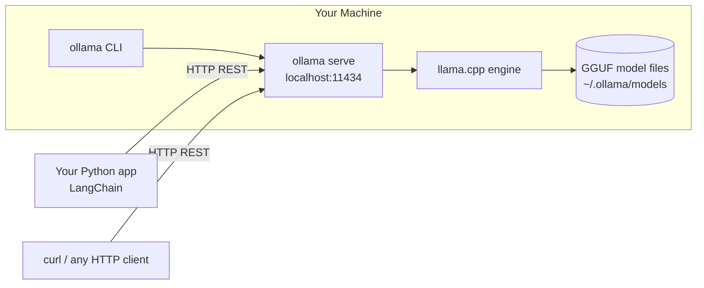
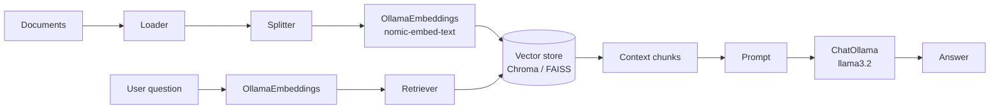

# 20. Ollama Masterclass — Run Powerful Local LLMs  (Bonus)

> 📺 [Watch on YouTube](https://www.youtube.com/playlist?list=PLKnIA16_RmvaTbihpo4MtzVm4XOQa0ER0) · ⏱️ ~2h 49m · CampusX — Generative AI using LangChain

---

## 🎯 What You'll Learn

- What **Ollama** is — a tool to download and run open-source LLMs *locally* on your own machine, exposed through a simple CLI **and** a local REST API — and why "local" is a first-class deployment target (privacy, zero per-token cost, offline, full control).
- The full **CLI workflow**: `pull`, `run`, `list`, `ps`, `rm`, `cp`, `show`, `serve`, and how the local model library is organized (llama3.x, mistral, gemma, phi, qwen, deepseek, `nomic-embed-text`, …).
- **Quantization & GGUF** — what `Q4_K_M` actually means, the size ↔ quality ↔ speed trade-off, and how to pick a quant that fits your RAM/VRAM.
- The **REST API** in depth: `POST /api/generate`, `POST /api/chat`, `POST /api/embeddings`, streaming vs non-streaming, with runnable `curl` examples.
- **Modelfiles** — building custom models with `FROM`, `SYSTEM`, `PARAMETER`, and `TEMPLATE`, then `ollama create`.
- Wiring Ollama into **LangChain** via `langchain_ollama` (`ChatOllama`, `OllamaLLM`, `OllamaEmbeddings`).
- Building a **fully-local RAG pipeline** — load → split → embed with `OllamaEmbeddings` → store in Chroma/FAISS → retrieve → answer with `ChatOllama`, at **zero API cost**.
- **Hardware guidance** (rough RAM/VRAM per model size) and a clear-eyed **local vs cloud** trade-off table.

---

## 📖 Overview / Why It Matters

Every LangChain example so far has reached out to a **hosted** model — OpenAI, Google Gemini, Anthropic — over the network. That's convenient, but it bakes in three costs: you pay per token, your data leaves your machine, and you can't run offline. **Ollama** flips all three. It is a small, self-contained runtime that downloads open-weight models (Llama, Mistral, Gemma, Phi, Qwen, DeepSeek, …) and runs them **on your own hardware**, serving them through a local HTTP API on `localhost:11434`.

Think of Ollama as "Docker for LLMs." Just as `docker pull` fetches an image and `docker run` starts a container, `ollama pull` fetches a quantized model and `ollama run` starts an interactive session. Under the hood it wraps **llama.cpp** (a highly-optimized C/C++ inference engine) and manages model files, prompt templates, and a REST server for you — so you never touch the low-level plumbing.

Where it fits in the LangChain picture: Ollama is just **another chat/LLM/embedding provider**. Anywhere your code uses `ChatOpenAI` or `ChatGoogleGenerativeAI`, you can drop in `ChatOllama` and keep the rest of your chain — prompts, output parsers, retrievers, LCEL pipelines — completely unchanged. That interchangeability is the whole point of LangChain's provider abstraction.



**Why local matters:**

- **Privacy / compliance.** Prompts and documents never leave the machine — critical for PII, medical, legal, or internal-source-code use cases where sending data to a third party is a non-starter.
- **Cost.** No per-token billing. Once the weights are downloaded, inference is "free" (you pay only for electricity/hardware you already own). Great for high-volume batch jobs and for iterating during development.
- **Offline / air-gapped.** Works on a plane, in a secure facility, or anywhere without internet after the initial pull.
- **Full control.** You choose the exact model version and quantization, pin it, and it never silently changes underneath you (unlike a hosted API that may swap model versions).

**The trade-offs are real, though:** local models need RAM/VRAM proportional to their size, they're generally **weaker** than frontier closed models (GPT-4-class, Claude, Gemini Ultra) on hard reasoning, and throughput is bounded by your hardware, not a datacenter. The sweet spot is privacy-sensitive workloads, cost-sensitive high-volume tasks, offline scenarios, and local development — while frontier hosted models still win on raw capability.

---

## 🧠 Key Concepts

### What Ollama actually is

Ollama is three things bundled together:

1. **A CLI** (`ollama …`) for managing and chatting with models.
2. **A background server** (`ollama serve`) that exposes a **REST API** on `http://localhost:11434`. On macOS/Windows the desktop app starts this automatically; on Linux it runs as a systemd service.
3. **A model registry + local store**. Models live at `~/.ollama/models` (Linux/macOS) as content-addressed blobs. `ollama.com/library` is the public registry it pulls from.

Crucially, the CLI is *just a client of the REST API*. When you type `ollama run llama3.2`, the CLI is making HTTP calls to the same `/api/chat` endpoint your Python code would hit. There is no "special" path — everything goes through the server.

### The model library

Ollama's [library](https://ollama.com/library) hosts many open-weight families. The common ones:

| Family | Typical tags | Notes |
|---|---|---|
| **Llama 3.x** (Meta) | `llama3.2`, `llama3.2:1b`, `llama3.1:8b`, `llama3.3:70b` | Strong general-purpose default; `3.2` has tiny 1B/3B variants great for laptops. |
| **Mistral / Mixtral** | `mistral`, `mixtral:8x7b` | 7B is a very capable small model; Mixtral is a mixture-of-experts. |
| **Gemma** (Google) | `gemma2:2b`, `gemma2:9b`, `gemma3` | Efficient, permissively licensed. |
| **Phi** (Microsoft) | `phi3`, `phi3.5`, `phi4` | "Small language models" tuned for reasoning-per-parameter. |
| **Qwen** (Alibaba) | `qwen2.5`, `qwen2.5-coder`, `qwen3` | Strong multilingual + coding variants. |
| **DeepSeek** | `deepseek-r1`, `deepseek-coder-v2` | `r1` is a reasoning ("thinking") model. |
| **Embeddings** | `nomic-embed-text`, `mxbai-embed-large`, `all-minilm` | Text → vector models for RAG; **not** chat models. |

A model reference is `name:tag`. If you omit the tag you get `:latest`, which is usually a mid-size default quant. Be explicit in production (e.g. `llama3.1:8b-instruct-q4_K_M`) so the exact weights are pinned.

> **Instruct vs base.** Most chat tags are *instruction-tuned* ("instruct"/"chat") — they follow prompts. "Base"/"text" tags are raw next-token predictors and behave very differently. For chat/RAG, always use an instruct variant.

### Quantization & GGUF

This is the concept that makes local LLMs practical, so it's worth understanding well.

**GGUF** ("GGML Unified Format") is the on-disk file format that llama.cpp — and therefore Ollama — uses to store model weights. A single `.gguf` file packs the tensors, tokenizer, and metadata. Everything Ollama pulls is a GGUF blob.

**Quantization** is the compression that shrinks these files. A model is originally trained in 16-bit floats (**FP16**, 2 bytes per parameter). An 8B-parameter model at FP16 is ~16 GB — too big for most consumer GPUs. Quantization stores each weight in **fewer bits** (8, 5, 4, 3, even 2), trading a little accuracy for a lot of size and speed.

Ollama tags encode the quant, e.g. `llama3.1:8b-instruct-q4_K_M`. Reading `Q4_K_M`:

- **`Q4`** — weights stored in ~**4 bits** each (vs 16 for FP16). Roughly 4× smaller than FP16.
- **`_K`** — "k-quant," a smarter block-wise scheme that keeps quality higher than naive quantization at the same bit-width.
- **`_M`** — the *size class* within k-quants: **S**(mall) / **M**(edium) / **L**(arge). `M` keeps a few sensitive tensors at higher precision; it's the standard "balanced" pick.

The trade-off, from smallest/fastest to largest/most-faithful:

| Quant | Bits/weight | Size (rel. FP16) | Quality | When to use |
|---|---|---|---|---|
| `Q2_K` | ~2 | ~1/8 | Noticeably degraded | Only if you're desperate for RAM; expect errors. |
| `Q3_K_M` | ~3 | ~3/16 | Usable but lossy | Very tight memory. |
| **`Q4_K_M`** | ~4 | ~1/4 | **Great balance** | **The default recommendation** for most people. |
| `Q5_K_M` | ~5 | ~5/16 | Very close to FP16 | If you have spare RAM/VRAM and want more fidelity. |
| `Q6_K` | ~6 | ~3/8 | Near-lossless | High-quality, still smaller than FP16. |
| `Q8_0` | 8 | ~1/2 | Essentially lossless | When quality matters more than footprint. |
| `FP16` | 16 | 1× | Reference | Rarely needed locally; huge. |

**Rule of thumb:** start at **`Q4_K_M`**. If the model doesn't fit or is slow, step down to `Q3_K_M`; if you have headroom and want better answers, step up to `Q5_K_M`/`Q6_K`. Lower bits = smaller file, less memory, faster tokens/sec, but more "rounding error" showing up as weaker reasoning and occasional mistakes.

### The REST API

Everything Ollama does is reachable over HTTP on `localhost:11434`. Three endpoints matter most:

- **`POST /api/generate`** — a *single-turn* completion. You send one `prompt` string and get a completion. Good for one-shot tasks (summarize this, classify that).
- **`POST /api/chat`** — a *multi-turn* conversation. You send a `messages` array (each with `role` = `system`/`user`/`assistant` and `content`). This is what you want for chatbots and for anything with a system prompt or history.
- **`POST /api/embeddings`** (and the newer `POST /api/embed`) — turn text into a vector using an embedding model like `nomic-embed-text`. This is the backbone of local RAG.

**Streaming.** By default both `/api/generate` and `/api/chat` **stream**: the server returns a sequence of newline-delimited JSON objects, one per token/chunk, each with `"done": false`, ending with a final object `"done": true` that carries timing stats. Set `"stream": false` in the body to get a single consolidated JSON response instead — simpler to parse when you don't need token-by-token output.

Other useful endpoints: `GET /api/tags` (list local models — the API behind `ollama list`), `GET /api/ps` (running models), `POST /api/pull` (download), `POST /api/create` (build from a Modelfile), `POST /api/show` (model metadata).

### Modelfiles

A **Modelfile** is a small declarative recipe (à la Dockerfile) for building a *customized* model on top of a base one — baking in a system prompt, default parameters, or a custom chat template. Key instructions:

- **`FROM`** — the base model (a library name like `llama3.2`, or a path to a local `.gguf`). Required, first line.
- **`SYSTEM`** — a default system prompt baked into the model, so every chat starts with that persona/instructions.
- **`PARAMETER`** — set inference defaults: `temperature`, `top_p`, `top_k`, `num_ctx` (context window size), `repeat_penalty`, `stop`, `seed`, etc.
- **`TEMPLATE`** — the Go-template that formats messages into the prompt the model actually sees (system/user/assistant markers). You rarely need to override this — inheriting it from the base model is usually correct.
- **`LICENSE`**, **`ADAPTER`** (LoRA), **`MESSAGE`** (few-shot priming) — less common.

You then run `ollama create mymodel -f Modelfile`, and `mymodel` becomes a first-class model you can `run`, hit via the API, or use from LangChain — with your system prompt and parameters already applied.

### Ollama + LangChain

The integration lives in the **`langchain_ollama`** package and mirrors the other providers exactly:

- **`ChatOllama`** — a chat model (takes/returns messages); the one you'll use most.
- **`OllamaLLM`** — a plain text-completion LLM interface (string in, string out).
- **`OllamaEmbeddings`** — an embeddings model for RAG.

All three are standard LangChain `Runnable`s: they support `.invoke()`, `.stream()`, `.batch()`, async variants, and slot straight into LCEL pipes (`prompt | model | parser`). Because the interface is identical to `ChatOpenAI`/`ChatGoogleGenerativeAI`, swapping providers is a one-line change — see the sibling [LangChain Components](03_langchain-components.md) and [Prompts](05_prompts.md) notes for the shared abstractions.

### Local RAG with Ollama

The big payoff: a **completely local, zero-cost RAG pipeline**. The RAG mechanics are exactly the ones from the [RAG notes](../12_rag/01_what-is-rag.md) — load, split, embed, store, retrieve, generate — but every model call goes to Ollama instead of a hosted API:



Nothing leaves your machine, there's no API key, and you can run it offline. The only tax is that a local embedding model + a local chat model are slower and somewhat weaker than their hosted counterparts.

---

## 💻 Code Examples

### 1. Install & first run (shell)

```bash
# macOS: download the app from ollama.com, or:
brew install ollama

# Linux (installs + starts a systemd service):
curl -fsSL https://ollama.com/install.sh | sh

# Windows: download the installer from ollama.com

# Verify:
ollama --version
```

### 2. CLI basics

```bash
# Download a model (weights cached under ~/.ollama/models)
ollama pull llama3.2

# Start an interactive chat (pulls automatically if not present)
ollama run llama3.2
# >>> Why is the sky blue?
# (type /bye to exit, /? for in-chat commands)

# One-shot prompt without entering the REPL
ollama run llama3.2 "Summarize the theory of relativity in 2 sentences."

# List installed models (name, id, size, modified)
ollama list

# Show models currently loaded in memory (with VRAM/CPU split + expiry)
ollama ps

# Inspect a model's Modelfile, template, params, license
ollama show llama3.2
ollama show llama3.2 --modelfile

# Copy / rename, and delete
ollama cp llama3.2 my-llama
ollama rm my-llama

# Run the API server in the foreground (usually already running as a service)
ollama serve
```

### 3. REST API with `curl`

```bash
# --- /api/generate : single completion, non-streaming ---
curl http://localhost:11434/api/generate -d '{
  "model": "llama3.2",
  "prompt": "Explain quantization in one sentence.",
  "stream": false
}'
# -> {"model":"llama3.2","response":"Quantization stores model weights ...","done":true, ...}

# --- /api/generate : streaming (default) ---
# Emits one JSON object per chunk, each with "done": false, then a final "done": true.
curl http://localhost:11434/api/generate -d '{
  "model": "llama3.2",
  "prompt": "Count from 1 to 5."
}'

# --- /api/chat : multi-turn with a system message ---
curl http://localhost:11434/api/chat -d '{
  "model": "llama3.2",
  "stream": false,
  "messages": [
    {"role": "system", "content": "You are a terse assistant. Answer in one line."},
    {"role": "user",   "content": "What is Ollama?"}
  ]
}'
# -> {"message":{"role":"assistant","content":"A tool to run open-source LLMs locally."}, "done":true, ...}

# --- /api/embeddings : text -> vector ---
curl http://localhost:11434/api/embeddings -d '{
  "model": "nomic-embed-text",
  "prompt": "LangChain makes it easy to build LLM apps."
}'
# -> {"embedding": [0.0123, -0.0456, ...]}   # 768-dim for nomic-embed-text

# --- tuning generation parameters via "options" ---
curl http://localhost:11434/api/generate -d '{
  "model": "llama3.2",
  "prompt": "Give me a startup name for a coffee brand.",
  "stream": false,
  "options": { "temperature": 0.9, "top_p": 0.95, "num_ctx": 4096 }
}'
```

### 4. A Modelfile — custom persona + defaults

```dockerfile
# File: Modelfile
FROM llama3.2

# Bake in a persona / system prompt
SYSTEM """
You are "PirateGPT", a helpful assistant who answers every question
in the voice of a friendly pirate. Keep answers concise.
"""

# Default inference parameters
PARAMETER temperature 0.7
PARAMETER top_p 0.9
PARAMETER num_ctx 4096
PARAMETER repeat_penalty 1.1
PARAMETER stop "<|eot_id|>"

# (Optional) override the prompt template — usually inherited from the base model.
# TEMPLATE """{{ .System }}\nUser: {{ .Prompt }}\nAssistant: """
```

```bash
# Build it into a reusable model
ollama create pirate-llama -f Modelfile

# Use it exactly like any other model
ollama run pirate-llama "How do I center a div?"
ollama list        # pirate-llama now shows up
```

### 5. LangChain — `ChatOllama` chat

```python
from langchain_ollama import ChatOllama
from langchain_core.messages import SystemMessage, HumanMessage

# base_url defaults to http://localhost:11434; no API key needed.
llm = ChatOllama(
    model="llama3.2",
    temperature=0.7,
    num_ctx=4096,        # context window
    # base_url="http://localhost:11434",
)

messages = [
    SystemMessage(content="You are a concise assistant."),
    HumanMessage(content="Give me three benefits of running LLMs locally."),
]

resp = llm.invoke(messages)
print(resp.content)
```

### 6. LangChain — LCEL pipeline + streaming

```python
from langchain_ollama import ChatOllama
from langchain_core.prompts import ChatPromptTemplate
from langchain_core.output_parsers import StrOutputParser

prompt = ChatPromptTemplate.from_messages([
    ("system", "You are an expert {domain} tutor. Be clear and brief."),
    ("human", "{question}"),
])

llm = ChatOllama(model="llama3.2", temperature=0.3)
chain = prompt | llm | StrOutputParser()

# Same LCEL surface as any other provider:
print(chain.invoke({"domain": "physics", "question": "What is entropy?"}))

# Token-by-token streaming:
for chunk in chain.stream({"domain": "history", "question": "Who was Ashoka?"}):
    print(chunk, end="", flush=True)
```

### 7. LangChain — `OllamaLLM` and `OllamaEmbeddings`

```python
from langchain_ollama import OllamaLLM, OllamaEmbeddings

# Plain string-in / string-out completion model
text_llm = OllamaLLM(model="llama3.2")
print(text_llm.invoke("Write a haiku about local models."))

# Embeddings for RAG (use a dedicated embedding model, not a chat model)
embeddings = OllamaEmbeddings(model="nomic-embed-text")

vec = embeddings.embed_query("How do transformers work?")
print(len(vec))                    # 768 for nomic-embed-text

doc_vecs = embeddings.embed_documents([
    "Ollama runs models locally.",
    "LangChain orchestrates LLM apps.",
])
print(len(doc_vecs), len(doc_vecs[0]))
```

### 8. A fully-local RAG pipeline (zero API cost)

```python
from langchain_community.document_loaders import TextLoader
from langchain_text_splitters import RecursiveCharacterTextSplitter
from langchain_community.vectorstores import Chroma          # or FAISS
from langchain_ollama import OllamaEmbeddings, ChatOllama
from langchain_core.prompts import ChatPromptTemplate
from langchain_core.output_parsers import StrOutputParser
from langchain_core.runnables import RunnablePassthrough

# 1. Load
docs = TextLoader("notes.txt").load()

# 2. Split  (see ../12_rag/03_text-splitters.md for the details)
splitter = RecursiveCharacterTextSplitter(chunk_size=500, chunk_overlap=50)
chunks = splitter.split_documents(docs)

# 3. Embed locally + 4. Store in a vector DB
embeddings = OllamaEmbeddings(model="nomic-embed-text")
vectorstore = Chroma.from_documents(chunks, embedding=embeddings)

# 5. Retrieve
retriever = vectorstore.as_retriever(search_kwargs={"k": 4})

# 6. Generate locally with ChatOllama
llm = ChatOllama(model="llama3.2", temperature=0.2)

prompt = ChatPromptTemplate.from_template(
    """Answer the question using ONLY the context below.
If the answer isn't in the context, say you don't know.

Context:
{context}

Question: {question}"""
)

def format_docs(docs):
    return "\n\n".join(d.page_content for d in docs)

rag_chain = (
    {"context": retriever | format_docs, "question": RunnablePassthrough()}
    | prompt
    | llm
    | StrOutputParser()
)

print(rag_chain.invoke("What are the benefits of running LLMs locally?"))
```

Every model call above — embedding *and* generation — hits `localhost:11434`. No API key, no per-token cost, works offline. To swap in FAISS instead of Chroma, replace step 4 with `FAISS.from_documents(chunks, embedding=embeddings)`; the rest is identical. Compare with the hosted version in the [RAG YouTube-chatbot note](../12_rag/06_youtube-chatbot-rag.md).

### 9. Python `ollama` client (no LangChain)

```python
# pip install ollama
import ollama

# Chat
resp = ollama.chat(model="llama3.2", messages=[
    {"role": "user", "content": "One fun fact about octopuses."}
])
print(resp["message"]["content"])

# Streaming
for chunk in ollama.chat(model="llama3.2",
                         messages=[{"role": "user", "content": "Count to 5."}],
                         stream=True):
    print(chunk["message"]["content"], end="", flush=True)

# Embeddings
e = ollama.embeddings(model="nomic-embed-text", prompt="hello world")
print(len(e["embedding"]))
```

---

## 📊 Comparison / Reference Table

### Model size vs hardware (rough guidance)

Memory needed ≈ model file size + a bit for the KV-cache/context. These are ballpark figures for a `Q4_K_M` quant; larger quants need more, smaller quants less.

| Model size | Q4 file size (approx) | Min RAM (CPU-only) | Recommended VRAM (GPU) | Realistic on |
|---|---|---|---|---|
| **1–3B** (`llama3.2:1b`, `gemma2:2b`, `phi3`) | ~1–2 GB | 8 GB | 4 GB | Any modern laptop, even CPU-only |
| **7–8B** (`llama3.1:8b`, `mistral`, `qwen2.5:7b`) | ~4–5 GB | 16 GB | 8 GB | Mainstream laptop / mid GPU |
| **13–14B** (`qwen2.5:14b`, `phi4`) | ~8–9 GB | 32 GB | 12–16 GB | Enthusiast desktop |
| **30–34B** (`qwen2.5:32b`, `deepseek-coder-v2`) | ~18–20 GB | 48–64 GB | 24 GB (e.g. RTX 4090) | Workstation |
| **70B** (`llama3.3:70b`, `llama3.1:70b`) | ~40 GB | 64 GB+ | 48 GB+ (or 2× 24 GB) | Multi-GPU / server |

Notes: GPU is dramatically faster (tokens/sec) than CPU, but Ollama will happily run **CPU-only** (just slower) or **split** a model between GPU VRAM and system RAM when it doesn't fully fit. Apple Silicon uses **unified memory**, so "RAM" and "VRAM" are the same pool — a 16 GB M-series Mac comfortably runs 7–8B models. Bigger context (`num_ctx`) also consumes more memory.

### Local (Ollama) vs Cloud (hosted API)

| Dimension | Local (Ollama) | Cloud (OpenAI / Gemini / Anthropic) |
|---|---|---|
| **Cost** | Free after download (your hardware/electricity) | Per-token billing; scales with usage |
| **Privacy** | Data never leaves your machine | Data sent to a third-party provider |
| **Offline** | Works fully offline after pull | Requires internet |
| **Setup** | Install Ollama, pull a model | Just an API key |
| **Model quality** | Good, but generally below frontier models | State-of-the-art reasoning/quality |
| **Max model size** | Bounded by your RAM/VRAM | Effectively unlimited (huge models) |
| **Latency / throughput** | Bounded by local hardware | Elastic datacenter scale |
| **Version control** | You pin the exact quant; never changes | Provider may update/deprecate versions |
| **Maintenance** | You manage updates & hardware | Fully managed |
| **Best for** | Privacy, cost-sensitive/high-volume, offline, dev | Hardest reasoning, largest models, zero-ops |

---

## ⚠️ Gotchas & Tips

- **Use the right package.** Install `langchain-ollama` (`pip install langchain-ollama`). Older code imported `Ollama`/`ChatOllama` from `langchain_community`; those are deprecated — prefer `from langchain_ollama import ChatOllama, OllamaLLM, OllamaEmbeddings`.
- **Chat model ≠ embedding model.** Passing a chat model like `llama3.2` to `OllamaEmbeddings` will either error or give poor vectors. Use a dedicated embedding model (`nomic-embed-text`, `mxbai-embed-large`). And **never mix embedding models** between indexing and querying — the vectors must come from the same model, or similarity search is meaningless.
- **The server must be running.** LangChain/`curl` calls fail with a connection error if `ollama serve` isn't up. The desktop app starts it automatically; on Linux check `systemctl status ollama`. Default port is **11434**.
- **`stream: true` is the default on the REST API.** If you send a raw `curl`/`requests` call and try to `json.loads` the whole body, it'll break — the response is *newline-delimited* JSON objects. Set `"stream": false` for a single object, or parse line-by-line.
- **First call after idle is slow.** Ollama loads the model into memory on demand and unloads it after ~5 minutes of inactivity (`keep_alive`). The first `invoke` pays the load cost; subsequent ones are fast. Tune with the `keep_alive` option (e.g. `"keep_alive": "30m"` or `-1` to keep loaded).
- **Watch the context window (`num_ctx`).** Ollama's default context is often small (e.g. 2048–4096 tokens) regardless of the model's theoretical max. If you feed long RAG context and it seems to "forget," raise `num_ctx` — but note bigger context uses more memory and is slower.
- **Quantization is a quality knob.** If a local model is giving weak/wrong answers, before blaming the model, check the quant. Jumping from `Q4_K_M` to `Q5_K_M`/`Q6_K` often noticeably improves output if you have the memory.
- **`temperature=0` for RAG/extraction.** For factual, grounded tasks, low temperature makes answers more deterministic and less prone to embellishment.
- **Not all local models do tool-calling well.** LangChain agents / structured output rely on function-calling; support varies by model. Llama 3.1/3.2, Qwen 2.5, and Mistral have decent tool-calling; smaller models often don't. Test before building an agent on a tiny model.
- **Disk fills up fast.** Models are gigabytes each. `ollama list` shows sizes; `ollama rm` reclaims space. Keep an eye on `~/.ollama/models`.
- **Reproducibility.** Set a `seed` (and `temperature=0`) in `options`/`PARAMETER` if you need repeatable outputs across runs.

---

## 🧠 Key Takeaways

- **Ollama runs open-source LLMs locally** via a simple CLI plus a REST API on `localhost:11434` — "Docker for LLMs," built on llama.cpp.
- **Why local:** privacy (data stays put), zero per-token cost, offline capability, and full version control — at the cost of needing RAM/VRAM and getting generally weaker quality than frontier hosted models.
- **Core CLI:** `pull` (download), `run` (chat), `list` (installed), `ps` (loaded), `rm` (delete), `show` (inspect), `serve` (start API). The CLI is just a client of the same REST API your code uses.
- **Quantization + GGUF** make local LLMs viable: GGUF is the file format; a tag like `Q4_K_M` means ~4-bit k-quant, medium size class. **Start at `Q4_K_M`** and adjust for your hardware and quality needs.
- **REST API:** `/api/generate` (single completion), `/api/chat` (messages), `/api/embeddings` (vectors). Responses **stream by default** as newline-delimited JSON — set `"stream": false` for one object.
- **Modelfiles** build custom models with `FROM`, `SYSTEM`, `PARAMETER`, and `TEMPLATE`, then `ollama create name -f Modelfile` — baking in a persona and default params.
- **LangChain integration** is a drop-in: `from langchain_ollama import ChatOllama, OllamaLLM, OllamaEmbeddings`. Identical `Runnable`/LCEL surface as OpenAI/Gemini/Anthropic, so swapping providers is one line.
- **Fully-local RAG** is the flagship use case: `OllamaEmbeddings` + Chroma/FAISS + `ChatOllama` gives a private, offline, zero-cost pipeline with the exact same architecture as any hosted RAG.
- **Match the model to your hardware:** 1–3B for laptops, 7–8B mainstream, 70B for workstations/servers. Use a real embedding model (`nomic-embed-text`) for RAG, never a chat model.

---

## ❓ Revision Questions

1. In one paragraph, what is Ollama, and what are the three headline reasons to run an LLM locally instead of calling a hosted API?
2. What does the CLI command `ollama pull llama3.1:8b` do, and where do the downloaded weights live? How does `ollama run` differ from `ollama pull`?
3. Decode the tag `llama3.1:8b-instruct-q4_K_M` piece by piece. What does each of `q4`, `_K`, and `_M` tell you, and why is `Q4_K_M` the common default?
4. What is GGUF, and what is the relationship between GGUF, quantization, and llama.cpp?
5. You have a laptop with 16 GB of RAM and no discrete GPU. Which rough model sizes and quant are realistic, and which would you avoid? Why?
6. Compare `/api/generate` and `/api/chat`. When would you use each, and what shape is the request body for `/api/chat`?
7. By default, is the Ollama REST API streaming or non-streaming? What does the raw HTTP response look like, and what breaks if you naively `json.loads` the whole body?
8. Write a minimal Modelfile that gives `llama3.2` a fixed "helpful legal assistant" persona at `temperature=0.2`, and give the command to build it.
9. Show the imports and a two-line snippet to (a) chat with `ChatOllama` and (b) embed a query with `OllamaEmbeddings`. Why must the embedding model differ from the chat model?
10. Sketch the components of a fully-local RAG pipeline with Ollama. Which pieces replace the hosted API, and what are the main trade-offs versus a cloud-based RAG setup?
