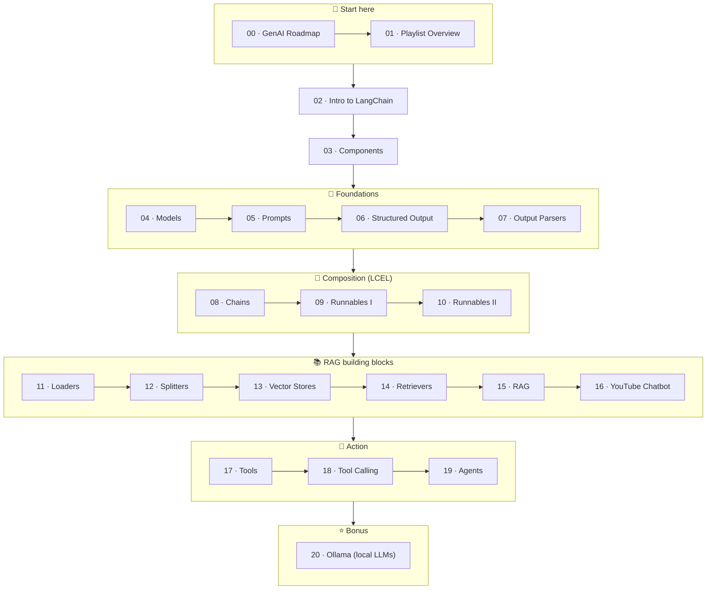
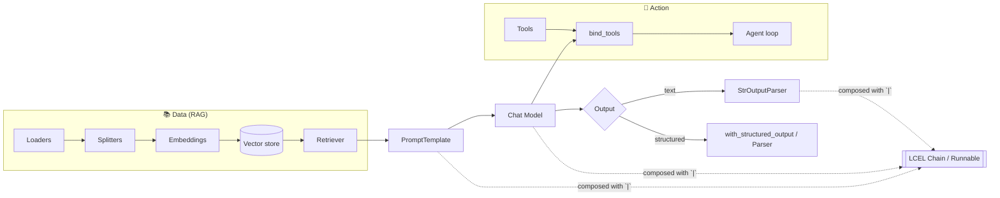

# 🦜🔗 LangChain — Generative AI (Study Notes)

Structured English study notes generated from the **CampusX** playlist
[**Generative AI using LangChain**](https://www.youtube.com/playlist?list=PLKnIA16_RmvaTbihpo4MtzVm4XOQa0ER0).

The playlist teaches LangChain **bottom-up**: first the foundations (models, prompts,
structured output, parsers), then how to compose them (chains, runnables/LCEL), then
how to connect an LLM to your own data (the RAG building blocks), and finally how to
give it the ability to *act* (tools, tool calling, agents) — plus a bonus deep-dive on
running local models with **Ollama**.

> Notes are written in English; the original videos are taught in Hindi/Hinglish.
> Code uses **modern, split-package LangChain** (`langchain_core`, `langchain_openai`,
> `langchain_community`, `langchain_text_splitters`, …).

> 🔗 **Sibling folders in this repo:** the RAG building blocks (videos 10–15) are covered
> in depth under [`../12_rag/`](../12_rag/README.md); stateful agents continue in
> [`../13_langgraph/`](../13_langgraph/README.md).

---

## 🗺️ Learning Path



---

## 📓 Notes Index

| # | Topic | Notes | Watch |
|---|-------|-------|-------|
| 00 | **GenAI Roadmap** — the big picture, builder vs user | [`00_genai-roadmap.md`](00_genai-roadmap.md) | [▶️](https://www.youtube.com/playlist?list=PLKnIA16_RmvaTbihpo4MtzVm4XOQa0ER0) |
| 01 | **Playlist Overview** — syllabus & prerequisites | [`01_playlist-overview.md`](01_playlist-overview.md) | [▶️](https://www.youtube.com/playlist?list=PLKnIA16_RmvaTbihpo4MtzVm4XOQa0ER0) |
| 02 | **Introduction to LangChain** — what & why | [`02_introduction-to-langchain.md`](02_introduction-to-langchain.md) | [▶️](https://www.youtube.com/playlist?list=PLKnIA16_RmvaTbihpo4MtzVm4XOQa0ER0) |
| 03 | **LangChain Components** — the six core families | [`03_langchain-components.md`](03_langchain-components.md) | [▶️](https://www.youtube.com/playlist?list=PLKnIA16_RmvaTbihpo4MtzVm4XOQa0ER0) |
| 04 | **Models** — LLMs vs Chat, embeddings, open vs closed | [`04_langchain-models.md`](04_langchain-models.md) | [▶️](https://www.youtube.com/playlist?list=PLKnIA16_RmvaTbihpo4MtzVm4XOQa0ER0) |
| 05 | **Prompts** — PromptTemplate, ChatPromptTemplate, placeholders | [`05_prompts.md`](05_prompts.md) | [▶️](https://www.youtube.com/playlist?list=PLKnIA16_RmvaTbihpo4MtzVm4XOQa0ER0) |
| 06 | **Structured Output** — `with_structured_output`, Pydantic | [`06_structured-output.md`](06_structured-output.md) | [▶️](https://www.youtube.com/playlist?list=PLKnIA16_RmvaTbihpo4MtzVm4XOQa0ER0) |
| 07 | **Output Parsers** — Str / Json / Structured / Pydantic | [`07_output-parsers.md`](07_output-parsers.md) | [▶️](https://www.youtube.com/playlist?list=PLKnIA16_RmvaTbihpo4MtzVm4XOQa0ER0) |
| 08 | **Chains** — LCEL, sequential / parallel / conditional | [`08_chains.md`](08_chains.md) | [▶️](https://www.youtube.com/playlist?list=PLKnIA16_RmvaTbihpo4MtzVm4XOQa0ER0) |
| 09 | **Runnables I** — the LCEL interface & primitives | [`09_runnables-part1.md`](09_runnables-part1.md) | [▶️](https://www.youtube.com/playlist?list=PLKnIA16_RmvaTbihpo4MtzVm4XOQa0ER0) |
| 10 | **Runnables II** — Passthrough / Lambda / Parallel / Branch | [`10_runnables-part2.md`](10_runnables-part2.md) | [▶️](https://www.youtube.com/playlist?list=PLKnIA16_RmvaTbihpo4MtzVm4XOQa0ER0) |
| 11 | **Document Loaders** *(→ `rag/`)* | [`11_document-loaders.md`](11_document-loaders.md) | [▶️](https://www.youtube.com/playlist?list=PLKnIA16_RmvaTbihpo4MtzVm4XOQa0ER0) |
| 12 | **Text Splitters** *(→ `rag/`)* | [`12_text-splitters.md`](12_text-splitters.md) | [▶️](https://www.youtube.com/playlist?list=PLKnIA16_RmvaTbihpo4MtzVm4XOQa0ER0) |
| 13 | **Vector Stores** *(→ `rag/`)* | [`13_vector-stores.md`](13_vector-stores.md) | [▶️](https://www.youtube.com/playlist?list=PLKnIA16_RmvaTbihpo4MtzVm4XOQa0ER0) |
| 14 | **Retrievers** *(→ `rag/`)* | [`14_retrievers.md`](14_retrievers.md) | [▶️](https://www.youtube.com/playlist?list=PLKnIA16_RmvaTbihpo4MtzVm4XOQa0ER0) |
| 15 | **RAG Explained** *(→ `rag/`)* | [`15_rag-explained.md`](15_rag-explained.md) | [▶️](https://www.youtube.com/playlist?list=PLKnIA16_RmvaTbihpo4MtzVm4XOQa0ER0) |
| 16 | **Project: YouTube Chatbot (RAG)** *(→ `rag/`)* | [`16_youtube-chatbot-rag.md`](16_youtube-chatbot-rag.md) | [▶️](https://www.youtube.com/playlist?list=PLKnIA16_RmvaTbihpo4MtzVm4XOQa0ER0) |
| 17 | **Tools** — built-in & custom (`@tool`, `StructuredTool`) | [`17_tools.md`](17_tools.md) | [▶️](https://www.youtube.com/playlist?list=PLKnIA16_RmvaTbihpo4MtzVm4XOQa0ER0) |
| 18 | **Tool Calling** — `bind_tools`, tool_calls, ToolMessage loop | [`18_tool-calling.md`](18_tool-calling.md) | [▶️](https://www.youtube.com/playlist?list=PLKnIA16_RmvaTbihpo4MtzVm4XOQa0ER0) |
| 19 | **End-to-End Agent** — ReAct, AgentExecutor, → LangGraph | [`19_end-to-end-agent.md`](19_end-to-end-agent.md) | [▶️](https://www.youtube.com/playlist?list=PLKnIA16_RmvaTbihpo4MtzVm4XOQa0ER0) |
| 20 | **Ollama Masterclass** — run local LLMs, local RAG | [`20_ollama-masterclass.md`](20_ollama-masterclass.md) | [▶️](https://www.youtube.com/playlist?list=PLKnIA16_RmvaTbihpo4MtzVm4XOQa0ER0) |

> 📚 Notes **11–16** are course summaries that cross-link the **detailed** RAG write-ups under
> [`../12_rag/`](../12_rag/README.md) (same playlist, covered there in full).

---

## ⚡ LangChain in One Diagram



Everything in LangChain is a **`Runnable`**, so you compose components with the pipe
operator: `prompt | model | parser`. Chains, RAG pipelines, and agents are all just
Runnables wired together.

---

## 🧰 Core Stack

| Layer | What you use |
|-------|--------------|
| Models | `ChatOpenAI`, `ChatAnthropic`, `ChatGoogleGenerativeAI`, `ChatHuggingFace`, `ChatOllama` |
| Embeddings | `OpenAIEmbeddings`, `HuggingFaceEmbeddings`, `OllamaEmbeddings` |
| Prompts | `PromptTemplate`, `ChatPromptTemplate`, `MessagesPlaceholder`, `SystemMessage/HumanMessage/AIMessage` |
| Structured output | `llm.with_structured_output(...)` (TypedDict / Pydantic / JSON schema) |
| Output parsers | `StrOutputParser`, `JsonOutputParser`, `StructuredOutputParser`, `PydanticOutputParser` |
| Composition (LCEL) | `RunnableSequence`, `RunnableParallel`, `RunnablePassthrough`, `RunnableLambda`, `RunnableBranch` |
| Loaders | `TextLoader`, `PyPDFLoader`, `WebBaseLoader`, `CSVLoader`, `DirectoryLoader` |
| Splitters | `CharacterTextSplitter`, `RecursiveCharacterTextSplitter`, `SemanticChunker` |
| Vector stores | FAISS, Chroma (local) · Pinecone / Weaviate / Qdrant / pgvector (prod) |
| Retrievers | `as_retriever` (similarity / MMR), `MultiQueryRetriever`, `ContextualCompressionRetriever` |
| Tools & Agents | `@tool`, `StructuredTool`, `bind_tools`, `AgentExecutor`, `create_react_agent` → LangGraph |
| Local models | Ollama (`langchain_ollama`) |

---

## 🚀 Quick Start

```bash
python -m venv .venv && source .venv/bin/activate
pip install langchain langchain-core langchain-openai langchain-community \
            langchain-text-splitters python-dotenv
# add provider keys to a .env file (OPENAI_API_KEY=..., etc.)
```

```python
from dotenv import load_dotenv; load_dotenv()
from langchain_openai import ChatOpenAI
from langchain_core.prompts import ChatPromptTemplate
from langchain_core.output_parsers import StrOutputParser

chain = (
    ChatPromptTemplate.from_template("Explain {topic} in one sentence.")
    | ChatOpenAI(model="gpt-4o-mini", temperature=0)
    | StrOutputParser()
)
print(chain.invoke({"topic": "LangChain"}))
```

---

*Source: CampusX — “Generative AI using LangChain” playlist. Notes are for personal study/revision.
Video timings are approximate. The playlist link is used throughout since per-video links change.*
