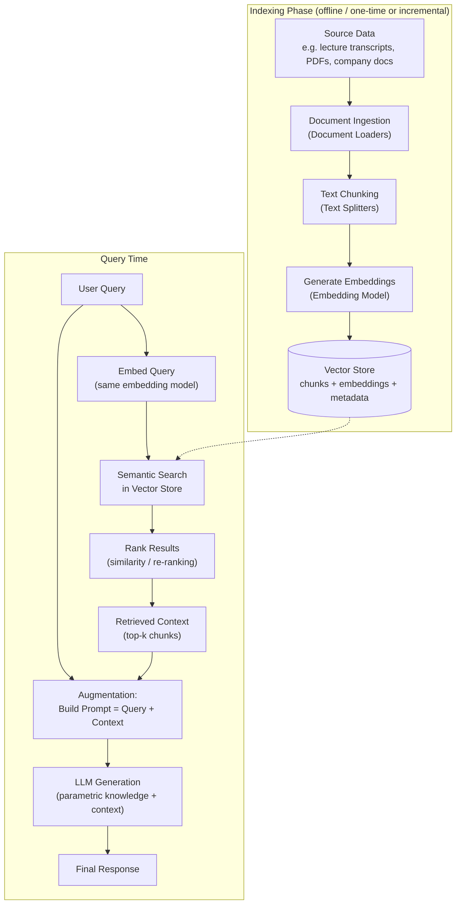

# 1. What is RAG (Retrieval-Augmented Generation)

> 📺 [Watch on YouTube](https://www.youtube.com/watch?v=X0btK9X0Xnk&list=PLKnIA16_Rmva0dRLWEHLznSHKbFD_RJfX) · ⏱️ ~59 min · CampusX — Generative AI using LangChain

This is Video 1 of a 2-part RAG series (and video 5 overall in the LangChain playlist, following four earlier videos on Document Loaders, Text Splitters, Vector Stores, and Retrievers). This video is purely conceptual/theoretical; the next video builds a RAG system from scratch in LangChain.

## 🎯 What You'll Learn
- Why plain LLM prompting fails in three real situations: private data, recent/current data, and hallucination
- What fine-tuning is, how it partially solves those problems, and why it has serious drawbacks
- What in-context learning (ICL) is, and the landmark GPT-3 paper behind it
- How extending ICL with full context (instead of just examples) gives you RAG
- The four-stage RAG architecture: Indexing → Retrieval → Augmentation → Generation
- Why RAG solves the same three problems more cheaply and simply than fine-tuning

## 📖 Overview
Large Language Models are transformer-based neural networks pre-trained on internet-scale data. All the "knowledge" an LLM has is baked into its weights and biases — this is called **parametric knowledge** (more parameters generally means more parametric knowledge, e.g. 70B > 13B > 7B). A user accesses this knowledge purely through **prompting**: send a prompt, the LLM digs into its parametric knowledge and generates a response word by word.

This works well most of the time, but breaks down in three situations:
1. **Private data** — the LLM never saw your company's/website's private documents during pre-training, so it cannot answer questions about them.
2. **Recent data** — every LLM has a **knowledge cutoff date**; it cannot answer questions about events after that date unless it has separate internet access (like ChatGPT does, but a downloaded open-source model does not).
3. **Hallucination** — because generation is probabilistic, the model sometimes produces confident but fabricated answers.

The video walks through two candidate fixes — **fine-tuning** and **in-context learning** — before arriving at **RAG**, which is essentially "in-context learning taken to its logical conclusion": instead of giving the LLM a few examples of *how* to solve a task, you give it the *actual context* needed to answer a specific question, retrieved on the fly from an external knowledge base. RAG is defined in the video as: *"a way to make a language model smarter by giving it extra information at the time you ask your question."*

## 🔑 Core Concepts

### LLM Limitations and Parametric Knowledge
- LLMs are pre-trained on huge datasets; knowledge is stored as numbers (weights/biases) inside the model — hence "parametric knowledge."
- Bigger models (more parameters) can hold more parametric knowledge.
- Users can only access this knowledge via prompts; the LLM decodes the prompt and generates an answer from its parameters.

### The Three Problems
| # | Problem | Why it happens | Example from the video |
|---|---------|-----------------|--------------------------|
| 1 | Private data | Model never saw this data during pre-training | Asking ChatGPT what was taught at a specific point in a CampusX course video — it has no access to that private course content |
| 2 | Recent/current data | Every LLM has a knowledge cutoff date | Asking an LLM "what was the biggest news in India today?" — a downloaded Hugging Face model can't answer; ChatGPT can only because it has separate internet-search access |
| 3 | Hallucination | Generation is probabilistic, not guaranteed factual | Model confidently claims "Einstein played football for Germany in his early years" — completely fabricated |

### Fine-Tuning (First Attempted Solution)
**Definition:** Take a pre-trained LLM and retrain it further on a smaller, domain-specific dataset.

**Analogy:** An engineering graduate (the LLM) already knows English, Physics, Chemistry, CS, Electronics, etc. (pre-training). When they join a company, they still go through 2–3 months of company-specific training (fine-tuning) to apply their general knowledge to the specific job.

**Types of fine-tuning mentioned:**
- **Supervised Fine-Tuning (SFT)** — most preferred; you provide a labeled dataset of (prompt, desired output) pairs, typically 1,000 to 1,000,000+ rows.
- **Continued Pre-Training** — an unsupervised method; you feed raw domain text (no labels), e.g. feeding lecture transcripts directly, similar in nature to the original pre-training but on a smaller domain-specific corpus.
- **RLHF (Reinforcement Learning from Human Feedback)** — teaches the model how to behave in real-world scenarios.
- Other techniques mentioned by name (not detailed): **LoRA**, **QLoRA** — parameter-efficient fine-tuning methods.

**4-step supervised fine-tuning process:**
1. **Collect labeled domain data** — (prompt, desired output) pairs.
2. **Choose a method** — full-parameter fine-tuning (retrain all weights) vs. parameter-efficient methods like LoRA/QLoRA (freeze base weights, train only a smaller additional set of weights).
3. **Train** for a limited number of epochs (full training is computationally expensive).
4. **Evaluate** — exact match against desired output, factuality checks, hallucination rate, safety tests, etc.

**How fine-tuning addresses the three problems:**
- *Private data*: once trained on your private data, it becomes part of the model's parametric knowledge — solved directly.
- *Recent data*: partially solved, but tricky — every time new data arrives (e.g. a new course added to a catalog) you must re-run fine-tuning with the updated dataset. Frequent updates mean frequent (costly) retraining.
- *Hallucination*: can be reduced by adding training examples that teach the model to say "I don't know" on tricky/out-of-scope prompts instead of inventing facts.

**Problems with fine-tuning:**
1. **Computationally expensive** — training a large model, even on a small dataset, costs real money.
2. **Requires strong technical expertise** — you need AI engineers/data scientists; not accessible to everyone.
3. **Poor fit for fast-changing domains** — frequent catalog/content updates mean frequent, costly re-fine-tuning cycles.

### In-Context Learning (ICL) — Second Attempted Solution
**Definition:** A core capability of large language models (GPT-3, Claude, Llama, etc.) where the model learns to solve a task purely by seeing examples inside the prompt, **without any weight updates**.

**Example — Sentiment analysis via few-shot prompting:**
```
Below are examples of text labeled with their sentiment. Use the examples
to determine the sentiment of the final text.

"I love this phone. It's so smooth."      -> Positive
"This app crashes a lot."                 -> Negative
"The camera is amazing."                  -> Positive
"I hate the battery life."                -> ?
```
The model learns the pattern from the examples and answers "Negative." A similar example was given for Named Entity Recognition (NER), where a couple of labeled sentences teach the model to extract entities from a new sentence. This example-driven prompting technique is called **few-shot prompting**.

**ICL is an emergent property:** *"a behavior or ability that suddenly appears in a system when it reaches a certain scale and complexity, even though it was not explicitly programmed or expected from the individual components."* GPT-1 and GPT-2 did not reliably show ICL. It was only with **GPT-3 (~175 billion parameters)** that this ability clearly emerged.

**Landmark paper:** *"Language Models are Few-Shot Learners"* (the GPT-3 paper) — first introduced and studied ICL. Key point from the abstract: traditional NLP relies on pre-training + fine-tuning, which needs a costly labeled dataset of 10,000–1,000,000 rows. By contrast, **humans** can learn a new language task from just a few examples and simple instructions. The authors tested whether a sufficiently large model (GPT-3, 175B params) could do the same by learning purely from examples given in the prompt — and found that it could. This was the paper's central finding, and it made ICL famous. (The video recommends reading at least the abstract.)

Note: ICL is not guaranteed to work equally well on every task. This motivated later alignment techniques — additional SFT and RLHF — applied to GPT-3.5, GPT-4, etc., which made those models much better at ICL.

### From ICL to RAG — the Key Insight
In few-shot prompting, you give examples of *how to solve a task*. The natural extension: instead of examples, why not send the model the **entire context** it needs to answer a *specific question*?

**Worked example:** A 2-hour lecture on Linear Regression is on a website. A student has a doubt specifically about the "Gradient Descent" portion (say, minutes 5–25 of the video). Rather than sending the LLM the whole 2-hour transcript, you send:
1. The student's question, and
2. Just the relevant transcript segment (minutes 5–25) as **context**.

This exact technique — injecting the precise context needed, rather than generic examples — **is RAG (Retrieval-Augmented Generation)**.

**RAG prompt structure**, built from two pieces:
```
You are a helpful assistant. Answer the question only from the provided
context. If the context is insufficient, just say "I don't know."

Context: <retrieved transcript segment / document chunks>
Question: <user's query>
```
The LLM combines this injected context with its own parametric knowledge to produce the response.

### RAG = Information Retrieval + Text Generation
At a high level, RAG is described as the **marriage of two older concepts**:
- **Information Retrieval** — a long-established topic in computer science.
- **Text Generation** — popularized by LLMs.

## 🧭 The RAG Pipeline

RAG breaks down into **four broad steps**: Indexing, Retrieval, Augmentation, Generation.

### 1. Indexing — building the external knowledge base
*"The process of preparing your knowledge base so that it can be efficiently searched at query time."*

| Sub-step | What happens | LangChain tools mentioned |
|----------|--------------|----------------------------|
| a. Document Ingestion | Load source knowledge into memory from wherever it lives (server, Google Drive, AWS S3, etc.) | PyPDFLoader, YouTubeLoader, WebBaseLoader, and other document loaders |
| b. Text Chunking | Split the large document into smaller, semantically meaningful chunks | RecursiveCharacterTextSplitter (most popular), semantic chunkers, HTML/Markdown-specific splitters |
| c. Generate Embeddings | Convert each chunk into a dense vector capturing its semantic meaning | OpenAI embeddings, Sentence-Transformer embeddings, etc. |
| d. Store in Vector Store | Save vectors + original chunk text + metadata in a vector database | Local: FAISS, Chroma · Cloud: Pinecone, Weaviate, Milvus, Qdrant |

**Why chunk at all?**
1. LLMs have a limited context length (token limit) — you can't send a giant document in one prompt.
2. Semantic search quality degrades when applied to very large documents; smaller, topic-coherent chunks search better. (Chunks should not be split abruptly — ideally each chunk covers one coherent topic.)

The end result of indexing is an **external knowledge base**: a vector store containing all chunks and their embeddings.

### 2. Retrieval — finding relevant context at query time
*"The real-time process of finding the most relevant pieces of information from a prebuilt index, based on the user's question."*

The **retriever** component performs these steps:
1. **Embed the query** — using the exact same embedding model (same vector dimensions) used to embed the stored chunks.
2. **Search** the vector store for the closest vectors to the query vector — simple semantic/similarity search, or more advanced techniques like **MMR (Maximum Marginal Relevance)** or **contextual compression** (covered in the earlier Retrievers video).
3. **Rank** the candidate matches (e.g. by cosine similarity, or more advanced re-ranking algorithms).
4. **Fetch** the top-ranked chunks' original text — this becomes the **context**.

Worked example continued: out of several transcript chunks (OLS, multiple linear regression, two different gradient-descent segments), the retriever picks only the gradient-descent chunks as context for a gradient-descent question.

### 3. Augmentation — building the final prompt
The retrieved context and the user's original query are combined into a single prompt:
```
You are a helpful assistant. Answer the questions only from the
provided context. If the context is insufficient, just say "I don't know."

Context: <retrieved chunks>
Question: <user query>
```
This is called augmentation because you are adding extra (non-parametric) knowledge on top of the LLM's parametric knowledge.

### 4. Generation — producing the final answer
The augmented prompt is sent to the LLM, which uses its text-generation capability plus in-context learning to combine the injected context with its parametric knowledge and produce the final response.

### Pipeline Diagram


## 💻 Code / Concepts in Practice
This video is conceptual — no live coding (that's reserved for the next video). The main "code-like" artifact shown is the **RAG prompt template**, which is worth memorizing as a pattern:

```
You are a helpful assistant.
Answer the question only from the provided context.
If the context is insufficient, just say "I don't know."

Context:
{retrieved_context}

Question:
{user_query}
```

Representative LangChain-style pseudocode for the full pipeline discussed:

```python
# --- Indexing (done once, or incrementally as new data arrives) ---
docs = DocumentLoader(source).load()              # Document Ingestion
chunks = TextSplitter(chunk_size=...).split_documents(docs)  # Text Chunking
vectors = EmbeddingModel().embed_documents(chunks) # Generate Embeddings
vector_store = VectorStore.from_documents(chunks, EmbeddingModel())  # Store

# --- Retrieval + Augmentation + Generation (per user query) ---
query = "How do we perform the optimization step in gradient descent?"
retriever = vector_store.as_retriever(search_kwargs={"k": 3})
retrieved_chunks = retriever.get_relevant_documents(query)  # Retrieval

prompt = f"""You are a helpful assistant. Answer the question only from the
provided context. If the context is insufficient, just say "I don't know."

Context: {retrieved_chunks}
Question: {query}"""                               # Augmentation

response = llm.invoke(prompt)                      # Generation
```

## 🧠 Key Takeaways
- LLMs store all their knowledge as **parametric knowledge** inside model weights, accessed only via prompting — this fails for private data, recent/current data, and is prone to hallucination.
- **Fine-tuning** can address all three problems to some extent (retrain on private/domain data, teach "I don't know" for tricky prompts) but is computationally expensive, requires deep technical expertise, and is impractical for frequently changing data (needs repeated retraining).
- **In-Context Learning (ICL)** lets an LLM learn a task purely from examples in the prompt, with no weight updates — it's an emergent property that appeared clearly only at GPT-3 scale (~175B params), as shown in the "Language Models are Few-Shot Learners" paper.
- **RAG is ICL taken further**: instead of giving example demonstrations, you inject the actual retrieved context needed to answer the specific question.
- RAG has four stages: **Indexing** (ingest → chunk → embed → store), **Retrieval** (embed query → search → rank → fetch context), **Augmentation** (combine query + context into a prompt), **Generation** (LLM produces the final answer).
- RAG solves all three original problems: private data (knowledge base built from your own data), recent data (just add new documents to the vector store, no retraining needed), and hallucination (model is instructed to answer only from provided context and say "I don't know" otherwise).
- RAG is **cheaper and simpler than fine-tuning** — no model training, no labeled dataset; you just ingest documents as-is into a vector store.

## RAG vs. Fine-Tuning — Quick Comparison

| Aspect | Fine-Tuning | RAG |
|--------|--------------|-----|
| Core idea | Retrain the LLM's weights on domain-specific data | Retrieve relevant external context at query time and inject it into the prompt |
| Handles private data | Yes, becomes parametric knowledge | Yes, via external knowledge base |
| Handles recent/current data | Requires repeated retraining as data changes | Just add new documents to the vector store — no retraining |
| Handles hallucination | Reduced via training examples ("say I don't know") | Reduced by grounding answers strictly in retrieved context |
| Cost | Computationally expensive (training runs) | Cheaper — no training, just embedding + storage |
| Complexity / expertise needed | High — needs AI engineers/data scientists, labeled datasets | Lower — mainly data ingestion and pipeline engineering |
| Best suited for | Stable domain knowledge/behavior that rarely changes | Frequently changing or large external knowledge sources |

## ❓ Revision / Interview Questions
- What is "parametric knowledge," and why is it insufficient for answering questions about private or recent data?
- Name and explain the three situations where plain LLM prompting fails to give a good answer.
- What is fine-tuning, and what are the four steps of a typical supervised fine-tuning process?
- What is the difference between full-parameter fine-tuning and parameter-efficient techniques like LoRA/QLoRA?
- What is in-context learning (ICL), and why is it called an "emergent property"? Which model/paper first demonstrated it at scale?
- How does few-shot prompting relate to in-context learning?
- Explain, in your own words, how RAG is a natural extension of in-context learning.
- What are the four stages of a RAG pipeline, and what happens in each?
- Why is text chunking necessary before generating embeddings, and what makes a "good" chunk?
- How does RAG address each of the three problems (private data, recent data, hallucination) more cheaply than fine-tuning?
