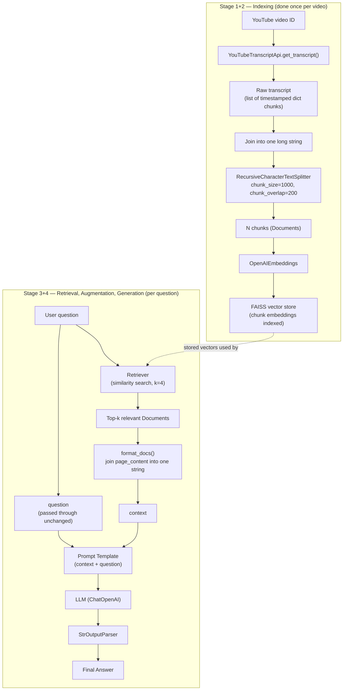

# 6. Building a RAG System — YouTube Video Chatbot

> 📺 [Watch on YouTube](https://www.youtube.com/watch?v=J5_-l7WIO_w&list=PLKnIA16_Rmva0dRLWEHLznSHKbFD_RJfX) · ⏱️ ~46 min · CampusX — Generative AI using LangChain

## 🎯 What You'll Build

A **"YouTube Chat"** system: paste the ID of any YouTube video and ask it questions in natural language — "Is AI discussed in this podcast?", "Summarize this video in 5 bullet points", "What did the speaker say about X at minute 40?" — without watching the whole thing.

This solves a real problem: long-form content (2–3 hour podcasts, lectures) is expensive to consume linearly, but the answer to a specific question might be buried in one small segment. Instead of skimming or scrubbing through the video, you ask the system directly and it retrieves only the relevant part of the transcript before answering.

Two possible "final products" are mentioned, but **not built** in this video (this video is Colab-only, functionality-first):
- **Chrome extension** — user installs it, opens a YouTube video, a chat panel appears alongside it. Best UX, but needs HTML/CSS/JS.
- **Streamlit app** — user pastes a video URL, a chat window opens. Easier to build with only Python.

The video deliberately skips the UI and builds the RAG pipeline itself in a Google Colab notebook, using everything learned in the playlist so far: document loaders, text splitters, embeddings, and vector stores.

## 🧭 Architecture

The same 4-stage RAG architecture from the previous (theory) video is reused end-to-end: **Indexing → Retrieval → Augmentation → Generation.**



## 🛠️ Step-by-Step Build

### 1. Get the OpenAI API key and install dependencies

The project uses OpenAI models for both embeddings and generation.

```bash
pip install langchain langchain-openai langchain-community \
            faiss-cpu tiktoken python-dotenv youtube-transcript-api
```

```python
import os
from dotenv import load_dotenv

load_dotenv()
os.environ["OPENAI_API_KEY"] = "your-openai-api-key-here"  # never hardcode/share this
```

### 2. Step 1 (Indexing) — Fetch the transcript with the YouTube Transcript API

The video deliberately **avoids** LangChain's built-in `YoutubeLoader` document loader — the presenter found it buggy (it worked for some videos and threw errors on others). Instead, it calls the `youtube-transcript-api` package directly, which proved reliable across videos.

Only the **video ID** is needed (the part after `v=` in the URL), not the full URL.

```python
from youtube_transcript_api import YouTubeTranscriptApi, TranscriptsDisabled

video_id = "Gfr50f6ZBvo"  # only the ID, NOT the full URL

try:
    # Returns a list of dicts, each with keys: "text", "start", "duration"
    transcript_list = YouTubeTranscriptApi.get_transcript(video_id, languages=["en"])

    # Flatten the timestamped chunks into one continuous string
    transcript = " ".join(chunk["text"] for chunk in transcript_list)

except TranscriptsDisabled:
    print("No captions available for this video.")
```

Key details from the demo:
- The raw API result is a **list of dictionaries**, one per subtitle line, each carrying `text`, `start` (timestamp in seconds), and `duration` (how long it stays on screen).
- If the video has no English captions (e.g., a Hindi video), the call raises an error — swap `languages=["en"]` for `languages=["hi"]` (or whatever language is actually available) and it works.
- For the rest of the video, the presenter uses the transcript of a real ~2-hour podcast (covering DeepMind, AI, aliens, nuclear fusion) as the working example, so later demo questions ("What is DeepMind?", "Who is Demis?", "Is the topic of aliens discussed?") make sense against that transcript.

### 3. Step 2 (Indexing) — Split the transcript into chunks

A 2-hour video's transcript is far too long to embed as a single unit, so it's split with `RecursiveCharacterTextSplitter`.

```python
from langchain.text_splitter import RecursiveCharacterTextSplitter

splitter = RecursiveCharacterTextSplitter(chunk_size=1000, chunk_overlap=200)
chunks = splitter.create_documents([transcript])

len(chunks)   # 168 chunks for the ~2-hour example podcast
chunks[100]   # inspect any individual chunk by index
```

`chunk_size=1000` / `chunk_overlap=200` gave good results for this use case in testing — worth experimenting with different values for your own videos.

### 4. Step 3 (Indexing) — Embed the chunks and store them in a vector store

```python
from langchain_openai import OpenAIEmbeddings
from langchain_community.vectorstores import FAISS

embeddings = OpenAIEmbeddings(model="text-embedding-3-small")
vector_store = FAISS.from_documents(chunks, embeddings)
```

Each chunk gets an auto-generated ID once embedded and stored. This completes **indexing**: transcript loaded → split into chunks → embedded → stored in FAISS.

```python
vector_store.get_by_ids([vector_store.index_to_docstore_id[167]])  # inspect the last chunk
```

### 5. Step 4 (Retrieval) — Build a retriever and query it

```python
retriever = vector_store.as_retriever(
    search_type="similarity",
    search_kwargs={"k": 4},
)

retriever.invoke("What is deepmind")
```

A retriever is itself a **Runnable**, so it exposes `.invoke()`. Given a query string, it embeds the query, performs a semantic (similarity) search against the vector store, and returns the top-4 most relevant `Document` objects.

> Rule of thumb worth memorizing: **retriever input = a query string; retriever output = a list of Documents.**

### 6. Step 5 (Augmentation) — Design the prompt template

```python
from langchain_openai import ChatOpenAI
from langchain_core.prompts import PromptTemplate

llm = ChatOpenAI(model="gpt-4o-mini", temperature=0.2)

prompt = PromptTemplate(
    template="""
      You are a helpful assistant.
      Answer ONLY from the provided transcript context.
      If the context is insufficient, just say you don't know.

      {context}
      Question: {question}
    """,
    input_variables=["context", "question"],
)
```

The template needs exactly two input variables: `context` (the retrieved transcript excerpts) and `question` (the user's query). The instruction to answer *only* from context, and to admit "I don't know" otherwise, is what keeps the assistant from hallucinating.

### 7. Manually merge retrieved docs into a single context string

A retriever returns a **list** of Documents — but a prompt template needs a single string. So before wiring things into a chain, the video walks through this merge step by hand:

```python
question = "Is the topic of aliens discussed in this video? If yes, what was discussed?"
retrieved_docs = retriever.invoke(question)

context_text = "\n\n".join(doc.page_content for doc in retrieved_docs)
```

### 8. Manually run augmentation + generation

```python
final_prompt = prompt.invoke({"context": context_text, "question": question})

answer = llm.invoke(final_prompt)
print(answer.content)
```

At this point every stage works — indexing, retrieval, augmentation, generation — but each step (`retriever.invoke`, `prompt.invoke`, `llm.invoke`) is being called **manually and separately**. The next step is to wire them into one chain so a single `.invoke()` triggers the whole pipeline automatically.

### 9. Build the chain — wrap the merge logic in a `RunnableLambda`

```python
from langchain_core.runnables import RunnableLambda

def format_docs(retrieved_docs):
    return "\n\n".join(doc.page_content for doc in retrieved_docs)
```

A plain Python function can't be a link in an LCEL chain unless it's itself a `Runnable`. Wrapping it in `RunnableLambda` makes `format_docs` composable with `|`.

### 10. Build the parallel chain (retriever branch + pass-through branch)

```python
from langchain_core.runnables import RunnableParallel, RunnablePassthrough

parallel_chain = RunnableParallel({
    "context": retriever | RunnableLambda(format_docs),
    "question": RunnablePassthrough(),
})

parallel_chain.invoke("who is Demis")
# -> {"context": "<merged transcript excerpts>", "question": "who is Demis"}
```

### 11. Build the full chain and run it end-to-end

```python
from langchain_core.output_parsers import StrOutputParser

parser = StrOutputParser()

main_chain = parallel_chain | prompt | llm | parser

main_chain.invoke("Can you summarize the video?")
```

One `.invoke()` call now runs the entire pipeline: the question flows into the parallel chain, which produces `{context, question}`; that dict is fed into the prompt; the formatted prompt goes to the LLM; the LLM's message object is parsed down to a plain string by `StrOutputParser`. This is the clean, production-ready shape of the RAG pipeline — indexing happens once upfront, and this single chain handles retrieval + augmentation + generation per query.

## 💡 Key LCEL / Chain Concepts

- **`RunnableParallel`** — runs multiple Runnables against the *same* input and collects their outputs into a dict, keyed by whatever names you choose. Here it produces `{"context": ..., "question": ...}` from a single incoming question string, because the prompt template needs both.
- **`RunnablePassthrough`** — a no-op Runnable that returns its input unchanged. Used for the `"question"` branch: the question needs to reach the prompt exactly as the user typed it, with no processing.
- **`RunnableLambda`** — wraps an arbitrary Python function so it can participate in a `|` chain. Necessary here because `format_docs` (merging a list of Documents into one string) is plain Python, but the chain composition operator (`|`) only understands Runnables.
- **Chaining with `|`** — `retriever | RunnableLambda(format_docs)` is itself a mini-chain: the retriever's list-of-Documents output becomes the formatter's input, producing the final context string. This sub-chain is then nested as one branch inside `RunnableParallel`.
- **`itemgetter`** (a related, commonly-paired tool not needed in this specific chain) — when a chain's input is a *dict* with several keys instead of a bare string (e.g., if you need both a raw `question` and a `chat_history` at different points), `from operator import itemgetter` lets you pluck out `itemgetter("question")` as a Runnable to route just that one key downstream. It's worth knowing because as soon as a RAG chain needs more than "one question in, one string context out," `itemgetter` alongside `RunnableParallel` is the standard way to route multiple named inputs to different branches.
- **Why two chains, not one** — the overall chain is really two chains merged: (1) the *parallel retrieval chain* that turns a bare question into `{context, question}`, and (2) the *simple linear chain* `prompt | llm | parser` that turns `{context, question}` into a final string answer. `main_chain = parallel_chain | prompt | llm | parser` composes them.

## 🧠 Key Takeaways

- A full RAG system is just the 4-stage architecture (indexing → retrieval → augmentation → generation) implemented with concrete LangChain pieces: a transcript loader, a text splitter, an embedding model + vector store, a retriever, a prompt template, an LLM, and an output parser.
- Reusable document loaders (e.g., LangChain's `YoutubeLoader`) aren't always the most reliable choice — hitting the underlying API (`youtube-transcript-api`) directly can be more robust in practice. Always have a fallback plan (e.g., try another language code) for real-world data quirks.
- `chunk_size=1000` / `chunk_overlap=200` are reasonable defaults for transcript-style long text, but should be tuned per use case.
- A retriever always takes a query string in and returns a list of Documents out — never a ready-to-use string, so you must explicitly merge/format Documents before handing them to a prompt.
- Manually invoking each stage (retriever → prompt → llm) works but doesn't scale or read cleanly; converting the pipeline into a single LCEL chain (`RunnableParallel` + `RunnablePassthrough` + `RunnableLambda` piped into `prompt | llm | parser`) collapses the whole flow into one `.invoke()` call.
- This is a *basic* RAG system — a deliberately simple baseline. The video closes with a tour (not implementation) of how production-grade RAG systems go further:
  - **UI**: wrap the notebook logic in a Streamlit app or a Chrome extension.
  - **Evaluation**: use libraries like **RAGAS** (faithfulness, answer relevancy, context precision, context recall) and **LangSmith** (tracing every step of the pipeline) to measure whether the system actually works well.
  - **Indexing improvements**: clean up auto-generated transcript errors, translate non-English transcripts, use a semantic chunker instead of a fixed-size splitter, move from FAISS to a cloud vector DB like Pinecone for production scale.
  - **Retrieval improvements**: *pre-retrieval* — LLM-based query rewriting, multi-query generation, domain-aware routing across multiple retrievers; *during retrieval* — MMR (maximal marginal relevance) search, hybrid retrieval (semantic + keyword) merged together, LLM-based re-ranking of results; *post-retrieval* — contextual compression to strip irrelevant text out of retrieved chunks before they reach the prompt.
  - **Augmentation improvements**: richer prompt templating, explicit answer grounding (instructing the LLM to never fabricate facts outside the given context), context-window optimization (trimming context to fit token limits).
  - **Generation improvements**: answer citations (pointing back to which part of the context an answer came from), guardrails against harmful/incorrect output.
  - **System design variants**: multimodal RAG (text + images + video), agentic RAG (an agent that can take actions like web browsing mid-answer, not just retrieve-and-answer), memory-based RAG (personalized systems that recall earlier conversations).
  - All of the above will be covered later in a dedicated **"Advanced RAG"** playlist, planned for after this LangChain playlist wraps up.

## ❓ Revision Questions

1. Why did the presenter choose to call the `youtube-transcript-api` package directly instead of using LangChain's `YoutubeLoader`?
2. What are the three fields present in each item returned by `YouTubeTranscriptApi.get_transcript()`, and why must the individual text fragments be joined before splitting?
3. What chunk size and chunk overlap were used for splitting the transcript, and roughly how many chunks did a ~2-hour podcast produce?
4. What are the input and output types of a retriever's `.invoke()` call? Why can't its raw output be passed directly into a prompt template?
5. What is the purpose of wrapping `format_docs` in `RunnableLambda` rather than using it as a plain Python function inside the chain?
6. In `RunnableParallel({"context": retriever | RunnableLambda(format_docs), "question": RunnablePassthrough()})`, explain what each of the two dictionary values produces and why `RunnablePassthrough` is sufficient for the question branch.
7. Write out the full final chain (`main_chain`) as an LCEL pipe expression, and describe what value flows through each stage from a single string question to the final printed answer.
8. Name at least three categories of "advanced RAG" improvements mentioned (e.g., retrieval-stage optimizations) and one specific technique from each.
9. What does "answer grounding" mean, and why is it important for a RAG system's trustworthiness?
10. Why might a production RAG system need context window optimization even after retrieval already limits results to the top-k documents?
