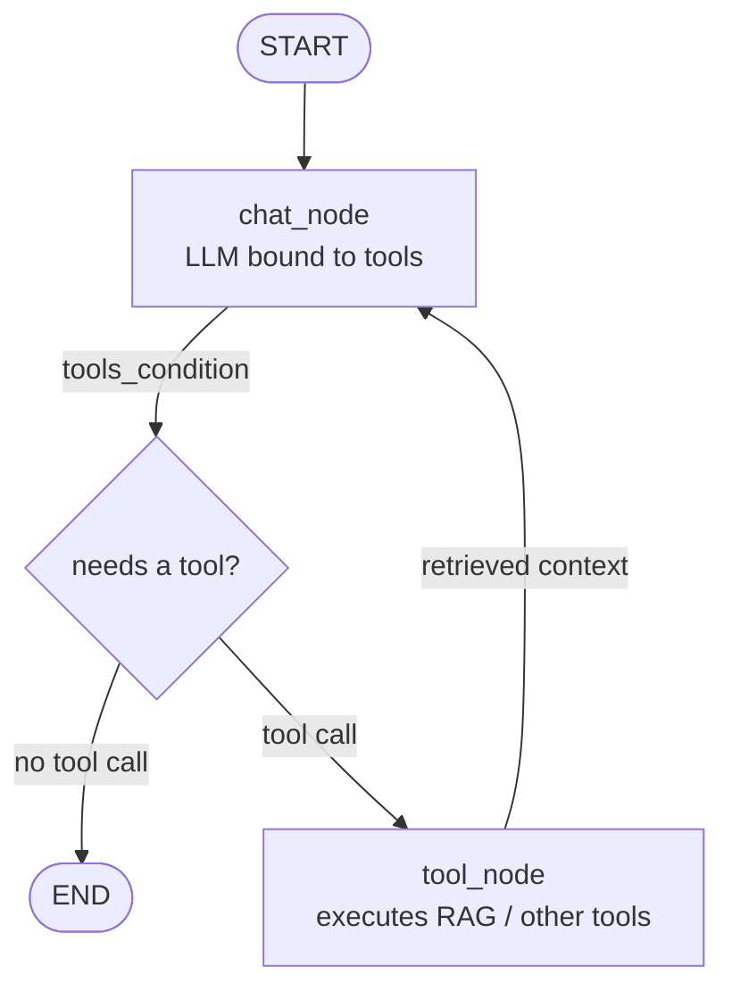

# 7. RAG using LangGraph

> 📺 [Watch on YouTube](https://www.youtube.com/watch?v=E1qP9Xsnmik&list=PLKnIA16_Rmva0dRLWEHLznSHKbFD_RJfX) · ⏱️ ~37 min · CampusX — Agentic AI using LangGraph

---

## 🎯 What You'll Learn

- Why a plain chatbot needs RAG (Retrieval-Augmented Generation) and the three problems it solves.
- A quick refresher on how RAG works end to end: load → split → embed → store → retrieve → generate.
- How to model a RAG pipeline inside **LangGraph** using state, nodes, and (conditional) edges.
- The clean pattern used in agentic apps: **wrap the retriever as a tool** and let the LLM decide when to call it.
- A full code walkthrough that builds a RAG chatbot from scratch, then folds it back into the running multi-utility chatbot project.

This is video 7 of the series. So far the running "chatbot" project has grown from a bare bot → UI → streaming → persistence (resume chat) → observability → tools → MCP. This video adds **RAG**, turning it into a **multi-utility chatbot** that can answer questions over user-uploaded documents (a PDF, an e-book, etc.) in addition to normal chat, tools, and MCP.

---

## 📖 Why LangGraph for RAG?

A basic RAG flow can be written as a **linear LCEL chain** (`retriever → prompt → LLM → parser`). That works, but as RAG gets more advanced (grading retrieved docs, rewriting queries, looping back to retrieve again — the CRAG / Self-RAG patterns in later videos) a straight line stops being enough. You start needing:

- **State** that flows through and accumulates across steps (query, retrieved context, messages, metadata).
- **Conditional branching** — e.g. "does this question even need retrieval, or can the LLM answer directly?"
- **Cycles** — the ability to loop back (retrieve again, re-generate) instead of running once top to bottom.
- **Control & observability** — inspect exactly what happened at each node (LangSmith traces show the hops between nodes).

LangGraph gives you all of this by expressing the pipeline as a **graph** of nodes and edges over a shared state, rather than a fixed one-shot chain.

### The approach used in this video

There are multiple ways to implement RAG in LangGraph. This video uses the simplest and most reusable one:

> **Wrap the retriever inside a `@tool` and treat RAG as just another tool** the LLM can call.

This is the standard template for agentic AI applications — RAG becomes one more tool alongside a web-search tool, a calculator, a stock-price lookup, etc. The LLM decides *whether* it needs the document before invoking the tool.

---

## 🔑 LangGraph Core Concepts

### State (TypedDict / schema)

State is the shared data object passed from node to node. In the messages-based chatbot pattern, the state carries the running list of messages (human, AI, tool). Each node reads from state and returns an update that gets merged back in.

```python
from typing import Annotated, TypedDict
from langgraph.graph.message import add_messages
from langchain_core.messages import BaseMessage

class ChatState(TypedDict):
    # add_messages appends new messages instead of overwriting the list
    messages: Annotated[list[BaseMessage], add_messages]
```

### Nodes (functions that read/update state)

A node is a plain Python function that takes the current state and returns a partial state update (a dict). In this build there are two nodes:

- **`chat_node`** — runs the LLM (bound to the tools). It either answers directly or emits a tool call.
- **`tool_node`** — executes any tool calls the LLM requested and returns the results as tool messages.

### Edges & conditional edges

- **Normal edge** — always go from node A to node B.
- **Conditional edge** — inspect the state and branch. Here, `tools_condition` decides: if the LLM's last message contains a tool call → go to `tool_node`; otherwise → go to `END`.

This is what lets the chatbot skip retrieval entirely for a casual "hi", but route to the RAG tool for a document question.

### StateGraph, add_node, add_edge, set_entry_point, compile

```python
from langgraph.graph import StateGraph, START, END
from langgraph.prebuilt import ToolNode, tools_condition

graph = StateGraph(ChatState)
graph.add_node("chat_node", chat_node)
graph.add_node("tools", ToolNode(tools))

graph.add_edge(START, "chat_node")          # entry point
graph.add_conditional_edges("chat_node", tools_condition)  # -> "tools" or END
graph.add_edge("tools", "chat_node")         # loop tool result back to the LLM

chatbot = graph.compile()
```

`START` and `END` are the built-in entry/exit sentinels. `compile()` returns a runnable graph you `invoke()` like any other LangChain runnable.

---

## 🧭 The RAG Graph

The compiled graph looks exactly like the tool-calling graph from the previous videos — RAG just slots in as one of the available tools.



**Flow in words:**
1. The user's question enters at `chat_node`.
2. The LLM decides whether it needs a tool. If not, it answers and the graph ends.
3. If it needs the document, it emits a call to the **RAG tool** and control goes to `tool_node`.
4. `tool_node` runs the retriever, pulls the most similar chunks (context + metadata), and sends them back as a tool message.
5. Control returns to `chat_node`, which now has the original question **and** the retrieved context, and generates a grounded final answer → `END`.

A LangSmith trace of a document question shows exactly three hops: `chat_node → tools → chat_node`.

---

## 💻 Code Walkthrough

### Part A — Build the retriever (offline / one-time indexing)

This is the classic ingestion pipeline: **load → split → embed → store → make a retriever.**

```python
from langchain_community.document_loaders import PyPDFLoader
from langchain_text_splitters import RecursiveCharacterTextSplitter
from langchain_openai import OpenAIEmbeddings, ChatOpenAI
from langchain_community.vectorstores import FAISS

# LLM used for generation
llm = ChatOpenAI(model="gpt-4o-mini")

# 1. Load the document (a machine-learning book PDF)
loader = PyPDFLoader("intro_to_ml.pdf")
docs = loader.load()

# 2. Split into overlapping chunks (overlap retains context across chunks)
splitter = RecursiveCharacterTextSplitter(chunk_size=1000, chunk_overlap=200)
chunks = splitter.split_documents(docs)

# 3. + 4. Embed every chunk and store the vectors in FAISS
embeddings = OpenAIEmbeddings(model="text-embedding-3-small")
vector_store = FAISS.from_documents(chunks, embeddings)

# 5. Turn the vector store into a retriever (top-4 by semantic similarity)
retriever = vector_store.as_retriever(
    search_type="similarity",
    search_kwargs={"k": 4},
)
```

Quick sanity check — `retriever.invoke(query)` embeds the query, searches FAISS, and returns the 4 most similar chunks as `Document` objects:

```python
results = retriever.invoke("What is a decision tree?")
len(results)              # 4
results[0].page_content   # the actual text of the most similar chunk
results[0].metadata       # author, source, page, etc.
```

Each returned `Document` has `id`, `metadata`, and `page_content` — the real answer lives in `page_content`.

### Part B — Wrap the retriever as a tool

```python
from langchain_core.tools import tool

@tool
def rag_tool(query: str) -> dict:
    """Search the uploaded document and return relevant context.
    Use this tool whenever the user asks a question about the uploaded document."""
    docs = retriever.invoke(query)

    context = [d.page_content for d in docs]   # the 4 most similar pages
    metadata = [d.metadata for d in docs]      # author, page, etc. (sometimes useful)

    return {
        "query": query,
        "context": context,
        "metadata": metadata,
    }
```

The docstring is written carefully — it's how the LLM learns *when* to reach for this tool.

### Part C — Bind tools and wire the graph

```python
tools = [rag_tool]                     # (plus search / calculator / stock tools in the full app)
llm_with_tools = llm.bind_tools(tools)

def chat_node(state: ChatState):
    response = llm_with_tools.invoke(state["messages"])
    return {"messages": [response]}

# ToolNode from langgraph.prebuilt executes whatever tool calls chat_node emitted
tool_node = ToolNode(tools)

graph = StateGraph(ChatState)
graph.add_node("chat_node", chat_node)
graph.add_node("tools", tool_node)

graph.add_edge(START, "chat_node")
graph.add_conditional_edges("chat_node", tools_condition)
graph.add_edge("tools", "chat_node")

chatbot = graph.compile()
```

### Part D — Invoke

```python
result = chatbot.invoke({
    "messages": [
        ("human", "Using the PDF notes, explain how to find the ideal value of K in K-Nearest Neighbors.")
    ]
})
print(result["messages"][-1].content)
```

Document questions take ~8–9 seconds because of the round trip to the vector store. Casual messages (e.g. "hi") skip retrieval entirely and return immediately.

### Part E — Folding it into the existing chatbot project

Two new files are added to the running project:

- **`langgraph_rag_backend.py`** — the backend.
- **`streamlit_rag_frontend.py`** — the Streamlit frontend.

Key changes:

- An **`ingest_pdf()`** function bundles the load → split → embed → build-retriever steps so an uploaded PDF can be indexed on the fly.
- The `rag_tool` sits alongside the existing tools (web search, calculator, get-stock-price) — all bound to the LLM together.
- The frontend adds a **sidebar file uploader** so users can upload a PDF, plus a little extra thread-handling and error-handling code.

The rest of the LangGraph wiring is essentially identical to the previous videos — which is the whole point: once you can work with tools, RAG is *just another tool*.

---

## 🧠 Key Takeaways

- **RAG solves three problems:** outdated knowledge (LLM knowledge cutoff), privacy (querying your own private/proprietary data the model never trained on), and hallucination (grounding answers in retrieved evidence). The private-data use case is the biggest driver in industry.
- **RAG is in-context learning.** You feed relevant context into the prompt so the LLM answers using it plus its parametric knowledge — but you must **filter** the context, because the LLM's context window is limited. You can't paste an entire 200-page book or a whole codebase; you retrieve only the few chunks that matter.
- **The ingestion pipeline is fixed:** load → split into overlapping chunks → embed each chunk → store vectors + text in a vector store (FAISS/Chroma) → build a retriever.
- **The retriever** embeds the incoming query and does a semantic-similarity search to fetch the top-k most similar chunks (here `k=4`), returning both the text (`page_content`) and `metadata`.
- **In LangGraph, model RAG as a graph, not a linear chain:** shared state + a `chat_node` (LLM) + a `tool_node`, joined by a conditional edge (`tools_condition`) and a loop-back edge. This structure is what makes the advanced CRAG / Self-RAG patterns possible later.
- **The winning pattern:** wrap the retriever in a `@tool` and let the LLM decide when to call it. This is the standard architecture for agentic AI applications.
- **Use LangSmith** to visualize the `chat_node → tools → chat_node` hops and inspect the retrieved chunks at each step.

---

## ❓ Revision Questions

1. Name the three primary problems RAG is designed to solve, and give a one-line example of each.
2. What is "in-context learning," and why can't you simply paste your entire knowledge source into the prompt?
3. List the five steps of the RAG ingestion pipeline, from raw document to a working retriever.
4. Why do we use **chunk overlap** when splitting documents? What does it preserve?
5. What does an embedding model do, and what property of the resulting vectors makes similarity search meaningful?
6. When you call `retriever.invoke(query)`, what happens behind the scenes, and what does each returned `Document` object contain?
7. In the LangGraph build, what are the two nodes, and what is the job of each?
8. What does the **conditional edge** (`tools_condition`) decide, and what are its two possible destinations?
9. Why does the graph include an edge from `tools` **back to** `chat_node` instead of going straight to `END`?
10. Explain the "RAG as a tool" pattern. Why is it the preferred approach for agentic applications rather than a linear LCEL chain?
11. Trace what happens (node by node) when a user asks a document question versus when they just say "hi".
12. In the full project, which function handles PDF ingestion, and what does the frontend add to let users bring their own document?
