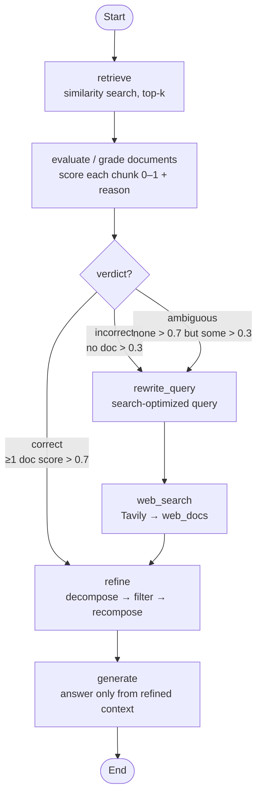

# 8. Corrective RAG (CRAG)

> 📺 [Watch on YouTube](https://www.youtube.com/watch?v=41XDn81nR5c&list=PLKnIA16_Rmva0dRLWEHLznSHKbFD_RJfX) · ⏱️ ~75 min · CampusX — Advanced RAG

---

## 🎯 What You'll Learn

- Why **traditional (naive) RAG** silently fails and produces hallucinations when the retriever returns bad documents.
- What **Corrective RAG (CRAG)** is, and how a **retrieval evaluator** turns RAG from "blind trust" into "grade, then correct."
- The three outcomes of grading — **Correct / Incorrect / Ambiguous** — and the distinct control flow each triggers.
- The **knowledge refinement** sub-routine (decompose → filter → recompose) that strips noise out of retrieved chunks.
- The **web-search fallback** (via Tavily) and **query rewriting** that fetch better external knowledge.
- How to build the full CRAG graph **incrementally in LangGraph**, using structured (Pydantic) LLM outputs and conditional edges.
- How the original **CRAG paper (2024)** structures this, and where the video deviates (e.g. using an LLM instead of the paper's fine-tuned T5-Large).

---

## 📖 The Problem with Traditional RAG

A quick recap of naive RAG, then the flaw CRAG exists to fix.

**Traditional RAG = three steps:**

1. **Retrieval** — The user query (e.g. *"What is machine learning?"*) is passed through an **embedding model** to get a query vector. That vector is used to run a **semantic (similarity) search** against a **vector database** holding your private documents (chunked and embedded). The closest vectors come back as the **top-k retrieved documents**.
2. **Augmentation** — The retrieved documents are stitched onto the original query inside a prompt and handed to the LLM ("here is the question, answer it using these documents").
3. **Generation** — The LLM reads the question + documents and generates the answer.

**The flaw: blind trust in retrieval.**

The generation prompt effectively says *"answer only from these documents."* This means the LLM **blindly trusts** whatever the retriever returned. A vector database is obligated to return *something* for every query — even when nothing relevant exists.

**Concrete failure:** Ask *"What is an LLM?"* against a database that only contains machine-learning books. There is no LLM content, so semantic search returns the "least far" documents it can find — say, Random Forest or XGBoost chunks. The LLM is now forced to answer an LLM question using Random-Forest context → **wrong answer**.

**Why this is dangerous in production:** Imagine an employee asking about a **leave policy** that isn't in the vector store. The retriever returns unrelated HR text, the LLM confidently fabricates a policy, and the user acts on a **hallucinated** answer. In a business setting the downstream consequences can be severe.

### Live demo from the video (RAG chatbot over 3 ML/DL books)

Setup: three classic books — *Hands-On Machine Learning*, *Deep Learning*, and *Pattern Recognition* — loaded (~2,000 doc objects), chunked with `RecursiveCharacterTextSplitter` (chunk size **900**, overlap **150**, ~6,000+ chunks), embedded with OpenAI embeddings into a **FAISS** store, retriever set to **top-4**.

| Query | What happened | Verdict |
|---|---|---|
| *"Explain the bias–variance trade-off"* | All 4 retrieved chunks genuinely discussed bias/variance → **solid, accurate answer**. | ✅ Retrieval was relevant |
| *"What are the top AI news from last month?"* | No matching content → the "answer only from context" prompt made it reply **"I don't know."** | ⚠️ Honest but useless |
| *"What is a transformer in deep learning?"* | The books never cover transformers. Retrieved chunks were about **MLPs, CNNs, regularization, and index pages** — none about transformers. Yet the model **still produced a fluent, correct-sounding answer.** | ❌ Silent hallucination risk |

The last case is the real problem: the answer came from the **LLM's parametric knowledge**, not the retrieved context. Here it happened to be right — but for a topic the LLM *doesn't* know (like your company's leave policy), the same mechanism produces a confident **hallucination**. This is exactly what CRAG is designed to prevent.

---

## 🧩 What is Corrective RAG?

**Core idea:** Don't send retrieved documents straight to the LLM. First insert a **Retrieval Evaluator** (a "grader") that looks at the query *and* the retrieved documents and decides whether they are actually useful for answering — *then act on that grade.*

The evaluator sorts every retrieval into one of **three cases**:

| Case | Meaning | Corrective action |
|---|---|---|
| **Correct** (relevant) | At least one retrieved document is strongly relevant. | Proceed like normal RAG → refine the good documents → generate. Uses **internal knowledge** only. |
| **Incorrect** (not relevant) | No retrieved document is good enough to answer. | Don't stop → go to an **external knowledge source** (web search via Tavily) → generate from web results. Uses **external knowledge** only. |
| **Ambiguous** (partially relevant) | Documents are partly useful but insufficient on their own. | Do **both** — keep the good documents *and* run a web search, **merge** them, then generate. Uses **internal + external knowledge**. |

The essential difference from naive RAG: CRAG **never assumes the retrieved documents are correct.** The retrieval evaluator is what makes the branching decision possible.

### The original CRAG paper (2024)

The video follows the paper closely. The paper's diagram:

- Question `x` → retrieve → documents `d1, d2`.
- **Retrieval Evaluator** looks at `x` and `d1, d2` and judges relevance.
  - If **Correct** → *refine* the documents into **Knowledge (Internal)** → generate.
  - If **Incorrect** → **Knowledge Searching**: web-search `x` → **Knowledge (External)** → generate.
  - If **Ambiguous** → produce **both** Internal (refined) and External (web) knowledge, merge, → generate.
- The paper's evaluator and refiner both use a fine-tuned **T5-Large (~770M params)** — small, free, and (per the paper) *better than a general LLM on this specific task*. Since the authors never released the fine-tuned checkpoint, the video substitutes **ChatOpenAI**.

---

## 🧭 CRAG Workflow

The final graph built in the video. Note the clever simplification: the *Ambiguous* branch does not need its own path — it reuses the *Incorrect* (web-search) path, and the **refine** node decides which documents to use based on the verdict.



**Which documents `refine` consumes, by verdict:**

- **correct** → `good_docs` (relevant retrieved chunks)
- **incorrect** → `web_docs` (Tavily results only)
- **ambiguous** → `good_docs` + `web_docs` (merged)

---

## 🔑 Key Components

### Retrieval grader (LLM-as-judge, structured output)

- The evaluator scores **each retrieved chunk individually** on a **0–1 relevance scale** and returns a short **reason**.
- Two thresholds decide the verdict (tunable; the paper doesn't fix values):
  - **Upper threshold = 0.7**
  - **Lower threshold = 0.3**
- **Verdict rules:**
  - **Correct** → *at least one* chunk scores **> 0.7**.
  - **Incorrect** → *no* chunk scores **> 0.3** (all are junk).
  - **Ambiguous** → anything in between (no chunk clears 0.7, but not all are below 0.3).
- **Critical detail:** Only chunks scoring **> 0.3** (the "good docs") are ever passed to generation — even in the Correct case. Example: scores `D1=0.8, D2=0.4, D3=0.2` → verdict **Correct** (D1 > 0.7), but generation uses **only D1 and D2**; D3 is dropped.
- Structured output (Pydantic) forces the LLM to return exactly `{score, reason}`.

### Query rewriting / transformation

- Raw user queries fed to a search engine are often **vague, under-specified, keyword-poor, or missing time constraints**.
- Before web-searching, an LLM **rewrites** the query into a search-engine-optimized form.
  - *"Who was the screen writer for Death of a Batman"* → *"Death of a Batman screen writer wikipedia"*
  - *"recent AI news"* → *"recent AI news last 30 days"* (the LLM adds a recency window the user omitted).
- Honest caveat from the video: in practice this helps only sometimes, but the paper prescribes it, so it's included for fidelity.

### Web search fallback (Tavily)

- Triggered on **Incorrect** and **Ambiguous** verdicts.
- Tavily returns multiple search results (title, URL, content). These are wrapped into `Document` objects and stored as `web_docs`.
- Web results are **not trusted blindly either** — they go through the **same knowledge-refinement** step before generation.

### Knowledge refinement (decompose → filter → recompose)

Applied to whichever documents feed generation. Why it's needed: fixed-size chunking (900 chars) splits arbitrarily, so a single chunk often mixes a **relevant** passage with **unrelated** text (e.g. a gradient-descent explanation followed by stray CNN sentences).

Three steps:

1. **Decompose** — break each document into **strips** (roughly sentence-level, 1–2 sentences each): `S1, S2, S3, S4`.
2. **Filter** — send the query + each strip to a model; keep only strips that **directly help** answer the query. (Paper: fine-tuned T5-Large scores each strip's relevance; video: an LLM returns `keep = true/false`.)
3. **Recompose** — merge the kept strips back into a cleaner **refined context** used for generation.

### Generation node

- Standard RAG generation: prompt the LLM to **answer only from the (refined) context**, and to say it doesn't know if the answer isn't there.
- The only thing that changes across CRAG's branches is *what context* reaches this node — the generation logic itself is reused unchanged.

---

## 💻 Implementation (LangGraph)

Built incrementally in the video (traditional RAG → + refinement → + evaluation → + web search → + query rewrite → + ambiguous merge). Below is the consolidated final version. Node names follow the video (`evaluate`, `refine`, `rewrite_query`); the equivalent names in the standard LangGraph CRAG tutorial are `grade_documents`, and `transform_query`.

### Structured-output models (Pydantic)

```python
from pydantic import BaseModel, Field

class GradeDocument(BaseModel):
    """Retrieval-evaluator output for a single chunk."""
    score: float = Field(description="Relevance score between 0 and 1")
    reason: str = Field(description="Short justification for the score")

class KeepStrip(BaseModel):
    """Relevance-filter output for a single sentence strip."""
    keep: bool = Field(description="True only if the sentence directly helps answer the question")

class RewrittenQuery(BaseModel):
    """Search-engine-optimized query."""
    query: str = Field(description="A single, concise, search-optimized query")
```

### State definition

```python
from typing import List, TypedDict
from langchain_core.documents import Document

class GraphState(TypedDict):
    question: str                 # original user query
    documents: List[Document]     # raw retrieved chunks
    good_docs: List[Document]     # chunks scoring > lower threshold
    web_docs: List[Document]      # Tavily results (as Documents)
    strips: List[str]             # all decomposed sentence strips
    kept_strips: List[str]        # strips that passed the filter
    refined_context: str          # recomposed context for generation
    web_query: str                # rewritten search query
    verdict: str                  # "correct" | "incorrect" | "ambiguous"
    reason: str                   # why that verdict was chosen
    answer: str                   # final generated answer
```

### Setup (LLM, thresholds, retriever)

```python
from langchain_openai import ChatOpenAI

llm = ChatOpenAI(model="gpt-4o-mini", temperature=0)

LOWER_THRESHOLD = 0.3
UPPER_THRESHOLD = 0.7

# retriever built earlier from a FAISS store (top-4 similarity search)
# retriever = vector_store.as_retriever(search_kwargs={"k": 4})
```

### Node: retrieve

```python
def retrieve(state: GraphState):
    docs = retriever.invoke(state["question"])
    return {"documents": docs}
```

### Node: evaluate (grade documents)

```python
from langchain_core.prompts import ChatPromptTemplate

evaluator_system = """You are a strict retrieval evaluator for RAG.
You will be given ONE retrieved chunk and a question.
Return a relevance score between 0 and 1:
  1 -> the chunk ALONE is sufficient to answer the question fully
  0 -> the chunk is irrelevant
Be conservative with high scores. Also return a short reason.
Output JSON only."""

evaluator_prompt = ChatPromptTemplate.from_messages([
    ("system", evaluator_system),
    ("human", "Question: {question}\n\nChunk:\n{chunk}"),
])
evaluator_chain = evaluator_prompt | llm.with_structured_output(GradeDocument)

def evaluate(state: GraphState):
    question = state["question"]
    scores, reasons, good_docs = [], [], []

    for d in state["documents"]:
        result = evaluator_chain.invoke({"question": question, "chunk": d.page_content})
        scores.append(result.score)
        reasons.append(result.reason)
        if result.score > LOWER_THRESHOLD:      # only "good" docs feed generation
            good_docs.append(d)

    if max(scores) > UPPER_THRESHOLD:
        return {"good_docs": good_docs, "verdict": "correct",
                "reason": "At least one retrieved chunk scored above the upper threshold."}
    elif max(scores) <= LOWER_THRESHOLD:         # no doc cleared the lower threshold
        return {"good_docs": [], "verdict": "incorrect",
                "reason": "No chunk was sufficient to answer the question."}
    else:
        return {"good_docs": good_docs, "verdict": "ambiguous",
                "reason": "Mixed signals: no chunk was strong, but some were relevant."}
```

### Node: refine (decompose → filter → recompose)

```python
import re

def decompose_to_sentences(text: str) -> List[str]:
    strips = re.split(r"(?<=[.!?])\s+", text)      # rough sentence-level split
    return [s.strip() for s in strips if s.strip()]

filter_system = """You are a strict relevance filter.
Return keep=true ONLY if the sentence directly helps answer the question.
Use only the sentence. Output JSON only."""

filter_prompt = ChatPromptTemplate.from_messages([
    ("system", filter_system),
    ("human", "Question: {question}\n\nSentence: {sentence}"),
])
filter_chain = filter_prompt | llm.with_structured_output(KeepStrip)

def refine(state: GraphState):
    question = state["question"]
    verdict = state["verdict"]

    # choose source documents by verdict
    if verdict == "correct":
        base_docs = state["good_docs"]
    elif verdict == "incorrect":
        base_docs = state["web_docs"]
    else:  # ambiguous -> merge internal + external knowledge
        base_docs = state["good_docs"] + state["web_docs"]

    context = "\n".join(d.page_content for d in base_docs)
    strips = decompose_to_sentences(context)

    kept = []
    for s in strips:                                # 2) filtration
        res = filter_chain.invoke({"question": question, "sentence": s})
        if res.keep:
            kept.append(s)

    refined_context = " ".join(kept)                # 3) recomposition
    return {"strips": strips, "kept_strips": kept, "refined_context": refined_context}
```

### Node: rewrite_query (transform query)

```python
rewrite_system = """You are a web-search query composer. Rules:
- Keep it short.
- If a question implies recency, add a constraint such as 'last 30 days'.
- Do NOT answer the question.
Return JSON only with a single query."""

rewrite_prompt = ChatPromptTemplate.from_messages([
    ("system", rewrite_system),
    ("human", "{question}"),
])
rewrite_chain = rewrite_prompt | llm.with_structured_output(RewrittenQuery)

def rewrite_query(state: GraphState):
    result = rewrite_chain.invoke({"question": state["question"]})
    return {"web_query": result.query}
```

### Node: web_search (Tavily)

```python
from langchain_community.tools.tavily_search import TavilySearchResults

tavily = TavilySearchResults(k=4)

def web_search(state: GraphState):
    results = tavily.invoke({"query": state["web_query"]})
    web_docs = [
        Document(
            page_content=r["content"],
            metadata={"title": r.get("title"), "url": r.get("url")},
        )
        for r in results
    ]
    return {"web_docs": web_docs}
```

### Node: generate

```python
gen_prompt = ChatPromptTemplate.from_messages([
    ("system", "Answer ONLY from the context. If the answer is not in the context, say you don't know."),
    ("human", "Question: {question}\n\nContext:\n{context}"),
])

def generate(state: GraphState):
    msg = gen_prompt.invoke({"question": state["question"],
                             "context": state["refined_context"]})
    answer = llm.invoke(msg).content
    return {"answer": answer}
```

### Conditional edge (decide_to_generate / route_after_evaluation)

```python
def route_after_evaluation(state: GraphState) -> str:
    if state["verdict"] == "correct":
        return "refine"          # internal knowledge is enough
    else:
        return "rewrite_query"   # incorrect OR ambiguous -> go to the web
```

> In the intermediate iterations there were three explicit branches (`refine` / `fail` / `ambiguous`). In the final version the *ambiguous* branch is folded into the web path: both `incorrect` and `ambiguous` route to `rewrite_query`, and `refine` distinguishes them via the `verdict` in state. This is the "smart use of LangGraph state" the video highlights.

### Build & compile the StateGraph

```python
from langgraph.graph import StateGraph, START, END

graph = StateGraph(GraphState)

graph.add_node("retrieve", retrieve)
graph.add_node("evaluate", evaluate)
graph.add_node("refine", refine)
graph.add_node("rewrite_query", rewrite_query)
graph.add_node("web_search", web_search)
graph.add_node("generate", generate)

graph.add_edge(START, "retrieve")
graph.add_edge("retrieve", "evaluate")

graph.add_conditional_edges(
    "evaluate",
    route_after_evaluation,
    {"refine": "refine", "rewrite_query": "rewrite_query"},
)

graph.add_edge("rewrite_query", "web_search")
graph.add_edge("web_search", "refine")   # web results are refined too
graph.add_edge("refine", "generate")
graph.add_edge("generate", END)

app = graph.compile()

# result = app.invoke({"question": "batch normalization vs layer normalization"})
# print(result["verdict"], result["answer"])
```

### End-to-end examples from the video

| Query | Verdict | Path taken | Notes |
|---|---|---|---|
| *"Explain the bias–variance trade-off"* | **correct** | retrieve → evaluate → refine → generate | ≥1 chunk scored > 0.7; refinement made the answer more point-wise. |
| *"AI news from last month"* | **incorrect** | retrieve → evaluate → rewrite_query → web_search → refine → generate | All chunks < 0.3; web fallback returned real news (e.g. an open-source AI assistant, physical AI at CES 2026). |
| *"batch normalization vs layer normalization"* | **ambiguous** | retrieve → evaluate → rewrite_query → web_search → refine (good_docs + web_docs) → generate | Batch norm is in the books, layer norm isn't → no chunk > 0.7 but some > 0.3; internal + external knowledge merged. |

---

## ⚖️ CRAG vs Naive RAG

| Aspect | Naive (Traditional) RAG | Corrective RAG (CRAG) |
|---|---|---|
| Trust in retrieval | Blind — assumes retrieved docs are correct | Verifies every chunk with a **retrieval evaluator** |
| Relevance grading | None | Per-chunk **0–1 score** + reason, with lower/upper thresholds |
| Handling bad retrieval | Forced to answer from junk → hallucination | Detects it, then **corrects** via web search |
| Fallback knowledge source | None | **Web search** (Tavily) for Incorrect / Ambiguous |
| Query handling | Uses raw user query | **Rewrites** the query for the search engine before web search |
| Noise in chunks | Passed straight to the LLM | **Knowledge refinement** (decompose → filter → recompose) removes irrelevant strips |
| Context used for generation | All retrieved docs | Only **good docs** (> lower threshold), refined; plus web when needed |
| Branching | Single linear path | Three-way branch: **Correct / Incorrect / Ambiguous** |
| Robustness | Fails silently on gaps | Rarely returns empty-handed; degrades gracefully |
| Cost / latency | Lower (one retrieval + one generation) | Higher (extra LLM grading + optional web round-trip) |

---

## 🧠 Key Takeaways

- **Naive RAG's core weakness is blind trust in the retriever.** When retrieval is poor, the LLM either refuses or, worse, hallucinates from parametric knowledge — a serious risk in business settings.
- **CRAG adds a grading step between retrieval and generation.** A retrieval evaluator scores each chunk and classifies the whole retrieval as **Correct, Incorrect, or Ambiguous.**
- **The grade drives the control flow:** Correct → use refined internal docs; Incorrect → replace with web search; Ambiguous → merge internal + web.
- **Two thresholds (lower 0.3, upper 0.7)** define the verdict, and **only chunks above the lower threshold ever reach generation** — even in the Correct case.
- **Knowledge refinement (decompose → filter → recompose)** strips chunk-level noise introduced by fixed-size splitting, improving generation quality.
- **Query rewriting** turns vague user questions into search-engine-friendly queries before hitting the web.
- **Web results are refined too** — CRAG doesn't blindly trust external knowledge any more than internal knowledge.
- **LangGraph state enables an elegant simplification:** the Ambiguous case reuses the web-search path, with the `refine` node choosing its source documents from `verdict`. Fewer branches, less duplicated code.
- **Structured outputs (Pydantic + `with_structured_output`)** make the grader, filter, and rewriter reliable and machine-parseable.
- The paper uses a small **fine-tuned T5-Large (770M)** for grading/refinement — cheaper and reportedly better than a general LLM on this task; the video uses ChatOpenAI only because the checkpoint isn't public.

---

## ❓ Revision Questions

1. In one sentence, what specific failure mode of traditional RAG does CRAG correct?
2. Walk through the three steps of a traditional RAG pipeline (retrieval, augmentation, generation). Where exactly does CRAG insert its new logic?
3. Why can a vector database return irrelevant documents even when the answer doesn't exist in it at all?
4. What are the three verdicts a retrieval evaluator can produce, and what corrective action does each trigger?
5. Given per-chunk scores `D1=0.8, D2=0.4, D3=0.2` with lower=0.3 and upper=0.7: what is the verdict, and **which documents** are actually used for generation? Why isn't D3 used?
6. State the precise rule for an **Incorrect** verdict and for an **Ambiguous** verdict.
7. Explain the three steps of knowledge refinement. Why is refinement necessary given how chunking works?
8. Why does CRAG rewrite the query before doing a web search? Give an example transformation.
9. Are web-search results trusted directly, or do they undergo further processing before generation? Explain.
10. In the final LangGraph implementation, how is the **Ambiguous** case handled *without* a dedicated third branch? What role does the graph state play?
11. What did the CRAG paper use for the retrieval evaluator and refiner, and why did the video substitute an LLM instead?
12. Sketch the final CRAG graph: list the nodes, the conditional edge, and which documents `refine` consumes for each verdict.
