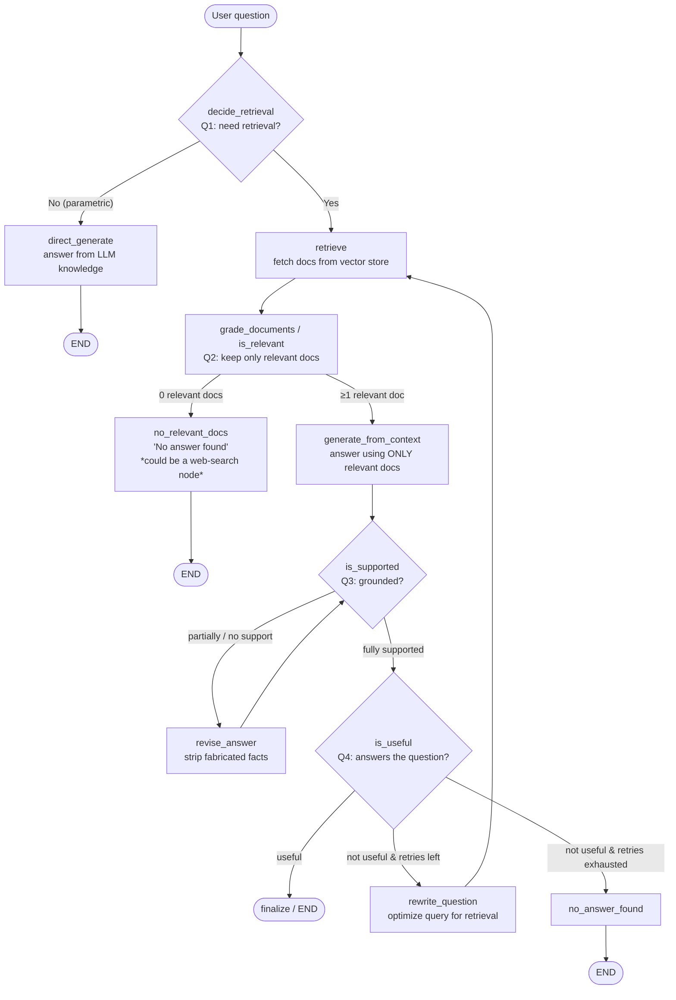

# 9. Self-RAG

> 📺 [Watch on YouTube](https://www.youtube.com/watch?v=BbO_XaEjzaA&list=PLKnIA16_Rmva0dRLWEHLznSHKbFD_RJfX) · ⏱️ ~68 min · CampusX — Advanced RAG

---

## 🎯 What You'll Learn

- The **three fundamental flaws of traditional (naive) RAG** that motivate a smarter architecture.
- What **Self-RAG (Self-Reflective RAG)** is: an LLM that *judges its own* retrieval, evidence, and answers instead of blindly trusting whatever the retriever returns.
- The **four self-reflection questions** Self-RAG asks at each stage, and the three "grader" checks that implement them.
- The full **Self-RAG workflow** — with its two loop-backs (revise answer, rewrite query) and its termination conditions.
- How to build the whole thing **step by step in LangGraph** using a shared state, grader nodes, and conditional edges, with **structured (Pydantic) outputs** for every judgment.
- How Self-RAG differs from **CRAG** (previous video) and **naive RAG**.

This is **video 9 of 9** in the Advanced RAG series. The previous video covered **CRAG (Corrective RAG)**; Self-RAG is the natural next step — instead of only correcting *retrieval*, the model reflects on *every* step of its own pipeline.

> **Prerequisite:** You should already understand basic RAG (load → split → embed → store → retrieve → generate) and ideally have built a small RAG app and worked with LangGraph. Self-RAG is an *advanced* pattern built on top of those foundations.

---

## 📖 Recap & Motivation — Why Traditional RAG Isn't Enough

Naive RAG always does the same thing for every query: **retrieve → stuff context → generate**. That rigidity causes three concrete problems.

### Problem 1 — Retrieval happens even when it's unnecessary ("indiscriminate retrieval")

Imagine a children's chatbot loaded with encyclopedia books. A kid asks:

> *"How many seconds are there in a minute?"*

The LLM's **parametric knowledge** (what it learned during training) can answer this instantly — no encyclopedia needed. But because it's wrapped in a RAG pipeline, retrieval fires anyway and pulls in noise:

- Chunk A: *"A minute is a unit of time equal to 60 seconds."*
- Chunk B: *"In some contexts, a minute can colloquially mean a short period of time."* (from a history book)
- Chunk C: *"The concept of time units evolved historically."*

Forced to answer *from these chunks*, the model produces a wobbly answer like *"A minute typically consists of about 60 seconds, depending on the context."* Two things went wrong:

1. **Confidence dropped.** Unnecessary extra context made a trivially-answerable question *ambiguous*, so the answer hedges ("depending on the context").
2. **Compute was wasted.** An embedding search + larger prompt ran for a question the model already knew.

This is called **indiscriminate retrieval** — retrieving regardless of whether it helps.

### Problem 2 — RAG blindly trusts retrieved documents

> *"What causes diabetes?"*

Retrieved doc: *"Diabetes is a chronic medical condition that affects how the body processes blood sugar."* — this describes an **effect**, not a **cause**. Forced to ground its answer in this chunk, the model outputs:

> *"Diabetes is caused by problems in how the body processes blood sugar."*

That's **factually wrong** and logically odd. Why was such a document even retrieved? Because retrieval is driven by **semantic similarity** — the chunk mentions "diabetes," so it scored high, got fetched, and the LLM was *obligated* to use it.

### Problem 3 — RAG never verifies its own answer

Once naive RAG generates an answer, that answer is final and shown to the user. There is **no check** for hallucination or for whether the answer even addresses the question.

> **Self-RAG's job:** add self-reflection so the model can *skip* pointless retrieval, *filter out* irrelevant/noisy documents, *catch* its own hallucinations, and *verify* that the answer is actually useful.

---

## 🧩 What is Self-RAG?

> **Self-RAG = Self-Reflective RAG**, where the LLM **actively judges its own retrieval, evidence, and answers** instead of blindly trusting retrieved documents.

The USP is **self-reflection**: at every step the architecture *questions its own actions* and modifies its behavior based on the verdict. Concretely, Self-RAG answers **four questions**:

| # | Reflection question | What it decides |
|---|---------------------|-----------------|
| 1 | **Is retrieval even needed** for this query? | Skip retrieval and answer directly, or go fetch documents. |
| 2 | Are the **retrieved documents relevant**? | Keep only relevant docs; drop the noise. |
| 3 | Is the generated response **grounded** in the retrieved docs? | Catch hallucinations. |
| 4 | Does the response **actually answer** the user's question? | Catch grounded-but-useless answers. |

### Q3 illustrated — grounding / hallucination

> *"What are the side effects of Drug X?"*
>
> - Doc 1: *"Drug X is commonly prescribed for hypertension."*
> - Doc 2: *"Clinical trials report mild dizziness and nausea as observed side effects."*
>
> **Generated answer:** *"Drug X may cause dizziness, nausea, fatigue and headaches, especially in older patients."*

Here `dizziness` and `nausea` come from Doc 2 — fine. But `fatigue`, `headaches`, and `especially in older patients` were **fabricated** by the model from its parametric knowledge (many drugs share those side effects, so it "helpfully" added them). That is **hallucination**: producing facts not supported by the provided evidence.

### Q4 illustrated — usefulness

> *"Why does ice float on water?"*
>
> - Doc: *"Ice is the solid form of water."*
>
> **Generated answer:** *"Ice is the solid form of water that occurs at low temperature."*

This answer is **grounded** (no hallucination) — but it **does not answer** *why* ice floats. So it fails the usefulness check even though it passes the grounding check. Grounded ≠ useful.

> **Key mental model:** Self-RAG is *reflective*. Not "conscious" in a literal sense, but at every hop it asks *"is what I'm about to do correct?"* and re-routes accordingly.

---

## 🧭 Self-RAG Workflow

The full architecture chains the four reflection questions into a graph with two loops. The video builds toward exactly this graph.



**Reading the graph:**

- **decide_retrieval** routes the query either to `direct_generate` (answer straight from the LLM → END) or to `retrieve`.
- **retrieve → is_relevant** filters the fetched documents. If *nothing* is relevant, the flow ends with "no answer found" (or, optionally, branches to a **web search** node — see the note below). If at least one doc is relevant, generation proceeds.
- **generate_from_context → is_supported** runs the grounding check. Any answer that is **partially** or **not** supported is sent to **revise_answer**, which rewrites it against the context and loops back to `is_supported`. This is **loop #1** (bounded by `max_retries`).
- Once **fully supported**, **is_useful** checks whether the answer addresses the question. If useful → finalize/END. If not useful, **rewrite_question** rewrites the query and loops all the way back to `retrieve`. This is **loop #2** (bounded by `rewrite_tries`). When retries are exhausted, the flow ends with "no answer found."

---

## 🔑 Key Grading Steps (the graders)

Every reflection question is implemented as an LLM call that returns a **structured (Pydantic) output** — a strict schema so the verdict is machine-readable (no free-text parsing). There are effectively **four graders + two rewriters**.

### 0. Retrieval router (`decide_retrieval`)

Decides whether retrieval is needed at all.

- **Schema:** `should_retrieve: bool` — *"True if external documents are needed to answer reliably, else False."*
- **Prompt guidelines:** `should_retrieve = True` if answering requires specific fact citations or info unlikely to be in the model; `False` for general explanations / definitions / reasoning. **If unsure → choose True** (safer to retrieve than to hallucinate).
- Example: *"How many paid leave days do employees get per year?"* → **True**. *"What is a paid leave?"* → **False**.

### 1. Document relevance grader (`is_relevant`)

Runs **once per retrieved document** and keeps only the relevant ones.

- **Schema:** `is_relevant: bool` — *"True if the document helps answer the question, else False."*
- **Prompt:** *"You are judging document relevance. Return JSON that matches this schema. A document is relevant if it contains information useful for answering the question."* — the grader is given both the **question** and the **individual document**.
- Effect: semantic-similarity noise gets filtered out. In the demo, 4 docs are retrieved for *"Who is the CEO?"* but only **1** (the one naming the CEO) survives; the rest are close in meaning but not relevant.

### 2. Hallucination / groundedness grader (`is_supported`)

Judges whether every fact in the generated answer traces back to the context.

- **Schema:** `support: Literal["fully_supported", "partially_supported", "no_support"]` plus `evidence: list[str]` (the supporting facts extracted from context — mainly for debugging; optional).
- **Three verdicts:**
  - **Fully supported** — every claim comes from the retrieved docs. → *accept*.
  - **Partially supported** — some claims are grounded, some fabricated (e.g. inventing that "24 leaves *includes* sick + casual leave" when the docs never state that correlation). → *revise*.
  - **No support** — the whole answer is fabricated (e.g. "employees get 30 paid leaves with carry-forward" when no doc says so). → *revise*.
- The grader receives the **question**, the **generated answer**, and the **context**.

### 3. Answer usefulness grader (`is_useful`)

Checks whether a grounded answer actually satisfies the user's intent.

- **Schema:** `is_useful: Literal["useful", "not_useful"]` plus `reason: str`.
- The grader receives the **question** and the **generated answer** and decides whether the answer *justifies* the question. A perfectly grounded answer can still be `not_useful` if it talks about the wrong thing.

### Rewriters used by the loops

- **`revise_answer`** — a *strict reviser* prompt: *"Modify the answer so it is written based only on the context."* Given the question, current answer, and context, it returns a trimmed answer with fabricated facts removed, then re-enters `is_supported`. Increments a `retries` counter.
- **`rewrite_question`** — rewrites the query for better retrieval: *"Rewrite the user's question into a query optimized for vector retrieval over internal company PDFs. Keep it short, preserve key entities, add 2–5 high-signal keywords."* Given the question, previous retrieval query, and current answer, it returns a new `retrieval_query`, increments `rewrite_tries`, and loops back to `retrieve`.

---

## 💻 Implementation (LangGraph)

> **Disclaimer from the video:** this implementation differs from the **original Self-RAG paper**. The paper trains a *single* model to emit special **reflection tokens** (`Retrieve`, `ISREL`, `ISSUP`, `ISUSE`) inline during generation. Here we instead use **off-the-shelf OpenAI LLMs as separate grader nodes** with structured outputs. The *core ideas* are identical; only the finer implementation details differ. (Paper link is in the video description.)

The demo builds a company RAG chatbot for a fictional company, **"Nexa AI Solutions,"** over three PDFs: **Company Profile**, **Company Policies** (HR / leave / conduct / disciplinary), and **Product & Pricing**. The graph is built **incrementally** in five steps, each adding one reflection feature.

### Shared setup (same for every step)

```python
# load PDFs -> split -> embed -> vector store -> retriever -> LLM
splitter   = RecursiveCharacterTextSplitter(chunk_size=600, chunk_overlap=150)
chunks     = splitter.split_documents(docs)             # docs = 3 loaded PDFs
vectorstore = FAISS.from_documents(chunks, embeddings)  # embed into vector store
retriever  = vectorstore.as_retriever()
llm        = ChatOpenAI(model="gpt-4o-mini", temperature=0)
```

> `chunk_size=600` / `chunk_overlap=150` were chosen empirically for this document set — experiment for your own data.

### The State

The state grows one or two keys per step; the final state is:

```python
from typing import TypedDict, Literal
from langchain_core.documents import Document

class SelfRAGState(TypedDict):
    question: str                     # original user question
    need_retrieval: bool              # Q1 verdict (routing)
    retrieval_query: str              # query actually used for retrieval (rewritten over time)
    docs: list[Document]              # all retrieved docs
    relevant_docs: list[Document]     # only docs that passed the relevance grader
    context: str                      # relevant_docs merged into one string
    answer: str                       # current / final answer
    support: Literal["fully_supported", "partially_supported", "no_support"]
    evidence: list[str]               # facts extracted from context (debug aid)
    is_useful: Literal["useful", "not_useful"]
    reason: str                       # why useful / not useful
    retries: int                      # revise_answer loop counter
    rewrite_tries: int                # rewrite_question loop counter
```

### Node — `decide_retrieval` (Q1)

```python
from pydantic import BaseModel, Field

class ShouldRetrieve(BaseModel):
    should_retrieve: bool = Field(
        description="True if external documents are needed to answer reliably, else False"
    )

decide_llm = llm.with_structured_output(ShouldRetrieve)

DECIDE_SYS = """You decide whether retrieval is needed. Return JSON that matches the schema.
Guidelines:
- should_retrieve = True if answering requires specific fact citations or info likely NOT in the model.
- should_retrieve = False for general explanations, definitions, or reasoning.
- If unsure, choose True."""

def decide_retrieval(state):
    out = decide_llm.invoke([("system", DECIDE_SYS), ("human", state["question"])])
    return {"need_retrieval": out.should_retrieve}
```

### Node — `direct_generate` (Q1 = No path)

```python
DIRECT_SYS = """Answer the question using your general knowledge.
Do not assume access to external documents.
If you are unsure or the answer requires specific sources,
say "I don't know based on my general knowledge." """

def direct_generate(state):
    out = llm.invoke([("system", DIRECT_SYS), ("human", state["question"])])
    return {"answer": out.content}
```

### Node — `retrieve`

```python
def retrieve(state):
    # note: retrieves against retrieval_query, which the rewrite loop can update
    return {"docs": retriever.invoke(state["retrieval_query"])}
```

### Node — `grade_documents` / `is_relevant` (Q2)

```python
class IsRelevant(BaseModel):
    is_relevant: bool = Field(description="True if the document helps answer the question, else False")

relevance_llm = llm.with_structured_output(IsRelevant)

REL_SYS = """You are judging document relevance. Return JSON that matches the schema.
A document is relevant if it contains information useful for answering the question."""

def grade_documents(state):
    relevant = []
    for d in state["docs"]:
        verdict = relevance_llm.invoke([
            ("system", REL_SYS),
            ("human", f"Question: {state['question']}\n\nDocument:\n{d.page_content}"),
        ])
        if verdict.is_relevant:
            relevant.append(d)
    return {"relevant_docs": relevant}
```

### Node — `generate_from_context` (grounded generation)

```python
GEN_SYS = "You are a business RAG assistant. Answer the user's question using ONLY the provided context."

def generate_from_context(state):
    context = "\n\n".join(d.page_content for d in state["relevant_docs"])
    out = llm.invoke([
        ("system", GEN_SYS),
        ("human", f"Context:\n{context}\n\nQuestion: {state['question']}"),
    ])
    return {"answer": out.content, "context": context}
```

### Node — `is_supported` (Q3 — hallucination grader)

```python
class IsSupported(BaseModel):
    support: Literal["fully_supported", "partially_supported", "no_support"]
    evidence: list[str] = Field(default_factory=list,
        description="Facts from the context that support the answer")

support_llm = llm.with_structured_output(IsSupported)

SUP_SYS = """You check whether the generated answer is grounded in the context.
- fully_supported : every fact in the answer is present in the context.
- partially_supported : some facts are in the context, some are fabricated.
- no_support : the answer is entirely fabricated / not in the context.
Also return the supporting evidence sentences from the context."""

def is_supported(state):
    out = support_llm.invoke([
        ("system", SUP_SYS),
        ("human", f"Question: {state['question']}\n\nAnswer: {state['answer']}\n\nContext:\n{state['context']}"),
    ])
    return {"support": out.support, "evidence": out.evidence}
```

### Node — `revise_answer` (loop #1)

```python
REVISE_SYS = """You are a strict reviser. Rewrite the answer so that EVERY fact is drawn
directly from the provided context. Remove any claim not supported by the context."""

def revise_answer(state):
    out = llm.invoke([
        ("system", REVISE_SYS),
        ("human", f"Question: {state['question']}\n\nCurrent answer: {state['answer']}\n\nContext:\n{state['context']}"),
    ])
    return {"answer": out.content, "retries": state.get("retries", 0) + 1}
```

### Node — `is_useful` (Q4 — usefulness grader)

```python
class IsUseful(BaseModel):
    is_useful: Literal["useful", "not_useful"]
    reason: str

useful_llm = llm.with_structured_output(IsUseful)

USE_SYS = """Decide whether the answer actually justifies / addresses the user's question.
Return 'useful' or 'not_useful' with a short reason."""

def is_useful(state):
    out = useful_llm.invoke([
        ("system", USE_SYS),
        ("human", f"Question: {state['question']}\n\nAnswer: {state['answer']}"),
    ])
    return {"is_useful": out.is_useful, "reason": out.reason}
```

### Node — `rewrite_question` (loop #2)

```python
class RewrittenQuery(BaseModel):
    retrieval_query: str = Field(
        description="Rewritten query optimized for vector retrieval against internal company PDFs")

rewrite_llm = llm.with_structured_output(RewrittenQuery)

REWRITE_SYS = """Rewrite the user's question into a query optimized for vector retrieval
over internal company PDFs. Keep it short, preserve key entities,
add 2 to 5 high-signal keywords."""

def rewrite_question(state):
    out = rewrite_llm.invoke([
        ("system", REWRITE_SYS),
        ("human", f"Question: {state['question']}\n"
                  f"Previous retrieval query: {state['retrieval_query']}\n"
                  f"Current answer: {state['answer']}"),
    ])
    return {"retrieval_query": out.retrieval_query,
            "rewrite_tries": state.get("rewrite_tries", 0) + 1}
```

### Conditional edges (the routing + branching logic)

```python
MAX_RETRIES = 5   # bound both loops so they can't spin forever

# Q1 router
def route_after_decision(state):
    return "retrieve" if state["need_retrieval"] else "direct_generate"

# Q2 branch: any relevant docs?
def route_after_relevance(state):
    return "generate_from_context" if len(state["relevant_docs"]) >= 1 else "no_relevant_docs"

# Q3 branch (loop #1): grounded?
def grade_generation_v_documents(state):
    if state["support"] == "fully_supported":
        return "is_useful"
    if state.get("retries", 0) >= MAX_RETRIES:
        return "is_useful"          # give up revising; let usefulness decide
    return "revise_answer"

# Q4 branch (loop #2): useful?
def grade_generation_v_question(state):
    if state["is_useful"] == "useful":
        return "finalize"           # END
    if state.get("rewrite_tries", 0) >= MAX_RETRIES:
        return "no_answer_found"     # END
    return "rewrite_question"        # loop back to retrieve
```

### Build & compile the graph

```python
from langgraph.graph import StateGraph, START, END

g = StateGraph(SelfRAGState)

g.add_node("decide_retrieval", decide_retrieval)
g.add_node("direct_generate", direct_generate)
g.add_node("retrieve", retrieve)
g.add_node("grade_documents", grade_documents)          # is_relevant
g.add_node("no_relevant_docs", lambda s: {"answer": "No answer found"})
g.add_node("generate_from_context", generate_from_context)
g.add_node("is_supported", is_supported)
g.add_node("revise_answer", revise_answer)
g.add_node("is_useful", is_useful)
g.add_node("rewrite_question", rewrite_question)
g.add_node("no_answer_found", lambda s: {"answer": "No answer found"})
g.add_node("finalize", lambda s: s)

g.add_edge(START, "decide_retrieval")
g.add_conditional_edges("decide_retrieval", route_after_decision,
                        {"retrieve": "retrieve", "direct_generate": "direct_generate"})
g.add_edge("direct_generate", END)

g.add_edge("retrieve", "grade_documents")
g.add_conditional_edges("grade_documents", route_after_relevance,
                        {"generate_from_context": "generate_from_context",
                         "no_relevant_docs": "no_relevant_docs"})
g.add_edge("no_relevant_docs", END)

g.add_edge("generate_from_context", "is_supported")
g.add_conditional_edges("is_supported", grade_generation_v_documents,
                        {"revise_answer": "revise_answer", "is_useful": "is_useful"})
g.add_edge("revise_answer", "is_supported")             # loop #1

g.add_conditional_edges("is_useful", grade_generation_v_question,
                        {"finalize": "finalize",
                         "rewrite_question": "rewrite_question",
                         "no_answer_found": "no_answer_found"})
g.add_edge("rewrite_question", "retrieve")              # loop #2
g.add_edge("finalize", END)
g.add_edge("no_answer_found", END)

app = g.compile()

# initial state: retrieval_query starts equal to the question
result = app.invoke({"question": "Describe Nexa AI company culture",
                     "retrieval_query": "Describe Nexa AI company culture"})
```

### What the demos showed (sanity checks)

- **"Who is the CEO of Nexa AI?"** → `need_retrieval = True`; 4 docs retrieved, **1** kept by the relevance grader; answer *"The CEO of Nexa is Aarav Mehta"*; `fully_supported`; `useful` (reason: it directly names the CEO).
- **"What is machine learning?"** → `need_retrieval = False`; answered directly from parametric knowledge, no docs retrieved.
- **"How many employees does Nexa AI have?"** → 4 → 2 relevant; answer *"Nexa AI has 85+ employees"*; `fully_supported` with evidence pulled from context.
- **"Describe Nexa AI company culture"** → first pass `partially_supported` (the LLM added extras beyond the evidence); after **one** `revise_answer` pass it became `fully_supported` and the answer was trimmed to just the evidence.
- **"Does Nexa AI have a free trial? How many days?"** → nothing in the docs; the model fabricated *"Yes, plans include a 14-day free trial"* from parametric knowledge → correctly flagged **`no_support`** (hallucination caught).
- **"What is the refund policy of Nexa AI?"** → no relevant docs → `no_support`, final answer *"No answer found"*, `not_useful`.

> **Note on `no_relevant_docs`:** in this build it's a placeholder that just returns "No answer found." The video points out it can be swapped for a **web-search node** (rewrite the query for the web → search → feed results back into `is_relevant`), giving CRAG-style fallback. That variant's code is in the repo but is *not* wired into the main Self-RAG graph.

---

## ⚖️ Self-RAG vs CRAG vs Naive RAG

| Dimension | **Naive RAG** | **CRAG (Corrective RAG)** | **Self-RAG (Self-Reflective)** |
|---|---|---|---|
| Decides *whether* to retrieve | ❌ always retrieves | ❌ always retrieves | ✅ `decide_retrieval` can skip retrieval entirely |
| Grades document relevance | ❌ uses everything | ✅ retrieval evaluator (correct / ambiguous / incorrect) | ✅ per-document relevance grader |
| Corrective fallback for bad retrieval | ❌ none | ✅ web search + knowledge refinement | ✅ query rewrite loop (+ optional web search) |
| Checks answer **grounding** (hallucination) | ❌ never | ⚠️ not the core focus | ✅ `is_supported` (fully / partially / no support) → revise loop |
| Checks answer **usefulness** | ❌ never | ❌ not really | ✅ `is_useful` → rewrite-query loop |
| Loops / cycles | ❌ single pass | ✅ correction step | ✅ **two** loops (revise answer, rewrite query) with retry caps |
| Trust model | blindly trusts retrieved docs | corrects *retrieval* | reflects on retrieval **and** generation |
| Cost | low | medium | higher (multiple grader LLM calls) |

**One-liner:** Naive RAG *retrieves and hopes*; CRAG *corrects the retrieval*; Self-RAG *reflects on the whole pipeline* — retrieval, grounding, and usefulness.

---

## 🧠 Key Takeaways

1. **Naive RAG has three flaws** — indiscriminate retrieval, blind trust in retrieved docs, and no self-verification. Self-RAG targets all three.
2. **Self-RAG = self-reflection.** At each hop the model asks whether its own action was correct and re-routes accordingly, answering four questions: *need retrieval? · docs relevant? · answer grounded? · answer useful?*
3. **Grounded ≠ useful.** The grounding grader (`is_supported`) and the usefulness grader (`is_useful`) are *separate* checks — an answer can be fully grounded yet fail to address the question.
4. **Two loops, two purposes.** `revise_answer` fixes *hallucination* (strips fabricated facts); `rewrite_question` fixes *poor retrieval* (fetches better docs). Both need **retry caps** to avoid infinite loops.
5. **Structured outputs everywhere.** Every judgment is a Pydantic schema (bool / enum + reason), so routing is deterministic and parse-free.
6. **Implementation ≠ paper.** The original paper trains one model to emit **reflection tokens** inline; this video approximates the same behavior with **separate grader LLMs** — conceptually equivalent, easier to build.
7. **Build incrementally.** Adding one reflection feature at a time (router → relevance filter → grounded generation → grounding check → revise/rewrite loops) keeps a complex graph understandable.

---

## ❓ Revision Questions

1. Name the three problems with traditional RAG and give a one-line example of each.
2. What does the acronym "Self-RAG" stand for, and what is its single biggest differentiator over naive RAG?
3. List the four self-reflection questions Self-RAG answers and map each to its grader node.
4. Explain the difference between an answer that is *not grounded* and one that is *grounded but not useful*. Give an example of each.
5. What are the three possible verdicts of the grounding (`is_supported`) grader, and what action does each trigger?
6. Trace the two loops in the Self-RAG graph: which node starts each loop, where does it loop back to, and what breaks the loop?
7. Why does `decide_retrieval` default to `True` when it is unsure? What failure would defaulting to `False` risk?
8. Why is the `no_relevant_docs` node a useful *placeholder*? What real capability can replace it?
9. How does this LangGraph implementation differ from the original Self-RAG paper, and why does the video say it's still conceptually equivalent?
10. In the demo, "Does Nexa AI have a free trial?" produced a confident but wrong "14-day trial" answer. Which grader caught it, and what verdict did it assign?
11. Why is `structured output` (Pydantic) important for the grader nodes rather than free-text LLM responses?
12. Compare the corrective mechanisms of CRAG and Self-RAG. What does each one "correct," and where do they overlap?
