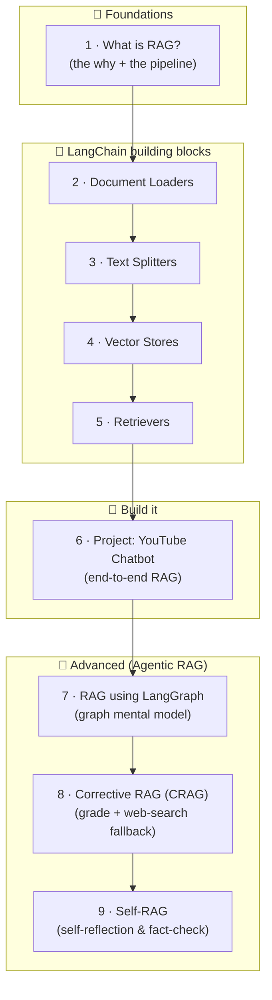
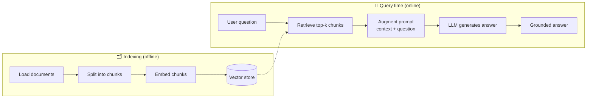

# 📚 RAG — Retrieval-Augmented Generation (Study Notes)

Structured English study notes generated from the **CampusX** playlist
[**Generative AI using LangChain — RAG series**](https://www.youtube.com/playlist?list=PLKnIA16_Rmva0dRLWEHLznSHKbFD_RJfX).

The playlist teaches RAG bottom-up: first the *why*, then each LangChain building
block (loaders → splitters → vector stores → retrievers), then a full end-to-end
project, and finally the advanced graph-based variants (LangGraph, Corrective RAG,
Self-RAG).

> Notes are written in English; the original videos are taught in Hindi/Hinglish.
> Raw transcripts are kept under [`transcripts/`](transcripts/) for reference.

---

## 🗺️ Learning Path

---

## 📓 Notes Index

| # | Topic | Notes | Watch |
|---|-------|-------|-------|
| 1 | **What is RAG** — problem, core idea, full pipeline | [`01_what-is-rag.md`](01_what-is-rag.md) | [▶️](https://www.youtube.com/watch?v=X0btK9X0Xnk&list=PLKnIA16_Rmva0dRLWEHLznSHKbFD_RJfX) |
| 2 | **Document Loaders** — Text/PDF/Web/CSV/Directory loaders | [`02_document-loaders.md`](02_document-loaders.md) | [▶️](https://www.youtube.com/watch?v=bL92ALSZ2Cg&list=PLKnIA16_Rmva0dRLWEHLznSHKbFD_RJfX) |
| 3 | **Text Splitters** — length / recursive / structure / semantic chunking | [`03_text-splitters.md`](03_text-splitters.md) | [▶️](https://www.youtube.com/watch?v=SEWS9P4ODmc&list=PLKnIA16_Rmva0dRLWEHLznSHKbFD_RJfX) |
| 4 | **Vector Stores** — embeddings, similarity search, Chroma | [`04_vector-stores.md`](04_vector-stores.md) | [▶️](https://www.youtube.com/watch?v=k13WK0bxQP0&list=PLKnIA16_Rmva0dRLWEHLznSHKbFD_RJfX) |
| 5 | **Retrievers** — VectorStore, MMR, MultiQuery, Compression | [`05_retrievers.md`](05_retrievers.md) | [▶️](https://www.youtube.com/watch?v=pJdMxwXBsk0&list=PLKnIA16_Rmva0dRLWEHLznSHKbFD_RJfX) |
| 6 | **Project: YouTube Chatbot** — full RAG app with LCEL | [`06_youtube-chatbot-rag.md`](06_youtube-chatbot-rag.md) | [▶️](https://www.youtube.com/watch?v=J5_-l7WIO_w&list=PLKnIA16_Rmva0dRLWEHLznSHKbFD_RJfX) |
| 7 | **RAG using LangGraph** — state, nodes, edges | [`07_rag-with-langgraph.md`](07_rag-with-langgraph.md) | [▶️](https://www.youtube.com/watch?v=E1qP9Xsnmik&list=PLKnIA16_Rmva0dRLWEHLznSHKbFD_RJfX) |
| 8 | **Corrective RAG (CRAG)** — grade docs, web-search fallback | [`08_corrective-rag-crag.md`](08_corrective-rag-crag.md) | [▶️](https://www.youtube.com/watch?v=41XDn81nR5c&list=PLKnIA16_Rmva0dRLWEHLznSHKbFD_RJfX) |
| 9 | **Self-RAG** — self-reflection, hallucination & answer grading | [`09_self-rag.md`](09_self-rag.md) | [▶️](https://www.youtube.com/watch?v=BbO_XaEjzaA&list=PLKnIA16_Rmva0dRLWEHLznSHKbFD_RJfX) |

---

## ⚡ RAG in One Diagram

---

## 🧰 Core Stack

| Layer | Tools seen in the series |
|-------|--------------------------|
| Orchestration | LangChain (LCEL), LangGraph |
| Loaders | `TextLoader`, `PyPDFLoader`, `WebBaseLoader`, `CSVLoader`, `DirectoryLoader` |
| Splitters | `CharacterTextSplitter`, `RecursiveCharacterTextSplitter`, `SemanticChunker` |
| Embeddings + store | OpenAI embeddings, Chroma / FAISS |
| Retrievers | `as_retriever`, MMR, `MultiQueryRetriever`, `ContextualCompressionRetriever` |
| Advanced | Corrective RAG (CRAG), Self-RAG — LLM-as-judge grading + web search |

---

*Source: CampusX — “Generative AI using LangChain” playlist. Notes are for personal study/revision.*
