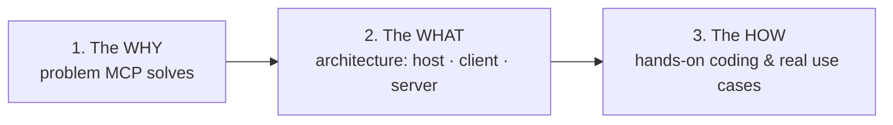
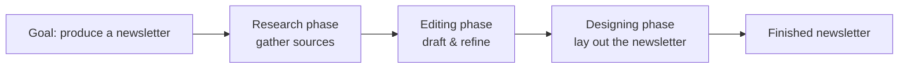

# Lesson 1 — MCP Trilogy: Playlist Intro & Newsletter Demo

> **Source:** CampusX · *Model Context Protocol | Mini Playlist | MCP Trilogy* · 37:07 · [watch](https://www.youtube.com/watch?v=3_TN1i3MTEU&list=PLKnIA16_Rmva_oZ9F4ayUu9qcWgF7Fyc0&index=1)
> **One-liner:** The trailer for the MCP trilogy (Why → What → How), demonstrated end-to-end with a real project: an AI-powered newsletter generator built on **MCP + Claude**.

---

## 🎯 TL;DR

**MCP (Model Context Protocol)** is a standard that lets AI tools/models connect to external data, tools, and workflows in a uniform way. This mini-series is a **trilogy**: **The Why** (the problem MCP solves), **The What** (its architecture), and **The How** (hands-on coding). As a teaser, the video builds a working **AI newsletter generator** where Claude, via MCP servers, automates the whole pipeline — research → drafting → design.

---

## 1. The trilogy structure

| Part | Covers | This playlist's lessons |
|------|--------|------------------------|
| **The Why** | Why MCP was created; the fragmentation problem | Lesson 2 |
| **The What** | Architecture, lifecycle, primitives | Lessons 3–4 |
| **The How** | Connect, build local/remote servers, build clients | Lessons 5–8 |

---

## 2. The teaser project: an AI newsletter generator

A real CampusX project shows MCP's payoff before the theory. Claude (the host) orchestrates MCP servers to run a full content pipeline:

| Chapter beat | What it shows |
|--------------|---------------|
| **Problem statement** | The manual, multi-tool content workflow is slow and fragmented. |
| **Structure & process** | Break the job into research → edit → design stages. |
| **Deciding the tool** | Pick MCP + Claude to automate each stage via servers. |
| **Research / Editing / Designing** | Each phase driven by an MCP-connected capability, hands-off. |

**Takeaway:** MCP turns a chatbot into an **orchestrator of real tools** — the same idea the rest of the trilogy formalizes.

---

## 3. Key terms

| Term | Meaning |
|------|---------|
| **MCP** | Model Context Protocol — a standard connecting AI models to external tools/data/workflows. |
| **Host** | The AI app the user talks to (e.g., Claude Desktop). |
| **MCP server** | A program exposing tools/data to the host in the MCP standard. |
| **Trilogy: Why / What / How** | The series' three-part arc. |

---

## ✍️ Notes / follow-ups
- Next: the motivation in depth → [Lesson 2 — MCP: The Why](02-mcp-the-why.md).
- Anchor: **MCP = a universal adapter between AI apps and the outside world.**
