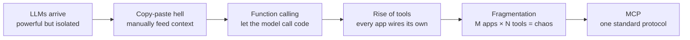

# Lesson 2 — MCP: The Why

> **Source:** CampusX · *Model Context Protocol - The Why* · 52:01 · [watch](https://www.youtube.com/watch?v=Zmy439spZB4&list=PLKnIA16_Rmva_oZ9F4ayUu9qcWgF7Fyc0&index=2)
> **One-liner:** The problem MCP was invented to solve — from "copy-paste hell" and function calling to the **M×N integration explosion** of tools, and why a shared protocol fixes it.

---

## 🎯 TL;DR

LLMs are powerful but **isolated** — they only know their training data and whatever context you paste in. We bolted on **function calling / tools** to give them access to the outside world, but every app integrated every tool its own way → an **M×N mess** of fragmented, non-reusable integrations. **MCP standardizes that connection**: build a tool once as an MCP **server**, and any MCP-compatible **client** can use it. It's "USB-C for AI tools."

---

## 1. How we got here

| Stage | Problem it exposed |
|-------|--------------------|
| **Arrival of LLMs** | Great reasoning, but no access to *your* data or live actions. |
| **Copy-paste hell** | You manually shuttle context in and results out — tedious, unscalable. |
| **Function calling** | The model can call functions/tools — but you hand-wire each one. |
| **Rise of tools** | Every app re-implements every integration differently. |
| **Fragmentation** | M applications × N tools = M×N bespoke integrations to build and maintain. |

---

## 2. What "context" really is

The model's usefulness is bounded by the **context** it can see. Getting the right context (your files, APIs, live data) into the model — reliably and safely — is the core problem. Function calling was step one; MCP makes it a **standard**.

---

## 3. The solution: MCP

> Build a capability **once** as an MCP **server**; any MCP **client** can consume it. M×N bespoke integrations collapse to **M + N**.

### MCP vs the alternatives
| | **Function/Tool calling** | **Traditional API** | **MCP** |
|---|--------------------------|---------------------|---------|
| Who wires it | You, per app, per tool | You, per integration | Build once, reuse everywhere |
| Standardized? | No — ad hoc schemas | No — every API differs | ✅ Yes — one protocol |
| Discovery | Manual | Manual (read docs) | Dynamic (client asks server what it offers) |
| Heavy lifting | In your app | In your app | **The server does it** |

- **MCP vs tool calling:** tool calling is the *mechanism*; MCP is the *standard* for exposing/discovering tools across apps.
- **MCP vs API:** an API is a bespoke contract per service; MCP is a **uniform** contract so clients don't need custom code per server.
- **Server does the heavy lifting:** the MCP server encapsulates auth, logic, and data access — the client just speaks the protocol.

---

## 4. Benefits & the ecosystem

- **Reusability** — one server, many clients (Claude Desktop, IDEs, custom apps).
- **Decoupling** — swap tools without touching the app; swap apps without rewriting tools.
- **A growing ecosystem** — shared servers for GitHub, Slack, Google Drive, filesystems, etc., that any MCP host can plug into.

---

## 5. Key terms

| Term | Meaning |
|------|---------|
| **Context** | Everything the model can "see" to answer — the thing MCP delivers reliably. |
| **Function/tool calling** | Letting an LLM invoke code/tools — the pre-MCP mechanism. |
| **M×N problem** | M apps each hand-wiring N tools; MCP reduces it to M+N. |
| **MCP server / client** | Provider of tools/data / consumer that speaks the protocol. |

---

## ✍️ Notes / follow-ups
- Next: how MCP is actually built → [Lesson 3 — MCP Architecture](03-mcp-architecture.md).
- Anchor: **MCP = "USB-C for AI" — one plug, any tool, any app.**
