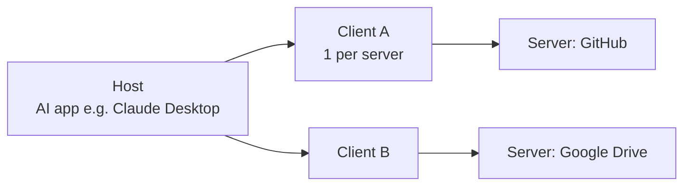
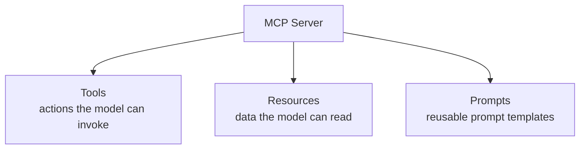
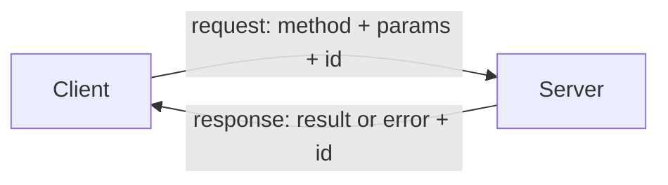

# Lesson 3 — MCP Architecture

> **Source:** CampusX · *MCP Architecture | Model Context Protocol Architecture* · 1:17:09 · [watch](https://www.youtube.com/watch?v=nQa31xdXbGk&list=PLKnIA16_Rmva_oZ9F4ayUu9qcWgF7Fyc0&index=3)
> **One-liner:** MCP from first principles — the **Host / Client / Server** trio, the three **primitives** (Tools, Resources, Prompts), and the two layers underneath: the **Data Layer (JSON-RPC 2.0)** and the **Transport Layer (STDIO / HTTP+SSE)**.

---

## 🎯 TL;DR

An MCP system has three roles: the **Host** (the AI app), the **Client** (a connector inside the host, one per server), and the **Server** (exposes capabilities). Servers offer three **primitives** — **Tools** (actions), **Resources** (data), **Prompts** (templates) — via standard operations (`tools/list`, `resources/read`, …). Messages are encoded with **JSON-RPC 2.0** (the Data Layer) and carried over a **Transport Layer**: **STDIO** for local servers, **HTTP + SSE** for remote ones.

---

## 1. The three roles

| Role | What it is | Why it exists |
|------|-----------|---------------|
| **Host** | The application the user interacts with (Claude Desktop, an IDE, a custom app) | Runs the LLM and the overall experience |
| **Client** | A connector living *inside* the host — **one client per server** | Manages a single, isolated, decoupled connection to one server |
| **Server** | A program exposing tools/data (GitHub, Slack, Google Drive, filesystem) | Does the heavy lifting; standard interface |

> **Why the Client is essential:** it keeps each server connection **isolated and decoupled**, so one server can't interfere with another and the host can scale across many servers safely.

---

## 2. The three primitives

| Primitive | What it is | Standard operations |
|-----------|-----------|---------------------|
| **Tools** | Executable actions (send message, run query, create file) | `tools/list`, `tools/call` |
| **Resources** | Readable data/context (files, records) | `resources/list`, `resources/read` |
| **Prompts** | Pre-built prompt templates the server offers | `prompts/list`, `prompts/get` |

Standard operations mean **any client can discover and use any server** without bespoke code — that's the whole point.

---

## 3. The Data Layer — JSON-RPC 2.0

- MCP messages are **JSON-RPC 2.0**: a lightweight request/response format with `method`, `params`, `id`, and `result`/`error`.
- **Why JSON-RPC over REST:** it's transport-agnostic, supports **bidirectional** request/response and **notifications**, and gives a uniform method-call model (`tools/call`) rather than REST's resource-URL conventions — a better fit for a stateful, capability-negotiated session.

---

## 4. The Transport Layer — how messages move

| Transport | Used for | How it works |
|-----------|----------|--------------|
| **STDIO** | **Local** servers | Host launches the server as a subprocess; messages flow over stdin/stdout — simple, fast, no network |
| **HTTP + SSE** | **Remote** servers | Requests over HTTP; server streams responses via Server-Sent Events — works across the network |

- **STDIO benefits:** zero network setup, low latency, naturally secure (local process).
- **HTTP+SSE:** needed when the server runs elsewhere (enterprise, shared, cloud).

---

## 5. Key terms

| Term | Meaning |
|------|---------|
| **Host / Client / Server** | AI app / per-server connector / capability provider. |
| **Primitives** | Tools (actions), Resources (data), Prompts (templates). |
| **Standard operations** | `tools/list`, `resources/read`, etc. — uniform across servers. |
| **JSON-RPC 2.0** | The message format for MCP's data layer. |
| **STDIO / HTTP+SSE** | Local (subprocess) vs remote (network) transports. |

---

## ✍️ Notes / follow-ups
- Next: how a session actually runs start-to-finish → [Lesson 4 — The MCP Lifecycle](04-mcp-lifecycle.md).
- Anchor: **Host↔Client↔Server, three primitives, JSON-RPC over STDIO/HTTP.**
